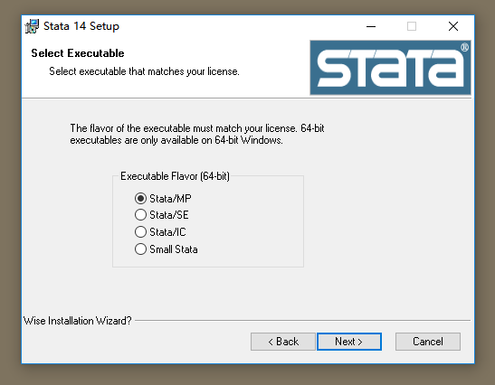
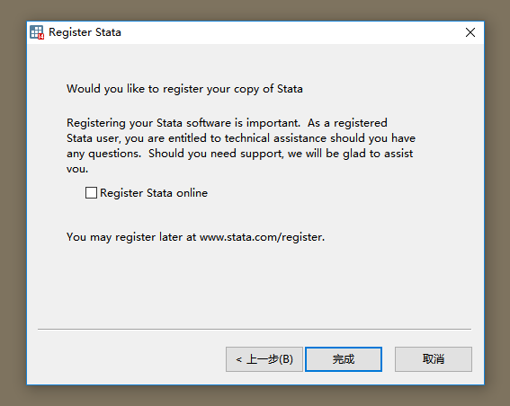
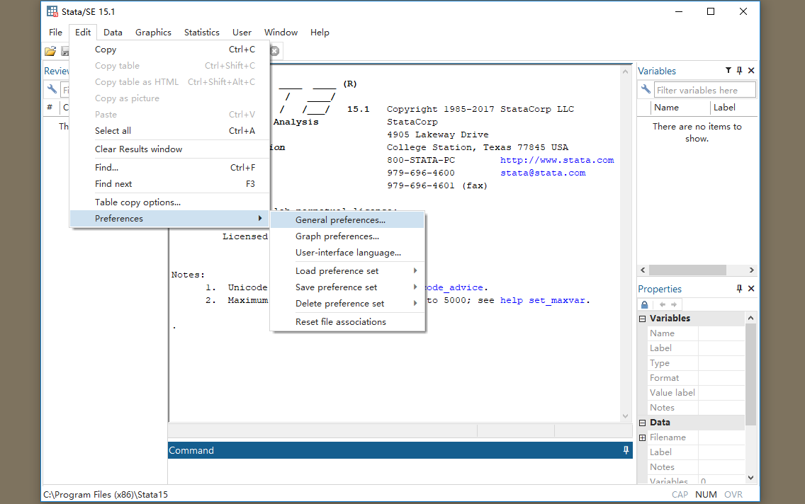

\mainmatter
# Stata 安装与 Sublime Text3 配置教程

这篇文章介绍了 Stata14、Stata15 和 Sublime Text3 的安装及配置。

## Stata 安装包获取

网上关于 Stata 安装包的资源很多，建议自行获取。

为了方便（实际上是我懒得卸载自己电脑上的 Stata 了），本文仅介绍如何在 Windows 系统上安装 Stata14 和 Stata15，最后作为补充，介绍如何安装和配置一款非常好用的 Stata 代码编辑器——Sublime Text。当然 Stata 的代码编辑器还是不止一个的，另一个非常好用的代码编辑器是 Atom，不过实际上一个编辑器是否支持 Stata 在于有没有大佬编写一个把代码发送给 Stata 执行的插件。

## Stata14 的安装
之所以有了 Stata15 还是想介绍一下 Stata14，是因为很多人（包括我）学习 Stata 的时候是使用的 Stata14，所以有时候还不是很习惯 Stata15 里面的一些东西。另外就 MP 版本的 Stata 来说，暂时我只找到了 Stata14MP（并行版本的 Stata，价格最为昂贵且速度最快），Stata15 暂时只有 SE 版本（特别版本）和 IC 版本（最慢的版本）。大部分时候 SE 版本是能满足使用需求的。

### Windows OS
下面就正式开始介绍 Stata14MP 的安装过程吧！

+ 第一步，点击打开 exe 文件：


+ 第二步，接受许可协议：


+ 第三步，不需要修改改任何东西：


+ 第四步，选择版本。由于序列号是 MP 版本的，所以选择 MP：




+ 第五步，设定你的 Stata 的安装目录，**注意：一定要记住这个安装目录的路径！**


+ 第六步，Next：


+ 第七步，Next：


+ 第八步，正在安装中：


+ 第九步，安装完成：


+ 第十步，找到刚刚的安装目录，按照图中的方法创建桌面快捷方式：


+ 第十一步， 把共享文件夹里面一个名为 stata.lic 的文件复制粘贴到安装目录里面，然后双击刚刚在桌面新建的快捷方式打开 Stata，你会看到下面的错误信息：


+ 不过完全不用担心，点击`OK`然后点击`下一步`：


+ 注意这一步里面记得取消`Register Stata online`：




+ 最后，安装完成，记得选择`Disable automatic update checking`，因为它很烦人：


+ 然后，我们可以运行一个简单的更新命令：

```stata
update all
```
你会发现运行出错，这就说明！这个 Stata 是盗版的！所以别声张！


### Mac OS

Mac OS 上安装 Stata14 比 Windows 上的安装要简单很多，因此我不再赘述。下面仅仅展示一下 Mac 版本的 Stata14：


另外 Mac 版本的 Stata14 可以非常方便的更改工作目录：


## Stata15 的安装
### Windows OS

Stata15 的安装过程和 Stata14 的基本一样：
+ 第一步，点击打开 exe 文件：


+ Next：


+ 注意！这里要选择 SE：


+ 另外，如果你忘记关闭自动检查，可以使用如下操作关闭：





### Mac OS

同样，这里仅仅展示 Mac 版本的 Stata15SE：


此外 Mac 版本的 Stata 还支持在终端使用（刚刚的 Stata14 也支持），首先需要安装终端工具：


然后打开终端，输入`stata-se`回车：


是不是非常酷！当然不仅仅是酷，这个功能极大的拓展了 Stata 的能力！

## Stata 代码编辑器的配置

同样，这里只详细介绍 Windows 系统上的安装和配置，Mac 系统的安装配置流程相似且更加简单。（以连接 Stata15 为例）

### Windows OS

#### 安装与配置

首先到 Sublime Text3 的官网下载最新版本的 Sublime Text3，官网地址为：[Sublime Text3](https://www.sublimetext.com/)，Windows 版本的下载连接为：[Windows 64 bit](https://download.sublimetext.com/Sublime%20Text%20Build%203176%20x64%20Setup.exe)
+ 下载完成后点击打开，记得勾选这个：


+ 安装完成之后的界面如下（我打开了一个 Stata 的 ado 文件），点击 Tools => Install Package Control，这个会安装一个包控制工具：


+ 稍等片刻即安装完成（注意电脑要联网）：


+ 下面我们需要安装一些包。选择 Preferences => Package Control：


+ 选择 Install Packages：


+ 然后在输入框里输入 pywin32 点击安装这个插件


+ 稍等片刻即可安装完成，同样的方式安装 StataEditor 和 ChineseLocalizations 插件，第二个插件是一个汉化的插件：


+ 接下来配置 StataEditor 插件，把 Setting-Default 中的内容复制粘贴到 Setting-User 中：


+ 然后在 Setting-User 中改动如下内容：


为（这里修改的是你的 Stata 的安装位置、版本和字符编码，前面两个要结合你的实际情况）


+ 配置完成之后点击右下角会弹出一个选择框，从框中找到 Stata 选中，然后你就会发现代码变成彩色的了！这就是代码高亮。


+ 不过现在的代码还是不能直接运行，我们还需要继续进行下面的操作：

* 按 Ctrl+\`(注意这个键是半角输入模式下的制表符上面的那个键)打开命令窗口输入下面这段代码：


* 这段代码来自这里：[点击跳转](https://packagecontrol.io/installation)

* 回车运行完之后再次 Ctrl+\` 关闭命令窗口即可。

* 最后我们再去到 Stata15 的安装位置，右键 **StataSE-64.exe** 创建快捷方式，然后右键点击刚刚创建的快捷方式选择属性打开做如下修改，也就是在目标的最后加上`/Register`：


* 再点击**高级**勾选：


* 确定所有，回到安装位置，右键快捷方式选择以管理员的身份运行，然后可以了。


运行完之后你就会发现这个快捷方式无法启动 Stata 了，重新新建一个快捷方式即可。

#### 使用演示

* 关掉 Sublime，首先新建一个 do 文档（建立方法是新建一个 txt 文档然后把扩展名改为 do 即可）

* 现在它的默认打开方式是 Stata，我们右键打开属性修改一下：


* 然后点击确定就可以了。

* 打开它！我写了一个比较规范的 do-file：


我的注释是绿色的，是我自己调的色。

* 我们要记住的第一个快捷键就是：`Ctrl+D`——运行全部或选中的代码。

+ 选择实力文件夹中的所有代码，然后按`Ctrl+D`即可绘制出一副太极八卦图了：


#### 太极八卦图的绘制代码

```stata
clear
* 安装绘图主题
ssc install blindschemes, replace all
* 设置绘图主题为 plotplain
set scheme plotplain

set obs 500
gen x = runiform(0, 0.6)
gen y1 = sqrt(0.352 - x^2)
gen y2 = -sqrt(0.352 - x^2)
tw ///
scatteri 0 0, msymbol(O) msize(*60) mcolor(black) || ///
scatteri 0 0, msymbol(O) msize(*56) mcolor(white) || ///
scatteri 0 0, msymbol(O) msize(*54) mcolor(black) || ///
scatteri 0 0, msymbol(O) msize(*50) mcolor(white) || ///
scatteri 0 0, msymbol(O) msize(*48) mcolor(black) || ///
scatteri 0 0, msymbol(O) msize(*44) mcolor(white) || ///
pci 0 0 -1 -0.03, lc(white) lw(*2) || ///
pci 0 0 -1 0, lc(white) lw(*6) || ///
pci 0 0 -1 0.03, lc(white) lw(*2) || ///
|| ///
pci 1 -0.4142 -1 0.4142, lc(white) lw(*12) || ///
pci 1 -0.38 -1 0.38, lc(white) lw(*4) || ///
pci 1 -0.49 -1 0.49, lc(white) lw(*4) || ///
|| ///
pci 0 0 -0.63 0.66, lc(white) lw(*3) || ///
pci 0 0 -0.61 0.66, lc(white) lw(*3) || ///
pci 0 0 -0.59 0.665, lc(white) lw(*3) || ///
|| ///
pci 0.65 -0.65 0.75 -0.75, lc(white) lw(*3) || ///
pci 0.635 -0.635 0.7 -0.7, lc(white) lw(*3) || ///
pci 0.63 -0.666 0.68 -0.72, lc(white) lw(*5) || ///
|| ///
pci 0.45 -1 -0.45 1, lc(white) lw(*5) || ///
pci 0.4 -1 -0.4 1, lc(white) lw(*6) || ///
pci 0.35 -1 -0.35 1, lc(white) lw(*8) || ///
|| ///
pci 0 -0.9 0 -0.8, lc(white) lw(*8)|| ///
pci 0 0.7 0 0.8, lc(white) lw(*8)|| ///
pci 0 0.9 0 1, lc(white) lw(*8)|| ///
|| ///
pci -1 -0.4142 1 0.4142, lc(white) lw(*16) || ///
|| ///
pci -0.75 -0.75  -0.57 -0.57, lc(white) lw(*8) || ///
pci 0.5 0.5  0.56 0.56, lc(white) lw(*8) || ///
|| ///
pci -0.45 -1 0.45 1 , lc(white) lw(*16) || ///
|| ///
scatteri 0 0, msymbol(Oh) msize(*36) mcolor(black) || ///
rarea y1 y2 x, sort fc(black) lc(black) fi(inten100) || ///
scatteri -0.292 0, msymbol(O) msize(*17.5) mcolor(black) || ///
scatteri 0.292 0, msymbol(O) msize(*17.5) mcolor(white) || ///
scatteri 0.292 0, msymbol(O) msize(*4) mcolor(black) || ///
scatteri -0.292 0, msymbol(O) msize(*4) mc(white) || ///
||, leg(off) xla(-1(2)1, nogrid format(%6.0f) labc(white) ///
tlc(white)) xsc(lc(white)) yla(-1(0.1)1, nogrid) ///
aspect(1) ysc(off) xti(" ")
gr export 太极八卦图.png, width(1800) height(1200)

```

### Mac OS

Mac 上的安装配置更加简单。不再介绍。

## 常用 shell/Dos 命令安装
shell 和 Dos 分别是 Mac/Linux 和 Windows 上对命令解释器的称谓。Stata 的一个最常见的拓展使用就是调用 shell 命令和 Dos 命令。为了简单，下面统称为 shell 命令。在 Windows 系统上，Dos 命令可以在 cmd——命令提示符中运行，而 shell 命令可以在 Mac 的终端中运行。Stata 可以通过`!`或者 shell 调用这些工具。其中最常用的莫过于`curl`命令了。这款命令非常强大，可以模拟浏览器操作。在使用 Stata 爬数据的时候经常使用。这里介绍一下如何安装这款工具。

### Windows OS

- 首先打开命令提示符,输入`where powershell`找到 powershell.exe 的位置, 然后找到它右键选择以管理员身份打开. 然后就会弹出来一个蓝色的命令行界面.
- 然后可以安装一个包管理工具 choco(这里参考了这篇文章[《在 windows 下使用 choco 作为包管理工具》](https://www.jianshu.com/p/be19a2bebc48)). 在以管理员身份打开的 powershell 里依次输入下面几句命令:

```bash
Set-ExecutionPolicy RemoteSigned
* 安装choco
iwr https://chocolatey.org/install.ps1 -UseBasicParsing | iex
* 安装curl
choco install curl
```

这样你就安装好了 Windows 下一款非常好用的包管理工具，此外，你如果想安装其他命令，可以在这个网站检索：[https://chocolatey.org/packages](https://chocolatey.org/packages)。推荐安装`wget`和`axel`，这两个是非常好用的下载工具。`axel`是个多线程下载工具，下载电影什么的都不是问题。

+ 另外有时候也会用到 tr 命令和 sed 命令：这两个命令的下载链接分别为：

tr：[http://bcn.bathome.net/tool/tr.exe](http://bcn.bathome.net/tool/tr.exe)

sed：[http://bcn.bathome.net/tool/4.7/sed.exe](http://bcn.bathome.net/tool/4.7/sed.exe)

推荐大家一个非常全的批处理命令库：http://www.bathome.net/s/tool/

注意上面下面的命令都不是双击安装的，把下载到的 exe 文件放入`C:\Windows\System32`即可全局使用。

### Mac OS
如果你是 Mac 用户，那你非常幸运，因为上面提到的 curl、tr 和 sed 都是自带的。

## Stata 更新
Stata 公司定期会出更新包修复一些 Bug 或者添加一些新的功能，及时更新 Stata 也是有必要的。由于我们的 Stata 是盗版的，所以只能采取离线更新。即首先下载离线更新包，然后更新：
离线更新包的下载地址为[https://www.stata.com/support/updates/](https://www.stata.com/support/updates/)，为了方便大家更新，我这里直接给出各个版本的下载链接

**[stata15update_win.zip](https://www.stata.com/support/updates/stata15/stata15update_win.zip)**

**[stata15update_mac.zip](https://www.stata.com/support/updates/stata15/stata15update_mac.zip)**

**[stata14update_win.zip](https://www.stata.com/support/updates/stata14/stata14update_win.zip)**

**[stata14update_mac.zip](https://www.stata.com/support/updates/stata14/stata14update_mac.zip)**

下载完成之后会得到一个 zip 文件，解压。

下面打开 Stata（根据你的 Stata 版本选择更新包即可）：
在 Command 窗口输入`db update`并回车，会弹出这个窗口：


然后选择 From alternate location => Browse => 确定：


点击 OK 即可进入更新：


选择 Yes：


然后等待片刻即可更新成功：


