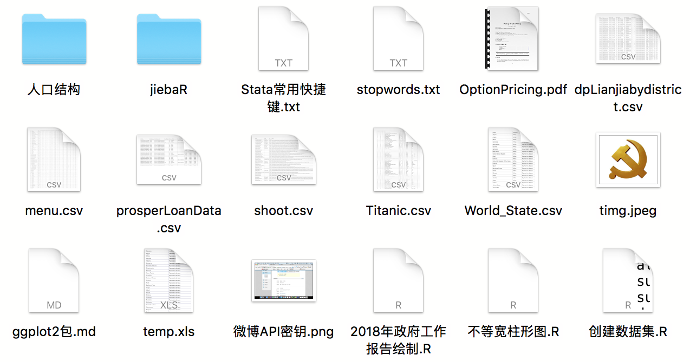
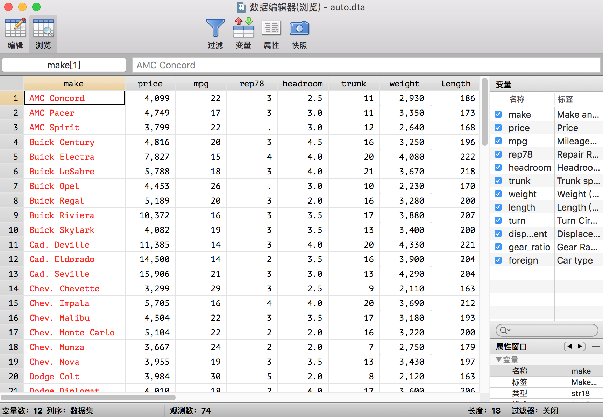
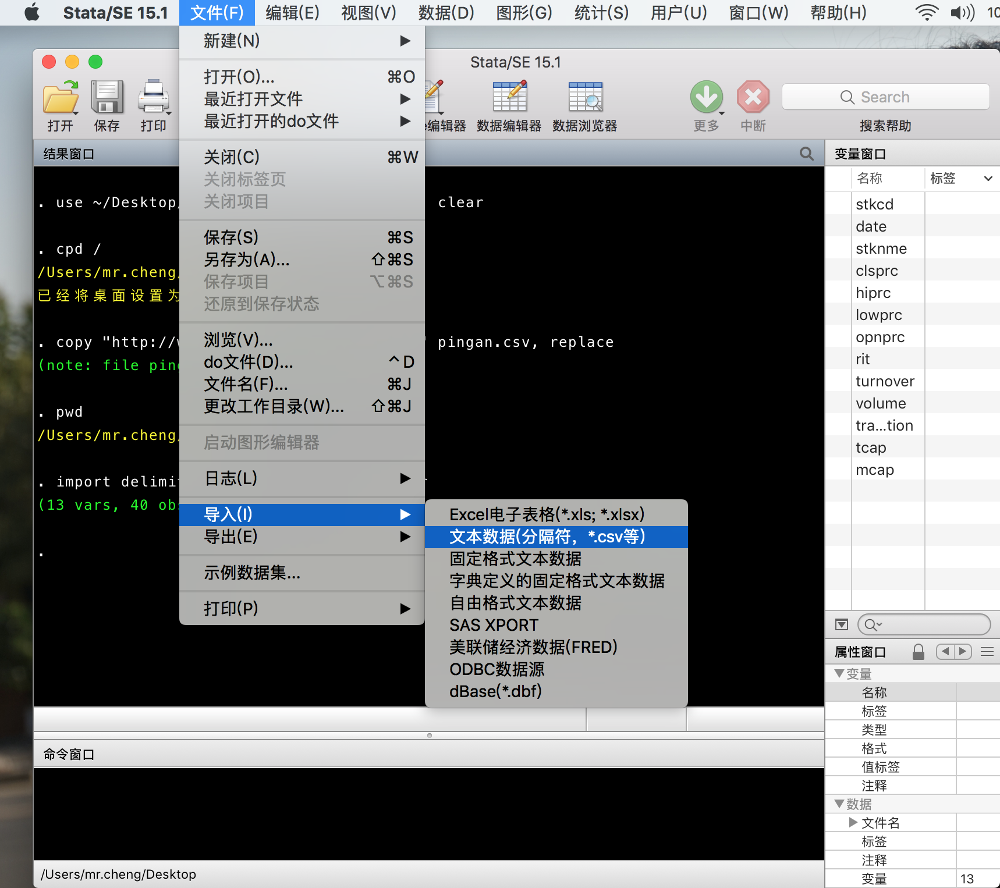
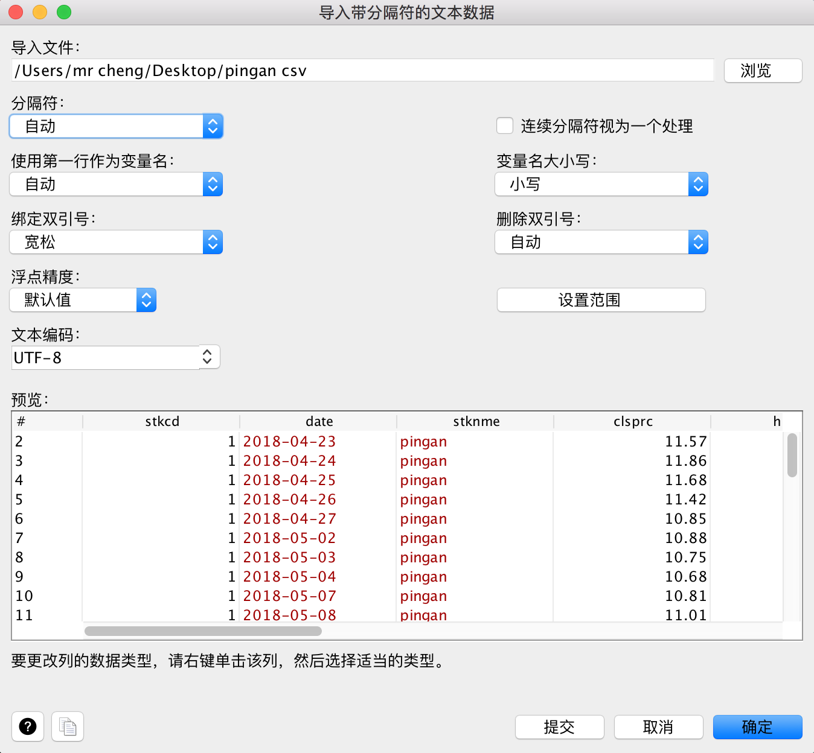
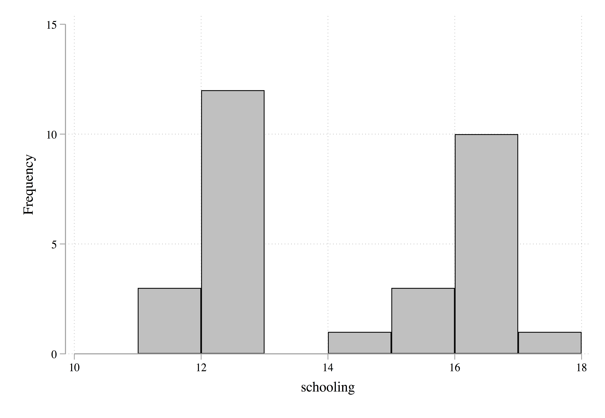
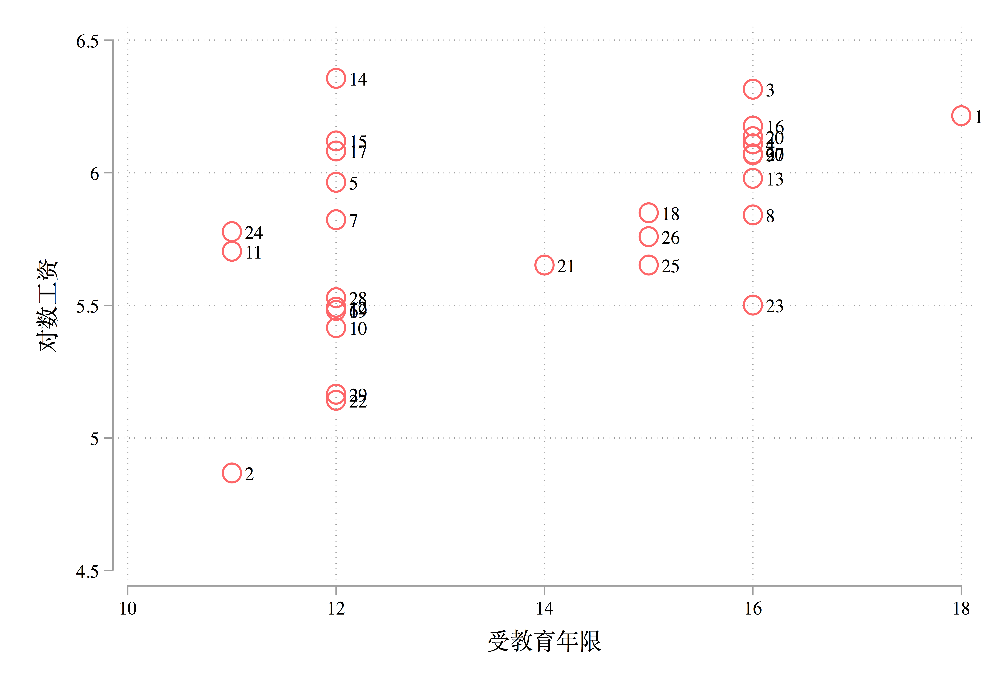

# Stata 基础操作

## Stata 是什么
根据 Stata 对自己的介绍：

> 1. Stata is a statistical package for managing, analyzing, and graphing data.
> 2. Stata is available for a variety of platforms. Stata may be used either as a point-and-click application or as a command-driven package.
> 3. Stata’s GUI provides an easy interface for those new to Stata and for experienced Stata users who
wish to execute a command that they seldom use.
> 4. The command language provides a fast way to communicate with Stata and to communicate more complex ideas.

也就是说， Stata 是一个集数据管理、分析和可视化的工具。可以在各种操作系统中使用，可以通过鼠标点击操作也能通过命令行驱动。

Stata 的图形用户界面让新手们很方便入门，Stata 的命令语言使得很多复杂的想法变得容易实现。

我经常看到很多 R、Python、Matlab 用户对 Stata 非常不屑一顾。每每提及 Stata 总是要加一句：

> "如果 Stata 也算编程语言的话······"

我也常听一些没有接触过编程的朋友对 Stata 望而却步，他们常说：

> "虽然看不懂，但是觉得很厉害的样子。"

所以 Stata 是什么？在 Stata 中运行 `help class` 命令你就可以看到下面的一段介绍：

> Stata's two programming languages, ado and Mata, each support object-oriented programming.  [P] class explains object-oriented programming in ado.  Most users interested in object-oriented programming will wish to do the programming in Mata.  See [M-2] class to learn about object-oriented programming in Mata.

Stata 是套体系完整的面向对象的编程语言。两种编程语言，**ado** 和 **Mata** ，第一种较为常用，第二种更为强大。

## Stata 能做什么

1. 数据获取与处理；
使用 Stata 可以比较快速的获取多种数据并迅速整理成研究者所需要的数据。
2. 精美统计图形绘制与导出。
Stata 的绘图系统是相当完整的。通过绘图主题的选择，Stata 作图也可以非常的精美。
3. 严谨可重复的实证研究。

在熟练使用 Stata 之前，你的论文原材料可能是这样的（图 \@ref(fig:dirtydir) 并不是论文的原材料，是我随便截的，只是想表达乱）：

```{r dirtydir, echo=FALSE, fig.align='center', fig.cap = '一个乱七八糟的文件夹', out.width='90%'}

```

在此之前可能你的主要数据处理工具是 Excel ，并且还不会 Excel VBA ，所以经常会整夜整夜的复制粘贴。而这些工作实际上用几行 Stata 语句就能完成。

那你用熟练了 Stata 之后你的论文数据是什么样的呢？（假如你是一个像我一样的强迫症患者）

```{r cleandir, echo=FALSE, fig.align='center', fig.cap = '一个整洁的项目文件夹', out.width='90%'}
knitr::include_graphics('assets/cleandir.png')
```

这个文件夹的目录结构是：
```shell
.
├── ADO
│   ├── carryforward.ado
│   ├── carryforward.hlp
│   ├── estadd.ado
│   ├── estadd.hlp
│   ├── esttab.ado
│   └── esttab.hlp
├── DATA
│   ├── beta.csv
│   └── mydata.dta
├── DO
│   ├── 表2-1-描述性统计表.do
│   ├── 表3-1-模型估计结果.do
│   ├── 图3-1-每个月份的风险暴露变化对股票流动性影响的差异.do
│   ├── 表3-2-模型估计结果.do
│   ├── 图3-2-每个年份风险暴露变化对股票流动性影响的差异.do
│   ├── 表4-1-稳健性检验结果.do
│   └── 设定绘图主题.do
├── DOCS
│   └──  风险暴露的变化对股票流动性的影响.pdf
├── IMAGE
│   ├── 年份效应.png
│   └── 月份效应.png
├── 主程序.do
└── 参考文献
    └── 110228635.pdf
```

在用 Stata 之前，每次画图你可能都要在 Excel 上面点击无数次。而用 Stata 之后，即使是下面这样复杂的图，你只需要一行命令就能绘制出来：

```{r sci, echo=FALSE, fig.align='center', fig.cap = '上证指数蜡烛图', out.width='90%'}
knitr::include_graphics('assets/stkpv4.png')
```

此外，如果你还会一些数据库或其它编程软件，Stata 能够很好的和它们交互使用。

如果说 Stata 不是最好的，我觉得 Stata 是做实证研究的最好工具。

1. Stata 作为商业软件，有着专业且负责的团队维护。所以 Stata 的帮助文档是最让人喜爱的，这些也是很多开源软件无法比拟的。
2. Stata 的速度相对较快，Stata 的启动速度远快于 Matlab、SAS 这些软件，且对电脑硬件要求较低，这是非常重要的，如果你想用一个软件，然后打开它就要等待几分钟。那我想你可能很快就烦了。另外 Stata 运行的速度也足够快。可以满足大多数用户的需要。
3. Stata 提供了很多可以把统计表格导出到 Word、PDF 和 Tex 文档的命令。实际上 Stata15 的 putdocx 命令搭配其它的一些命令可以直接实现论文的编排。

我想以上的每一条都足以成为大家认真学习 Stata 的理由。

下面就让我们进入 Stata 的世界吧！

## Stata 基本操作
### Stata 系统文件夹
运行 `sysdir` 命令即可得到 Stata 的系统文件夹列表：

```stata 
sysdir
*>    STATA:  /Applications/Stata15/
*>     BASE:  /Applications/Stata15/ado/base/
*>     SITE:  /Applications/Stata15/ado/site/
*>     PLUS:  /Users/czx/Library/Application Support/Stata/ado/plus/
*> PERSONAL:  /Users/czx/Library/Application Support/Stata/ado/personal/
*> OLDPLACE:  ~/ado/
```

* `BASE` 文件夹包含了 Stata 官方的 ado 文件；
* `PERSONAL` 文件夹可以放置你自己的 ado-files；
* `PLUS` 文件夹在你下载外部命令时会被自动创建。

另外运行 `adopath` 也可以得到：

```stata 
adopath
*>  [1]  (BASE)      "/Applications/Stata15/ado/base/"
*>  [2]  (SITE)      "/Applications/Stata15/ado/site/"
*>  [3]              "."
*>  [4]  (PERSONAL)  "/Users/czx/Library/Application Support/Stata/ado/personal/"
*>  [5]  (PLUS)      "/Users/czx/Library/Application Support/Stata/ado/plus/"
*>  [6]  (OLDPLACE)  "~/ado/"
```
`adopath` 命令的运行结果和 `sysdir` 基本相同，这里的排序也是 `Stata` 寻找 `ado` 文件的顺序。

### 数据导入
#### 导入系统数据集
系统数据集就是位于系统文件夹的数据集，这些数据集一般是一些示例数据集。导入系统数据集是使用 sysuse 命令，最有名的系统数据集要数 auto 数据集了：

```stata
sysuse auto, clear
```

这是个 1978 年的汽车数据集。这个数据集是这样的：

```{r auto, echo=FALSE, fig.align='center', fig.cap = '1978年汽车数据集', out.width='90%'}

```

此外 sysuse 还可以用来查看所有的系统数据集：

```stata
sysuse dir
*>  .dta               cjd1617.dta        lifeexp.dta        reshape1.dta
*>  air2.dta           colorschemes.dta   lutkepohl2.dta     sandstone.dta
*>  airq.dta           countycode.dta     moneysupply.dta    sexratio.dta
*>  auto.dta           educ99gdp.dta      network1.dta       smoking.dta
*>  auto2.dta          fullauto.dta       network1a.dta      sp500.dta
*>  autornd.dta        ghanaage.dta       nhanes2f.dta       splotxmpl.dta
*>  bplong.dta         gnp96.dta          nlsw88.dta         stackxmpl.dta
*>  bpwide.dta         grunfeld.dta       nlswide1.dta       surface.dta
*>  brewmeta.dta       houseprice.dta     nlswork.dta        tsline1.dta
*>  cancer.dta         jd14151617xxb.dta  nlswork2.dta       tsline2.dta
*>  census.dta         jd141516cjd.dta    parent.dta         uslifeexp.dta
*>  child.dta          jd2017zsjh.dta     pop2000.dta        uslifeexp2.dta
*>  citytemp.dta       jdcourse2018a.dta  population.dta     voter.dta
*>  citytemp4.dta      lbw.dta            rate2.dta          xtline1.dta
```

使用 all 选项可以查看所有的：

```stata
sysuse dir, all
*>  .dta                  child.dta             network1a.dta
*>  __i10v2003.dta        china_map.dta         nhanes2f.dta
*>  __i10v2004.dta        citytemp.dta          nlsw88.dta
*>  __i10v2006.dta        citytemp4.dta         nlswide1.dta
*>  __i10v2007.dta        cjd1617.dta           nlswork.dta
*>  __i10v2008.dta        colorschemes.dta      nlswork2.dta
*>  __i10v2009.dta        countycode.dta        parent.dta
*>  __i10v2010.dta        echarts_worldmap.dta  pop2000.dta
*>  __i10v2011.dta        educ99gdp.dta         population.dta
*>  __i10v2012.dta        fullauto.dta          rate2.dta
*>  __i10v2013.dta        ghanaage.dta          reshape1.dta
*>  __i10v2014.dta        gini_prov.dta         sandstone.dta
*>  __i10v2016.dta        gnp96.dta             sexratio.dta
*>  __icd10.dta           grunfeld.dta          smoking.dta
*>  __icd10cm.dta         houseprice.dta        sp500.dta
*>  __icd10pcs.dta        icd9_cod.dta          splotxmpl.dta
*>  air2.dta              icd9_cop.dta          stackxmpl.dta
*>  airq.dta              jd14151617xxb.dta     surface.dta
*>  auto.dta              jd141516cjd.dta       tsline1.dta
*>  auto2.dta             jd2017zsjh.dta        tsline2.dta
*>  autornd.dta           jdcourse2018a.dta     uslifeexp.dta
*>  bplong.dta            lbw.dta               uslifeexp2.dta
*>  bpwide.dta            lifeexp.dta           voter.dta
*>  brewmeta.dta          lutkepohl2.dta        xtline1.dta
*>  cancer.dta            moneysupply.dta
*>  census.dta            network1.dta
```

#### 导入网络数据集

网络数据集是存放在 Stata 公司服务器上的一些数据集，通常也是一些示例数据集。例如导入 `lifeexp.dta` 数据集：

```stata 
webuse lifeexp, clear
*> (Life expectancy, 1998)
```

这是一个 1998 年预期寿命数据集，括号里面的内容是数据集的标签(`help label`)。

`webuse query`可以用来查看当前 webuse 指向的数据仓库地址：

```stata 
webuse query
*> (prefix now "http://www.stata-press.com/data/r15")
```

我还可以换个地址：

```stata
webuse set "https://czxa.github.io/cuse/c"
*> (prefix now "https://czxa.github.io/cuse/c")
```

这个网址是我的数据仓库下的一个名称为 c 的子文件夹，里面放置着 c 开头的数据集。设定好网址指向之后就可以调用该指向下的数据集了：

```stata
webuse cjd1617, clear
*> (金融学16和17年成绩单)
```

这是我们班同学 2016 和 2017 年的成绩单，为了保护隐私，我抹去了大家的姓名。
重新把 webuse 的指向的网址指向设定为默认网址，只需要运行下面的命令即可：

```stata 
webuse set
*> (prefix now "http://www.stata-press.com/data/r15")
```

#### 调用我的个人仓库里面的数据集

在实际数据处理过程中，有时候我们会需要一些常用的数据集，例如中国行政区划编码。如果每次我们都上网找然后再导入 Stata 进行整理，是不是太麻烦了？我们能不能像 sysuse、webuse 这样直接使用数据呢？所以我就写了这套  `cuse` 命令。这个命令里面包含了很多我经常使用的数据集，例如各省市的行政区号之类的。

运行下面的命令即可安装这个命令：

```stata 
github install czxa/cuse, replace
```

这个命令的使用方法是：

```stata
* cuselist可以用来查看数据库中包含的数据
cuselist
*> 【0】
*> ----------------------------------------------------------------------
*> 1.  000001.dta: 平安银行历史股票数据
*> 【a】
*> ----------------------------------------------------------------------
*> 1.  amricancellmapdata.dta: 美国蜂窝地图各个省份的位置坐标
*> 【c】
*> ----------------------------------------------------------------------
*> 1.  cellmapdata.dta: 中国蜂窝地图各个省份的位置坐标
*> 1.  countycode.dta: 中国各省市区县编号(即身份证前六位号码)
*> 2.  china_label.dta: 中国地图标签
*> 3.  china_map.dta: 中国地图数据
*> 4.  china_city_spatial_distance.dta: 中国地级地图数据集
*> 5.  china_province_spatial_distance.dta: 中国省级地图数据集
*> 6.  cjd1617.dta: 金融学16和17年成绩单
*> 7.  cpi.dta: 中国CPI2008/1-2017/11
*> 8.  countrysexratio.dta: knoema各国总人口性别比例数据
*> 9.  ctbc2.dta: 中债国债2002-2017年国债到期收益率
*> 10.  cnstockholiday.dta: 上交所与深交所休市日期
*> 11.  cnstockincome.dta:1989年-2017年所有上市公司的基本收入状况
*> ----------------------------------------------------------------------
*> 【d】
*> ----------------------------------------------------------------------
*> 1.  echarts_worldmap.dta: ECharts世界地图各国中英文名称对照
*> 【g】
*> ----------------------------------------------------------------------
*> 1.  gdpjdlj.dta: 中国GDP季度累计2006/第一季度-2017/第三季度
*> 2.  gini_prov.dta: 1995-2010中国各省份Gini系数
*> 【h】
*> ----------------------------------------------------------------------
*> 1.  huaihe.dta: 2017年淮河供暖政策对人预期寿命的影响模仿数据集
*> 2.  houseprice.dta: 中国百城房价数据集
*> ----------------------------------------------------------------------
*> 【j】
*> ----------------------------------------------------------------------
*> 1.  jdcourse2018a.dta: 2018年上半年暨南大学排课选课表
*> 2.  jd2017zsjh.dta: 暨南大学2017年各省招生人数
*> ----------------------------------------------------------------------
*> 【l】
*> ----------------------------------------------------------------------
*> 1.  life_expentancy.dta: 2010年中国各省市自治区人口出生时预期寿命
*> 【m】
*> ----------------------------------------------------------------------
*> 1.  moneysupply.dta: 2008/1-2017/11中国货币供应量M0M1M2
*> ----------------------------------------------------------------------
*> 【p】
*> ----------------------------------------------------------------------
*> 1.  pm10.dta: 2017年淮河供暖政策对人预期寿命影响的原始数据集
*> 2.  population.dta: 2010年中国各区县人口
*> 3.  population_prov.dta: 2002-2014年全国各省市年末人口
*> 4.  pjw.dta: 分城市人口、就业与工资(1990-2016)
*> ----------------------------------------------------------------------
*> 【s】
*> ----------------------------------------------------------------------
*> 1.  station.dta: 中国所有火车站车站代码
*> 2.  smoking.dta: 合成控制法的美国39个洲的香烟销售量数据集
*> 2.  sexratio.dta: knoema各国总人口性别比例数据
*> ----------------------------------------------------------------------
*> 【t】
*> ----------------------------------------------------------------------
*> 1.  titanic.dta: 泰坦尼克号生存数据集
*> 2.  tourism.dta: 旅游事业发展情况
*> ----------------------------------------------------------------------
*> 【书籍数据集】
*> 注意！如果你想调用的数据集的名字里含大写字母，你需要把它的首字母调成小写才能调用!
*> 1. 《计量经济学及Stata应用》——陈强著
*> 2. 《高级计量经济学及Stata应用》——陈强著
*> 3. 《An Introduction to Stata Programming, Second Edition》——Christopher F. Baum著
```

然后如果你想调用需要的数据集，使用 cuse 命令，这个命令的语法是：

> cuse filename , [<u>c</u>lear <u>w</u>eb <u>s</u>avetosystem]

下划线表明该选项可以简写为下划线部分。

+ <u>c</u>lear：清空当前数据集；
+ <u>w</u>eb：表示从网络读取数据，对我的电脑来说，这是个可选项，对于别人的电脑来说，这是个必选项。
+ <u>s</u>avetosystem 表示调用的同时把该数据集存入系统文件夹。

例如，假如我想调用 `grilic_small.dta` 数据集，使用下面的命令即可：

```stata 
cuse grilic_small, c w s
```

上面的命令就实现了把内存清空、从网络获取数据和存入系统文件夹三个操作，以后如果需要这个数据集，用 sysuse 也可以读取了：

```stata
sysuse grilic_small, clear
```

### 读入 dta 数据集

这个是最为常用的命令， use 命令。用来导入 Stata 的 dta 格式的数据集。

例如我想读取`grilic_small.dta`数据集，下面的命令即可：

```stata
* 首先把工作目录设置到这个数据集所在的文件夹
cd ~/Desktop/datasets
* 然后使用use命令读取该数据集
use grilic_small, clear
* 当然你也可以这么做，也就是路径+文件名
use ~/Desktop/datasets/grilic_small.dta, clear
* 但是不推荐。建议的工作流程是把所有的工作都在工作目录下进行。
```

### 读入 csv 数据集

csv 格式的数据集是逗号分隔的文本文件，可以直接用 Excel 打开。例如，我想读取 `pingan.csv` 文件，这个文件下载地址为：`https://czxb.github.io/mr/pingan.csv` 。

Stata 的 copy 命令可以被用来下载文件：

```stata
copy "https://czxb.github.io/mr/pingan.csv" pingan.csv, replace
```

然后你就能在你的工作目录里面发现这个文件了。如果你不清楚你的工作目录在哪里，可以运行下面的命令：

```stata
pwd
*> /Users/czx/Desktop
```

然后我们把这个 csv 文件读入 Stata：

```stata
import delimited using pingan.csv, clear
```

此外，你还可以通过 GUI (图形用户界面) 导入：

```{r csvgui1, echo=FALSE, fig.align='center', fig.cap = 'Stata 通过 GUI 导入 csv 数据(1)', out.width='90%'}

```

稍等片刻，在对话框里进行选择，然后提交即可：

```{r csvgui2, echo=FALSE, fig.align='center', fig.cap = 'Stata 通过 GUI 导入 csv 数据(2)', out.width='70%'}

```

为了保存这个操作，我们最好把这个提交动作的命令复制粘贴到我们的 do 文档里面：

```stata
import delimited /Users/czx/Desktop/pingan.csv, ///
    delimiter(comma) varnames(1) encoding(utf8) clear
```

### 读入 xls、xlsx 数据

这两种格式的数据是 Excel 的数据，例如我想导入 `grilic_small.xls` 数据集：

```stata
* 首先用copy下载：
copy "https://czxb.github.io/mr/grilic_small.xls" grilic_small.xls, replace
import excel using grilic_small.xls, clear firstrow
```

`firstrow` 表示设定第一行为变量名。

同样导入 Excel 文件也能通过界面鼠标点击操作。

### 导入自由格式的 txt 文件

下面我要介绍的这种是在使用 Stata 爬数据的时候最为常用的一种方法了。

假如我想爬东方财富网的采购经理人指数：网址是：[中国 采购经理人指数（PMI）](http://data.eastmoney.com/cjsj/pmi.html)。那么第一步就是我的把这个网页读入 Stata，下面的命令就可以实现了：

```stata
* 首先把这个网页下载存储为temp.txt文件：
copy "http://data.eastmoney.com/cjsj/pmi.html" temp.txt, replace
* 然后读入Stata，把每一行的前20000个字符（可以确定是整行了）读入strL格式的变量v。
infix strL v 1-20000 using temp.txt, clear
```

然后你会发现这个变量 v 里面的有些观测值是乱码的，这是因为这个网页文件不是 `UTF-8` 编码的，所以需要先把这个 `temp.txt` 文件转一下码。 Stata 中的转码命令是：

```stata
unicode encoding set gb18030
unicode translate 文件名.后缀名
unicode erasebackups, badidea
```

所以我们把这个 temp.txt 文件转个码再读如 Stata 中：

```stata
* 首先清空内存，这个清空是非常彻底的清空。
clear all
copy "http://data.eastmoney.com/cjsj/pmi.html" temp.txt, replace
unicode encoding set gb18030
unicode translate temp.txt
unicode erasebackups, badidea
infix strL v 1-20000 using temp.txt, clear
```

然后就会发现乱码问题得到了解决。
Stata14 之前的版本创建的数据集读入 Stata14、15 都是需要转码的，都可以用这三句命令完成。

但是每次都打这三句是不是非常麻烦？所以我简单把这三句封装成了一个小命令`utrans`。
这个命令位于我的 finance 命令包中，安装 finance 包即可安装这个命令：

```stata
github install czxa/finance, replace
```

然后上面的转码只需要`utrans + 文件即可完成`：

```stata
utrans temp.txt
*> 转码完成
```

## 数据处理

当我们把数据读入之后就能进行数据处理了。数据处理的熟练程度直接决定了你写论文的速度。这里介绍一些常用的 Stata 处理数据的命令。

### describe：审视数据
这个命令可以被简写为`des`。建议初学者不要立即使用简写，以免后来记不住命令的全称。

```stata
sysuse auto, clear
*> (1978 Automobile Data)

des
*> Contains data from /Applications/Stata/ado/base/a/auto.dta
*>   obs:            74                          1978 Automobile Data
*>  vars:            12                          13 Apr 2016 17:45
*>  size:         3,182                          (_dta has notes)
*> ----------------------------------------------------------------------
*>               storage   display    value
*> variable name   type    format     label      variable label
*> ----------------------------------------------------------------------
*> make            str18   %-18s                 Make and Model
*> price           int     %8.0gc                Price
*> mpg             int     %8.0g                 Mileage (mpg)
*> rep78           int     %8.0g                 Repair Record 1978
*> headroom        float   %6.1f                 Headroom (in.)
*> trunk           int     %8.0g                 Trunk space (cu. ft.)
*> weight          int     %8.0gc                Weight (lbs.)
*> length          int     %8.0g                 Length (in.)
*> turn            int     %8.0g                 Turn Circle (ft.)
*> displacement    int     %8.0g                 Displacement (cu. in.)
*> gear_ratio      float   %6.2f                 Gear Ratio
*> foreign         byte    %8.0g      origin     Car type
*> ----------------------------------------------------------------------
*> Sorted by: foreign
```

### list：列示数据

这个命令有两种用法，第一种是列示某些变量，第二种是列示某些观测值：

```stata
* 列示整个数据表
list

* 列示变量price和make
list price make

* 列示所有变量的第5-10个观测值
list in 5/10

* 列示变量price和make的最后一个观测值
list price make in -1

* 列示price大于10000的部分
list price if price > 10000
```

### gsort/order：排序

sort 命令正在被逐渐弃用。gsort 用于观测值的排序，order 用于变量的排序。

```stata
* 把price按照由低到高的顺序排列
gsort price

* 把price按照由高到低的顺序排列
gsort -price

* 先排rep78再排price
gsort rep78 -price
```

### codebook：描述变量的基本信息

```stata
codebook
codebook price
*> --------------------------------------------------------------------------
*> price                                                               Price
*> --------------------------------------------------------------------------
*> 
*>                   type:  numeric (int)
*> 
*>                  range:  [3291,15906]                 units:  1
*>          unique values:  74                       missing .:  0/74
*> 
*>                   mean:   6165.26
*>               std. dev:    2949.5
*> 
*>            percentiles:        10%       25%       50%       75%       90%
*>                               3895      4195    5006.5      6342     11385
```
从上面的结果中可以看到：
1. price 变量为数值型变量；
2. 范围在 [3291,15906]；
3. 有 74 个观测值，互不相同且没有缺失值；
4. 均值为 6165.26，标准差为 2949.5；
5. 分位数看起来是合理的。

### generate：生成新变量

这个命令可以简写为`gen`。

```stata
* 例如我想生成一列等于观测值编号的变量v
gen v = _n

* 再例如我想生成一列等于总观测值数据的变量v1
gen v1 = _N

* 还可以和数学函数一起使用，例如生成pirce的平方序列
gen price2 = price^2
```

gen 还可以和 by/bysort 一起使用。例如我想生成一个表示 rep78 变量的每个值的个数的变量 v2：

```stata
bysort rep78: gen v2 = _N
* 或者
bysort rep78: egen v3 = count(mpg)
```

### replace: 替换

```stata
* 例如把rep78中的缺失值都替换成0(Stata中的数值型变量的缺失值用点表示，其实际数值是无穷大)
replace rep78 = 0 if rep78 == .

* 或者
replace rep78 = 0 if missing(rep78)

* 把 price 变量取值在 10000-15000 的观测值替换成-1
replace price = -1 if inrange(price, 10000, 15000)

* 把 make 变量取值为 "Olds Starfire" 和 "Dodge St. Regis" 的替换成 "" (空字符串)
replace make = "" if inlist(make, "Olds Starfire", "Dodge St. Regis")

* 把 make 变量中含字母A的观测值替换成空字符串
replace make = "" if index(make, "A")
```

### rename：重命名变量
这个命令可以简写为 ren。

```stata
* 例如把 make 重命名为 make1
ren make make1
```

### drop：删除
这个命令也有两种用法：删除变量和删除观测值。

```stata
* 删除变量make1
drop make1

* 删除第5-10个观测值
drop in 5/10

* 删除price大于10000的观测值
drop if price > 10000

* 使用通配符：删除m开头的变量
drop m*
```

### summarize：查看描述性统计量

这个命令可以简写为 sum ：

```stata
sum price
sum price if price > 10000
sum price, detail
```

### tabulate：查看频率频数表

这个命令可以被简写为 tab：

```stata
tab rep78
```

### pwcorr：计算相关系数表

```stata
pwcorr price length weight, star(0.05) sig
```

+ star 表示在 5%显著性水平上显著的相关系数上标星星。
+ sig 表示显示显著性水平。

corr 命令也能用于计算相关系数表：

```stata
corr price weight

* 还可以用来计算协方差矩阵
corr price weight, c
```

### display

这个命令可以被简写为`di`，用于打印：

```stata
display "这是一行字符串"
di as text "这是一行字符串"
di as error "这是一行字符串"
di as result "这是一行字符串"
di in green "这是一行字符串"
di in red "这是一行字符串"
di in yellow "这是一行字符串"
di in white "这是一行字符串"
di as input di in white "这是一行字符串"
di 3 + 4
di 2^0.5

sysuse auto, clear
*> (1978 Automobile Data)

summarize mpg
*> 
*>     Variable |        Obs        Mean    Std. Dev.       Min        Max
*> -------------+---------------------------------------------------------
*>          mpg |         74     21.2973    5.785503         12         41
*> 

di as text "mean of mpg = " as result r(mean)
*> mean of mpg = 21.297297
```

## 数据导出
### save: 导出为 dta 文件

```stata
save auto2, replace
```

### export delimited：导出为 csv 文件

```stata
export delimited using auto2.csv, replace
```

### export excel：导出为 excel 文件

```stata
export excel using auto2.xlsx, replace
```

## 绘图

### histogram：绘制直方图

这个命令可以被简写为 hist：

```stata
cuse grilic_small, c w
hist s, width(1) freq
```

+ width：组宽
+ freq：设定纵轴为频数，默认是密度

```{r hist, echo=FALSE, fig.align='center', fig.cap = '直方图', out.width='60%'}

```

> 推荐大家使用 plotplain 主题，刚刚安装 finance 命令包的时候这个主题已经安装好了，使用 scheme() 选项可以指定选项。

```stata
hist s, width(1) freq sch(plotplain)
```

### scatter：绘制散点图

```stata
* 例如，我想观察工资和受教育年限之间的关系
gen n = _n
sc lnw s, mlab(n) msize(*2) mc(red*0.6) xti("受教育年限") yti("对数工资")
```

```{r scatter, echo=FALSE, fig.align='center', fig.cap = '散点图', out.width='60%'}

```

## 统计相关

### grilic 数据集示例

```stata
cuse grilic, c w
ren lw lnw
des
sum
sum lnw, d
hist lnw, width(0.1)
kdensity lnw, normal normop(lp(dash)) leg(pos(6) row(1)) ///
  xti("工资对数") yti("密度") ///
  yla(,format(%6.1f))
```

```{r kden, echo=FALSE, fig.align='center', fig.cap = '工资对数的核密度估计图', out.width='60%'}
knitr::include_graphics('assets/kden.png')
```

```stata
tw ///
kdensity lnw || ///
kdensity lnw if s == 16, lp(dash) ||, ///
  xti("工资对数") yti("密度") ///
  leg(pos(6) row(1)) ///
  yla(#4, format(%6.1f)) xla(, format(%6.1f)) ///
```

```{r kden2, echo=FALSE, fig.align='center', fig.cap = '工资对数的核密度估计图与受教育年限为16年的样本工资对数和密度估计图', out.width='60%'}
knitr::include_graphics('assets/kdensity2.png')
```

### 验证迭代期望定律

迭代期望定律：
$$E(Y) = E_x[E(Y|x)]$$

使用数据集 grilic.dta 来验证该定律：

$$E(lnw) = E_{rns} \times [E(lnw|rns)]$$

* rns 是一个虚拟变量，首先我们计算 `[E(lnw|rns=1)]` 和 `[E(lnw|rns=0)]`
* 那么 `E_rns[E(lnw|rns)]` 等于两者的加权平均：
* 先别急着算，均值这么长，抄起来多累，我们重新开始，这一次使用宏变量来记录每一次的均值。

```stata
cuse grilic, c w
ren lw lnw
sum lnw if rns == 1
return list
local a = r(mean)
sum lnw if rns == 0
return list
local b = r(mean)
di (`a'*204+`b'*554)/(204+554)
*> 5.6867388
```

另一方面，E(lnw)为：

```stata
sum lnw
```
忽略舍入误差，两者完全相等。从而得证。

## t 检验、方差分析和因子分析

### t 检验

t 检验使用 ttest 命令。

#### 单样本 t 检验
单样本 t 检验就是均值检验，检验某组数的均值是否等于某个值。
例如检验 auto 数据集中的 mpg 的变量是否为 20：

```stata
sysuse auto, clear
ttest mpg == 20  

*> One-sample t test
*> ------------------------------------------------------------------------------
*> Variable |     Obs        Mean    Std. Err.   Std. Dev.   [95% Conf. Interval]
*> ---------+--------------------------------------------------------------------
*>      mpg |      74     21.2973    .6725511    5.785503     19.9569    22.63769
*> ------------------------------------------------------------------------------
*>     mean = mean(mpg)                                              t =   1.9289
*> Ho: mean = 20                                    degrees of freedom =       73
*> 
*>     Ha: mean < 20               Ha: mean != 20                 Ha: mean > 20
*>  Pr(T < t) = 0.9712         Pr(|T| > |t|) = 0.0576          Pr(T > t) = 0.0288
```

#### 双样本 t 检验

双样本 t 检验也就是检验两组样本的均值是否相等。例如，我想检验国产车和进口车的价格的均值是否相等：

```stata
ttest price, by(for)

*> Two-sample t test with equal variances
*> ------------------------------------------------------------------------------
*>    Group |     Obs        Mean    Std. Err.   Std. Dev.   [95% Conf. Interval]
*> ---------+--------------------------------------------------------------------
*> Domestic |      52    6072.423    429.4911    3097.104    5210.184    6934.662
*>  Foreign |      22    6384.682    558.9942    2621.915     5222.19    7547.174
*> ---------+--------------------------------------------------------------------
*> combined |      74    6165.257    342.8719    2949.496    5481.914      6848.6
*> ---------+--------------------------------------------------------------------
*>     diff |           -312.2587    754.4488               -1816.225    1191.708
*> ------------------------------------------------------------------------------
*>     diff = mean(Domestic) - mean(Foreign)                         t =  -0.4139
*> Ho: diff = 0                                     degrees of freedom =       72
*> 
*>     Ha: diff < 0                 Ha: diff != 0                 Ha: diff > 0
*>  Pr(T < t) = 0.3401         Pr(|T| > |t|) = 0.6802          Pr(T > t) = 0.6599
```

### 方差分析

方差分析(Analysis of Variance，简称 ANOVA)，又称“变异数分析”，是 R.A.Fisher 发明的，用于两个及两个以上样本均数差别的显著性检验。

#### 单因素方差分析

```stata
webuse systolic, clear
anova systolic drug

*>            Number of obs =         58    R-squared     =  0.3355
*>            Root MSE      =    10.7211    Adj R-squared =  0.2985       
*>     Source | Partial SS         df         MS        F    Prob>F
*> -----------+----------------------------------------------------
*>      Model |  3133.2385          3   1044.4128      9.09  0.0001
*>            |
*>       drug |  3133.2385          3   1044.4128      9.09  0.0001
*>            |
*>   Residual |  6206.9167         54    114.9429  
*> -----------+----------------------------------------------------
*>      Total |  9340.1552         57   163.86237  
```

#### 双因素方差分析

```stata
anova systolic drug disease

*>            Number of obs =         58    R-squared     =  0.3803
*>            Root MSE      =    10.5503    Adj R-squared =  0.3207
*>     Source | Partial SS         df         MS        F    Prob>F
*> -----------+----------------------------------------------------
*>      Model |  3552.0722          5   710.41445      6.38  0.0001
*>            |
*>       drug |  3063.4329          3   1021.1443      9.17  0.0001
*>    disease |  418.83374          2   209.41687      1.88  0.1626
*>            |
*>   Residual |  5788.0829         52   111.30929  
*> -----------+----------------------------------------------------
*>      Total |  9340.1552         57   163.86237  
```
