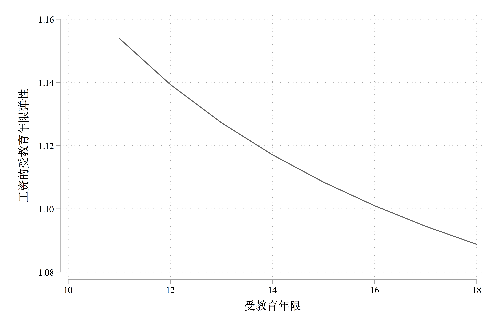

# 弹性与半弹性

使用书上的 grilic_small.dta 数据集，考虑受教育年限对工资的影响。

## 弹性
首先是弹性的表述，我们经常说这样一个词：“需求的价格弹性”，我们也很清楚它的意思是价格对需求的影响（而不是需求对价格的影响）。所以如果我们把他们换成数学语言，就是“y 的 x 弹性”(英文：The elasticity of y with respect to x)。计算公式如下：

$$\varepsilon  = \frac{\Delta y / y}{\Delta x / x}$$

即 y 的变化比例除以 x 的变化比例。关于弹性的表述非常绕，我们可以举个这样的例子：$x = 100, \Delta x = 1, y = 100, \Delta y = 2$，那么$\varepsilon = 2$。这样就说明，如果弹性为 2，那么其含义就是，$x$变化$1\%$，$y$变化$2\%$.

实际回归的时候如何求一个 y 的 x 弹性呢？我们可以继续把上面的公式变形一下：

\begin{align}
\varepsilon & = \frac{\Delta y / y}{\Delta x / x} \\
& = \frac{\partial y / y}{\partial x / x} \\
& = \frac{\partial lny}{\partial lnx}
\end{align}

这就意味着如何想要求 $y$ 的 $x$ 弹性，我们需要求 $lny$ 对 $lnx$ 的偏导数。考虑工资的受教育年限弹性：

```stata
cuse grilic_small, clear web
* 或者
use http://www.czxa.top/cuse/g/grilic_small, clear
* 因为数据集里面已经对数工资变量，所以我们只对受教育年限变量取对数即可
gen lns = ln(s)
* 注意ln()函数和log()函数是等价的
* 回归lnw和lns
reg lnw lns

*>       Source |       SS           df       MS      Number of obs   =        30
*> -------------+----------------------------------   F(1, 28)        =     11.23
*>        Model |  1.12395728         1  1.12395728   Prob > F        =    0.0023
*>     Residual |  2.80324396        28  .100115856   R-squared       =    0.2862
*> -------------+----------------------------------   Adj R-squared   =    0.2607
*>        Total |  3.92720124        29  .135420733   Root MSE        =    .31641
*> ------------------------------------------------------------------------------
*>          lnw |      Coef.   Std. Err.      t    P>|t|     [95% Conf. Interval]
*> -------------+----------------------------------------------------------------
*>          lns |   1.271595   .3795118     3.35   0.002     .4942001    2.048989
*>        _cons |   2.470437   .9933712     2.49   0.019     .4356081    4.505265
*> ------------------------------------------------------------------------------
```

可以看到，lnw 对 lns 的回归系数是 1.27，也就是 w 的 s 弹性，解释为：受教育年限每延长 1%，工资平均提高 1.27%。。很容易理解这里计算的是平均。我们经常需要计算 y 关于 x 在某个点的弹性（也就是说更多时候，弹性不是一个常数，而是关于 x 的函数）。

Stata 的 margins 命令可以用来计算 y 关于 x 在某个点的弹性：

```stata
* 首先我们需要生成工资变量，因为数据集里面只有工资对数变量
gen w = exp(lnw)
* 然后就 w 对 s 回归
reg w s

*>       Source |       SS           df       MS      Number of obs   =        30
*> -------------+----------------------------------   F(1, 28)        =     10.35
*>        Model |  106091.987         1  106091.987   Prob > F        =    0.0033
*>     Residual |  287015.278        28  10250.5457   R-squared       =    0.2699
*> -------------+----------------------------------   Adj R-squared   =    0.2438
*>        Total |  393107.266        29   13555.423   Root MSE        =    101.24
*> ------------------------------------------------------------------------------
*>            w |      Coef.   Std. Err.      t    P>|t|     [95% Conf. Interval]
*> -------------+----------------------------------------------------------------
*>            s |   28.26456   8.785661     3.22   0.003     10.26795    46.26117
*>        _cons |   -41.4791   122.6431    -0.34   0.738    -292.7022     209.744
*> ------------------------------------------------------------------------------
```
我们也知道这个回归系数 28.26 的含义是受教育年限每延长一年，工资平均增加 28 块钱（币种可能是美元）。

然后我们可以使用 tabulate 命令查看变量 s 的频率频数分布表：
```stata
tab s

*>   schooling |      Freq.     Percent        Cum.
*> ------------+-----------------------------------
*>          11 |          3       10.00       10.00
*>          12 |         12       40.00       50.00
*>          14 |          1        3.33       53.33
*>          15 |          3       10.00       63.33
*>          16 |         10       33.33       96.67
*>          18 |          1        3.33      100.00
*> ------------+-----------------------------------
*>       Total |         30      100.00
```
根据上表，我们可以看出 s 的取值为 11～18，所以下面我们求 w 关于 s 在每一点的弹性：

```stata
* margins必须在回归后才能使用
margins, eyex(s) at(s = (11(1)18))

*> Conditional marginal effects                    Number of obs     =         30
*> Model VCE    : OLS
*> 
*> Expression   : Linear prediction, predict()
*> ey/ex w.r.t. : s
*> 
*> 1._at        : s               =          11
*> 2._at        : s               =          12
*> 3._at        : s               =          13
*> 4._at        : s               =          14
*> 5._at        : s               =          15
*> 6._at        : s               =          16
*> 7._at        : s               =          17
*> 8._at        : s               =          18
*> ------------------------------------------------------------------------------
*>              |            Delta-method
*>              |      ey/ex   Std. Err.      t    P>|t|     [95% Conf. Interval]
*> -------------+----------------------------------------------------------------
*> s            |
*>          _at |
*>           1  |   1.153951    .470754     2.45   0.021     .1896548    2.118247
*>           2  |   1.139334   .4206618     2.71   0.011     .2776474     2.00102
*>           3  |   1.127252   .3801114     2.97   0.006     .3486291    1.905875
*>           4  |   1.117098   .3466306     3.22   0.003     .4070576    1.827139
*>           5  |   1.108445   .3185293     3.48   0.002     .4559675    1.760923
*>           6  |   1.100983    .294614     3.74   0.001     .4974935    1.704472
*>           7  |   1.094481   .2740186     3.99   0.000     .5331797    1.655783
*>           8  |   1.088767   .2560998     4.25   0.000     .5641699    1.613363
*> ------------------------------------------------------------------------------
```

如果我们想把这些弹性绘制成关于 s 的图像该怎么做呢？
第一种是笨方法，把这些弹性直接手动复制粘贴下来：
```stata
clear
input s e
11 1.153951
12 1.139334
13 1.127252
14 1.117098
15 1.108445
16 1.100983
17 1.094481
18 1.088767
end
line e s, xti(受教育年限) ///
      yti(工资的受教育年限弹性) ///
      yla(, format(%6.2f))
```

```{r wage123, echo=FALSE, fig.align='center', fig.cap = '工资的受教育年限弹性', out.width='80%'}

```

另外一种方法是直接利用返回值。很多 Stata 命令运行之后都会保留一些返回值，运行命令 `return list` 就可以查看，例如上面 margins 命令运行之后的返回值查看：

```stata
* 因为刚刚clear了，所以再重新运行一下前面的命令
cuse grilic_small.dta, c w
gen w = exp(lnw)
* qui 前缀可以隐藏运行结果
qui reg w s
qui margins, eyex(s) at(s = (11(1)18))
ret list

*> scalars:
*>               r(level) =  95
*>                r(k_at) =  1
*>                r(k_by) =  1
*>           r(k_predict) =  1
*>           r(k_margins) =  0
*>                r(df_r) =  28
*>                   r(N) =  30
*> 
*> macros:
*>            r(mcmethod) : "noadjust"
*>                 r(cmd) : "margins"
*>             r(cmdline) : "margins , eyex(s) at(s = (11(1)18))"
*>         r(est_cmdline) : "regress w s"
*>             r(est_cmd) : "regress"
*>          r(emptycells) : "strict"
*>            r(atstats8) : "values"
*>            r(atstats7) : "values"
*>            r(atstats6) : "values"
*>            r(atstats5) : "values"
*>            r(atstats4) : "values"
*>            r(atstats3) : "values"
*>            r(atstats2) : "values"
*>            r(atstats1) : "values"
*>          r(continuous) : "continuous"
*>         r(derivatives) : "ey/ex"
*>               r(xvars) : "s"
*>          r(expression) : "predict()"
*>      r(predict1_label) : "Linear prediction"
*>             r(vcetype) : "Delta-method"
*>                 r(vce) : "delta"
*>           r(model_vce) : "ols"
*>               r(title) : "Conditional marginal effects"
*> 
*> matrices:
*>               r(table) :  9 x 8
*>           r(chainrule) :  1 x 3
*>                  r(at) :  8 x 1
*>                   r(V) :  8 x 8
*>            r(Jacobian) :  8 x 2
*>               r(error) :  1 x 8
*>                   r(b) :  1 x 8
*>                  r(_N) :  1 x 8
```

对比前面的 margins 的运行结果，可以很容易的发现我们需要的东西在`r(table)`里面，是以矩阵的形式保存的。我们把它读出来：

```stata
* 首先把r(table)保存到矩阵e里面，矩阵生产使用matrix命令，简写为mat
mat e = r(table)

* 查看矩阵使用matrix list命令，简写为mat list
mat list e

*> e[9,8]
*>                 s:         s:         s:         s:         s:         s:         s:         s:
*>                 1.         2.         3.         4.         5.         6.         7.         8.
*>               _at        _at        _at        _at        _at        _at        _at        _at
*>      b  1.1539507  1.1393339   1.127252  1.1170982  1.1084451  1.1009828  1.0944814  1.0887665
*>     se  .47075402  .42066176  .38011143  .34663063  .31852928  .29461398  .27401865  .25609981
*>      t  2.4512816  2.7084323  2.9655831  3.2227338  3.4798845  3.7370353   3.994186  4.2513367
*> pvalue  .02073597  .01139796  .00611555  .00321455  .00166106  .00084655  .00042681  .00021346
*>     ll  .18965477  .27764736  .34862905  .40705759  .45596746  .49749346  .53317969  .56416985
*>     ul  2.1182466  2.0010205   1.905875  1.8271389  1.7609228  1.7044722  1.6557832  1.6133632
*>     df         28         28         28         28         28         28         28         28
*>   crit  2.0484071  2.0484071  2.0484071  2.0484071  2.0484071  2.0484071  2.0484071  2.0484071
*>  eform          0          0          0          0          0          0          0          0
```

我们可以设计一个小循环，实现创建弹性 e 和变量 s 的数据集：

```stata
* preserve和restore是一对命令，preserve可以预保存，当前数据集和各种变量，restore可以恢复preserve预保存的内容。也就是说preserve和restore之间的操作不会产生影响
preserve
* 只使用clear不会清除宏变量（例如上面的矩阵）
clear
set obs 8
gen e = .
gen s = .
forval i = 1/8{
      replace s = `i' + 10
      replace e = e[1, `i']
}
line e s, xti(受教育年限) ///
      yti(工资的受教育年限弹性) ///
      yla(, format(%6.2f))
restore
```

## 半弹性
同样，我们可以这样定义 y 的 x 半弹性（The semielasticity of y with respect to x）：
$$
semi\sim\varepsilon 1 = \frac{\partial y}{\partial lnx}
$$

$$
semi\sim\varepsilon 2 = \frac{\partial lny}{\partial x}
$$

### 第一种半弹性

对于第一种半弹性：

\begin{align}
semi\sim\varepsilon 1 & = \frac{\partial y}{\partial lnx} \\
& = \frac{\partial y}{\partial x/x}
\end{align}


可以这么理解，$x = 100, \partial x = 100, \partial y = 2, semi \sim \varepsilon 1 = 2$。即是说，半弹性为 2 的时候表示 x 增加 100%，y 增加 2 个单位。

如果我们想求工资关于受教育年限的半弹性：
```stata
cuse grilic_small, c w
gen lns = ln(s)
reg w lns

*>       Source |       SS           df       MS      Number of obs   =        30
*> -------------+----------------------------------   F(1, 28)        =     10.09
*>        Model |  104136.237         1  104136.237   Prob > F        =    0.0036
*>     Residual |  288971.029        28  10320.3939   R-squared       =    0.2649
*> -------------+----------------------------------   Adj R-squared   =    0.2387
*>        Total |  393107.266        29   13555.423   Root MSE        =    101.59
*> ------------------------------------------------------------------------------
*>            w |      Coef.   Std. Err.      t    P>|t|     [95% Conf. Interval]
*> -------------+----------------------------------------------------------------
*>          lns |   387.0569    121.849     3.18   0.004     137.4605    636.6532
*>        _cons |  -662.8339   318.9395    -2.08   0.047    -1316.152   -9.516088
*> ------------------------------------------------------------------------------
```

回归结果为 387.0569。表示受教育年限翻一番，工资平均增加 387.0569 块钱。同样这个时候可以用 margins 命令求在受教育年限的每个点的半弹性，不过这个时候要用的选项是`dyex()`：

```stata
cuse grilic_small.dta, c
gen w = exp(lnw)
qui reg w s
qui margins, dyex(s) at(s = (11(1)18))
mat e = r(table)
clear
set obs 8
gen e = .
gen s = .
forval i = 1/8{
      replace s = `i' + 10 in `i'
      replace e = e[1, `i'] in `i'
}
line e s, xti(受教育年限) ///
      yti(工资的受教育年限半弹性) ///
      yla(, format(%6.2f))
gr export 工资的受教育年限半弹性.png, replace width(2400)
```

```{r wage456, echo=FALSE, fig.align='center', fig.cap = '工资的受教育年限半弹性', out.width='80%'}
knitr::include_graphics('assets/工资的受教育年限半弹性.png')
```

### 第二种半弹性
对于第二种半弹性：

\begin{align}
semi\sim\varepsilon 2 &= \frac{\partial lny}{\partial x} \\
& = \frac{\partial y/y}{\partial x}
\end{align}


可以这么理解，$\partial x = 1, \partial y = 200, y =100,  semi \sim \varepsilon 2 = 2$。即是说，半弹性为 2 的时候表示 x 增加 1，y 增加 200%。

这里求工资关于受教育年限的半弹性：
```stata
cuse grilic_small.dta, c w
reg lnw s

*>       Source |       SS           df       MS      Number of obs   =        30
*> -------------+----------------------------------   F(1, 28)        =     11.34
*>        Model |  1.13168716         1  1.13168716   Prob > F        =    0.0022
*>     Residual |  2.79551408        28  .099839789   R-squared       =    0.2882
*> -------------+----------------------------------   Adj R-squared   =    0.2627
*>        Total |  3.92720124        29  .135420733   Root MSE        =    .31597
*> ------------------------------------------------------------------------------
*>          lnw |      Coef.   Std. Err.      t    P>|t|     [95% Conf. Interval]
*> -------------+----------------------------------------------------------------
*>            s |   .0923133   .0274191     3.37   0.002     .0361478    .1484787
*>        _cons |   4.519277   .3827556    11.81   0.000     3.735237    5.303316
*> ------------------------------------------------------------------------------
```
回归系数为 0.09，即使说，受教育年限每增加一年，工资平均增加 0.09%。
同样可以求受教育年限每个点上的半弹性，这个时候使用 `eydx()` 选项：

```stata
cuse grilic_small.dta, c
gen w = exp(lnw)
qui reg w s
qui margins, eydx(s) at(s = (11(1)18))
mat e = r(table)
clear
set obs 8
gen e = .
gen s = .
forval i = 1/8{
      replace s = `i' + 10 in `i'
      replace e = e[1, `i'] in `i'
}
line e s, xti(受教育年限) ///
      yti(工资的受教育年限半弹性) ///
      yla(, format(%6.2f))
gr export 工资的受教育年限半弹性2.png, replace width(2400)
```

```{r wage4562, echo=FALSE, fig.align='center', fig.cap = '工资的受教育年限半弹性2', out.width='80%'}
knitr::include_graphics('assets/工资的受教育年限半弹性2.png')
```

## 总结
最后可以用 Stata 帮助文件(margins 命令: dydx 选项)中的一个表格来总结弹性和半弹性：


