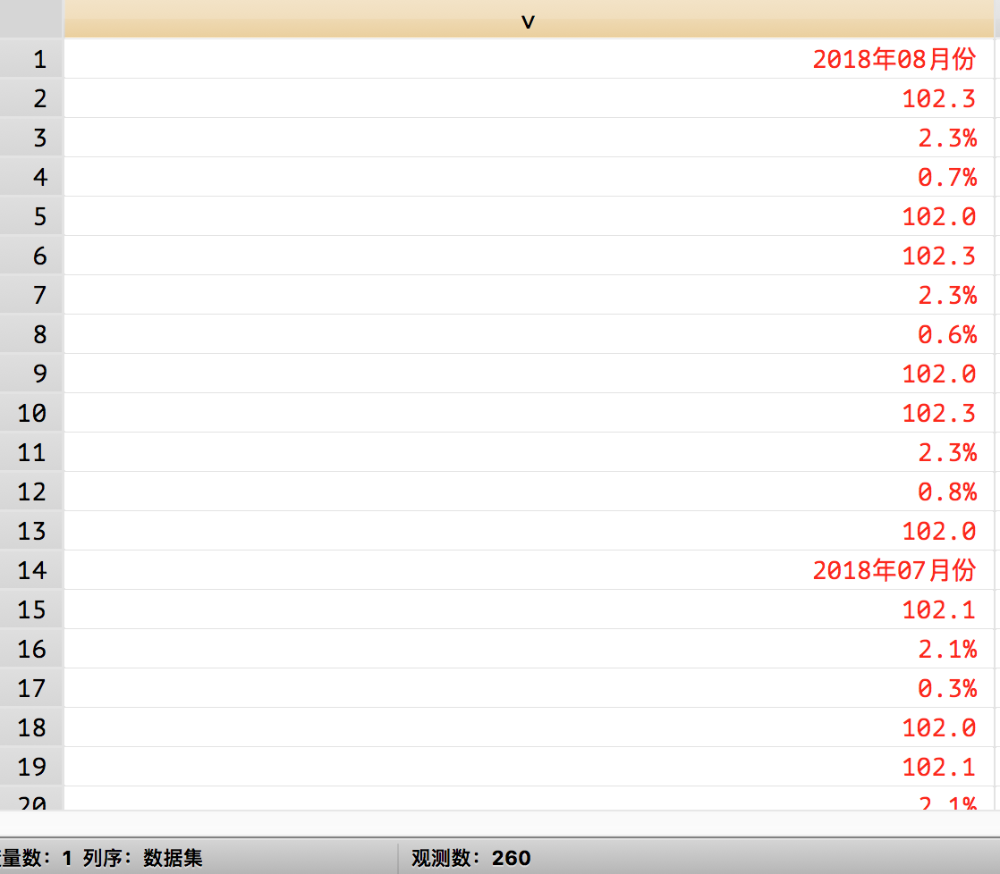
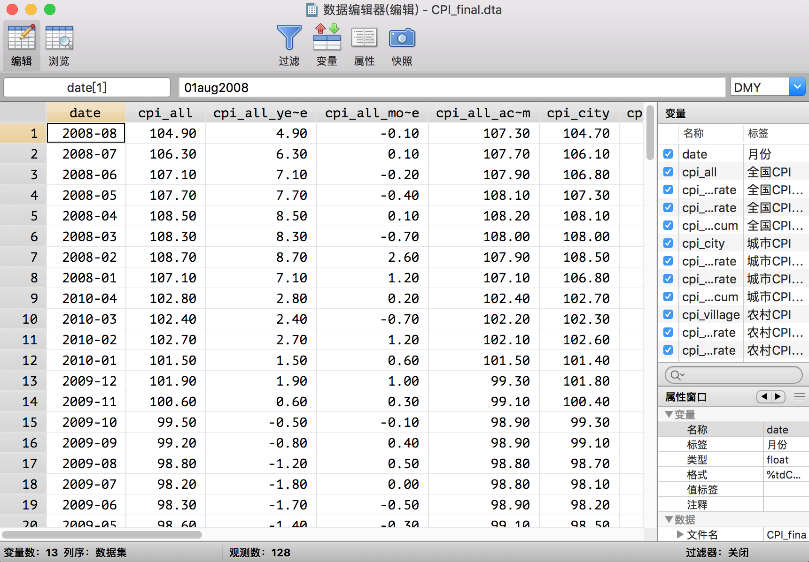

# Stata 网页表格爬取示例

本文以爬取[东方财富网 CPI 数据](http://data.eastmoney.com/cjsj/cpi.html)为例，讲解如何使用 Stata 进行网页表格数据爬取。

Stata 虽非数据爬取利器，但是能够轻松解决一些小的数据爬取任务。数据爬取的本质无非是数据请求和数据处理，因此熟练使用 Stata 进行数据爬取往往也是很好的数据处理能力的象征。在实际应用中，我们经常需要爬取一些公开数据。这些数据一种常见展示方式是通过 HTML 表示呈现。一个简单的 HTML 表格示例如下：

```html
<table>
    <tr><td bgcolor="red">1</td><td bgcolor="yellow">2</td><td bgcolor="blue">3</td></tr>
    <tr><td>1</td><td>2</td><td>3</td></tr>
</table>
```
[东方财富网 CPI 数据](http://data.eastmoney.com/cjsj/cpi.html)的表格是这样的：


下面我将一步步讲解如何爬取这个表格。

## 准备工作
1. Stata14.0 以上版本的；
2. Chrome 浏览器；
3. 想把数据爬下来的你。

## 网页分析
首先讲解如何爬取一个页面的表格。这个网页的网址是：
```markdown
http://data.eastmoney.com/cjsj/cpi.html
```


在页面上右键选择显示网页源代码，很多浏览器都有查看网页源代码的功能，但是我还是最喜欢谷歌浏览器的。点击之后即可跳转至网页源代码界面：


也就是说你刚刚看到的网页的本质实际上是这些源代码，之所以我们能看到各种炫彩的页面，那是因为浏览器帮我们翻译了源代码。

下一步我们要做的事情就是找到这个表格在源代码的哪一块儿了，然后分析表格的特点，已方便在后面的 Stata 处理源代码的时候进行过滤。

一个经常被用来寻找目标的方法是使用`查找`功能。Ctr+F（Mac 是 Command + F）即可打开搜索框，我们注意到表格里面有`月份`两个字，所以我们就用`月份`进行查找。


我们首先在第 1987 行发现了这个词，仔细一看，这附近的代码就是表格的代码。

下一步就是我们先分析一下这部分代码的特点：
1. 所有表格中的数据在源代码中都是单独位于一行的，所以我们不能从其所在行入手了；
2. 表格数据的上一行要么有字符串`<td class=`要么有`<span`。也可以发现，span 标签是控制文字颜色的。

经过以上的网页分析我们就可以开始进行网页表格爬取了。

## 开始爬取
总的来说，Stata 进行网页表格爬取分为 3 个步骤：
1. 请求：把含有所需数据的源代码下载下来；
2. 转码：很多网页并非使用 UTF-8 编码，直接读入 Stata 会出现乱码，因此可以预先进行 UTF-8 转码；
3. 处理：这里主要是对字符串进行处理，常用操作有分割(split)、转置(sxpose)、提取(正则表达式或直接字符串提取)等等。

### 请求
由于这个网页没有设置反爬机制，所以可以直接使用`copy`命令进行下载，copy 命令不仅可以下载网页，还可以下载文件（当然网页其实就是一个 html 文件）。更多用法可以`help copy`。我们这里把要爬取的页面保存成一个名叫`temp.txt`的 txt 文件，为什么要起这个名字呢，因为爬完之后它就要被删除了，所以只是一个临时的文件。
```stata
clear all
* 设定工作目录
cd "你自己的工作目录（一个文件夹的路径）"
copy "http://data.eastmoney.com/cjsj/pmi.html" temp.txt, replace
```
### 转码
在我的 Stata 命令包——finance 包中，我编写了一个简单的转码命令，这个命令包的安装办法为：
```stata
* 首先你需要安装github命令，这个命令是用来安装github上的命令的
* net install github, from("https://haghish.github.io/github/")
* 然后就可以安装这个命令了
* github install czxa/finance, replace
```
安装成功之后，使用下面的命令就可以直接对 temp.txt 文件进行转码了：
```stata
utrans temp.txt
```
如果返回的结果是`转码成功`，则表示`转码成功`了！（感觉像在说废话。。。）

如果你不幸的因为各种各样的原因没能成功安装这个小命令，可以直接使用下面三句命令进行转码：
```stata
unicode encoding set gb18030
unicode translate temp.txt
unicode erasebackups, badidea
```

### 读入
下面我们就要把 temp.txt 文件读入 Stata 进行处理了，一个非常常用的读取方法是使用 infix 命令：
```stata
infix strL v 1-20000 using temp.txt, clear
* 把变量v的显示格式变成 %60s （这样看起来更宽）
format v %60s
```
这句命令的含义是创建一个格式为 strL 的变量 v，然后把 temp.txt 文件的每一行的前 1-20000 个字符（因为我们注意到 temp.txt 的每一行都没有超过 20000 个字符）读入变量 v 的每一个观测值。读入之后是这样的：


### 处理
首先根据上面我们进行网页分析发现的结论，我们保留符合<font color = 'blue'>表格数据的上一行要么有字符串"<td class="要么有"<span"</font>规律的观测值：
```stata
keep if index(v[_n-1], "<td class=") | index(v[_n-1], "<span")
* 再删除空观测值
drop if v == ""
* 再删除一些显然不是表格中数据的观测值，而这些无用观测值中都含有斜线
drop if index(v, "/")
```
这一步处理后的结果：




实际上到这一步，我们已经把表格整理的挺干净了，不过这不像一个表格，我们需要进行这样的一个操作：我们已经注意到了 1-13 行实际是表格的第一行，14-26 行实际是表格的第二行。我们该怎么完成这样的一个操作呢？一个非常好用的命令是`post命令`。这个命令的功能就像它的名字一样——邮局。它可以实现把 v 的每个观测值发送到我们想要得到的表格的指定位置。
```stata
* 第一步postfile建立一个“邮局”，同时设定“收件人”（变量date、v1、v2、v3、v4）：
postfile mypost str20 date str20 v1 str20 v2 str20 v3 ///
	str20 v4 str20 v5 str20 v6 str20 v7 str20 v8 str20 v9 ///
	str20 v10 str20 v11 str20 v12 using cpi.dta, replace
* 然后循环将v的值对应发送给各个收件人
forval i = 1(13)`=_N'{
	post mypost (v[`i']) (v[`i' + 1]) (v[`i' + 2]) (v[`i' + 3]) ///
	 			(v[`i' + 4]) (v[`i' + 5]) (v[`i' + 6]) (v[`i' + 7]) ///
	 			(v[`i' + 8]) (v[`i' + 9]) (v[`i' + 10]) (v[`i' + 11]) ///
	 			(v[`i' + 12])
}
* 关闭邮局mypost
postclose mypost

* 打开 cpi.dta 就能看到整理好的数据了
use cpi, clear
```
经过这个“邮局操作”，数据现在变成这个样子的了：


到这一步我们实际上已经完成了这个表格的爬取了，不过接下来我们再把数据整理成更加规整的 Stata 数据。

```stata
* 整理date变量
replace date = subinstr(date, "年", "", .)
replace date = subinstr(date, "月份", "", .)
* date()函数把字符串日期变成Stata日期
gen date1 = date(date, "YM")
* format一下便于我们人类理解
format date1 %tdCY-N
* 把date1变量放在第一列
order date1
* 删除date
drop date
* 重命名date1为date
ren date1 date
* 循环所有变量，把%删除
foreach i of varlist _all{
	cap replace `i' = subinstr(`i', "%", "", .)
}
* 把所有能被转换为数值型变量的字符串变量转换成数值型变量
destring, replace
* 循环所有变量，如果变量名不是date就把显示格式变成%6.2f
foreach i of varlist _all{
	if "`i'" != "date" {
		format `i' %6.2f
	}
}
* 添加变量标签
label var date "月份"
label var v1 "全国CPI"
label var v2 "全国CPI年率"
label var v3 "全国CPI月率"
label var v4 "全国CPI累计"
label var v5 "城市CPI"
label var v6 "城市CPI年率"
label var v7 "城市CPI月率"
label var v8 "城市CPI累计"
label var v9 "农村CPI"
label var v10 "农村CPI年率"
label var v11 "农村CPI月率"
label var v12 "农村CPI累计"
* 数据集标签
label data "消费者价格指数"

* 变量重命名
ren v1 cpi_all
ren v2 cpi_all_year_rate
ren v3 cpi_all_month_rate
ren v4 cpi_all_accum
ren v5 cpi_city
ren v6 cpi_city_year_rate
ren v7 cpi_city_month_rate
ren v8 cpi_city_accum
ren v9 cpi_village
ren v10 cpi_village_year_rate
ren v11 cpi_village_month_rate
ren v12 cpi_village_accum
save CPI_final, replace
```
这样整理之后的数据集是这样的：


这样我们就爬好了单页面的表格。另外我们也注意到完整的表格有 7 页。我们点击下一页可以看到第二页的网址是：

```html
http://data.eastmoney.com/cjsj/consumerpriceindex.aspx?p=2
```

显然 url 中的最后一个参数就是页数。每页的结构都是一致的，所以可以循环运行刚刚的代码把剩下 6 个页面的表格依次爬下来然后合并。

## 多页面爬取
### 纵向拼接示例
作为示例，我们再尝试用刚刚的代码爬第二页：

```stata
clear
copy "http://data.eastmoney.com/cjsj/consumerpriceindex.aspx?p=2" temp.txt, replace
utrans temp.txt
infix strL v 1-20000 using temp.txt, clear
keep if index(v[_n-1], "<td class=") | index(v[_n-1], "<span")
drop if v == ""
drop if index(v, "/")
postfile mypost str20 date str20 v1 str20 v2 str20 v3 ///
	str20 v4 str20 v5 str20 v6 str20 v7 str20 v8 str20 v9 ///
	str20 v10 str20 v11 str20 v12 using CPI_temp.dta, replace
forval i = 1(13)`=_N'{
	post mypost (v[`i']) (v[`i' + 1]) (v[`i' + 2]) (v[`i' + 3]) ///
	 			(v[`i' + 4]) (v[`i' + 5]) (v[`i' + 6]) (v[`i' + 7]) ///
	 			(v[`i' + 8]) (v[`i' + 9]) (v[`i' + 10]) (v[`i' + 11]) ///
	 			(v[`i' + 12])
}
postclose mypost
use CPI_temp, clear
replace date = subinstr(date, "年", "", .)
replace date = subinstr(date, "月份", "", .)
gen date1 = date(date, "YM")
format date1 %tdCY-N
order date1
drop date
ren date1 date
foreach i of varlist _all{
	cap replace `i' = subinstr(`i', "%", "", .)
}
destring, replace
foreach i of varlist _all{
	if "`i'" != "date" {
		format `i' %6.2f
	}
}
ren v1 cpi_all
ren v2 cpi_all_year_rate
ren v3 cpi_all_month_rate
ren v4 cpi_all_accum
ren v5 cpi_city
ren v6 cpi_city_year_rate
ren v7 cpi_city_month_rate
ren v8 cpi_city_accum
ren v9 cpi_village
ren v10 cpi_village_year_rate
ren v11 cpi_village_month_rate
ren v12 cpi_village_accum
```
这些代码运行之后可以得到一个和第一页爬取结果类似的表格，然后可以用 append 命令把这个表格纵向拼接到第一页爬取的数据集`CPI_final.dta`上：
```stata
append using CPI_final
save CPI_final, replace
```

### 循环拼接
为了连贯，我再把上面的代码重新写，因为有些代码可以在放在循环之后再运行，例如变量标签、变量名等。
```stata
*===============================*
* 	 东方财富网消费者价格指数爬取
*===============================*
* 下载第一页
clear all
cd "~/Desktop"
copy "http://data.eastmoney.com/cjsj/cpi.html" temp.txt, replace
utrans temp.txt
infix strL v 1-20000 using temp.txt, clear
keep if index(v[_n-1], "<td class=") | index(v[_n-1], "<span")
drop if v == ""
drop if index(v, "/")
postfile mypost str20 date str20 v1 str20 v2 str20 v3 ///
	str20 v4 str20 v5 str20 v6 str20 v7 str20 v8 str20 v9 ///
	str20 v10 str20 v11 str20 v12 using CPI_temp.dta, replace
forval i = 1(13)`=_N'{
	post mypost (v[`i']) (v[`i' + 1]) (v[`i' + 2]) (v[`i' + 3]) ///
	 	(v[`i' + 4]) (v[`i' + 5]) (v[`i' + 6]) (v[`i' + 7]) ///
		(v[`i' + 8]) (v[`i' + 9]) (v[`i' + 10]) (v[`i' + 11]) ///
	 	(v[`i' + 12])
}
postclose mypost
use CPI_temp, clear
save CPI_final, replace

* 接下来循环第2到第7页，把每一页纵向拼接
forval i = 2/7{
	clear
	copy "http://data.eastmoney.com/cjsj/consumerpriceindex.aspx?p=`i'" temp.txt, replace
	utrans temp.txt
	infix strL v 1-20000 using temp.txt, clear
	keep if index(v[_n-1], "<td class=") | index(v[_n-1], "<span")
	drop if v == ""
	drop if index(v, "/")
	postfile mypost str20 date str20 v1 str20 v2 str20 v3 ///
		str20 v4 str20 v5 str20 v6 str20 v7 str20 v8 str20 v9 ///
		str20 v10 str20 v11 str20 v12 using CPI_temp.dta, replace
	forval i = 1(13)`=_N'{
		post mypost (v[`i']) (v[`i' + 1]) (v[`i' + 2]) (v[`i' + 3]) ///
		 	(v[`i' + 4]) (v[`i' + 5]) (v[`i' + 6]) (v[`i' + 7]) ///
		 	(v[`i' + 8]) (v[`i' + 9]) (v[`i' + 10]) (v[`i' + 11]) ///
		 	(v[`i' + 12])
	}
	postclose mypost
	use CPI_temp, clear
	append using CPI_final
	save CPI_final, replace
}

use CPI_final, clear
replace date = subinstr(date, "年", "", .)
replace date = subinstr(date, "月份", "", .)
gen date1 = date(date, "YM")
format date1 %tdCY-N
order date1
drop date
ren date1 date
foreach i of varlist _all{
	cap replace `i' = subinstr(`i', "%", "", .)
}
destring, replace
foreach i of varlist _all{
	if "`i'" != "date" {
		format `i' %6.2f
	}
}
* 添加变量标签
label var date "月份"
label var v1 "全国CPI"
label var v2 "全国CPI年率"
label var v3 "全国CPI月率"
label var v4 "全国CPI累计"
label var v5 "城市CPI"
label var v6 "城市CPI年率"
label var v7 "城市CPI月率"
label var v8 "城市CPI累计"
label var v9 "农村CPI"
label var v10 "农村CPI年率"
label var v11 "农村CPI月率"
label var v12 "农村CPI累计"
* 数据集标签
label data "消费者价格指数"

* 变量重命名
ren v1 cpi_all
ren v2 cpi_all_year_rate
ren v3 cpi_all_month_rate
ren v4 cpi_all_accum
ren v5 cpi_city
ren v6 cpi_city_year_rate
ren v7 cpi_city_month_rate
ren v8 cpi_city_accum
ren v9 cpi_village
ren v10 cpi_village_year_rate
ren v11 cpi_village_month_rate
ren v12 cpi_village_accum
save CPI_final, replace
```
爬取结果：



 
至此，这个爬取任务我们就算完成了。下面我们进行一个简单的应用——数据展示。

## 数据呈现
假如我想观察 CPI 的走势，需要绘制一幅线图：
```stata
use CPI_final, clear
gsort date
* 绘图
* 推荐使用我最喜欢的绘图主题plotplain
* 安装方法
ssc install blindschemes, replace all
* 把绘图主题永久性的设置为plotplain
set scheme plotplain, permanently
* 查看2018年6月对应的Stata日期
di date("2018-06", "YM")
* ///表示代码换行，注意下面几行绘图代码要一起运行
tw ///
line cpi_all date,  ///
	lc(blue*0.6) lp(solid)  ///
	xline(21336) ||  ///
line cpi_city date, lc(dkorange)  ///
	lp(solid) ||  ///
line cpi_village date, lc(orange_red) ||, ///
	ti("图：消费者价格指数走势", size(*1.2)) ///
	leg(pos(6) row(1))  ||  ///
scatteri 102.3 21336 (12) "2018年6月"
* 导出图片为png格式
gr export 20181004a1.png, replace
```


上面一些选项的含义：

+ ||: 用于分隔图层。
+ line: 用于绘制线图
+ tw: 全称是 twoway，用于组合多个图层
+ lc: 全称为 lcolor()用于控制线图的颜色
+ lp: 全称是 lpattern()用于控制线型
+ yline: 在指定位置画一条水平线
+ xline: 在指定位置画一条竖直线
+ ti: 全称是 title()，控制标题，size 用于控制标题文字大小，这里是 1.2 倍
+ leg: 全称是 legend()，控制图例，pos 用于控制图例的位置，
			这里是 6 点种方向，单行排列。
+ scatteri: 用于在指定的坐标处画个点。"2018 年 6 月"是这个点的标签, (12)用于指定这个标签位于点的方向，指定为 12 点钟方向。
