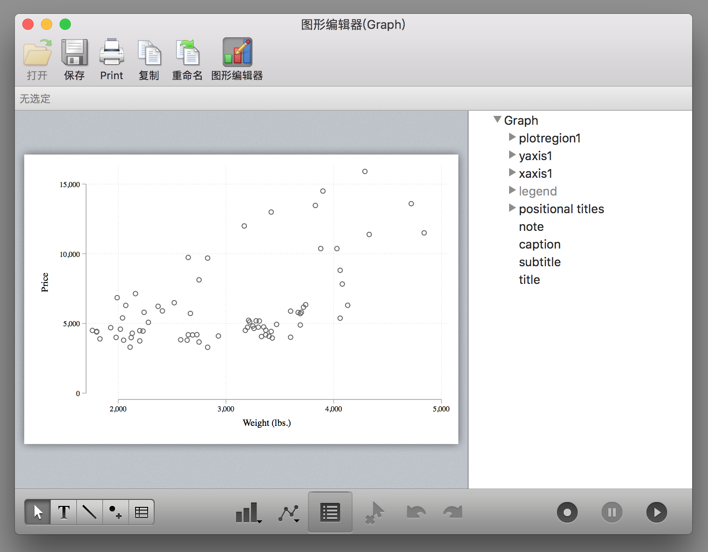
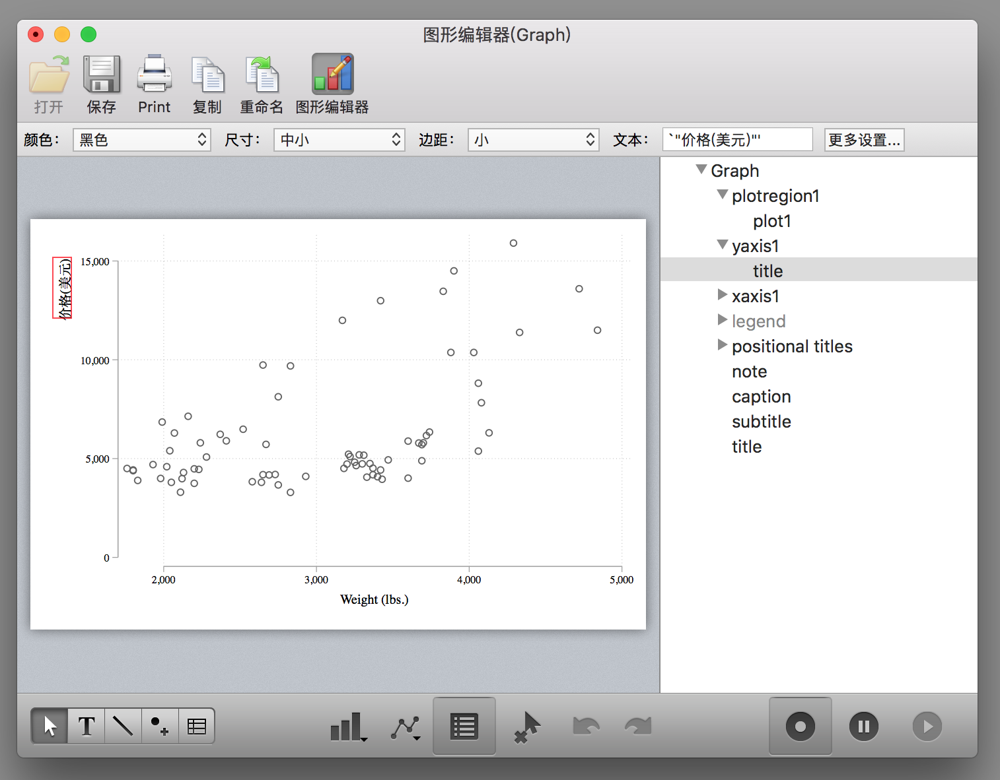
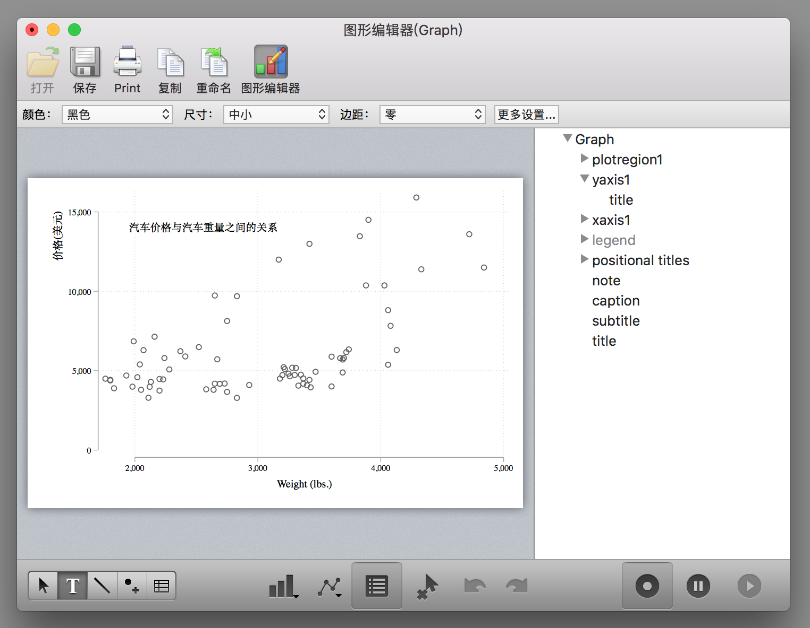
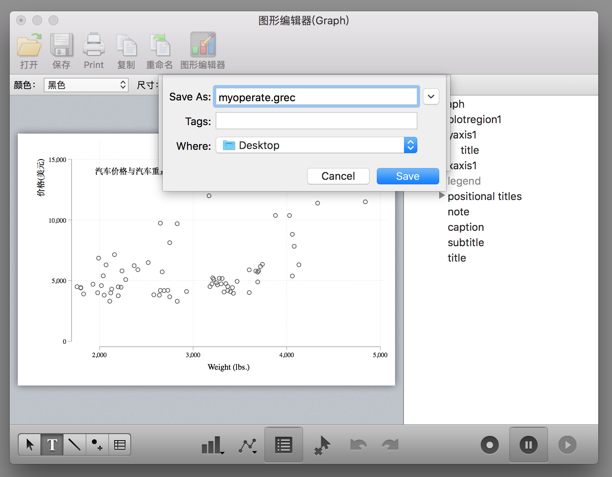
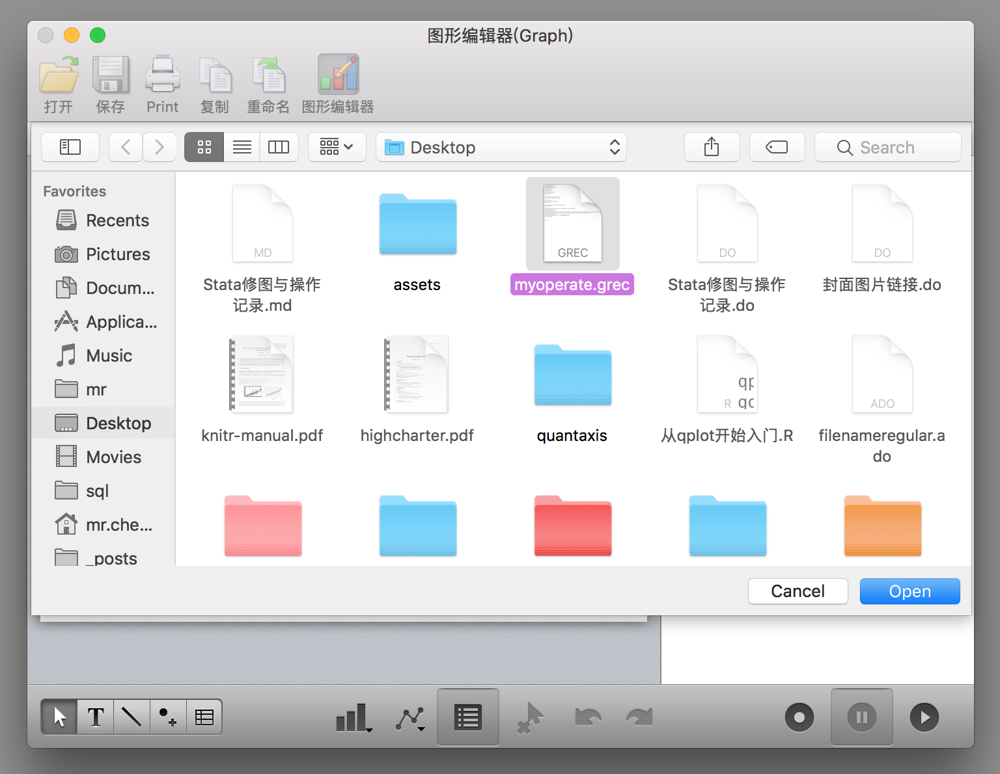

# Stata 修图与操作记录

对于 Stata 初学者而言，一般在绘图的时候都会很头疼，因为 Stata 绘图命令的选项非常多且不容易记。不过幸好 Stata 提供了非常人性化的 GUI，让我们可以通过图形界面操作进行修图。然而我们都知道鼠标点击修图的坏处就是不可重复，就是说我们第一次经过一系列的鼠标点击操作的过程很难再次重复了。但是幸运的是如果我们使用 Stata 进行修图操作可以把修图操作保存成代码，这样再次绘图的时候直接运行代码即可。为了大家绘图不头疼，我这里讲一下如何在 Stata 进行修图并记录修图操作。

首先我们绘制一幅很不美观的图：
```stata
* 使用plotplain主题绘制
sysuse auto, clear
tw sc price weight
```


对于 MacOS 的 Stata 来说，图形窗口是这样的（WindowsOS 版本的 Stata 的图形窗口虽然不太一样，但是功能是一样的）：


点击图形编辑器（WindowsOS 版本的 Stata 是在图形窗口上右键选择`Start Graph Editor`），开始图形编辑操作：



这个时候你会发现窗口的右下角（WindowsOS 版本的 Stata 的图形窗口这三个按钮是在顶边栏）有三个按钮，第一个按钮是开始/结束记录修图操作，第二个按钮是暂停记录，第三个按钮是打开修图操作的宏文件（里面记录了每一步的修图操作）。

点击第一个按钮开始记录修图操作：

这个图形界面操作还是蛮容易懂的，大家四处点击试试就知道怎么用了，例如在右侧边栏可以选择对应的图形元素进行修改，例如修改纵轴标题：


确定：


再例如把纵轴的标题移动到坐标轴的顶端：



再例如添加一些文字（点击下边栏的 T）



其它的功能大家可以自行探索。

修图操作完成之后，点击第二个按钮暂停修图操作或者点击第一个按钮保存修图操作为一个 grec 文件：





然后你就会在桌面发现一个 grec 文件了。

下面我们丢弃这幅图，运行刚刚的绘图代码：
```stata
sysuse auto, clear
tw sc price weight
```
重新绘制一幅没有修改的图，然后同样点击`图形编辑器`打开操作窗口，再点击右下角的第三个按钮 👉点击浏览👉选择刚刚保存的 grec 文件：



然后就会发现刚刚手动进行的操作被重新运行了一遍：


或者我们在绘图代码中加入这么一个选项也行，就一下也不要点击了：
```stata
tw sc price weight, play(myoperate)
```


但是这个必须要保证`myoperate.grec`文件存在才能正确运行，虽然代码简洁，但是如果我们不小心弄丢了`myoperate.grec`文件那不就完了！幸好 Stata 还提供了更令人拍案叫绝的操作，我们用文本编辑器打开这个`myoperate.grec`文件，可以看到里面的代码是这样的：
```stata
StataFileTM:00001:01100:GREC:                          :
00005:00004:00001:
*! classname: twowaygraph_g
*! family: twoway
*! date:  5 Oct 2018
*! time: 22:01:58
*! graph_scheme: plotplain
*! naturallywhite: 1
*! end

* File created by Graph Editor Recorder.
* Edit only if you know what you are doing.

.yaxis1.title.text = {}
.yaxis1.title.text.Arrpush 价格(美元)
* title edits

.yaxis1.title.DragBy 26.71715565298195 1.931360649613153
* title reposition

.plotregion1.AddTextBox added_text editor 14109.65584366113 1951.290247065128
.plotregion1.added_text_new = 1
.plotregion1.added_text_rec = 1
.plotregion1.added_text[1].style.editstyle  angle(default) ///
	size(medsmall) color(black) horizontal(left) vertical(middle) ///
	margin(zero) linegap(zero) drawbox(no) boxmargin(zero) ///
	fillcolor(bluishgray) linestyle( width(vthin) color(black) ///
	pattern(solid) align(inside)) box_alignment(east) editcopy
.plotregion1.added_text[1].text = {}
.plotregion1.added_text[1].text.Arrpush 汽车价格与汽车重量之间的关系
* editor text[1] edits


* <end>
```

虽然里面的代码很复杂，但是大致还是能看懂，我们把其中以`.`开头的行都复制到我们的 do 文件里面，记得在每行前面加上`gr_edit`，也就是说把绘图代码写成这个样子：
```stata
tw sc price weight

* 下面的代码是通过图形编辑器记录的
gr_edit .yaxis1.title.text = {}
gr_edit .yaxis1.title.text.Arrpush 价格(美元)
gr_edit .yaxis1.title.DragBy 26.71715565298195 1.931360649613153
gr_edit .plotregion1.AddTextBox added_text editor 14109.65584366113 1951.290247065128
gr_edit .plotregion1.added_text_new = 1
gr_edit .plotregion1.added_text_rec = 1
gr_edit ..plotregion1.added_text[1].style.editstyle  angle(default) ///
	size(medsmall) color(black) horizontal(left) vertical(middle) ///
	margin(zero) linegap(zero) drawbox(no) boxmargin(zero) ///
	fillcolor(bluishgray) linestyle( width(vthin) color(black) ///
	pattern(solid) align(inside)) box_alignment(east) editcopy
gr_edit .plotregion1.added_text[1].text = {}
gr_edit .plotregion1.added_text[1].text.Arrpush 汽车价格与汽车重量之间的关系
```
然后把上面的一大段代码运行一下你就会发现刚刚的那幅图又出现了！而且你还可以一步步的运行观察每一步的作用。

当然其实这个东西还有更强大的应用，例如通过下面的代码可以实现在图片的右边添加一个表格：
```stata
sysuse auto, clear
twoway scatter mpg rep78, msize(small) ||, ///
	graphregion(margin(r+50)) yti("里程数") ///
	xti("1978年的维修次数")

gr_edit AddTextBox added_text editor `=82+8' `=101'
gr_edit added_text_new = 1
gr_edit added_text_rec = 1
gr_edit added_text[1].text = {}
gr_edit added_text[1].text.Arrpush "Mean mpg by rep78"
gr_edit AddTextBox added_text editor `=82+2' `=112'
gr_edit added_text_new = 2
gr_edit added_text_rec = 2
gr_edit added_text[2].text = {}
gr_edit added_text[2].text.Arrpush "rep78  mpg"

* 按照rep78变量进行分组求mpg的均值
collapse mpg, by(rep78)

local z = 2

forvalues i=0/4 {
  local ++z
  gr_edit AddTextBox added_text editor `=80-(`i'*4)' `=114'
  gr_edit added_text_new = `z'
  gr_edit added_text_rec = `z'
  gr_edit added_text[`z'].text = {}
  gr_edit added_text[`z'].text.Arrpush ///
  "`=rep78[`z'-2]'      `=string(mpg[`z'-2],"%8.2f")' "
}
```


