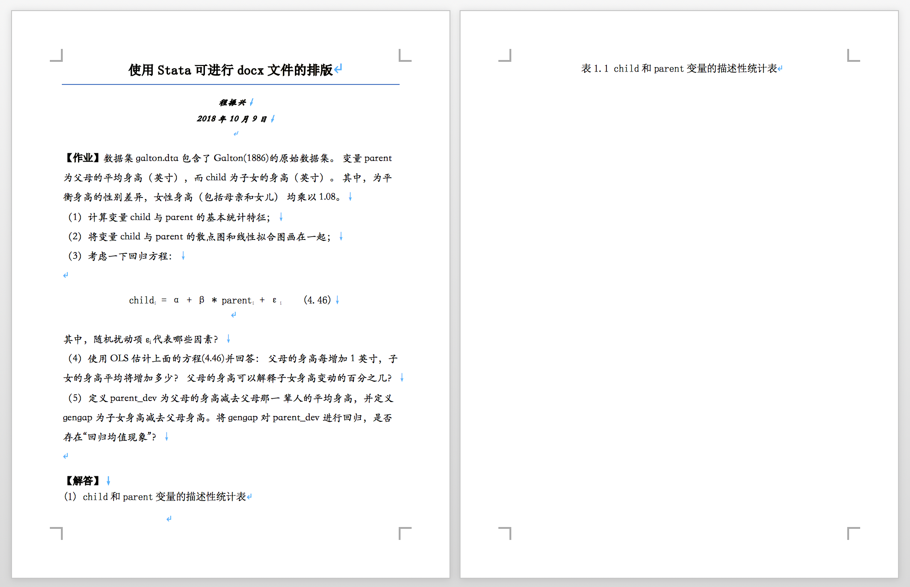

# Stata 与 docx 文档的协同

注意：后来爬虫俱乐部对这些命令进行了更新，更新后的命令支持了字体的自定义，推荐直接学习爬虫俱乐部的相关命令：

```stata
ssc install reg2docx
ssc install corr2docx
ssc install sum2docx
```

在实证论文写作的时候我们经常需要在论文中使用三种表格：描述性统计表、回归表以及相关系数表（当然这个不是必须）。有时候变量特别多，这些表格的排版就变得十分困难，幸运的是，我们有 Stata15。Stata15 比起前代的 Stata 在文本编排上有着巨大的进步，简单来说，Stata15 可以直接写论文了。本文就以上周的作业为例，讲解如何使用 Stata15 进行文本编排。其中用到了 reg2docx、sum2docx 和 corr2docx 三个命令。这三个命令都是外部命令，由爬虫俱乐部编写。不过我觉得非常不地道。根本不是为中文论文写作编写的，所以我稍作改编以方便我们自己使用，改编后的命令名为 reg2docx2、sum2docx2 和 corr2docx2。

## 安装
首先安装这三个命令的中文适配版：
```stata
github install czxa/stata2docx, replace
```
暂时只修改了两个地方：
1. 把字体的默认参数设置为`"宋体", 14, black`。这个比较贴近我们的毕业论文排版要求，因为我们的毕业论文的要求就是正文宋体四号字。
2. 添加了自定义字体选项。

## 使用
安装好之后就可以使用 help 命令查看帮助文件了，我贴心的准备了中文的帮助文档。
```stata
help stata2docx
help corr2docx2
help reg2docx2
help sum2docx2
```

## 父母身高与子女身高
作为示例，我以上周的作业为例讲解如何使用 Stata 进行文本编排，如果想要完整的学习 Stata 编排 docx 文档，还要自己对着 help 文档学习。
Stata15 的 docx 文本编排主要使用 pudocx 命令，

文档的创建一般分为三步
1. 创建用于输出的文件；
2. 文本操作；
3. 关闭保存文件。

putdocx 命令的使用方法也是如此：
```stata
clear all
* 首先打开文档，设置纸张大小为A4，字体为宋体、14号（即四号字）
putdocx begin, pagesize(A4) font("宋体", 14, black)
* 开启一个段落，居中，设置风格为标题（为了写标题）
putdocx paragraph, halign(center) style(Title)
putdocx text ("使用Stata可进行docx文件的排版"), bold ///
	font("宋体", 18, black)
* 新段落，副标题
putdocx paragraph, halign(center) style(Subtitle)
* linebreak：在文本后断行
putdocx text ("程振兴"), bold font("华文楷体", 12, black) linebreak
putdocx text ("2018年10月9日"), bold ///
	font("华文楷体", 12, black) linebreak
* 保存文档
putdocx save mydoc.docx, replace
```
然后我们运行刚刚的代码，打开 mydoc.docx 文件：


可能这个副标题的斜体风格不是我们想要的，那就去掉`style(Subtitle)`选项就好了。

继续，下面我们先把题目抄上去：
```stata
* 把题目抄写上去
* 打开文档
putdocx begin
* 开启一个新段落，为段落设置字体
putdocx paragraph, halign(left) font("华文楷体", 14, black)
* 为这两个字单独设置字体
putdocx text ("【作业】"), bold font("宋体", 14, black)
putdocx text ("数据集galton.dta 包含了Galton(1886)的原始数据集。///
变量parent为父母的平均身高（英寸），而child为子女的身高（英寸）。///
其中，为平衡身高的性别差异，女性身高（包括母亲和女儿）///
均乘以1.08。"), linebreak
putdocx text ("（1）计算变量child与parent的基本统计特征；"), linebreak
putdocx text ("（2）将变量child与parent的散点图和线性拟合图画在一起；"), ///
	linebreak
putdocx text ("（3）考虑一下回归方程："), linebreak

* 开启新段落，这段是公式，比较费事
putdocx paragraph, halign(center) font("宋体", 14, black)

putdocx text ("child"),
putdocx text ("i"), script(sub)
putdocx text (" = ")
putdocx text ("α")
putdocx text (" + ")
putdocx text ("β")
putdocx text (" * ")
putdocx text ("parent")
* 下标
putdocx text ("i"), script(sub)
putdocx text (" + ")
putdocx text ("ε")
putdocx text ("i"), script(sub)
putdocx text ("    ")
putdocx text ("(4.46)"), linebreak

* 新段落，楷体
putdocx paragraph, halign(left) font("华文楷体", 14, black)
putdocx text ("其中，随机扰动项 ε")
putdocx text ("i"), script(sub)
putdocx text ("代表哪些因素？"), linebreak
* 因为代码太长，所以我用三道斜线换个行
putdocx text ("（4）使用OLS估计上面的方程(4.46)并回答：///
父母的身高每增加1英寸，子女的身高平均将增加多少？///
父母的身高可以解释子女身高变动的百分之几？"), linebreak
putdocx text ("（5）定义parent_dev为父母的身高减去父母那一///
辈人的平均身高，并定义gengap为子女身高减去父母身高。将///
gengap对parent_dev进行回归，是否存在“回归均值现象”？"), linebreak
* 保存，注意应该是append，指定接在上面的那个文档后面
putdocx save mydoc.docx, append
```


接下来开始解答这道题：
```stata
putdocx begin, font("宋体", 14, black)
putdocx paragraph, halign(left)
putdocx text ("【解答】"), bold linebreak
putdocx text ("(1) child和parent变量的描述性统计表")
putdocx pagebreak
putdocx paragraph, halign(center)
putdocx text ("表1.1 child和parent变量的描述性统计表")
putdocx save mydoc.docx, append
```



接下来我们是要添加一个描述性统计表。使用 sum2docx2 即可：
```stata
cuse galton, c w
* 实际上font("宋体", 14, black)是默认选项，不加也一样
sum2docx2 child parent using mydoc.docx, append ///
	obs mean(%9.2f) sd min(%9.2f) max(%9.2f) ///
	font("宋体", 14, black)

putdocx begin, font("宋体", 14, black)
putdocx paragraph, halign(left)
putdocx text ("(2) child与parent的散点图和线性拟合图: ")
putdocx save mydoc.docx, append
```


接下来第二题，画个图然后放进去，注意按照毕业论文的要求，图标题放置在图片的下方，表标题放置在表的上方。：
```stata
tw ///
sc child parent || ///
lfit child parent ||, ///
	leg(off) ///
	xti("父母的平均身高(英寸)") ///
	yti("子女的平均身高(英寸)") ///
	xlab(64(1)74)
gr export img1.png, replace

putdocx begin, font("宋体", 14, black)
putdocx paragraph, halign(center)
putdocx image "img1.png"
putdocx text ("图1.1 child与parent的散点图和线性拟合图")
putdocx save mydoc.docx, append
```


编排效果：


继续：
```stata
putdocx begin, font("宋体", 14, black)
putdocx paragraph, halign(left)
putdocx text ("(3) 例如营养水平，后期运动量情况等。///
只要是不由父母的遗传决定但是会影响人身高的因素///
差不多都在里面了。"), linebreak
putdocx text ("(4) 首先估计方程(4.46)，回归结果如下："), linebreak
putdocx pagebreak
putdocx paragraph, halign(center)
putdocx text ("表1.2 模型估计表")
putdocx save mydoc.docx, append
```


再接下来就是一件大活了，把回归结果放在文档中，一般论文里面都要用到三五个模型，甚至更多，涉及的变量往往七八九十个，回归系数、显著性水平加起来估计有七八九十一百个。手动制表往往非常困难，使用 reg2docx 就能很方便的解决这个问题：
```stata
qui reg child parent
est store m1
reg2docx2 m1 using mydoc.docx, append b(%6.2f) p(%6.4f) ///
	mtitles("OLS") r2(%6.2f) ar2(%6.2f) font("宋体", 14, black)
```


帮助文档中有更加复杂的例子，我们也来尝试一下：
```stata
clear
set obs 1000
gen x1 = uniform()
gen x2 = uniform()
gen x3 = uniform()
gen x4 = uniform()
gen x5 = uniform()
gen x6 = uniform()
gen ind = mod(_n,10)
tab ind, gen(ind)
gen y = 0.4+.5*x1+.6*x2+.7*x3+.8*x4+rnormal()*3
replace y = y-.7*x5-.8*x6
forvalue i = 1(1)10{
	replace y = y+sqrt(`i')*ind`i'
}
reg y x1 x5 x6 ind2-ind10
est store m1
reg y x1 x2 x5 x6 ind2-ind10
est store m2
reg y x1 x2 x3 x5 x6 ind2-ind10
est store m3
reg y x1 x2 x3 x4 x5 x6 ind2-ind10
est store m4
reg2docx2 m1 m2 m3 m4 using mydoc.docx, append ///
	indicate("ind=ind*") drop(x2 x3) r2(%9.3f) ///
	ar2(%9.2f) order(x6 x5) b(%9.3f) t(%7.2f) ///
	title(table2: OLS regression results) ///
	mtitles("model 1" "model 2" "" "model 4")
```


可以看出，虽然这个命令里面有添加表格标题的功能，但是不建议使用，建议像我刚才那样自己添加标题。

删除掉刚刚的那段，继续做作业：
```stata
putdocx text ("(5) 生成新变量进行回归，回归结果如下："), linebreak
putdocx paragraph, halign(center)
putdocx text ("表1.3 模型估计表")
putdocx save mydoc.docx, append

cuse galton, c
egen parent_dev = mean(parent)
replace parent_dev = parent - parent_dev
* 或者也可以这样
* sum parent
* gen parent_dev = parent - r(mean)
gen gengap = child - parent

reg gengap parent_dev
qui reg child parent
est store m2
reg2docx2 m2 using mydoc.docx, append b(%6.2f) ///
p(%6.4f) mtitles("OLS") r2(%6.2f) ar2(%6.2f)

putdocx begin, font("宋体", 14, black)
putdocx paragraph, halign(left)
putdocx text ("可以看到回归系数为 -0.35 < 0，也就是说父母的身高///
越偏离其同辈的平均身高(也就是越高)，其子女与父辈的身高差越低。///
因此存在“回归均值的现象”。"), linebreak
putdocx save mydoc.docx, append
```
编排效果：


至此，我们的作业就完成了。下面再补充 corr2docx2 的使用：

```stata
* 最后作为演示，我再讲解一下corr2docx的用法：
putdocx begin, font("宋体", 14, black)
putdocx pagebreak
putdocx paragraph, halign(center)
putdocx text ("表1.4 相关系数表")
putdocx save mydoc.docx, append

corr2docx2 child parent gengap parent_dev using mydoc.docx, ///
append star(** 0.01 * 0.05)  font("宋体", 14, black) ///
notefont("宋体", 10, black)
```


这样我们就完成了这篇小文章的编排，最后附上完整代码：
```stata
* 首先打开文件：
clear all
putdocx begin, pagesize(A4) font("宋体", 14, black)
putdocx paragraph, halign(center) style(Title)
putdocx text ("使用Stata可进行docx文件的排版"), bold ///
	font("宋体", 18, black)
putdocx paragraph, halign(center) style(Subtitle)
putdocx text ("程振兴"), bold font("华文楷体", 12, black) linebreak
putdocx text ("2018年10月9日"), bold font("华文楷体", 12, black) ///
	linebreak
putdocx save mydoc.docx, replace

* 把题目抄写上去
* 打开文档
putdocx begin
* 开启一个新段落，为段落设置字体
putdocx paragraph, halign(left) font("华文楷体", 14, black)
* 为这两个字单独设置字体
putdocx text ("【作业】"), bold font("宋体", 14, black)
putdocx text ("数据集galton.dta 包含了Galton(1886)的原始数据集。///
变量parent为父母的平均身高（英寸），而child为子女的身高（英寸）。///
其中，为平衡身高的性别差异，女性身高（包括母亲和女儿）///
均乘以1.08。"), linebreak
putdocx text ("（1）计算变量child与parent的基本统计特征；"), linebreak
putdocx text ("（2）将变量child与parent的散点图和线性拟合图画在一起；"), ///
	linebreak
putdocx text ("（3）考虑一下回归方程："), linebreak

* 开启新段落，这段是公式，比较费事
putdocx paragraph, halign(center) font("宋体", 14, black)

putdocx text ("child"),
putdocx text ("i"), script(sub)
putdocx text (" = ")
putdocx text ("α")
putdocx text (" + ")
putdocx text ("β")
putdocx text (" * ")
putdocx text ("parent")
* 下标
putdocx text ("i"), script(sub)
putdocx text (" + ")
putdocx text ("ε")
putdocx text ("i"), script(sub)
putdocx text ("    ")
putdocx text ("(4.46)"), linebreak

* 新段落，楷体
putdocx paragraph, halign(left) font("华文楷体", 14, black)
putdocx text ("其中，随机扰动项 ε")
putdocx text ("i"), script(sub)
putdocx text ("代表哪些因素？"), linebreak
* 因为代码太长，所以我用三道斜线换个行
putdocx text ("（4）使用OLS估计上面的方程(4.46)并回答：///
父母的身高每增加1英寸，子女的身高平均将增加多少？///
父母的身高可以解释子女身高变动的百分之几？"), linebreak
putdocx text ("（5）定义parent_dev为父母的身高减去父母那一///
辈人的平均身高，并定义gengap为子女身高减去父母身高。将///
gengap对parent_dev进行回归，是否存在“回归均值现象”？"), linebreak
* 保存，注意应该是append，指定接在上面的那个文档后面
putdocx save mydoc.docx, append

putdocx begin, font("宋体", 14, black)
putdocx paragraph, halign(left)
putdocx text ("【解答】"), bold linebreak
putdocx text ("(1) child和parent变量的描述性统计表")
putdocx pagebreak
putdocx paragraph, halign(center)
putdocx text ("表1.1 child和parent变量的描述性统计表")
putdocx save mydoc.docx, append

cuse galton, c
sum2docx2 child parent using mydoc.docx, append ///
	obs mean(%9.2f) sd min(%9.2f) max(%9.2f) ///
	font("宋体", 14, black)

putdocx begin, font("宋体", 14, black)
putdocx paragraph, halign(left)
putdocx text ("(2) child与parent的散点图和线性拟合图: ")
putdocx save mydoc.docx, append

* tw ///
* sc child parent || ///
* lfit child parent ||, ///
* 	leg(off) ///
* 	xti("父母的平均身高(英寸)") ///
* 	yti("子女的平均身高(英寸)") ///
* 	xlab(64(1)74)
* gr export img1.png, replace

putdocx begin, font("宋体", 14, black)
putdocx paragraph, halign(center)
putdocx image "img1.png"
putdocx text ("图1.1 child与parent的散点图和线性拟合图")
putdocx save mydoc.docx, append

putdocx begin, font("宋体", 14, black)
putdocx paragraph, halign(left)
putdocx text ("(3) 例如营养水平，后期运动量情况等。///
只要是不由父母的遗传决定但是会影响人身高的因素差不多都///
在里面了。"), linebreak
putdocx text ("(4) 首先估计方程(4.46)，回归结果如下："), linebreak
putdocx pagebreak
putdocx paragraph, halign(center)
putdocx text ("表1.2 模型估计表")
putdocx save mydoc.docx, append

qui reg child parent
est store m1
reg2docx2 m1 using mydoc.docx, append b(%6.2f) p(%6.4f) ///
	mtitles("OLS") r2(%6.2f) ar2(%6.2f) font("宋体", 14, black)

putdocx begin, font("宋体", 14, black)
putdocx paragraph, halign(left)
putdocx text ("回归结果显示父母的身高每增加1英寸，///
子女的身高平均将增加0.65英寸。父母的身高可以解释子女///
身高变动的21.05%。"), linebreak

putdocx text ("(5) 生成新变量进行回归，回归结果如下："), linebreak
putdocx paragraph, halign(center)
putdocx text ("表1.3 模型估计表")
putdocx save mydoc.docx, append

cuse galton, c
egen parent_dev = mean(parent)
replace parent_dev = parent - parent_dev
* 或者也可以这样
* sum parent
* gen parent_dev = parent - r(mean)
gen gengap = child - parent

reg gengap parent_dev
qui reg child parent
est store m2
reg2docx2 m2 using mydoc.docx, append b(%6.2f) ///
p(%6.4f) mtitles("OLS") r2(%6.2f) ar2(%6.2f)

putdocx begin, font("宋体", 14, black)
putdocx paragraph, halign(left)
putdocx text ("可以看到回归系数为 -0.35 < ///
0，也就是说父母的身高越偏离其同辈的平均身高(也就///
是越高)，其子女与父辈的身高差越低。因此存在“回归均值///
的现象”。"), linebreak
putdocx save mydoc.docx, append

* 最后作为演示，我再讲解一下corr2docx的用法：
putdocx begin, font("宋体", 14, black)
putdocx pagebreak
putdocx paragraph, halign(center)
putdocx text ("表1.4 相关系数表")
putdocx save mydoc.docx, append

corr2docx2 child parent gengap parent_dev using ///
mydoc.docx, append star(** 0.01 * 0.05) ///
font("宋体", 14, black) notefont("宋体", 10, black)
```
