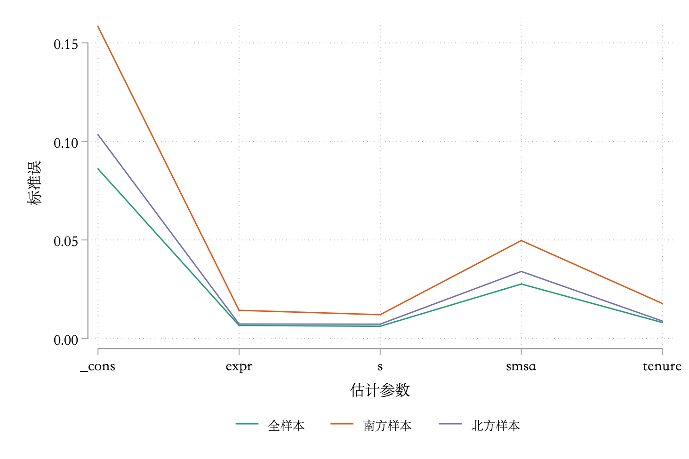
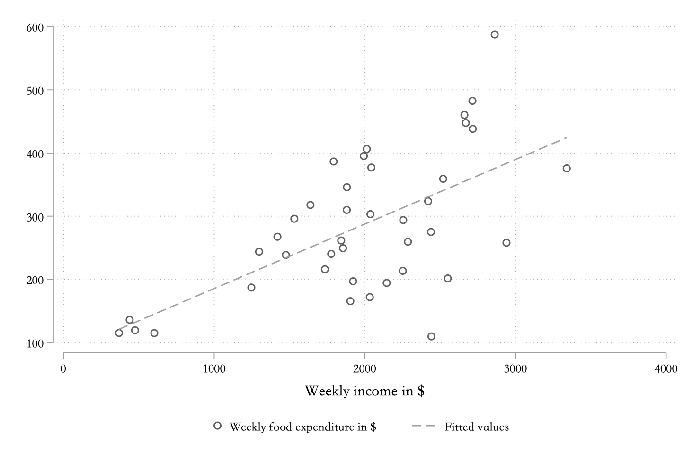
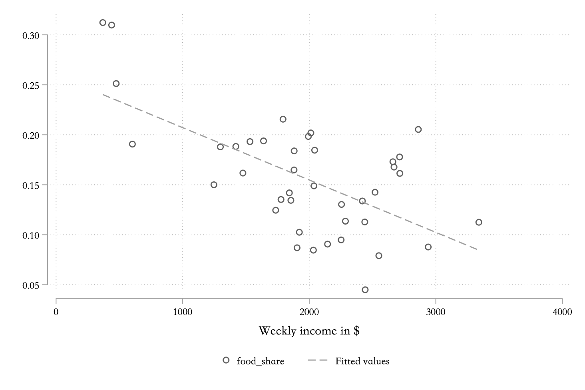
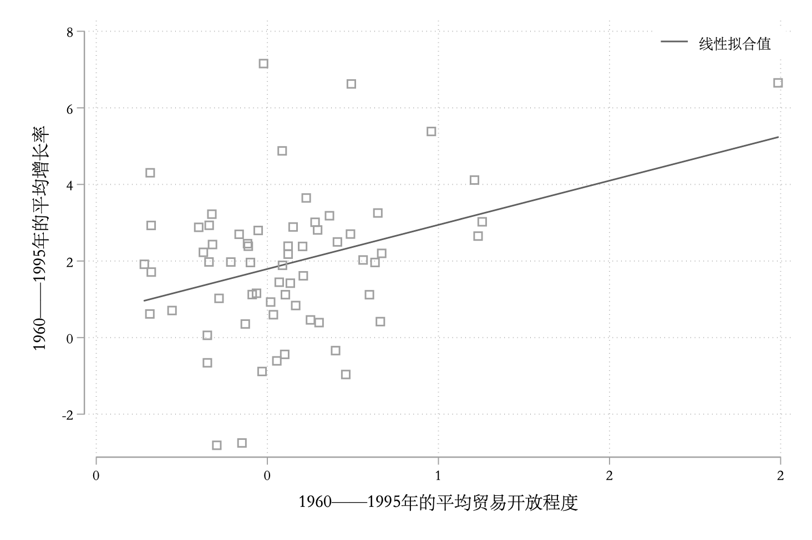
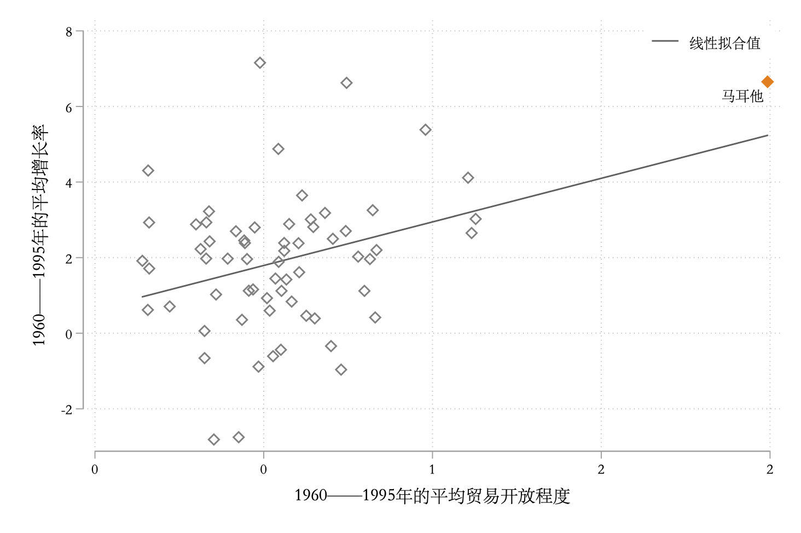
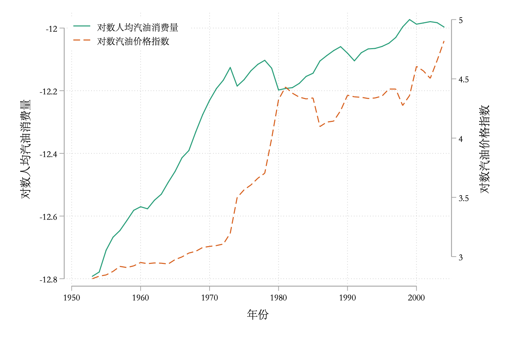
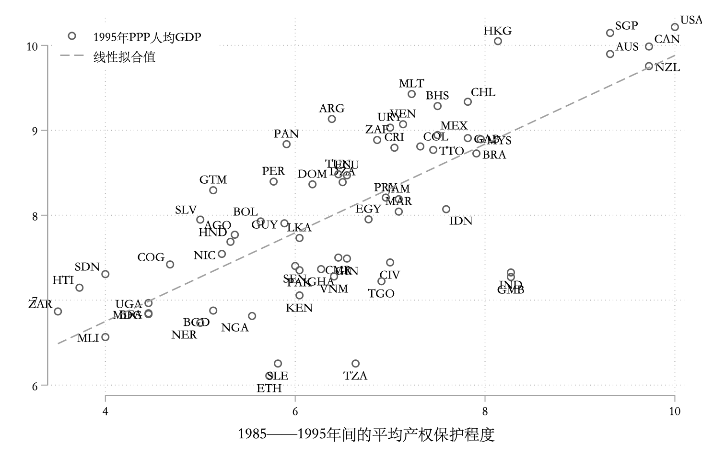
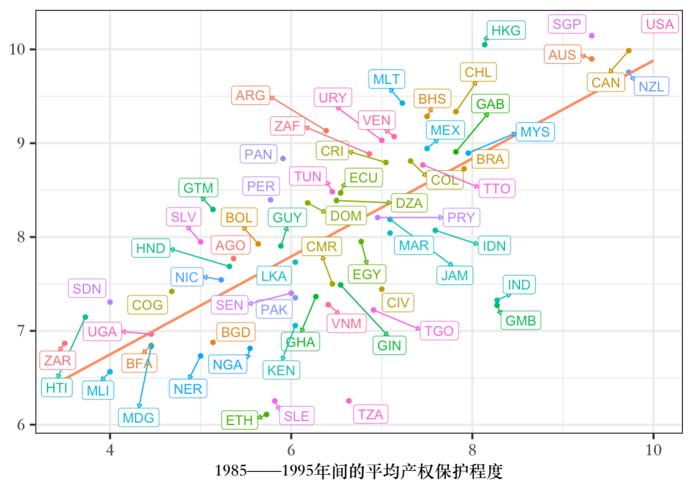
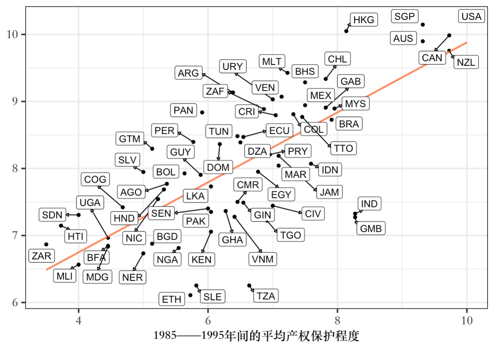

# 习题讲解

## 习题 6.5
**【题目】：**
使用数据集 `grilic.dta`，以稳健标准误估计下面的回归方程：

$$
ln w = \beta_{1} + \beta_{2} s + \beta_{3} expr + \beta_{4} tenure + \beta_{5} smsa + \varepsilon
$$

1. 使用全样本，估计方程（6.43）。
2. 使用美国南方的子样本，估计方程（6.43）。
3. 使用美国北方的子样本，估计方程（6.43）。
4. 与全样本相比，子样本估计量的标准误有何变化，为什么？

**【解答】：**

（1）：使用全样本：
```stata
cuse grilic, clear web
// 因为我的数据里面的lnw的名字是lw，为了和书上的统一，重命名为lnw
ren lw lnw
reg lnw s expr tenure smsa, r

*> Linear regression                               Number of obs     =        758
*>                                                 F(4, 753)         =      98.36
*>                                                 Prob > F          =     0.0000
*>                                                 R-squared         =     0.3448
*>                                                 Root MSE          =     .34813
*> ------------------------------------------------------------------------------
*>              |               Robust
*>          lnw |      Coef.   Std. Err.      t    P>|t|     [95% Conf. Interval]
*> -------------+----------------------------------------------------------------
*>            s |   .1035073   .0062235    16.63   0.000     .0912899    .1157247
*>         expr |   .0381933   .0066362     5.76   0.000     .0251656     .051221
*>       tenure |   .0363505   .0081018     4.49   0.000     .0204457    .0522554
*>         smsa |   .1523258   .0276534     5.51   0.000      .098039    .2066127
*>        _cons |   4.059067   .0861023    47.14   0.000     3.890038    4.228096
*> ------------------------------------------------------------------------------
```

根据估计结果，拟合的模型为：

$$
lnw = 4.059 + 0.104s + 0.036expr + 0.152smsa +\hat{\varepsilon}
$$


（2）：使用南方样本(rns == 1)估计
```stata
reg lnw s expr tenure smsa if rns, r

*> Linear regression                               Number of obs     =        204
*>                                                 F(4, 199)         =      36.04
*>                                                 Prob > F          =     0.0000
*>                                                 R-squared         =     0.4203
*>                                                 Root MSE          =     .34929
*> ------------------------------------------------------------------------------
*>              |               Robust
*>          lnw |      Coef.   Std. Err.      t    P>|t|     [95% Conf. Interval]
*> -------------+----------------------------------------------------------------
*>            s |   .1198242   .0120804     9.92   0.000     .0960021    .1436463
*>         expr |   .0451903   .0143038     3.16   0.002     .0169839    .0733967
*>       tenure |   .0092643   .0177777     0.52   0.603    -.0257926    .0443211
*>         smsa |   .1746563   .0496961     3.51   0.001     .0766579    .2726548
*>        _cons |   3.806148   .1582838    24.05   0.000     3.494019    4.118276
*> ------------------------------------------------------------------------------
```

根据估计结果，拟合的模型为：

$$
lnw = 3.806 + 0.120s + 0.045expr + 0.175smsa +\hat{\varepsilon}
$$


（3）：使用北方样本(rns == 0)估计：

```stata
reg lnw s expr tenure smsa if !rns, r

*> Linear regression                               Number of obs     =        554
*>                                                 F(4, 549)         =      59.45
*>                                                 Prob > F          =     0.0000
*>                                                 R-squared         =     0.3127
*>                                                 Root MSE          =     .34356
*> ------------------------------------------------------------------------------
*>              |               Robust
*>          lnw |      Coef.   Std. Err.      t    P>|t|     [95% Conf. Interval]
*> -------------+----------------------------------------------------------------
*>            s |   .0944787   .0072808    12.98   0.000      .080177    .1087804
*>         expr |   .0358675   .0073509     4.88   0.000     .0214281    .0503068
*>       tenure |   .0455117   .0088423     5.15   0.000     .0281429    .0628806
*>         smsa |   .1199364    .034029     3.52   0.000     .0530934    .1867794
*>        _cons |   4.214014    .103448    40.74   0.000     4.010812    4.417217
*> ------------------------------------------------------------------------------
```

根据估计结果，拟合的模型为：

$$
lnw = 4.021 + 0.094s + 0.036expr + 0.120smsa +\hat{\varepsilon}
$$


（4）：比较

三个模型的估计量标准误如下：

估计参数|全样本 | 北方样本 | 南方样本
:-:|:-:|:-:|:-:
s | 0.0062  | 0.0073 | 0.0120
expr | 0.0066 | 0.0074 | 0.0143
tenure | 0.0081 | 0.0088 | 0.0178
smsa | 0.0277 | 0.0340 | 0.0497
\_cons | 0.0861 | 0.1034 | 0.1583

还可以把这个画出来，如图\ref{fig:pic65}：

```{r pic65, echo=FALSE, fig.align='center', fig.cap = '模型比较', out.width='90%'}

```

从图中可以很容易看出全样本估计的模型各个参数的标准误都较子样本的小。这是当样本量增加时，样本更加接近总体，对参数的估计自然更加准确，标准误会更小。

绘图代码：
```stata
clear
input str10 var sd1 sd2 sd3
"s" 0.0062  0.0073 0.0120
"expr" 0.0066 0.0074 0.0143
"tenure" 0.0081 0.0088 0.0178
"smsa" 0.0277 0.0340 0.0497
"_cons" 0.0861 0.1034 0.1583
end
reshape long sd, i(var) j(m)
encode var, gen(varlab) lab(var)
* colorscheme是一个选择配色的命令，安装方法：
* net install colorscheme.pkg, from("https://github.com/matthieugomez/stata-colorscheme/raw/master/")
* 详细介绍可以参考我的这篇博客：https://www.czxa.top/posts/16049/
colorscheme 3, palette(Dark2)
ret list
tw ///
line sd varlab if m == 1, lp(solid) lc("`r(color1)'") || ///
line sd varlab if m == 2, lp(solid) lc("`r(color2)'") || ///
line sd varlab if m == 3, lp(solid) lc("`r(color3)'") ||, ///
xlab(, val labsize(*1.2)) ylab(, format(%6.2f) labsize(*1.2)) ///
xti("估计参数") yti("标准误") ///
leg(order(1 "全样本" 2 "北方样本" 3 "南方样本") pos(6) row(1))
gr export "6_5模型比较.png", replace
```

另外一种办法是把标准误存储起来使用：
```stata
cuse grilic, clear
ren lw lnw
reg lnw s expr tenure smsa, r
ret list
mat list r(table)
mat m1 = r(table)
mat list m1

reg lnw s expr tenure smsa if rns, r
mat m2 = r(table)

reg lnw s expr tenure smsa if !rns, r
mat m3 = r(table)

mat list m1
mat list m2
mat list m3

clear
gen var = ""
gen sd1 = .
gen sd2 = .
gen sd3 = .
set obs 5

di m1[1,1]
forval i = 1/`=_N'{
	replace sd1 = m1[2, `i'] in `i'
	replace sd2 = m2[2, `i'] in `i'
	replace sd3 = m3[2, `i'] in `i'
}

local k = 1
foreach j in "s" "expr" "tenure" "smsa" "_cons"{
	replace var = "`j'" in `k'
	local ++k
}
reshape long sd, i(var) j(m)
encode var, gen(varlab) lab(var)
colorscheme 3, palette(Dark2)
ret list
tw ///
line sd varlab if m == 1, lp(solid) lc("`r(color1)'") || ///
line sd varlab if m == 2, lp(solid) lc("`r(color2)'") || ///
line sd varlab if m == 3, lp(solid) lc("`r(color3)'") ||, ///
xlab(, val labsize(*1.2)) ylab(, format(%6.2f) labsize(*1.2)) ///
xti("估计参数") yti("标准误") ///
leg(order(1 "全样本" 2 "南方样本" 3 "北方样本") pos(6) row(1))
gr export "6_5模型比较.png", replace
```

---

## 习题 6.6

**【题目】：**
房屋的价格如何决定？一种理论认为，房价由房屋的性能决定，成为“特征价格法”。数据集`hprice2a.dta`包含了美国波士顿 506 个社区的房屋中位数价格的横截面数据。考虑以下特征价格回归：

$$
lprice_i = \beta_1 + \beta_2lnox_i + \beta_3ldist_i + \beta_4rooms_i + \beta_5stratio_i + \varepsilon_i
$$

其中，$lprice$为房价的对数，$lnox$为空气污染程度的对数，$ldist$为社区到就业中心距离的对数，$rooms$为房屋的平均房间数，$stratio$为社区学校的`学生 - 教师`比例，下标$i$表示社区$i$。

（1）使用普通标准误进行回归，并评论解释变量系数的符号、统计显著性及经济意义。
（2）使用稳健标准误进行回归，稳健标准误和普通标准误差别大么？
（3）使用稳健标准误，以 5%的显著性水平，检验$H_0: \beta_3 = \beta_5$。
（4）使用稳健标准误，以 5%的显著性水平，检验$H_0: \beta_4 = 0.31$与$H_0: \beta_4 = 0.30$。

**【解答】**

（1）：普通标准误回归
```stata
cuse hprice2a, clear
gen ldist = ln(dist)
reg lprice lnox ldist rooms stratio

*>       Source |       SS           df       MS      Number of obs   =       506
*> -------------+----------------------------------   F(4, 501)       =    175.86
*>        Model |  49.3987735         4  12.3496934   Prob > F        =    0.0000
*>     Residual |  35.1834974       501  .070226542   R-squared       =    0.5840
*> -------------+----------------------------------   Adj R-squared   =    0.5807
*>        Total |  84.5822709       505  .167489645   Root MSE        =      .265
*> ------------------------------------------------------------------------------
*>       lprice |      Coef.   Std. Err.      t    P>|t|     [95% Conf. Interval]
*> -------------+----------------------------------------------------------------
*>         lnox |    -.95354   .1167418    -8.17   0.000    -1.182904   -.7241762
*>        ldist |  -.1343401   .0431032    -3.12   0.002    -.2190255   -.0496548
*>        rooms |   .2545271   .0185303    13.74   0.000     .2181203    .2909338
*>      stratio |  -.0524512   .0058971    -8.89   0.000    -.0640373   -.0408651
*>        _cons |   11.08387   .3181115    34.84   0.000     10.45887    11.70886
*> ------------------------------------------------------------------------------
```

1. lnox：系数为负，在 5%的显著性水平上显著，表示空气污染程度每加剧 1%，房价平均下跌 0.95%；
2. ldist：系数为负，在 5%的显著性水平上显著，表示社区到就业中心的距离每增加 1%，房价平均下跌 0.13%；
3. rooms：系数为正，在 5%的显著性水平上显著，表示房屋的平均房间数增加 1，房价平均上涨 25.45%；
4. stratio：系数为负，在 5%的显著性水平上显著，表示社区学校的学生-教师比例每提高一个单位，房价平均下跌 5.24%。

（2）：稳健标准误的回归
```stata
reg lprice lnox ldist rooms stratio, r

*> Linear regression                               Number of obs     =        506
*>                                                 F(4, 501)         =     146.27
*>                                                 Prob > F          =     0.0000
*>                                                 R-squared         =     0.5840
*>                                                 Root MSE          =       .265
*> ------------------------------------------------------------------------------
*>              |               Robust
*>       lprice |      Coef.   Std. Err.      t    P>|t|     [95% Conf. Interval]
*> -------------+----------------------------------------------------------------
*>         lnox |    -.95354   .1268006    -7.52   0.000    -1.202667   -.7044135
*>        ldist |  -.1343401   .0535287    -2.51   0.012    -.2395086   -.0291717
*>        rooms |   .2545271   .0247204    10.30   0.000     .2059586    .3030956
*>      stratio |  -.0524512   .0046082   -11.38   0.000     -.061505   -.0433974
*>        _cons |   11.08387   .3772952    29.38   0.000     10.34259    11.82514
*> ------------------------------------------------------------------------------
```

显然差别不大。


（3）：5%显著性水平，检验$\beta_3 = \beta_5$
```stata
test ldist = stratio

*> ( 1)  ldist - stratio = 0
*>
*>       F(  1,   501) =    2.27
*>            Prob > F =    0.1322
```

p 值大于 5%，不显著，因此无法拒绝原假设。


（4）：5% 显著性水平，检验$\beta_4 = 0.31 / 0.30$

```stata
test rooms = 0.31

*> ( 1)  rooms = .31

*>       F(  1,   501) =    5.04
*>            Prob > F =    0.0253

test rooms = 0.30

*> ( 1)  rooms = .3
*>
*>       F(  1,   501) =    3.38
*>            Prob > F =    0.0664
```
第一个检验的结果是拒绝原假设的，第二个结果是无法拒绝原假设。

---

## 习题 7.2

**【题目】**
房价的回归是否存在异方差？继续考虑上题中的房价模型：
1. 以 5%的置信度，使用 BP 检验，检验是否存在异方差（假设扰动项为 iid，分别以拟合值$\hat{y}以及所有解释变量进行检验$）。
2. 以 5%的置信度，使用怀特检验，检验是否存在异方差。

**【解答】**

（1）：BP 检验
首先是以拟合值进行检验：
```stata
cuse hprice2a, clear
gen ldist = ln(dist)
qui reg lprice lnox ldist rooms stratio
estat hettest, iid

*> Breusch-Pagan / Cook-Weisberg test for heteroskedasticity
*>          Ho: Constant variance
*>          Variables: fitted values of lprice
*> 
*>          chi2(1)      =    37.57
*>          Prob > chi2  =   0.0000
```

然后再使用所有的解释变量进行检验：
```stata
estat hettest, iid rhs

*> Breusch-Pagan / Cook-Weisberg test for heteroskedasticity
*>          Ho: Constant variance
*>          Variables: lnox ldist rooms stratio
*> 
*>          chi2(4)      =    69.87
*>          Prob > chi2  =   0.0000
```
两次检验的结果都强烈拒绝拒绝同方差的原假设，因为认为存在异方差。

（2）：怀特检验

```stata
estat imtest, white

*> White's test for Ho: homoskedasticity
*>          against Ha: unrestricted heteroskedasticity

*>          chi2(14)     =    143.98
*>          Prob > chi2  =    0.0000

*> Cameron & Trivedi's decomposition of IM-test

*> ---------------------------------------------------
*>               Source |       chi2     df      p
*> ---------------------+-----------------------------
*>   Heteroskedasticity |     143.98     14    0.0000
*>             Skewness |      16.99      4    0.0019
*>             Kurtosis |      11.30      1    0.0008
*> ---------------------+-----------------------------
*>                Total |     172.26     19    0.0000
*> ---------------------------------------------------
```

结果同样强烈拒绝同方差的原假设，认为存在异方差。

## 习题 7.3

**【题目】**
恩格尔系数是否存在异方差？数据集`food.dta`包含有关每周食物开支(food_exp)和周收入(income)的 40 个观测值。
1. 将 food_exp 和 income 的散点图和线性拟合图画在一起。根据此图，是否可能存在异方差？此异方差和收入的关系是怎样的？
2. 将 food_exp 对 income 进行回归。
3. 以 5%的置信度，使用 BP 检验，检验是否存在异方差（iid 假设）。
4. 以 5%的置信度，使用怀特检验，检验是否存在异方差。
5. 定义食物开支比例 food_share = food_exp/income，将 food_share 与 income 的散点图与线性拟合图画在一起。从图上看，是否还存在异方差？
6. 将 food_share 对 income 进行回归。
7. 5%、BP 检验、iid。
8. 5%、怀特检验。

**【解答】**

（1）：图表
```stata
cuse food, clear
tw ///
sc food_exp income || ///
lfit food_exp income ||, ///
leg(pos(6) row(1))
gr export "7_3恩格尔系数1.png", replace
```

```{r pic73, echo=FALSE, fig.align='center', fig.cap = '恩格尔系数', out.width='90%'}

```


从图\ref{fig:pic73}可以看出，很可能存在异方差，并且收入越高方差越大。


（2）：回归
```stata
reg food_exp income

*>       Source |       SS           df       MS      Number of obs   =        40
*> -------------+----------------------------------   F(1, 38)        =     23.79
*>        Model |  190626.976         1  190626.976   Prob > F        =    0.0000
*>     Residual |  304505.177        38  8013.29412   R-squared       =    0.3850
*> -------------+----------------------------------   Adj R-squared   =    0.3688
*>        Total |  495132.153        39  12695.6962   Root MSE        =    89.517
*> ------------------------------------------------------------------------------
*>     food_exp |      Coef.   Std. Err.      t    P>|t|     [95% Conf. Interval]
*> -------------+----------------------------------------------------------------
*>       income |   .1020964   .0209326     4.88   0.000     .0597205    .1444723
*>        _cons |   83.41601   43.41016     1.92   0.062     -4.46327    171.2953
*> ------------------------------------------------------------------------------
```

拟合的模型为：

$$
food\_exp = 83.416 + 0.102income + \varepsilon
$$


（3）：BP 检验
```stata
estat hettest, iid

*> Breusch-Pagan / Cook-Weisberg test for heteroskedasticity
*>          Ho: Constant variance
*>          Variables: fitted values of food_exp
*>          chi2(1)      =     7.38
*>          Prob > chi2  =   0.0066

estat hettest, iid rhs

*> Breusch-Pagan / Cook-Weisberg test for heteroskedasticity
*>          Ho: Constant variance
*>          Variables: income
*>          chi2(1)      =     7.38
*>          Prob > chi2  =   0.0066
```

两个 BP 检验的结果都强烈拒绝同方差的原假设，因此认为存在异方差。


（4）：怀特检验
```stata
estat imtest, white

*> White's test for Ho: homoskedasticity
*>          against Ha: unrestricted heteroskedasticity

*>          chi2(2)      =      7.56
*>          Prob > chi2  =    0.0229

*> Cameron & Trivedi's decomposition of IM-test

*> ---------------------------------------------------
*>               Source |       chi2     df      p
*> ---------------------+-----------------------------
*>   Heteroskedasticity |       7.56      2    0.0229
*>             Skewness |       0.13      1    0.7146
*>             Kurtosis |       0.00      1    0.9825
*> ---------------------+-----------------------------
*>                Total |       7.69      4    0.1036
*> ---------------------------------------------------
```
怀特检验的结果也强烈拒绝同方差的原假设，因此认为存在异方差。


（5）：food_share & income
```stata
gen food_share = food_exp / income
tw ///
sc food_share income || ///
lfit food_share income ||, ///
leg(pos(6) row(1)) ylab(, format(%6.2f))
gr export "7_3恩格尔系数2.png", replace
```



可以看出异方差现象不如刚刚那般明显了。


（6）：回归
```stata
reg food_share income

*>       Source |       SS           df       MS      Number of obs   =        40
*> -------------+----------------------------------   F(1, 38)        =     24.39
*>        Model |  .050217947         1  .050217947   Prob > F        =    0.0000
*>     Residual |  .078224368        38  .002058536   R-squared       =    0.3910
*> -------------+----------------------------------   Adj R-squared   =    0.3749
*>        Total |  .128442315        39  .003293393   Root MSE        =    .04537

*> ------------------------------------------------------------------------------
*>   food_share |      Coef.   Std. Err.      t    P>|t|     [95% Conf. Interval]
*> -------------+----------------------------------------------------------------
*>       income |  -.0000524   .0000106    -4.94   0.000    -.0000739   -.0000309
*>        _cons |   .2595986   .0220021    11.80   0.000     .2150576    .3041397
*> ------------------------------------------------------------------------------
```
拟合的模型为：

$$
food\_share = -5.24e^{-5}income + 0.26 + \varepsilon
$$


（7）：BP 检验
```stata
estat hettest, iid

*> Breusch-Pagan / Cook-Weisberg test for heteroskedasticity
*>          Ho: Constant variance
*>          Variables: fitted values of food_share
*> 
*>          chi2(1)      =     0.08
*>          Prob > chi2  =   0.7748

estat hettest, iid rhs

*> Breusch-Pagan / Cook-Weisberg test for heteroskedasticity
*>          Ho: Constant variance
*>          Variables: income

*>          chi2(1)      =     0.08
*>          Prob > chi2  =   0.7748
```
两个 BP 检验的结果都无法拒绝同方差的原假设，因此不认为存在异方差。


（8）：怀特检验
```stata
estat imtest, white

*> White's test for Ho: homoskedasticity
*>          against Ha: unrestricted heteroskedasticity

*>          chi2(2)      =      2.60
*>          Prob > chi2  =    0.2722

*> Cameron & Trivedi's decomposition of IM-test

*> ---------------------------------------------------
*>               Source |       chi2     df      p
*> ---------------------+-----------------------------
*>   Heteroskedasticity |       2.60      2    0.2722
*>             Skewness |       0.37      1    0.5421
*>             Kurtosis |       2.71      1    0.1000
*> ---------------------+-----------------------------
*>                Total |       5.68      4    0.2244
*> ---------------------------------------------------
```
怀特检验的结果无法拒绝同方差的原假设，因此不认为存在异方差。

## 习题 9.4
**【题目】：**

使用数据集`Growth.dta`考察贸易与增长的关系，该数据集的被解释变量为 65 个国家 1960——1995 年的平均增长率，而主要解释变量为 1960——1995 年的平均贸易开放度（tradeshare）。

1. 将 growth 与 tradeshare 的散点图和线性拟合图画在一起。二者看起来是否有关系？
2. 有一个国家马耳他（Malta），其贸易开放度比其他国家高很多，在散点图上找出马耳他。它是否像极端值？
3. 使用全样本，把 growth 对 tradeshare 进行回归，该回归的斜率和截距的估计值分别是多少？
4. 计算每个观测值的影响力，以及此影响力的最大值和平均值只比，是否存在极端值？
5. 去掉马耳他重复上述回归，并再次回答（3）中的问题。
6. 马耳他在哪？马耳他的贸易开放度为什么这么高？是否应该在本研究中去掉马耳他？
7. 把 growth 对 tradeshare，rgdp60（1960 年的人均 GDP），yearsschool（1960 年的平均受教育年限），rev_coups（1960 年-1995 年的年平均政变次数），以及 assassinations（1960——1995 年的年平均政治暗杀次数）进行回归。评论各变量系数的符号、统计显著性及经济意义。
8. 为什么把变量 r60 与 yearsschool 的取值定为起初的 1960 年？

**【解答】：**

（1）：散点图&线性拟合图
```stata
use growth, clear
tw ///
lfit growth tradeshare || ///
sc growth tradeshare ||, ///
leg(order(1 "线性拟合值") pos(1) ring(0) row(1)) ///
xti("1960——1995年的平均贸易开放程度") ///
yti("1960——1995年的平均增长率") ///
xlab(, format(%6.0f))
gr export "9_4散点+线性拟合图.png", replace
```



显然，贸易开放程度和经济增长之间存在正相关的关系。

（2）：马耳他
```stata
* 预保存数据
preserve
keep if country_name == "Malta"
* 存储马耳他的数据
local y = growth[1]
local x = tradeshare[1]
di "x = " `x' " 而 y = "`y'
* 恢复数据
restore
* 可以看到local变量还在
di "x = " `x' " 而 y = "`y'

tw ///
lfit growth tradeshare || ///
scatteri `y' `x' (7) "马耳他", ms(D) mc("dkorange") || ///
sc growth tradeshare if country_name != "Malta" ||, ///
leg(order(1 "线性拟合值") pos(1) ring(0) row(1)) ///
xti("1960——1995年的平均贸易开放程度") ///
yti("1960——1995年的平均增长率") ///
xlab(, format(%6.0f))
gr export "9_4散点+线性拟合图+极端值.png", replace
```



可以看出，马耳他看起来很像极端值。

（3）：全样本回归
```stata
reg growth tradeshare

*>       Source |       SS           df       MS      Number of obs   =        65
*> -------------+----------------------------------   F(1, 63)        =      8.89
*>        Model |  28.4885066         1  28.4885066   Prob > F        =    0.0041
*>     Residual |  201.851551        63  3.20399287   R-squared       =    0.1237
*> -------------+----------------------------------   Adj R-squared   =    0.1098
*>        Total |  230.340057        64  3.59906339   Root MSE        =      1.79
*> ------------------------------------------------------------------------------
*>       growth |      Coef.   Std. Err.      t    P>|t|     [95% Conf. Interval]
*> -------------+----------------------------------------------------------------
*>   tradeshare |   2.306434    .773485     2.98   0.004     .7607473     3.85212
*>        _cons |   .6402653   .4899767     1.31   0.196    -.3388749    1.619405
*> ------------------------------------------------------------------------------
```
斜率为`2.3064`，截距为`0.6403`。

（4）：影响力
```stata
* 计算leverage
predict lev, lev
qui sum lev
di r(max)/r(mean)
```

计算的结果为 12.87，经验规则表明，这是相当大的，因此认为存在极端值。

（5）：去掉极端值的回归
```stata
reg growth tradeshare if country_name != "Malta"

*>       Source |       SS           df       MS      Number of obs   =        64
*> -------------+----------------------------------   F(1, 62)        =      2.90
*>        Model |  9.28031557         1  9.28031557   Prob > F        =    0.0937
*>     Residual |  198.527844        62  3.20206201   R-squared       =    0.0447
*> -------------+----------------------------------   Adj R-squared   =    0.0292
*>        Total |   207.80816        63  3.29854222   Root MSE        =    1.7894
*> 
*> ------------------------------------------------------------------------------
*>       growth |      Coef.   Std. Err.      t    P>|t|     [95% Conf. Interval]
*> -------------+----------------------------------------------------------------
*>   tradeshare |   1.680905   .9873624     1.70   0.094    -.2928046    3.654614
*>        _cons |   .9574107   .5803727     1.65   0.104    -.2027378    2.117559
*> ------------------------------------------------------------------------------
```

此时斜率为 1.6809，截距为 0.9574。（对比刚刚的（2.3064 和 0.6403））

（6）：马耳他
马耳他是一个位于地中海中心的岛国。是一个高度发达的资本主义国家，经济以服务业和金融业为主，旅游业是马耳他主要的外汇来源。马耳他同 100 多个国家和地区有贸易关系，欧盟是马耳他最重要的贸易伙伴。另外，马耳他社会保障体系较为完备，实行免费教育，免费医疗及退休保险制。
也就是地中海的这个位置：

绘图代码（[R 语言 + leaflet](https://rstudio.github.io/leaflet/)）:

```{r}
library(leaflet)

Maltatag <- makeIcon(
  iconUrl = "malta.jpeg",
  iconWidth = 90, iconHeight = 55,
  iconAnchorX = 22, iconAnchorY = 94
)
content <- paste(sep = "<br/>",
                 "<b><a href='https://baike.baidu.com/item/%E9%A9%AC%E8%80%B3%E4%BB%96'>马耳他</a></b>",
                 "人口：44万",
                 "面积：316平方公里"
)

leaflet(width = "100%", height = "500px") %>%
  setView(lng = 14.31, lat = 35.53, zoom = 5) %>%
  addTiles() %>%
  addPopups(lng = 14.31, lat = 36.5, content) %>%
  addMarkers(lng = 17.31, lat = 32.5, icon = Maltatag)
```

由于马耳他是极端值且对估计结果影响较大，所以还是去掉比较好。

（7）：完整模型的估计

```stata
reg growth tradeshare rgdp60 yearsschool rev_coups assasinations

*>       Source |       SS           df       MS      Number of obs   =        65
*> -------------+----------------------------------   F(5, 59)        =      6.61
*>        Model |  82.6634812         5  16.5326962   Prob > F        =    0.0001
*>     Residual |  147.676576        59  2.50299281   R-squared       =    0.3589
*> -------------+----------------------------------   Adj R-squared   =    0.3045
*>        Total |  230.340057        64  3.59906339   Root MSE        =    1.5821
*> 
*> -------------------------------------------------------------------------------
*>        growth |      Coef.   Std. Err.      t    P>|t|     [95% Conf. Interval]
*> --------------+----------------------------------------------------------------
*>    tradeshare |   1.561696   .7579475     2.06   0.044     .0450462    3.078345
*>        rgdp60 |  -.0004693   .0001482    -3.17   0.002    -.0007659   -.0001728
*>   yearsschool |   .5748461   .1393379     4.13   0.000     .2960316    .8536606
*>     rev_coups |  -2.157503   1.110292    -1.94   0.057    -4.379191    .0641853
*> assasinations |   .3540784   .4773943     0.74   0.461    -.6011854    1.309342
*>         _cons |   .4897603   .6895996     0.71   0.480    -.8901254    1.869646
*> -------------------------------------------------------------------------------
```

1. tradeshare：符号为正，在 5%的显著性水平上显著，表示平均贸易开放程度每增加一个单位，经济平均增长率平均上升 1.56%。
2. rgdp60：符号为负，在 5%的显著性水平上显著，表示 1960 年的人均 GDP 每增加一块钱，经济平均增长率就平均下降 0.00047%。
3. yearsschool：符号为正，在 5%的显著性水平上显著，表示 1960 年的平均受教育年限每增加 1 年，经济平均增长率就平均上升 0.57%。
4. rev_coups：符号为负，在 10%的显著性水平上显著，表示 1960——1995 年间的年平均政变次数每增加一次，经济平均增长率就平均下降 2.15%。
5. assassinations：符号为负，但是很不显著，因此没有意义。

（8）：期初
这样可以避免逆向因果的问题，而且比较符合逻辑。

---

## 习题 9.5
**【题目】：**
美国的汽油需求函数是否稳定？使用数据集`gasoline.dta`，估计美国 1953——2004 年的汽油需求函数（参见第八章）：

\begin{align}
lgasq_t =& \beta_0 + \beta_1 lgasq_{t-1} + \beta_2lincome_t + \beta_3lgasp_t \\
& + \beta_4lpnc_t + \beta_5lpuc_t + \varepsilon_t
\end{align}

其中被解释变量 lgasq 为人均汽油消费量的对数，解释变量 lincome 为人均收入对数，lgasp 为汽油价格指数的对数，lpnc 为新车价格指数的对数，lpuc 为二手车价格指数的对数。

1. 将 lgasq 与 lgasp 的时间趋势图画在一起。根据此图，在 1953——2004 年期间，美国的汽油需求函数是否曾出现结构变动？
2. 使用 OLS 估计方程（9.48）.
3. 使用 BP 检验与怀特检验，检验是否存在异方差。
4. 使用 BG 检验与 Q 检验，检验是否存在自相关。
5. 1973 年 10 月爆发石油危机，可能引发汽油需求的结构变动。使用虚拟变量法，检验美国的汽油需求函数是否在 1974 年发生结构变动。根据（3）与（4）的检验结果决定是否应该使用稳健标准误。

**【解答】：**

（1）：时间趋势图
```stata
use gasoline, clear
* 使用调色板命令配色
colorscheme 3, palette(Dark2)
ret list
* "027 158 119" "217 095 002"
tw ///
line lgasq year, lc("027 158 119") yaxis(1) || ///
line lgasp year, lc("217 095 002") yaxis(2) ||, ///
leg(order(1 "对数人均汽油消费量" 2 "对数汽油价格指数") pos(10) ring(0)) ///
yti("对数人均汽油消费量", axis(1)) ///
yti("对数汽油价格指数", axis(2)) ///
xti("年份")

gr export "9_5趋势图.png", replace
```



（2）：OLS 估计
```stata
reg lgasq l.lgasq lincome lgasp lpnc lpuc

*>       Source |       SS           df       MS      Number of obs   =        51
*> -------------+----------------------------------   F(5, 45)        =   1830.77
*>        Model |  2.59056415         5   .51811283   Prob > F        =    0.0000
*>     Residual |  .012735088        45  .000283002   R-squared       =    0.9951
*> -------------+----------------------------------   Adj R-squared   =    0.9946
*>        Total |  2.60329924        50  .052065985   Root MSE        =    .01682
*> 
*> ------------------------------------------------------------------------------
*>        lgasq |      Coef.   Std. Err.      t    P>|t|     [95% Conf. Interval]
*> -------------+----------------------------------------------------------------
*>        lgasq |
*>          L1. |   .8309713   .0457633    18.16   0.000     .7387994    .9231433
*>              |
*>      lincome |   .1640462   .0550263     2.98   0.005     .0532175    .2748748
*>        lgasp |  -.0695317   .0147326    -4.72   0.000    -.0992047   -.0398587
*>         lpnc |  -.1783946   .0551726    -3.23   0.002    -.2895179   -.0672714
*>         lpuc |   .1270093   .0357704     3.55   0.001      .054964    .1990546
*>        _cons |   -3.12318   .9958266    -3.14   0.003    -5.128878   -1.117483
*> ------------------------------------------------------------------------------
```
拟合的模型为：

\begin{align}
lgasq_t =& -3.12 + 0.83 lgasq_{t-1} + 0.16lincome_t + -0.07lgasp_t \\
& - 0.18lpnc_t + 0.13lpuc_t + \varepsilon_t
\end{align}

（3）：异方差检验
```stata
estat hettest, iid

*> Breusch-Pagan / Cook-Weisberg test for heteroskedasticity
*>          Ho: Constant variance
*>          Variables: fitted values of lgasq

*>          chi2(1)      =     0.31
*>          Prob > chi2  =   0.5788

estat hettest, iid rhs

*> Breusch-Pagan / Cook-Weisberg test for heteroskedasticity
*>          Ho: Constant variance
*>          Variables: L.lgasq lincome lgasp lpnc lpuc
*>          chi2(5)      =     7.46
*>          Prob > chi2  =   0.1884

estat imtest, white

*> White's test for Ho: homoskedasticity
*>          against Ha: unrestricted heteroskedasticity
*> 
*>          chi2(20)     =     33.20
*>          Prob > chi2  =    0.0321
*> 
*> Cameron & Trivedi's decomposition of IM-test
*> 
*> ---------------------------------------------------
*>               Source |       chi2     df      p
*> ---------------------+-----------------------------
*>   Heteroskedasticity |      33.20     20    0.0321
*>             Skewness |       9.58      5    0.0881
*>             Kurtosis |       0.61      1    0.4356
*> ---------------------+-----------------------------
*>                Total |      43.38     26    0.0176
*> ---------------------------------------------------
```
两种 BP 检验的结果表明无法拒绝同方差的原假设，而怀特检验表明拒绝同方差的原假设。考虑到两种检验的区别，所以结论是：不存在线性的异方差，但是存在非线性的异方差。

（4）：自相关检验
```stata
tsset year
*>    time variable:  year, 1953 to 2004
*>            delta:  1 unit

qui reg lgasq l.lgasq lincome lgasp lpnc lpuc

* BG检验
estat bgo

*> Breusch-Godfrey LM test for autocorrelation
*> ---------------------------------------------------------------------------
*>     lags(p)  |          chi2               df                 Prob > chi2
*> -------------+-------------------------------------------------------------
*>        1     |          0.545               1                   0.4603
*> ---------------------------------------------------------------------------
*>                         H0: no serial correlation

estat bgo, nom

*> Breusch-Godfrey LM test for autocorrelation
*> ---------------------------------------------------------------------------
*>     lags(p)  |          chi2               df                 Prob > chi2
*> -------------+-------------------------------------------------------------
*>        1     |          1.361               1                   0.2434
*> ---------------------------------------------------------------------------
*>                         H0: no serial correlation

* Q检验

predict e1, r
*> (1 missing value generated)

wntestq e1

*> Portmanteau test for white noise
*> ---------------------------------------
*>  Portmanteau (Q) statistic =    25.2413
*>  Prob > chi2(23)           =     0.3380
```
两种检验都无法拒绝无自相关的原假设。

（5）：检验结构变动
```stata
use gasoline, clear
gen yearid = (year >= 1973)
gen interaction = yearid * lgasp
reg lgasq l.lgasq lincome lgasp lpnc lpuc yearid interaction, r

*> Linear regression                               Number of obs     =         51
*>                                                 F(7, 43)          =    2328.20
*>                                                 Prob > F          =     0.0000
*>                                                 R-squared         =     0.9967
*>                                                 Root MSE          =     .01421*> 

*> ------------------------------------------------------------------------------
*>              |               Robust
*>        lgasq |      Coef.   Std. Err.      t    P>|t|     [95% Conf. Interval]
*> -------------+----------------------------------------------------------------
*>        lgasq |
*>          L1. |   .4682407    .096862     4.83   0.000     .2728999    .6635815
*>              |
*>      lincome |   .3143699   .0528124     5.95   0.000     .2078636    .4208762
*>        lgasp |   .5230541   .1386092     3.77   0.000      .243522    .8025862
*>         lpnc |  -.0353864   .0503548    -0.70   0.486    -.1369365    .0661638
*>         lpuc |   .0381906   .0297671     1.28   0.206    -.0218405    .0982217
*>       yearid |   1.934971     .42312     4.57   0.000     1.081668    2.788274
*>  interaction |  -.6175106   .1377708    -4.48   0.000    -.8953518   -.3396694
*>        _cons |  -11.08808   2.034093    -5.45   0.000    -15.19022   -6.985939
*> ------------------------------------------------------------------------------

* 另外再进行检验
test yearid interaction

*> ( 1)  yearid = 0
*> ( 2)  interaction = 0
*>       F(  2,    43) =   18.80
*>            Prob > F =    0.0000
```
由于存在异方差问题，所以使用稳健的标准误。
可以看出生成的虚拟变量和虚拟变量与汽油价格指数对数的交互项的系数都非常显著，因此认为在 1973 年发生了结构变动。

## 习题 10.5

**【题目】：**
使用数据集`acemoglu.dta`。该数据集包含 64 个曾为欧洲殖民地的国家，主要变量为`logpgp95`（1995 年人均 GDP，PPP），`avexpr`（1985——1995 年间的平均产权保护程度，0 为最低，10 为最高），`lat_abst`（首都纬度的绝对值/90），以及`logem4`（殖民者死亡率的对数）。另外，变量`shortnam`以三个字母表示每个国家的简称。

1. 为了直观地考察产权保护与经济发展的关系，将`logpgp95`和`avexpr`的散点图和线性拟合图画在一起，并为每个散点标注国家简称。
2. 为了使用稳健标准误，把`logpgp95`对`avexpr`及`lat_abst`进行回归，评论变量的符号、统计显著性及经济意义。
3. 由于`avexpr`可能为内生解释变量，使用`logem4`作为`avexpr`的工具变量，重新进行（2）回归。工具变量回归的结果与 OLS 有何不同？
4. `logem4`是否为弱工具变量？

**【解答】：**

（1）：散点图+线性拟合图+散点标签

```stata
cuse acemoglu, clear web
* 这里需要处理一下散点标签遮盖的问题
* ssc install egenmore
egen clock = mlabvpos(logpgp95 avexpr)
tw ///
sc logpgp95 avexpr, mlab(shortnam) mlabvpos(clock) || ///
lfit logpgp95 avexpr ||, ///
  leg(order(1 "1995年PPP人均GDP" 2 "线性拟合值") pos(10) ring(0)) ///
  xti("1985——1995年间的平均产权保护程度")
gr export "10_5散点图.png", replace
```




虽然还是不能完美的处理散点遮盖的问题，但是已经处理的相当不错了，如果你想追求完全没有任何散点遮盖，你可以逐个修改 clock 变量的某些值。不过 R 的 ggplot2+ggrepel 包能够完美的解决散点相互遮盖的问题。

```R
# install.packages("RStata")
# 读取数据的方法一：使用RStata包，
# 该包的详细使用可以参考：https://www.czxa.top/posts/13184/
library(RStata)
library(ggplot2)
library(ggrepel)
options("RStata.StataPath" = "/Applications/Stata/StataSE.app/Contents/MacOS/stata-se")
options("RStata.StataVersion" = 15)
s <- stata("cuse acemoglu, clear web", data.out = T)

# 读取数据的方法二：使用readstata13包直接读取dta文件，
# 之所以用这个包的原因是这个包读地最快。
library(readstata13)
s <- read.dta13("acemoglu.dta")
# 之所以为散点创建颜色映射，是因为我闲的无聊
ggplot(data = s, aes(x = avexpr, y = logpgp95, colour = shortnam)) +
  geom_point() +
  geom_smooth(method = "lm", se = F, colour = "#fc8d62") +
  geom_label_repel(arrow = arrow(length = unit(0.01, "npc"),
                  type = "closed", ends = "first"),
                  force = 10,
    aes(label = shortnam)) +
  labs(x = "1985——1995年间的平均产权保护程度") +
  theme(axis.title.y = element_blank()) +
  theme(legend.position = "none") +
  theme(axis.title.x = element_text(size = 14))
```




取消颜色映射：
```stata
ggplot(data = s, aes(x = avexpr, y = logpgp95)) +
  geom_point() +
  geom_smooth(method = "lm", se = F, colour = "#fc8d62") +
  geom_label_repel(arrow = arrow(length = unit(0.01, "npc"),
                  type = "closed", ends = "first"),
                  force = 10,
    aes(label = shortnam)) +
  labs(x = "1985——1995年间的平均产权保护程度") +
  theme(axis.title.y = element_blank()) +
  theme(legend.position = "none") +
  theme(axis.title.x = element_text(size = 14))
```



（2）：稳健回归

```stata
reg logpgp95 avexpr lat_abst, r

*> Linear regression                               Number of obs     =         64
*>                                                 F(2, 61)          =      64.91
*>                                                 Prob > F          =     0.0000
*>                                                 R-squared         =     0.5745
*>                                                 Root MSE          =     .69166
*> ------------------------------------------------------------------------------
*>              |               Robust
*>     logpgp95 |      Coef.   Std. Err.      t    P>|t|     [95% Conf. Interval]
*> -------------+----------------------------------------------------------------
*>       avexpr |   .4678871   .0626811     7.46   0.000     .3425484    .5932257
*>     lat_abst |   1.576884   .6506046     2.42   0.018     .2759197    2.877848
*>        _cons |   4.728082   .3413732    13.85   0.000     4.045464      5.4107
*> ------------------------------------------------------------------------------
```

1. avexpr：符号为正，表示 1985——1995 年间的平均产权保护程度每提高 1，1995 年的 PPP 人均 GDP 平均提高 47%。
2. lat_abst：符号为正，表示纬度每上升 1%，1995 年的 PPP 人均 GDP 平均提高 1.57%。

（3）：IV

```stata
ivregress 2sls logpgp95 (avexpr = logem4) lat_abst, r

*> Instrumental variables (2SLS) regression          Number of obs   =         64
*>                                                   Wald chi2(2)    =      28.33
*>                                                   Prob > chi2     =     0.0000
*>                                                   R-squared       =     0.1025
*>                                                   Root MSE        =      .9807

*> ------------------------------------------------------------------------------
*>              |               Robust
*>     logpgp95 |      Coef.   Std. Err.      z    P>|z|     [95% Conf. Interval]
*> -------------+----------------------------------------------------------------
*>       avexpr |    .995704   .2403256     4.14   0.000     .5246745    1.466734
*>     lat_abst |  -.6472071   1.227012    -0.53   0.598    -3.052107    1.757692
*>        _cons |   1.691814   1.447779     1.17   0.243    -1.145781    4.529409
*> ------------------------------------------------------------------------------
*> Instrumented:  avexpr
*> Instruments:   lat_abst logem4
```
IV 的回归结果中 avexpr 的系数变大，lat_abst 的系数由正变负，但是不再显著。

（4）：弱工具变量检验

```stata
estat first

*> First-stage regression summary statistics
*> --------------------------------------------------------------------------
*>              |            Adjusted      Partial       Robust
*>     Variable |   R-sq.       R-sq.        R-sq.       F(1,61)   Prob > F
*> -------------+------------------------------------------------------------
*>       avexpr |  0.2960      0.2729       0.1767       9.52499    0.0030
*> --------------------------------------------------------------------------
```
由于 F 统计量小于 10，因此无法拒绝存在弱工具变量的原假设，认为其是弱工具变量。

---

## 习题 10.6
**【题目】：**
生育行为如何影响劳动力供给？具体来说，如果妇女多生一位小孩，其劳动力供给将下降多少？本题使用来自美国 1980 年人口普查的数据集`fertility_small.dta`进行估计。此数据集包含了美国 21～35 岁已婚且有两个或更多子女的妇女信息，主要变量为 weeks（1979 年的工作周数），morekids（是否有两个以上小孩），以及 samesex（头两个小孩是否性别相同）。

1. 把 weeks 对虚拟变量 morekids 进行回归。有两个以上小孩的的妇女是否比有两个小孩的妇女工作更少？少多少？此效应是否在统计上显著？
2. 上面（1）的回归能否估计生育行为对劳动力供给的因果效应？为什么？
3. 把 morekids 对 samesex 进行回归。如果头两个小孩的性别相同，是否更可能生第三个小孩，此效应大么？是否在统计上显著？
4. 在 weeks 对 morekids 的回归中，能否将 samesex 作为有效工具变量？为什么？
5. samesex 是否为弱工具变量？
6. 以 samesex 为工具变量，把 weeks 对 morekids 进行回归。生育行为对劳动力供给的效应有多大？是否在统计上显著？

**【解答】：**

（1）：OLS

```stata
cuse fertility_small.dta, clear
reg weeks morekids

*>      Source |       SS           df       MS      Number of obs   =    30,000
*> -------------+----------------------------------   F(1, 29998)     =    538.16
*>       Model |  254515.369         1  254515.369   Prob > F        =    0.0000
*>    Residual |  14187250.9    29,998  472.939893   R-squared       =    0.0176
*> -------------+----------------------------------   Adj R-squared   =    0.0176
*>       Total |  14441766.3    29,999  481.408257   Root MSE        =    21.747
*> ------------------------------------------------------------------------------
*>       weeks |      Coef.   Std. Err.      t    P>|t|     [95% Conf. Interval]
*> -------------+----------------------------------------------------------------
*>    morekids |  -6.008217   .2589951   -23.20   0.000    -6.515858   -5.500575
*>       _cons |    21.4782   .1591503   134.96   0.000     21.16626    21.79014
*> ------------------------------------------------------------------------------
```

从结果可以看出，有两个以上小孩的妇女确实比只有两个孩子的妇女的工作时间更少，在 5%的显著性水平上显著，平均每周少 6 个小时。

（2）：因果判断
显然是不能的，这里面存在逆向因果的问题，也就是妇女可能会因为有闲暇时间而选择生孩子。

（3）：回归
```stata
reg morekids samesex

*>       Source |       SS           df       MS      Number of obs   =    30,000
*> -------------+----------------------------------   F(1, 29998)     =    143.15
*>        Model |  33.4852461         1  33.4852461   Prob > F        =    0.0000
*>     Residual |  7017.06195    29,998   .23391766   R-squared       =    0.0047
*> -------------+----------------------------------   Adj R-squared   =    0.0047
*>        Total |   7050.5472    29,999  .235026074   Root MSE        =    .48365
*> ------------------------------------------------------------------------------
*>     morekids |      Coef.   Std. Err.      t    P>|t|     [95% Conf. Interval]
*> -------------+----------------------------------------------------------------
*>      samesex |   .0668197   .0055848    11.96   0.000     .0558732    .0777662
*>        _cons |   .3439785   .0039616    86.83   0.000     .3362137    .3517433
*> ------------------------------------------------------------------------------
```
结果显著为正，表明如果前两个孩子性别相同，更可能生第三个孩子。但是效应不大。

（4）：IV
从逻辑上分析 samesex 变量影响 morekids（相关性），且 weeks 不会影响 samesex（外生性），所以 samesex 是一个很好的工具变量。

（5）：弱工具变量的检验
```stata
ivregress 2sls weeks (morekids = samesex), r

*> Instrumental variables (2SLS) regression          Number of obs   =     30,000
*>                                                   Wald chi2(1)    =       2.58
*>                                                   Prob > chi2     =     0.1084
*>                                                   R-squared       =     0.0176
*>                                                   Root MSE        =     21.746
*> ------------------------------------------------------------------------------
*>              |               Robust
*>        weeks |      Coef.   Std. Err.      z    P>|z|     [95% Conf. Interval]
*> -------------+----------------------------------------------------------------
*>     morekids |  -6.033194   3.758162    -1.61   0.108    -13.39906    1.332668
*>        _cons |   21.48763   1.425247    15.08   0.000      18.6942    24.28107
*> ------------------------------------------------------------------------------
*> Instrumented:  morekids
*> Instruments:   samesex

estat first

*> First-stage regression summary statistics
*> --------------------------------------------------------------------------
*>              |            Adjusted      Partial       Robust
*>     Variable |   R-sq.       R-sq.        R-sq.    F(1,29998)   Prob > F
*> -------------+------------------------------------------------------------
*>     morekids |  0.0047      0.0047       0.0047       143.213    0.0000
*> --------------------------------------------------------------------------
```
对工具变量的有效性检验表明，F > 10，因此拒绝 samesex 是弱工具变量的原假设。

（6）：IV

（5）中的回归结果表明生育行为对劳动力的供给确实会存在影响，具体来说，生育超过两个孩子的妇女平均比只生育两个孩子的妇女每周少工作 6 个小时。结果并不显著的。

（7）：增加控制变量
回归略；结果发生了变化，因为这些被遗漏的控制变量会对生育行为产生影响。

---

## 习题 12.3
**【题目】：**
数据集 `munnell.dta` 包含了美国 48 个州、1970——1986 年的年度数据。为了估计公共资本对经济增长的贡献，使用此数据集进行以下回归：

\begin{align}
lny_{it} = & \beta_0 + \beta_1lnk_{1, it} + \beta_2lnk_{2, ik} + \\
& \beta_3lnlabor_{it} + \beta_4unemp_{it} + u_{i} + \varepsilon_{it}
\end{align}

其中，y 为州产值（gross state product），$k_1$为公共资本，$k_2$为私人资本存量，labor 为非农劳动力，unemp 为州失业率（反映影响产出的经济周期因素）。面板变量为 state，时间变量为 year。
1. 进行混合回归，评论$lnk_1$的系数符号、显著性与经济意义。
2. 对随机效应模型进行 FGLS 估计。$lnk_1$的系数符号与显著性是否有变化？检验是否存在个体随机效应。
3. 对随机效应模型进行 MLE 估计。
4. 对固定效应模型进行组内估计。$lnk_1$的系数符号与显著性是否有变化？
5. 对固定效应进行 LSDV 估计， 检验是否存在个体固定效应。
6. 进行传统的豪斯曼检验。
7. 进行稳健的豪斯曼检验。
8. 在组内估计中，加入时间趋势项。时间趋势项是否显著？
9. 在组内估计中，加入时间虚拟变量，估计双向固定效应模型。时间效应是否显著？
10. 计算一阶差分估计量。$lnk_1$的系数符号与显著性是否有变化？
11. 计算组间估计量。此估计量是否可信？

**【解答】：**

（1）：混合回归
```stata
cuse munnell, clear
xtset state year
reg lny lnk1 lnk2 lnlabor unemp, vce(cluster state)

*> Linear regression                               Number of obs     =        816
*>                                                 F(4, 47)          =    2706.83
*>                                                 Prob > F          =     0.0000
*>                                                 R-squared         =     0.9926
*>                                                 Root MSE          =      .0881
*>                                  (Std. Err. adjusted for 48 clusters in state)
*> ------------------------------------------------------------------------------
*>              |               Robust
*>          lny |      Coef.   Std. Err.      t    P>|t|     [95% Conf. Interval]
*> -------------+----------------------------------------------------------------
*>         lnk1 |    .155007   .0609054     2.55   0.014     .0324812    .2775328
*>         lnk2 |   .3091902    .046834     6.60   0.000     .2149723     .403408
*>      lnlabor |   .5939349   .0695029     8.55   0.000     .4541131    .7337567
*>        unemp |   -.006733   .0031308    -2.15   0.037    -.0130314   -.0004346
*>        _cons |   1.643302    .247374     6.64   0.000      1.14565    2.140955
*> ------------------------------------------------------------------------------
```
$lnk_1$的系数为正，在 5%的显著性水平上显著。经济意义是公共资本每增加 1%，州产值平均增加 0.155%。

（2）：随机效应 + FGLS
```stata
xtreg lny lnk1 lnk2 lnlabor unemp, r theta

*> Random-effects GLS regression                   Number of obs     =        816
*> Group variable: state                           Number of groups  =         48
*> 
*> R-sq:                                           Obs per group:
*>      within  = 0.9412                                         min =         17
*>      between = 0.9928                                         avg =       17.0
*>      overall = 0.9917                                         max =         17
*> 
*>                                                 Wald chi2(4)      =    4408.64
*> corr(u_i, X)   = 0 (assumed)                    Prob > chi2       =     0.0000
*> theta          = .8888353
*> 
*>                                  (Std. Err. adjusted for 48 clusters in state)
*> ------------------------------------------------------------------------------
*>              |               Robust
*>          lny |      Coef.   Std. Err.      z    P>|z|     [95% Conf. Interval]
*> -------------+----------------------------------------------------------------
*>         lnk1 |   .0044388   .0553107     0.08   0.936    -.1039682    .1128458
*>         lnk2 |   .3105483    .044162     7.03   0.000     .2239923    .3971043
*>      lnlabor |   .7296705   .0708825    10.29   0.000     .5907434    .8685976
*>        unemp |  -.0061725   .0023631    -2.61   0.009    -.0108041   -.0015409
*>        _cons |   2.135411   .2417872     8.83   0.000     1.661516    2.609305
*> -------------+----------------------------------------------------------------
*>      sigma_u |   .0826905
*>      sigma_e |  .03813705
*>          rho |  .82460109   (fraction of variance due to u_i)
*> ------------------------------------------------------------------------------
```

此时不再显著。为了检验个体效应，下面进行 LM 检验：

```stata
xttest0

*> Breusch and Pagan Lagrangian multiplier test for random effects

*>         lny[state,t] = Xb + u[state] + e[state,t]

*>         Estimated results:
*>                          |       Var     sd = sqrt(Var)
*>                 ---------+-----------------------------
*>                      lny |    1.04271       1.021132
*>                        e |   .0014544       .0381371
*>                        u |   .0068377       .0826905

*>         Test:   Var(u) = 0
*>                              chibar2(01) =  4134.96
*>                           Prob > chibar2 =   0.0000
```
结果强烈拒绝“不存在个体随机效应的假设”，即认为存在个体效应。

（3）：随机效应 + MLE
```stata
xtreg lny lnk1 lnk2 lnlabor unemp, mle nolog

*> Random-effects ML regression                    Number of obs     =        816
*> Group variable: state                           Number of groups  =         48
*> Random effects u_i ~ Gaussian                   Obs per group:
*>                                                               min =         17
*>                                                               avg =       17.0
*>                                                               max =         17
*>                                                 LR chi2(4)        =    2412.91
*> Log likelihood  =  1401.9041                    Prob > chi2       =     0.0000
*> ------------------------------------------------------------------------------
*>          lny |      Coef.   Std. Err.      z    P>|z|     [95% Conf. Interval]
*> -------------+----------------------------------------------------------------
*>         lnk1 |   .0031446   .0239185     0.13   0.895    -.0437348     .050024
*>         lnk2 |    .309811    .020081    15.43   0.000      .270453     .349169
*>      lnlabor |   .7313372   .0256936    28.46   0.000     .6809787    .7816957
*>        unemp |  -.0061382   .0009143    -6.71   0.000    -.0079302   -.0043462
*>        _cons |   2.143865   .1376582    15.57   0.000      1.87406    2.413671
*> -------------+----------------------------------------------------------------
*>     /sigma_u |    .085162   .0090452                      .0691573    .1048706
*>     /sigma_e |   .0380836   .0009735                      .0362226    .0400402
*>          rho |   .8333481   .0304597                      .7668537    .8861754
*> ------------------------------------------------------------------------------
*> LR test of sigma_u=0: chibar2(01) = 1149.84            Prob >= chibar2 = 0.000
```

（4）：固定效应 + 组内估计
```stata
xtreg lny lnk1 lnk2 lnlabor unemp, fe r

*> Fixed-effects (within) regression               Number of obs     =        816
*> Group variable: state                           Number of groups  =         48
*> 
*> R-sq:                                           Obs per group:
*>      within  = 0.9413                                         min =         17
*>      between = 0.9921                                         avg =       17.0
*>      overall = 0.9910                                         max =         17
*> 
*>                                                 F(4,47)           =     395.61
*> corr(u_i, Xb)  = 0.0608                         Prob > F          =     0.0000
*> 
*>                                  (Std. Err. adjusted for 48 clusters in state)
*> ------------------------------------------------------------------------------
*>              |               Robust
*>          lny |      Coef.   Std. Err.      t    P>|t|     [95% Conf. Interval]
*> -------------+----------------------------------------------------------------
*>         lnk1 |  -.0261493   .0611148    -0.43   0.671    -.1490964    .0967978
*>         lnk2 |   .2920067   .0625495     4.67   0.000     .1661733    .4178401
*>      lnlabor |   .7681595   .0827326     9.28   0.000      .601723     .934596
*>        unemp |  -.0052977   .0025285    -2.10   0.042    -.0103844   -.0002111
*>        _cons |   2.352898    .314594     7.48   0.000     1.720017     2.98578
*> -------------+----------------------------------------------------------------
*>      sigma_u |  .09057293
*>      sigma_e |  .03813705
*>          rho |   .8494045   (fraction of variance due to u_i)
*> ------------------------------------------------------------------------------
```
$lnk_1$ 的符号变为负，同样不显著。

（5）：固定效应 + LSDV

```stata
xtreg lny lnk1 lnk2 lnlabor unemp i.state, vce(cluster state)

*> Random-effects GLS regression                   Number of obs     =        816
*> Group variable: state                           Number of groups  =         48

*> R-sq:                                           Obs per group:
*>      within  = 0.9413                                         min =         17
*>      between = 1.0000                                         avg =       17.0
*>      overall = 0.9987                                         max =         17

*>                                                 Wald chi2(4)      =          .
*> corr(u_i, X)   = 0 (assumed)                    Prob > chi2       =          .

*>                                     (Std. Err. adjusted for 48 clusters in state)
*> ---------------------------------------------------------------------------------
*>                 |               Robust
*>             lny |      Coef.   Std. Err.      z    P>|z|     [95% Conf. Interval]
*> ----------------+----------------------------------------------------------------
*>            lnk1 |  -.0261493   .0629666    -0.42   0.678    -.1495615    .0972629
*>            lnk2 |   .2920067   .0644448     4.53   0.000     .1656972    .4183162
*>         lnlabor |   .7681595   .0852394     9.01   0.000     .6010934    .9352256
*>           unemp |  -.0052977   .0026051    -2.03   0.042    -.0104036   -.0001919
*>                 |
*>           state |
*>        ARIZONA  |   .1664708   .0131244    12.68   0.000     .1407475    .1921942
*>       ARKANSAS  |   .0613989   .0201529     3.05   0.002     .0218998    .1008979
*>     CALIFORNIA  |   .2988061   .0732358     4.08   0.000     .1552666    .4423455
*>       COLORADO  |   .1942932   .0086412    22.48   0.000     .1773568    .2112296
*>    CONNECTICUT  |   .2695868   .0341927     7.88   0.000     .2025704    .3366032
*>       DELAWARE  |   .2118447   .0451819     4.69   0.000     .1232898    .3003996
*>        FLORIDA  |   .1315363   .0385407     3.41   0.001     .0559979    .2070746
*>        GEORGIA  |   .0565913   .0241312     2.35   0.019     .0092949    .1038876
*>          IDAHO  |   .1367973   .0457483     2.99   0.003     .0471321    .2264624
*>       ILLINOIS  |   .1857042   .0448826     4.14   0.000     .0977359    .2736726
*>        INDIANA  |   .0577659   .0161645     3.57   0.000      .026084    .0894479
*>           IOWA  |   .1255467   .0159194     7.89   0.000     .0943453    .1567482
*>         KANSAS  |   .1371023   .0257417     5.33   0.000     .0866494    .1875551
*>       KENTUCKY  |   .1976712   .0128558    15.38   0.000     .1724743    .2228682
*>      LOUISIANA  |   .3130538   .0447378     7.00   0.000     .2253693    .4007384
*>          MAINE  |   .0667996   .0397777     1.68   0.093    -.0111633    .1447626
*>       MARYLAND  |   .1986622   .0368114     5.40   0.000     .1265132    .2708113
*>  MASSACHUSETTS  |   .1606044   .0505757     3.18   0.001     .0614778    .2597309
*>       MICHIGAN  |   .2153771   .0384914     5.60   0.000     .1399354    .2908188
*>      MINNESOTA  |   .1139324   .0209493     5.44   0.000     .0728724    .1549923
*>    MISSISSIPPI  |   .0484076   .0145654     3.32   0.001       .01986    .0769552
*>       MISSOURI  |   .1120074   .0205456     5.45   0.000     .0717388     .152276
*>        MONTANA  |   .1465373   .0661967     2.21   0.027     .0167942    .2762804
*>       NEBRASKA  |   .1096629   .0355752     3.08   0.002     .0399369     .179389
*>         NEVADA  |   .1402696   .0459828     3.05   0.002      .050145    .2303941
*>  NEW_HAMPSHIRE  |   .1225309   .0446646     2.74   0.006     .0349898    .2100719
*>     NEW_JERSEY  |   .2412521   .0422531     5.71   0.000     .1584374    .3240667
*>     NEW_MEXICO  |   .2527582   .0460158     5.49   0.000     .1625689    .3429476
*>       NEW_YORK  |   .2743703    .077557     3.54   0.000     .1223614    .4263792
*> NORTH_CAROLINA  |   .0360083    .030923     1.16   0.244    -.0245997    .0966164
*>   NORTH_DAKOTA  |   .1422781   .0748141     1.90   0.057    -.0043548     .288911
*>           OHIO  |   .1210272   .0431546     2.80   0.005     .0364457    .2056087
*>       OKLAHOMA  |   .2143161   .0255197     8.40   0.000     .1642985    .2643337
*>         OREGON  |   .1492874   .0121212    12.32   0.000     .1255303    .1730444
*>   PENNSYLVANIA  |   .0877255   .0488119     1.80   0.072    -.0079441    .1833952
*>   RHODE_ISLAND  |   .1867343   .0561357     3.33   0.001     .0767105    .2967582
*> SOUTH_CAROLINA  |   -.082223   .0207814    -3.96   0.000    -.1229539   -.0414922
*>   SOUTH_DAKOTA  |   .0880636   .0596279     1.48   0.140     -.028805    .2049322
*>       TENNESSE  |   .0274807   .0188807     1.46   0.146    -.0095248    .0644862
*>          TEXAS  |   .1920419   .0443789     4.33   0.000     .1050609    .2790229
*>           UTAH  |   .1270401   .0261314     4.86   0.000     .0758236    .1782566
*>        VERMONT  |   .1345834   .0546054     2.46   0.014     .0275587    .2416081
*>       VIRGINIA  |   .1788493   .0311795     5.74   0.000     .1177386    .2399599
*>     WASHINGTON  |   .2451644   .0331981     7.38   0.000     .1800973    .3102315
*>  WEST_VIRGINIA  |   .0915334   .0315848     2.90   0.004     .0296284    .1534383
*>      WISCONSIN  |   .1273426   .0258475     4.93   0.000     .0766825    .1780027
*>        WYOMING  |   .4469402   .1067769     4.19   0.000     .2376613    .6562192
*>                 |
*>           _cons |   2.201616   .3258801     6.76   0.000     1.562903    2.840329
*> ----------------+----------------------------------------------------------------
*>         sigma_u |          0
*>         sigma_e |  .03813705
*>             rho |          0   (fraction of variance due to u_i)
*> ---------------------------------------------------------------------------------
```

从估计结果中可以看出，基本所有州的估计系数都是显著的，因此可以放心拒绝“所有个体虚拟变量的系数都为 0”的原假设，即认为存在个体固定效应。

（6）：传统的 Hausman 检验
```stata
qui xtreg lny lnk1 lnk2 lnlabor unemp, re
est store RE
qui xtreg lny lnk1 lnk2 lnlabor unemp, fe
est store FE
hausman FE RE, constant sigmamore

*>                  ---- Coefficients ----
*>              |      (b)          (B)            (b-B)     sqrt(diag(V_b-V_B))
*>              |       FE           RE         Difference          S.E.
*> -------------+----------------------------------------------------------------
*>         lnk1 |   -.0261493     .0044388       -.0305881        .0172815
*>         lnk2 |    .2920067     .3105483       -.0185416        .0155955
*>      lnlabor |    .7681595     .7296705         .038489        .0170552
*>        unemp |   -.0052977    -.0061725        .0008747        .0004016
*>        _cons |    2.352898     2.135411        .2174875        .1138557
*> ------------------------------------------------------------------------------
*>                            b = consistent under Ho and Ha; obtained from xtreg
*>             B = inconsistent under Ha, efficient under Ho; obtained from xtreg
*> 
*>     Test:  Ho:  difference in coefficients not systematic
*> 
*>                   chi2(5) = (b-B)‘[(V_b-V_B)^(-1)](b-B)
*>                           =        9.65
*>                 Prob>chi2 =      0.0858
*>                 (V_b-V_B is not positive definite)
```

p 值为 0.0858，虽然在 5%的显著性水平上无法拒绝原假设“$H_0：u_i$与解释变量不相关”，但是在 10%的显著性水平上可以拒绝，认为应该使用固定效应而非随机效应模型。

（7）：稳健的豪斯曼检验
```stata
qui xtreg lny lnk1 lnk2 lnlabor unemp, r
xtoverid

*> Test of overidentifying restrictions: fixed vs random effects
*> Cross-section time-series model: xtreg re  robust cluster(state)
*> Sargan-Hansen statistic  19.333  Chi-sq(4)    P-value = 0.0007
```

检验的结果是强烈拒绝随机效应的原假设。

（8）：组内估计 + 时间趋势
```stata
xtreg lny lnk1 lnk2 lnlabor unemp year, fe r

*> Fixed-effects (within) regression               Number of obs     =        816
*> Group variable: state                           Number of groups  =         48
*> R-sq:                                           Obs per group:
*>      within  = 0.9475                                         min =         17
*>      between = 0.9883                                         avg =       17.0
*>      overall = 0.9864                                         max =         17
*>                                                 F(5,47)           =     383.39
*> corr(u_i, Xb)  = 0.8393                         Prob > F          =     0.0000
*>                                  (Std. Err. adjusted for 48 clusters in state)
*> ------------------------------------------------------------------------------
*>              |               Robust
*>          lny |      Coef.   Std. Err.      t    P>|t|     [95% Conf. Interval]
*> -------------+----------------------------------------------------------------
*>         lnk1 |  -.0283785   .0610049    -0.47   0.644    -.1511046    .0943477
*>         lnk2 |   .1434502   .0826932     1.73   0.089    -.0229069    .3098074
*>      lnlabor |    .725201   .0840044     8.63   0.000     .5562061     .894196
*>        unemp |  -.0076736   .0023959    -3.20   0.002    -.0124935   -.0028537
*>         year |   .0070499   .0014881     4.74   0.000     .0040561    .0100437
*>        _cons |  -9.686101   2.439071    -3.97   0.000    -14.59288   -4.779322
*> -------------+----------------------------------------------------------------
*>      sigma_u |  .21134823
*>      sigma_e |  .03608959
*>          rho |  .97166754   (fraction of variance due to u_i)
*> ------------------------------------------------------------------------------
```
时间趋势项是显著的。

（9）：组内估计 + 时间虚拟变量
```stata
tab year, gen(year)

xtreg lny lnk1 lnk2 lnlabor unemp year2-year17, fe r

*> Fixed-effects (within) regression               Number of obs     =        816
*> Group variable: state                           Number of groups  =         48

*> R-sq:                                           Obs per group:
*>      within  = 0.9536                                         min =         17
*>      between = 0.9890                                         avg =       17.0
*>      overall = 0.9879                                         max =         17

*>                                                 F(20,47)          =     364.45
*> corr(u_i, Xb)  = 0.7201                         Prob > F          =     0.0000

*>                                  (Std. Err. adjusted for 48 clusters in state)
*> ------------------------------------------------------------------------------
*>              |               Robust
*>          lny |      Coef.   Std. Err.      t    P>|t|     [95% Conf. Interval]
*> -------------+----------------------------------------------------------------
*>         lnk1 |  -.0301757   .0582405    -0.52   0.607    -.1473404    .0869891
*>         lnk2 |   .1688277   .0856799     1.97   0.055    -.0035381    .3411934
*>      lnlabor |   .7693063   .0850678     9.04   0.000     .5981719    .9404406
*>        unemp |  -.0042211   .0031954    -1.32   0.193    -.0106494    .0022072
*>        year2 |    .015136   .0033617     4.50   0.000      .008373    .0218989
*>        year3 |    .029522   .0045477     6.49   0.000     .0203732    .0386708
*>        year4 |   .0425394   .0076907     5.53   0.000     .0270677     .058011
*>        year5 |   .0152535   .0103313     1.48   0.146    -.0055304    .0360374
*>        year6 |   .0158935   .0137346     1.16   0.253    -.0117369    .0435239
*>        year7 |   .0231792   .0138496     1.67   0.101    -.0046827     .051041
*>        year8 |   .0312112    .014556     2.14   0.037     .0019283    .0604941
*>        year9 |   .0387562   .0164337     2.36   0.023     .0056959    .0718165
*>       year10 |   .0360904   .0188087     1.92   0.061    -.0017478    .0739287
*>       year11 |   .0274387   .0223685     1.23   0.226     -.017561    .0724384
*>       year12 |   .0442891   .0233254     1.90   0.064    -.0026355    .0912136
*>       year13 |   .0419059   .0258024     1.62   0.111    -.0100018    .0938136
*>       year14 |   .0588273   .0258947     2.27   0.028     .0067339    .1109206
*>       year15 |   .0784954   .0249182     3.15   0.003     .0283665    .1286243
*>       year16 |   .0873012   .0263323     3.32   0.002     .0343275    .1402749
*>       year17 |   .0979994     .02765     3.54   0.001     .0423749     .153624
*>        _cons |   3.637237    .679395     5.35   0.000     2.270471    5.004004
*> -------------+----------------------------------------------------------------
*>      sigma_u |  .15633758
*>      sigma_e |   .0342888
*>          rho |  .95410413   (fraction of variance due to u_i)
*> ------------------------------------------------------------------------------

local cmd = ""

forval i = 2/17{
  local cmd "`cmd' year`i'"
}

di "`cmd'"
*>  year2 year3 year4 year5 year6 year7 year8 year9 year10 year11 year12 year13 year14 year15 year16 year17

test `cmd'

*>  ( 1)  year2 = 0
*>  ( 2)  year3 = 0
*>  ( 3)  year4 = 0
*>  ( 4)  year5 = 0
*>  ( 5)  year6 = 0
*>  ( 6)  year7 = 0
*>  ( 7)  year8 = 0
*>  ( 8)  year9 = 0
*>  ( 9)  year10 = 0
*>  (10)  year11 = 0
*>  (11)  year12 = 0
*>  (12)  year13 = 0
*>  (13)  year14 = 0
*>  (14)  year15 = 0
*>  (15)  year16 = 0
*>  (16)  year17 = 0
*>        F( 16,    47) =   28.90
*>             Prob > F =    0.0000
```

时间效应显著。

（10）：FD
```stata
* net install st0039.pkg, from("http://www.stata-journal.com/software/sj3-2/")
xtserial lny lnk1 lnk2 lnlabor unemp year2-year17, output

*> Linear regression                               Number of obs     =        768
*>                                                 F(20, 47)         =     363.63
*>                                                 Prob > F          =     0.0000
*>                                                 R-squared         =     0.8539
*>                                                 Root MSE          =     .01845

*>                                  (Std. Err. adjusted for 48 clusters in state)
*> ------------------------------------------------------------------------------
*>              |               Robust
*>        D.lny |      Coef.   Std. Err.      t    P>|t|     [95% Conf. Interval]
*> -------------+----------------------------------------------------------------
*>         lnk1 |
*>          D1. |  -.0416268   .0440097    -0.95   0.349     -.130163    .0469093
*>              |
*>         lnk2 |
*>          D1. |   .0062043   .0257296     0.24   0.810    -.0455569    .0579656
*>              |
*>      lnlabor |
*>          D1. |   .9050566   .0362855    24.94   0.000     .8320596    .9780535
*>              |
*>        unemp |
*>          D1. |   -.002949   .0009908    -2.98   0.005    -.0049422   -.0009558
*>              |
*>        year2 |
*>          D1. |   .0193292    .003322     5.82   0.000     .0126461    .0260123
*>              |
*>        year3 |
*>          D1. |   .0333364   .0052652     6.33   0.000     .0227441    .0439287
*>              |
*>        year4 |
*>          D1. |   .0465709   .0087431     5.33   0.000      .028982    .0641598
*>              |
*>        year5 |
*>          D1. |   .0229254   .0092568     2.48   0.017     .0043031    .0415476
*>              |
*>        year6 |
*>          D1. |    .028394   .0106514     2.67   0.010     .0069662    .0498217
*>              |
*>        year7 |
*>          D1. |   .0380152    .012365     3.07   0.004     .0131401    .0628903
*>              |
*>        year8 |
*>          D1. |   .0441399   .0141835     3.11   0.003     .0156065    .0726734
*>              |
*>        year9 |
*>          D1. |   .0502516   .0155829     3.22   0.002     .0189028    .0816003
*>              |
*>       year10 |
*>          D1. |   .0491132   .0165744     2.96   0.005     .0157699    .0824565
*>              |
*>       year11 |
*>          D1. |    .045003   .0167655     2.68   0.010     .0112752    .0787307
*>              |
*>       year12 |
*>          D1. |   .0643423   .0177688     3.62   0.001     .0285962    .1000885
*>              |
*>       year13 |
*>          D1. |   .0668306   .0172853     3.87   0.000      .032057    .1016041
*>              |
*>       year14 |
*>          D1. |   .0852646   .0177724     4.80   0.000     .0495112    .1210181
*>              |
*>       year15 |
*>          D1. |   .1034262   .0190686     5.42   0.000      .065065    .1417874
*>              |
*>       year16 |
*>          D1. |   .1135096    .020332     5.58   0.000     .0726068    .1544123
*>              |
*>       year17 |
*>          D1. |   .1269322   .0217636     5.83   0.000     .0831494     .170715
*> ------------------------------------------------------------------------------

*> Wooldridge test for autocorrelation in panel data
*> H0: no first-order autocorrelation
*>     F(  1,      47) =    121.713
*>            Prob > F =      0.0000
```
$lnk_1$ 系数为负，不显著。

（11）：组间估计量
```stata
xtreg lny lnk1 lnk2 lnlabor unemp, be

*> Between regression (regression on group means)  Number of obs     =        816
*> Group variable: state                           Number of groups  =         48

*> R-sq:                                           Obs per group:
*>      within  = 0.9330                                         min =         17
*>      between = 0.9939                                         avg =       17.0
*>      overall = 0.9925                                         max =         17

*>                                                 F(4,43)           =    1754.11
*> sd(u_i + avg(e_i.))=  .0832062                  Prob > F          =     0.0000

*> ------------------------------------------------------------------------------
*>          lny |      Coef.   Std. Err.      t    P>|t|     [95% Conf. Interval]
*> -------------+----------------------------------------------------------------
*>         lnk1 |   .1793651   .0719719     2.49   0.017     .0342199    .3245104
*>         lnk2 |   .3019542   .0418215     7.22   0.000     .2176132    .3862953
*>      lnlabor |   .5761274   .0563746    10.22   0.000     .4624372    .6898176
*>        unemp |  -.0038903   .0099084    -0.39   0.697    -.0238724    .0160918
*>        _cons |   1.589444   .2329796     6.82   0.000     1.119596    2.059292
*> ------------------------------------------------------------------------------
```
由于豪斯曼检验选择了固定效应，而组间估计量只在随机效应成立的情况下才是一致的，所以其结果不可信。
