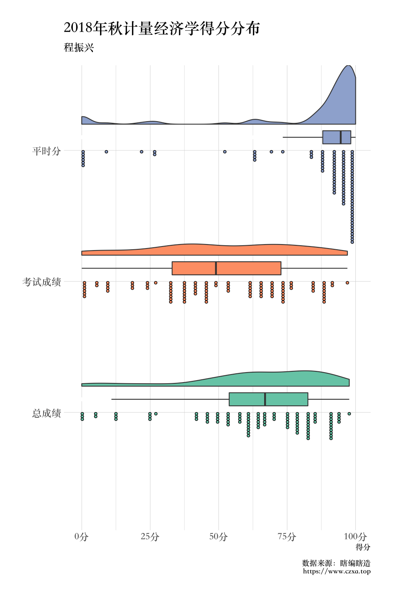

# 计量经济学课程的得分分布！

虽然计量的最终分数还没完全确定，我现在只有一个初稿，于是就画了幅`rainplot`。

只有平时分、考试分、按照四六开计算的总分的变量的数据集可以在这里下载：[econometrix_score.csv](https://czxb.github.io/br/econometrix_score.csv)。

```r
library(tidyverse)
library(gglayer)
df <- read_csv("econometrix_score.csv")
df %>% 
  mutate(
    id = 1:nrow(df)
  ) %>% 
  gather(homework, testscore, totalscore, 
         key = "type", value = "score") %>% 
  mutate(
    type = factor(type, levels = rev(c("homework", "testscore", "totalscore")),
                  labels = rev(c("平时分", "考试成绩", "总成绩")))
  ) %>% 
  ggplot(aes(x = type, y = score, fill = type)) + 
  geom_flat_violin(position = position_nudge(x = 0.2)) +  
  geom_dotplot(binaxis = 'y',
               stackdir = 'down',
               dotsize = 0.3) + 
  geom_boxplot(width = 0.1, position = position_nudge(x = 0.1),
               outlier.color = "white") + 
  guides(fill = "none") + 
  labs(y = "得分", title = "2018年秋计量经济学得分分布", 
       subtitle = "程振兴", caption = "数据来源：瞎编瞎造\nhttps://www.czxa.top") + 
  theme(axis.title.y = element_blank()) + 
  scale_fill_brewer(palette = 'Set2') +
  scale_colour_brewer(palette = 'Set2') +
  scale_y_continuous(
    breaks = seq(0, 100, by = 25),
    labels = formattable::suffix(seq(0, 100, by = 25), "分")
  ) + 
  coord_flip()
```



可见，我这个助教已经在平时分上尽力了！
