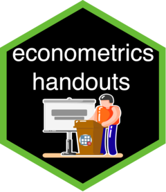

econometrics-handouts
========================================================

终于结束了一学期的助教工作，终究还是没有完全实现自己最开始的想法。实际教学中的感觉是：“言的多，而听者少”。尽管如此，还是比较完整的向同学们讲述了 Stata 在各个方面的使用方法。最后整理了一下这学期自己写的一些讲义文档，一共九份。涵盖了 Stata 基本使用、网络数据爬取、计量模型估计、绘图与修图几个方面。

1. Stata 安装教程：本讲义介绍了Stata14/15安装及Sublime Text3编辑器的配置。大家可能都觉得Sublime Text3的配置很麻烦，但是配置好之后真的极大地提高写代码的效率。
2. Stata 基本操作：本讲义介绍了Stata数据I/O、简单数据处理、绘图和一些统计检验的方法。其中还介绍了我的cuse数据库的使用方法，这个数据库里有书上的所有数据集，可以方便地调用书上的数据集。
3. 弹性、半弹性及其在 Stata 中的估计：本讲义介绍了介绍了弹性、半弹性的概念及其在Stata中的估计。着重介绍了margins命令的使用，以及如何根据估计结果的返回值绘制图表。值得注意的是半弹性的经济意义比较绕人。
4. Stata 网页表格爬取示例：学习的最好方法是在实操中学习，本讲义以东方财富网爬取为例讲解如何使用Stata作为爬虫工具。爬虫程序无非就是数据请求和数据处理。而数据处理又以字符串处理为主。学好了数据爬取基本上等于学好了数据处理。
5. Stata 修图与操作记录：Stata初学者甚至是所谓的熟练使用者在使用Stata绘图时都会感到头疼，因为Stata的绘图选项实在是好多，很难记忆，所以为了让大家在需要绘图的时候能够自由地绘制出美丽的图表，这篇讲义讲述了如何使用Stata手动修图并保存修图记录。
6. Stata15比起前代的Stata的一个巨大的进步就是能够非常好的处理docx文档了，得益于此，我们实际可以像R+RMarkdown那样直接在Stata中创建docx文档，同时一些非常方便的外部命令让我们能够很方便地将各种估计结果导出到word文档里。另外这里面还有第一次作业的参考答案。
7. 计量经济学第四章习题讲解（包含在Stata与docx文档的协同里）。
8. 计量经济学第6、7章习题讲解。
9. 计量经济学第9章习题。
10. 计量经济学第10、12章习题。
