--- 
title: "计量经济学与 Stata 的应用讲义"
author:
- affiliation: 暨南大学·经济学院·金融学
  name: 程振兴
documentclass: ctexbook
bibliography: [book.bib]
biblio-style: apalike
link-citations: yes
colorlinks: yes
lot: no
lof: no
geometry: [a4paper, tmargin=2cm, bmargin=2cm, lmargin=2cm, rmargin=2cm]
site: bookdown::bookdown_site
description: "计量经济学与 Stata 的应用讲义"
github-repo: czxa/econometrics-handouts
output:
  bookdown::gitbook:
    includes:
      after_body: valine.html
---

```{r setup, include=FALSE}
options(
  htmltools.dir.version = FALSE, formatR.indent = 2, width = 55, digits = 4
)

# 填上你需要用到的包，如 c('ggplot2', 'dplyr')
lapply(c('ggplot2', 'dplyr', 'tidyverse', 'magrittr', 'knitr'), function(pkg) {
  if (system.file(package = pkg) == '') install.packages(pkg)
})
library(tidyverse)
library(ggplot2)
```

# 前言

这是 2018 年下半年我在担任张宁老师的计量经济学助教的时候写的讲义，由于我主要负责 Stata 部分的教学，所以本讲义的主要内容集中于 Stata 的应用。

## 本书内容

本书主要有六个部分：

第一部分，Stata 的安装与代码编辑器的配置。

第二部分，Stata 的基本操作。

第三部分，Stata 的应用 —— 弹性和半弹性的计算。

第四部分，Stata 的应用 —— 爬取[东方财富网 CPI 数据](http://data.eastmoney.com/cjsj/cpi.html)。

第五部分，Stata 修图与操作记录。

第六部分，Stata 与 docx 文档的协同。

## 阅读本书之前的准备工作

首先你需要在你的 Windows 上或者 Mac 上安装 Stata15，由于作者的电脑是 Mac 系统，所以本书的内容尚未在 Windows 上测试。如果你运行出错，请联系作者。

## 目标读者

本书的目标读者是经济和金融专业的本科同学（毕竟作者也只是个渣渣本科）。读者并不需要有 Stata 的基础，但是建议读者对 Stata 的使用有一定的了解（例如知道在哪写代码，怎么运行）。

## 排版约定

在本书中，你会发现一些不同的文本样式，用以区别不同种类的信息，这里举例说明一些样式，以及它们的含义：

代码的输入和输出格式如下：

```stata 
* 导入系统数据集
clear all
sysuse auto, clear
*> (1978 Automobile Data)
```

`*` 开头的行为注释。`*>`开头的行为运行结果。

**新术语**和**重要的词**用黑体表示。

## 下载示例代码

本书的代码开源在 GitHub 上，你可以从这里下载：[econometrics-handouts](https://github.com/czxa/econometrics-handouts)。

## 许可证

本书是一本开源书籍，使用 [Creative Commons Attribution-NonCommercial-NoDerivs 3.0](http://creativecommons.org/licenses/by-nc-nd/3.0/us/) 许可证。这意味着：

```{r cca, echo=FALSE, fig.align='center', fig.cap = 'Creative Commons Attribution-NonCommercial-NoDerivs 3.0 协议要点', out.width='90%', fig.align='center'}
knitr::include_graphics('assets/license.png')
```

如果你想支持作者的工作，欢迎前往[作者的网站](https://www.czxa.top)对作者进行打赏。你的支持将会促使作者更加及时地改进这本书。

## 读者反馈

欢迎读者的反馈。你对本书有任何想法，喜欢或者不喜欢什么，请告知我。你可以在下面的评论区里评论，如果你阅读的是 PDF 版本，你可以前往 [econometrics-handouts](https://github.com/czxa/econometrics-handouts) 创建 issues。

<!--chapter:end:index.Rmd-->

\mainmatter
# Stata 安装与 Sublime Text3 配置教程

这篇文章介绍了 Stata14、Stata15 和 Sublime Text3 的安装及配置。

## Stata 安装包获取

网上关于 Stata 安装包的资源很多，建议自行获取。

为了方便（实际上是我懒得卸载自己电脑上的 Stata 了），本文仅介绍如何在 Windows 系统上安装 Stata14 和 Stata15，最后作为补充，介绍如何安装和配置一款非常好用的 Stata 代码编辑器——Sublime Text。当然 Stata 的代码编辑器还是不止一个的，另一个非常好用的代码编辑器是 Atom，不过实际上一个编辑器是否支持 Stata 在于有没有大佬编写一个把代码发送给 Stata 执行的插件。

## Stata14 的安装
之所以有了 Stata15 还是想介绍一下 Stata14，是因为很多人（包括我）学习 Stata 的时候是使用的 Stata14，所以有时候还不是很习惯 Stata15 里面的一些东西。另外就 MP 版本的 Stata 来说，暂时我只找到了 Stata14MP（并行版本的 Stata，价格最为昂贵且速度最快），Stata15 暂时只有 SE 版本（特别版本）和 IC 版本（最慢的版本）。大部分时候 SE 版本是能满足使用需求的。

### Windows OS
下面就正式开始介绍 Stata14MP 的安装过程吧！

+ 第一步，点击打开 exe 文件：


+ 第二步，接受许可协议：


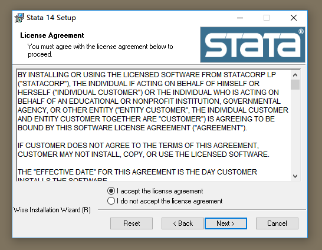

+ 第三步，不需要修改改任何东西：


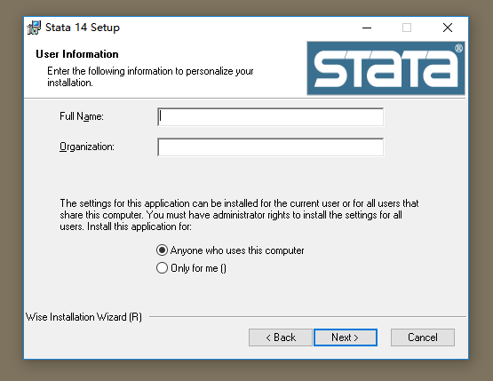

+ 第四步，选择版本。由于序列号是 MP 版本的，所以选择 MP：


+ 第五步，设定你的 Stata 的安装目录，**注意：一定要记住这个安装目录的路径！**


+ 第六步，Next：


+ 第七步，Next：


+ 第八步，正在安装中：


+ 第九步，安装完成：


+ 第十步，找到刚刚的安装目录，按照图中的方法创建桌面快捷方式：


+ 第十一步， 把共享文件夹里面一个名为 stata.lic 的文件复制粘贴到安装目录里面，然后双击刚刚在桌面新建的快捷方式打开 Stata，你会看到下面的错误信息：


+ 不过完全不用担心，点击`OK`然后点击`下一步`：


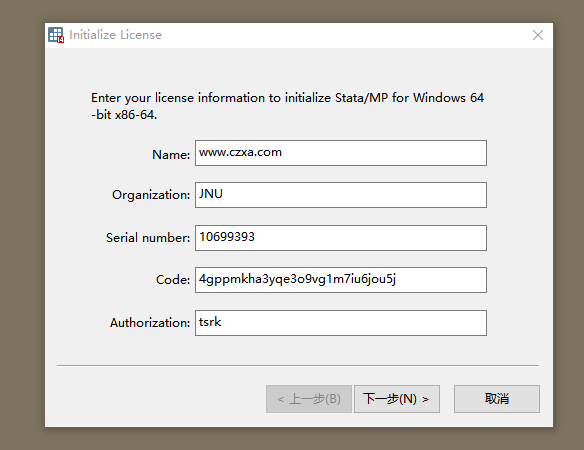

+ 注意这一步里面记得取消`Register Stata online`：


+ 最后，安装完成，记得选择`Disable automatic update checking`，因为它很烦人：


+ 然后，我们可以运行一个简单的更新命令：

```stata
update all
```
你会发现运行出错，这就说明！这个 Stata 是盗版的！所以别声张！


### Mac OS

Mac OS 上安装 Stata14 比 Windows 上的安装要简单很多，因此我不再赘述。下面仅仅展示一下 Mac 版本的 Stata14：


另外 Mac 版本的 Stata14 可以非常方便的更改工作目录：


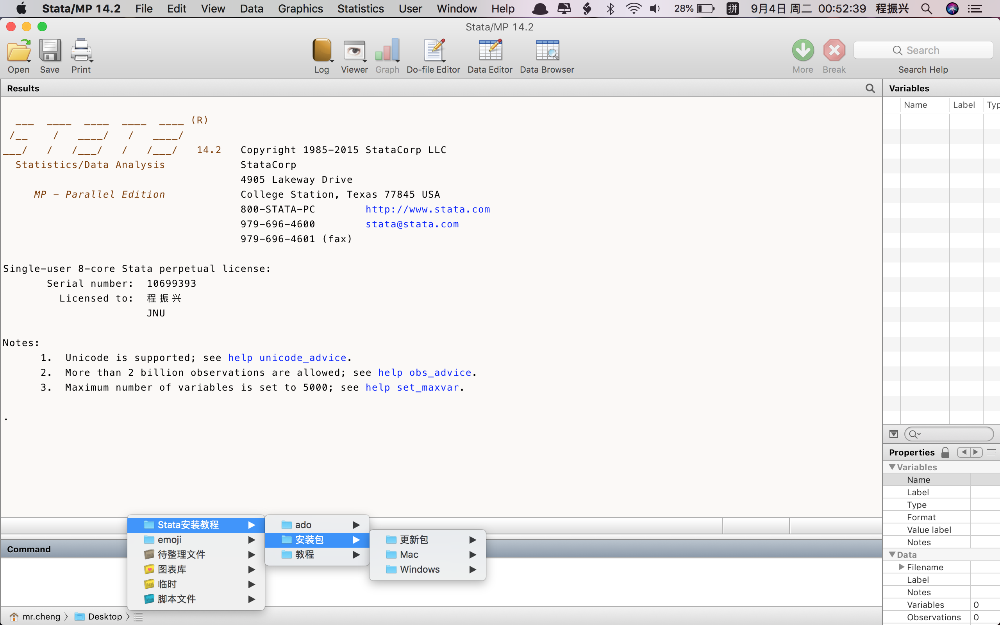

## Stata15 的安装
### Windows OS

Stata15 的安装过程和 Stata14 的基本一样：
+ 第一步，点击打开 exe 文件：


+ Next：


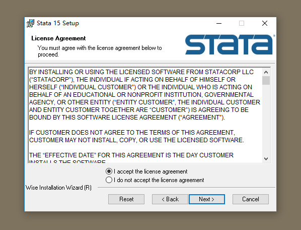


+ 注意！这里要选择 SE：


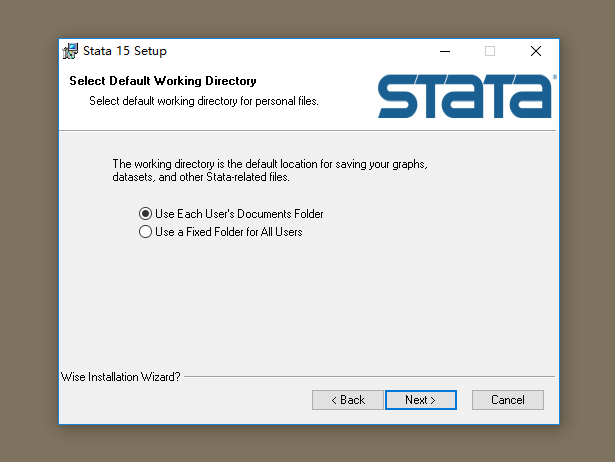


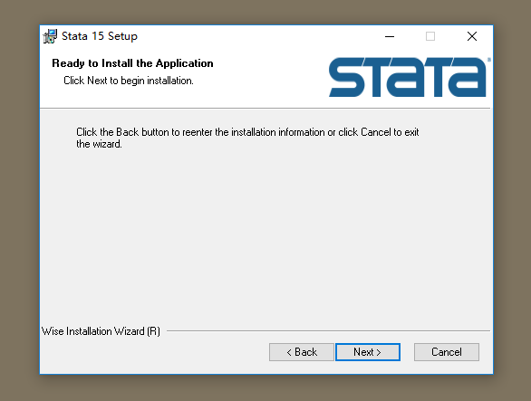


+ 另外，如果你忘记关闭自动检查，可以使用如下操作关闭：


### Mac OS

同样，这里仅仅展示 Mac 版本的 Stata15SE：


此外 Mac 版本的 Stata 还支持在终端使用（刚刚的 Stata14 也支持），首先需要安装终端工具：


然后打开终端，输入`stata-se`回车：


是不是非常酷！当然不仅仅是酷，这个功能极大的拓展了 Stata 的能力！

## Stata 代码编辑器的配置

同样，这里只详细介绍 Windows 系统上的安装和配置，Mac 系统的安装配置流程相似且更加简单。（以连接 Stata15 为例）

### Windows OS

#### 安装与配置

首先到 Sublime Text3 的官网下载最新版本的 Sublime Text3，官网地址为：[Sublime Text3](https://www.sublimetext.com/)，Windows 版本的下载连接为：[Windows 64 bit](https://download.sublimetext.com/Sublime%20Text%20Build%203176%20x64%20Setup.exe)
+ 下载完成后点击打开，记得勾选这个：


+ 安装完成之后的界面如下（我打开了一个 Stata 的 ado 文件），点击 Tools => Install Package Control，这个会安装一个包控制工具：


+ 稍等片刻即安装完成（注意电脑要联网）：


+ 下面我们需要安装一些包。选择 Preferences => Package Control：


+ 选择 Install Packages：


+ 然后在输入框里输入 pywin32 点击安装这个插件


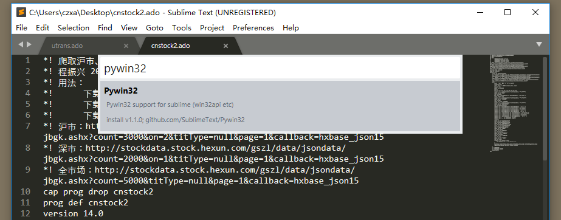

+ 稍等片刻即可安装完成，同样的方式安装 StataEditor 和 ChineseLocalizations 插件，第二个插件是一个汉化的插件：


+ 接下来配置 StataEditor 插件，把 Setting-Default 中的内容复制粘贴到 Setting-User 中：


+ 然后在 Setting-User 中改动如下内容：


为（这里修改的是你的 Stata 的安装位置、版本和字符编码，前面两个要结合你的实际情况）


+ 配置完成之后点击右下角会弹出一个选择框，从框中找到 Stata 选中，然后你就会发现代码变成彩色的了！这就是代码高亮。


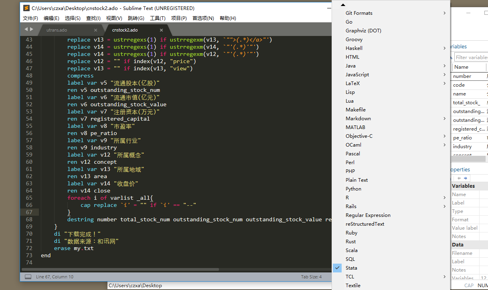

+ 不过现在的代码还是不能直接运行，我们还需要继续进行下面的操作：

* 按 Ctrl+\`(注意这个键是半角输入模式下的制表符上面的那个键)打开命令窗口输入下面这段代码：


* 这段代码来自这里：[点击跳转](https://packagecontrol.io/installation)

* 回车运行完之后再次 Ctrl+\` 关闭命令窗口即可。

* 最后我们再去到 Stata15 的安装位置，右键 **StataSE-64.exe** 创建快捷方式，然后右键点击刚刚创建的快捷方式选择属性打开做如下修改，也就是在目标的最后加上`/Register`：


* 再点击**高级**勾选：


* 确定所有，回到安装位置，右键快捷方式选择以管理员的身份运行，然后可以了。


运行完之后你就会发现这个快捷方式无法启动 Stata 了，重新新建一个快捷方式即可。

#### 使用演示

* 关掉 Sublime，首先新建一个 do 文档（建立方法是新建一个 txt 文档然后把扩展名改为 do 即可）

* 现在它的默认打开方式是 Stata，我们右键打开属性修改一下：


* 然后点击确定就可以了。

* 打开它！我写了一个比较规范的 do-file：


我的注释是绿色的，是我自己调的色。

* 我们要记住的第一个快捷键就是：`Ctrl+D`——运行全部或选中的代码。

+ 选择实力文件夹中的所有代码，然后按`Ctrl+D`即可绘制出一副太极八卦图了：


#### 太极八卦图的绘制代码

```stata
clear
* 安装绘图主题
ssc install blindschemes, replace all
* 设置绘图主题为 plotplain
set scheme plotplain

set obs 500
gen x = runiform(0, 0.6)
gen y1 = sqrt(0.352 - x^2)
gen y2 = -sqrt(0.352 - x^2)
tw ///
scatteri 0 0, msymbol(O) msize(*60) mcolor(black) || ///
scatteri 0 0, msymbol(O) msize(*56) mcolor(white) || ///
scatteri 0 0, msymbol(O) msize(*54) mcolor(black) || ///
scatteri 0 0, msymbol(O) msize(*50) mcolor(white) || ///
scatteri 0 0, msymbol(O) msize(*48) mcolor(black) || ///
scatteri 0 0, msymbol(O) msize(*44) mcolor(white) || ///
pci 0 0 -1 -0.03, lc(white) lw(*2) || ///
pci 0 0 -1 0, lc(white) lw(*6) || ///
pci 0 0 -1 0.03, lc(white) lw(*2) || ///
|| ///
pci 1 -0.4142 -1 0.4142, lc(white) lw(*12) || ///
pci 1 -0.38 -1 0.38, lc(white) lw(*4) || ///
pci 1 -0.49 -1 0.49, lc(white) lw(*4) || ///
|| ///
pci 0 0 -0.63 0.66, lc(white) lw(*3) || ///
pci 0 0 -0.61 0.66, lc(white) lw(*3) || ///
pci 0 0 -0.59 0.665, lc(white) lw(*3) || ///
|| ///
pci 0.65 -0.65 0.75 -0.75, lc(white) lw(*3) || ///
pci 0.635 -0.635 0.7 -0.7, lc(white) lw(*3) || ///
pci 0.63 -0.666 0.68 -0.72, lc(white) lw(*5) || ///
|| ///
pci 0.45 -1 -0.45 1, lc(white) lw(*5) || ///
pci 0.4 -1 -0.4 1, lc(white) lw(*6) || ///
pci 0.35 -1 -0.35 1, lc(white) lw(*8) || ///
|| ///
pci 0 -0.9 0 -0.8, lc(white) lw(*8)|| ///
pci 0 0.7 0 0.8, lc(white) lw(*8)|| ///
pci 0 0.9 0 1, lc(white) lw(*8)|| ///
|| ///
pci -1 -0.4142 1 0.4142, lc(white) lw(*16) || ///
|| ///
pci -0.75 -0.75  -0.57 -0.57, lc(white) lw(*8) || ///
pci 0.5 0.5  0.56 0.56, lc(white) lw(*8) || ///
|| ///
pci -0.45 -1 0.45 1 , lc(white) lw(*16) || ///
|| ///
scatteri 0 0, msymbol(Oh) msize(*36) mcolor(black) || ///
rarea y1 y2 x, sort fc(black) lc(black) fi(inten100) || ///
scatteri -0.292 0, msymbol(O) msize(*17.5) mcolor(black) || ///
scatteri 0.292 0, msymbol(O) msize(*17.5) mcolor(white) || ///
scatteri 0.292 0, msymbol(O) msize(*4) mcolor(black) || ///
scatteri -0.292 0, msymbol(O) msize(*4) mc(white) || ///
||, leg(off) xla(-1(2)1, nogrid format(%6.0f) labc(white) ///
tlc(white)) xsc(lc(white)) yla(-1(0.1)1, nogrid) ///
aspect(1) ysc(off) xti(" ")
gr export 太极八卦图.png, width(1800) height(1200)

```

### Mac OS

Mac 上的安装配置更加简单。不再介绍。

## 常用 shell/Dos 命令安装
shell 和 Dos 分别是 Mac/Linux 和 Windows 上对命令解释器的称谓。Stata 的一个最常见的拓展使用就是调用 shell 命令和 Dos 命令。为了简单，下面统称为 shell 命令。在 Windows 系统上，Dos 命令可以在 cmd——命令提示符中运行，而 shell 命令可以在 Mac 的终端中运行。Stata 可以通过`!`或者 shell 调用这些工具。其中最常用的莫过于`curl`命令了。这款命令非常强大，可以模拟浏览器操作。在使用 Stata 爬数据的时候经常使用。这里介绍一下如何安装这款工具。

### Windows OS

- 首先打开命令提示符,输入`where powershell`找到 powershell.exe 的位置, 然后找到它右键选择以管理员身份打开. 然后就会弹出来一个蓝色的命令行界面.
- 然后可以安装一个包管理工具 choco(这里参考了这篇文章[《在 windows 下使用 choco 作为包管理工具》](https://www.jianshu.com/p/be19a2bebc48)). 在以管理员身份打开的 powershell 里依次输入下面几句命令:

```bash
Set-ExecutionPolicy RemoteSigned
* 安装choco
iwr https://chocolatey.org/install.ps1 -UseBasicParsing | iex
* 安装curl
choco install curl
```

这样你就安装好了 Windows 下一款非常好用的包管理工具，此外，你如果想安装其他命令，可以在这个网站检索：[https://chocolatey.org/packages](https://chocolatey.org/packages)。推荐安装`wget`和`axel`，这两个是非常好用的下载工具。`axel`是个多线程下载工具，下载电影什么的都不是问题。

+ 另外有时候也会用到 tr 命令和 sed 命令：这两个命令的下载链接分别为：

tr：[http://bcn.bathome.net/tool/tr.exe](http://bcn.bathome.net/tool/tr.exe)

sed：[http://bcn.bathome.net/tool/4.7/sed.exe](http://bcn.bathome.net/tool/4.7/sed.exe)

推荐大家一个非常全的批处理命令库：http://www.bathome.net/s/tool/

注意上面下面的命令都不是双击安装的，把下载到的 exe 文件放入`C:\Windows\System32`即可全局使用。

### Mac OS
如果你是 Mac 用户，那你非常幸运，因为上面提到的 curl、tr 和 sed 都是自带的。

## Stata 更新
Stata 公司定期会出更新包修复一些 Bug 或者添加一些新的功能，及时更新 Stata 也是有必要的。由于我们的 Stata 是盗版的，所以只能采取离线更新。即首先下载离线更新包，然后更新：
离线更新包的下载地址为[https://www.stata.com/support/updates/](https://www.stata.com/support/updates/)，为了方便大家更新，我这里直接给出各个版本的下载链接

**[stata15update_win.zip](https://www.stata.com/support/updates/stata15/stata15update_win.zip)**

**[stata15update_mac.zip](https://www.stata.com/support/updates/stata15/stata15update_mac.zip)**

**[stata14update_win.zip](https://www.stata.com/support/updates/stata14/stata14update_win.zip)**

**[stata14update_mac.zip](https://www.stata.com/support/updates/stata14/stata14update_mac.zip)**

下载完成之后会得到一个 zip 文件，解压。

下面打开 Stata（根据你的 Stata 版本选择更新包即可）：
在 Command 窗口输入`db update`并回车，会弹出这个窗口：


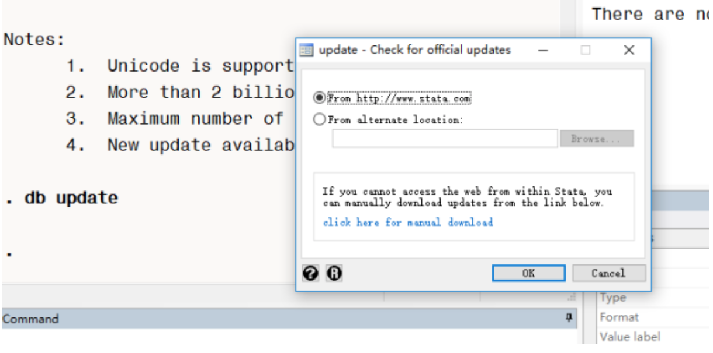

然后选择 From alternate location => Browse => 确定：


点击 OK 即可进入更新：


选择 Yes：


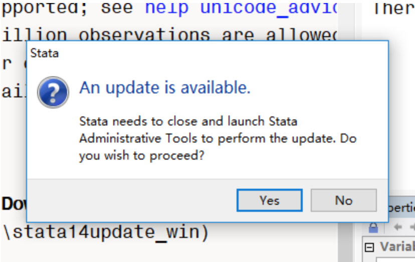

然后等待片刻即可更新成功：


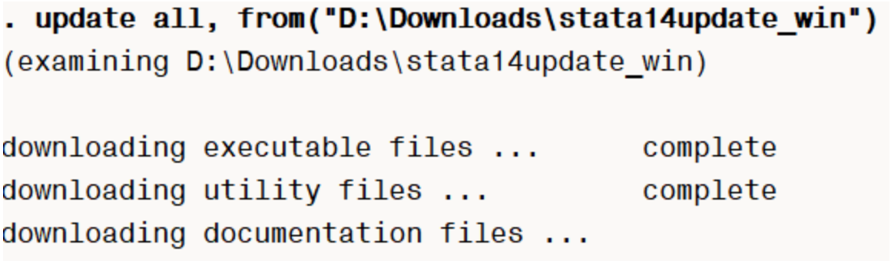

<!--chapter:end:01-install.Rmd-->

# Stata 基础操作

## Stata 是什么
根据 Stata 对自己的介绍：

> 1. Stata is a statistical package for managing, analyzing, and graphing data.
> 2. Stata is available for a variety of platforms. Stata may be used either as a point-and-click application or as a command-driven package.
> 3. Stata’s GUI provides an easy interface for those new to Stata and for experienced Stata users who
wish to execute a command that they seldom use.
> 4. The command language provides a fast way to communicate with Stata and to communicate more complex ideas.

也就是说， Stata 是一个集数据管理、分析和可视化的工具。可以在各种操作系统中使用，可以通过鼠标点击操作也能通过命令行驱动。

Stata 的图形用户界面让新手们很方便入门，Stata 的命令语言使得很多复杂的想法变得容易实现。

我经常看到很多 R、Python、Matlab 用户对 Stata 非常不屑一顾。每每提及 Stata 总是要加一句：

> "如果 Stata 也算编程语言的话······"

我也常听一些没有接触过编程的朋友对 Stata 望而却步，他们常说：

> "虽然看不懂，但是觉得很厉害的样子。"

所以 Stata 是什么？在 Stata 中运行 `help class` 命令你就可以看到下面的一段介绍：

> Stata's two programming languages, ado and Mata, each support object-oriented programming.  [P] class explains object-oriented programming in ado.  Most users interested in object-oriented programming will wish to do the programming in Mata.  See [M-2] class to learn about object-oriented programming in Mata.

Stata 是套体系完整的面向对象的编程语言。两种编程语言，**ado** 和 **Mata** ，第一种较为常用，第二种更为强大。

## Stata 能做什么

1. 数据获取与处理；
使用 Stata 可以比较快速的获取多种数据并迅速整理成研究者所需要的数据。
2. 精美统计图形绘制与导出。
Stata 的绘图系统是相当完整的。通过绘图主题的选择，Stata 作图也可以非常的精美。
3. 严谨可重复的实证研究。

在熟练使用 Stata 之前，你的论文原材料可能是这样的（图 \@ref(fig:dirtydir) 并不是论文的原材料，是我随便截的，只是想表达乱）：

```{r dirtydir, echo=FALSE, fig.align='center', fig.cap = '一个乱七八糟的文件夹', out.width='90%'}
knitr::include_graphics('assets/dirtydir.png')
```

在此之前可能你的主要数据处理工具是 Excel ，并且还不会 Excel VBA ，所以经常会整夜整夜的复制粘贴。而这些工作实际上用几行 Stata 语句就能完成。

那你用熟练了 Stata 之后你的论文数据是什么样的呢？（假如你是一个像我一样的强迫症患者）

```{r cleandir, echo=FALSE, fig.align='center', fig.cap = '一个整洁的项目文件夹', out.width='90%'}
knitr::include_graphics('assets/cleandir.png')
```

这个文件夹的目录结构是：
```shell
.
├── ADO
│   ├── carryforward.ado
│   ├── carryforward.hlp
│   ├── estadd.ado
│   ├── estadd.hlp
│   ├── esttab.ado
│   └── esttab.hlp
├── DATA
│   ├── beta.csv
│   └── mydata.dta
├── DO
│   ├── 表2-1-描述性统计表.do
│   ├── 表3-1-模型估计结果.do
│   ├── 图3-1-每个月份的风险暴露变化对股票流动性影响的差异.do
│   ├── 表3-2-模型估计结果.do
│   ├── 图3-2-每个年份风险暴露变化对股票流动性影响的差异.do
│   ├── 表4-1-稳健性检验结果.do
│   └── 设定绘图主题.do
├── DOCS
│   └──  风险暴露的变化对股票流动性的影响.pdf
├── IMAGE
│   ├── 年份效应.png
│   └── 月份效应.png
├── 主程序.do
└── 参考文献
    └── 110228635.pdf
```

在用 Stata 之前，每次画图你可能都要在 Excel 上面点击无数次。而用 Stata 之后，即使是下面这样复杂的图，你只需要一行命令就能绘制出来：

```{r sci, echo=FALSE, fig.align='center', fig.cap = '上证指数蜡烛图', out.width='90%'}
knitr::include_graphics('assets/stkpv4.png')
```

此外，如果你还会一些数据库或其它编程软件，Stata 能够很好的和它们交互使用。

如果说 Stata 不是最好的，我觉得 Stata 是做实证研究的最好工具。

1. Stata 作为商业软件，有着专业且负责的团队维护。所以 Stata 的帮助文档是最让人喜爱的，这些也是很多开源软件无法比拟的。
2. Stata 的速度相对较快，Stata 的启动速度远快于 Matlab、SAS 这些软件，且对电脑硬件要求较低，这是非常重要的，如果你想用一个软件，然后打开它就要等待几分钟。那我想你可能很快就烦了。另外 Stata 运行的速度也足够快。可以满足大多数用户的需要。
3. Stata 提供了很多可以把统计表格导出到 Word、PDF 和 Tex 文档的命令。实际上 Stata15 的 putdocx 命令搭配其它的一些命令可以直接实现论文的编排。

我想以上的每一条都足以成为大家认真学习 Stata 的理由。

下面就让我们进入 Stata 的世界吧！

## Stata 基本操作
### Stata 系统文件夹
运行 `sysdir` 命令即可得到 Stata 的系统文件夹列表：

```stata 
sysdir
*>    STATA:  /Applications/Stata15/
*>     BASE:  /Applications/Stata15/ado/base/
*>     SITE:  /Applications/Stata15/ado/site/
*>     PLUS:  /Users/czx/Library/Application Support/Stata/ado/plus/
*> PERSONAL:  /Users/czx/Library/Application Support/Stata/ado/personal/
*> OLDPLACE:  ~/ado/
```

* `BASE` 文件夹包含了 Stata 官方的 ado 文件；
* `PERSONAL` 文件夹可以放置你自己的 ado-files；
* `PLUS` 文件夹在你下载外部命令时会被自动创建。

另外运行 `adopath` 也可以得到：

```stata 
adopath
*>  [1]  (BASE)      "/Applications/Stata15/ado/base/"
*>  [2]  (SITE)      "/Applications/Stata15/ado/site/"
*>  [3]              "."
*>  [4]  (PERSONAL)  "/Users/czx/Library/Application Support/Stata/ado/personal/"
*>  [5]  (PLUS)      "/Users/czx/Library/Application Support/Stata/ado/plus/"
*>  [6]  (OLDPLACE)  "~/ado/"
```
`adopath` 命令的运行结果和 `sysdir` 基本相同，这里的排序也是 `Stata` 寻找 `ado` 文件的顺序。

### 数据导入
#### 导入系统数据集
系统数据集就是位于系统文件夹的数据集，这些数据集一般是一些示例数据集。导入系统数据集是使用 sysuse 命令，最有名的系统数据集要数 auto 数据集了：

```stata
sysuse auto, clear
```

这是个 1978 年的汽车数据集。这个数据集是这样的：

```{r auto, echo=FALSE, fig.align='center', fig.cap = '1978年汽车数据集', out.width='90%'}
knitr::include_graphics('assets/auto.png')
```

此外 sysuse 还可以用来查看所有的系统数据集：

```stata
sysuse dir
*>  .dta               cjd1617.dta        lifeexp.dta        reshape1.dta
*>  air2.dta           colorschemes.dta   lutkepohl2.dta     sandstone.dta
*>  airq.dta           countycode.dta     moneysupply.dta    sexratio.dta
*>  auto.dta           educ99gdp.dta      network1.dta       smoking.dta
*>  auto2.dta          fullauto.dta       network1a.dta      sp500.dta
*>  autornd.dta        ghanaage.dta       nhanes2f.dta       splotxmpl.dta
*>  bplong.dta         gnp96.dta          nlsw88.dta         stackxmpl.dta
*>  bpwide.dta         grunfeld.dta       nlswide1.dta       surface.dta
*>  brewmeta.dta       houseprice.dta     nlswork.dta        tsline1.dta
*>  cancer.dta         jd14151617xxb.dta  nlswork2.dta       tsline2.dta
*>  census.dta         jd141516cjd.dta    parent.dta         uslifeexp.dta
*>  child.dta          jd2017zsjh.dta     pop2000.dta        uslifeexp2.dta
*>  citytemp.dta       jdcourse2018a.dta  population.dta     voter.dta
*>  citytemp4.dta      lbw.dta            rate2.dta          xtline1.dta
```

使用 all 选项可以查看所有的：

```stata
sysuse dir, all
*>  .dta                  child.dta             network1a.dta
*>  __i10v2003.dta        china_map.dta         nhanes2f.dta
*>  __i10v2004.dta        citytemp.dta          nlsw88.dta
*>  __i10v2006.dta        citytemp4.dta         nlswide1.dta
*>  __i10v2007.dta        cjd1617.dta           nlswork.dta
*>  __i10v2008.dta        colorschemes.dta      nlswork2.dta
*>  __i10v2009.dta        countycode.dta        parent.dta
*>  __i10v2010.dta        echarts_worldmap.dta  pop2000.dta
*>  __i10v2011.dta        educ99gdp.dta         population.dta
*>  __i10v2012.dta        fullauto.dta          rate2.dta
*>  __i10v2013.dta        ghanaage.dta          reshape1.dta
*>  __i10v2014.dta        gini_prov.dta         sandstone.dta
*>  __i10v2016.dta        gnp96.dta             sexratio.dta
*>  __icd10.dta           grunfeld.dta          smoking.dta
*>  __icd10cm.dta         houseprice.dta        sp500.dta
*>  __icd10pcs.dta        icd9_cod.dta          splotxmpl.dta
*>  air2.dta              icd9_cop.dta          stackxmpl.dta
*>  airq.dta              jd14151617xxb.dta     surface.dta
*>  auto.dta              jd141516cjd.dta       tsline1.dta
*>  auto2.dta             jd2017zsjh.dta        tsline2.dta
*>  autornd.dta           jdcourse2018a.dta     uslifeexp.dta
*>  bplong.dta            lbw.dta               uslifeexp2.dta
*>  bpwide.dta            lifeexp.dta           voter.dta
*>  brewmeta.dta          lutkepohl2.dta        xtline1.dta
*>  cancer.dta            moneysupply.dta
*>  census.dta            network1.dta
```

#### 导入网络数据集

网络数据集是存放在 Stata 公司服务器上的一些数据集，通常也是一些示例数据集。例如导入 `lifeexp.dta` 数据集：

```stata 
webuse lifeexp, clear
*> (Life expectancy, 1998)
```

这是一个 1998 年预期寿命数据集，括号里面的内容是数据集的标签(`help label`)。

`webuse query`可以用来查看当前 webuse 指向的数据仓库地址：

```stata 
webuse query
*> (prefix now "http://www.stata-press.com/data/r15")
```

我还可以换个地址：

```stata
webuse set "https://czxa.github.io/cuse/c"
*> (prefix now "https://czxa.github.io/cuse/c")
```

这个网址是我的数据仓库下的一个名称为 c 的子文件夹，里面放置着 c 开头的数据集。设定好网址指向之后就可以调用该指向下的数据集了：

```stata
webuse cjd1617, clear
*> (金融学16和17年成绩单)
```

这是我们班同学 2016 和 2017 年的成绩单，为了保护隐私，我抹去了大家的姓名。
重新把 webuse 的指向的网址指向设定为默认网址，只需要运行下面的命令即可：

```stata 
webuse set
*> (prefix now "http://www.stata-press.com/data/r15")
```

#### 调用我的个人仓库里面的数据集

在实际数据处理过程中，有时候我们会需要一些常用的数据集，例如中国行政区划编码。如果每次我们都上网找然后再导入 Stata 进行整理，是不是太麻烦了？我们能不能像 sysuse、webuse 这样直接使用数据呢？所以我就写了这套  `cuse` 命令。这个命令里面包含了很多我经常使用的数据集，例如各省市的行政区号之类的。

运行下面的命令即可安装这个命令：

```stata 
github install czxa/cuse, replace
```

这个命令的使用方法是：

```stata
* cuselist可以用来查看数据库中包含的数据
cuselist
*> 【0】
*> ----------------------------------------------------------------------
*> 1.  000001.dta: 平安银行历史股票数据
*> 【a】
*> ----------------------------------------------------------------------
*> 1.  amricancellmapdata.dta: 美国蜂窝地图各个省份的位置坐标
*> 【c】
*> ----------------------------------------------------------------------
*> 1.  cellmapdata.dta: 中国蜂窝地图各个省份的位置坐标
*> 1.  countycode.dta: 中国各省市区县编号(即身份证前六位号码)
*> 2.  china_label.dta: 中国地图标签
*> 3.  china_map.dta: 中国地图数据
*> 4.  china_city_spatial_distance.dta: 中国地级地图数据集
*> 5.  china_province_spatial_distance.dta: 中国省级地图数据集
*> 6.  cjd1617.dta: 金融学16和17年成绩单
*> 7.  cpi.dta: 中国CPI2008/1-2017/11
*> 8.  countrysexratio.dta: knoema各国总人口性别比例数据
*> 9.  ctbc2.dta: 中债国债2002-2017年国债到期收益率
*> 10.  cnstockholiday.dta: 上交所与深交所休市日期
*> 11.  cnstockincome.dta:1989年-2017年所有上市公司的基本收入状况
*> ----------------------------------------------------------------------
*> 【d】
*> ----------------------------------------------------------------------
*> 1.  echarts_worldmap.dta: ECharts世界地图各国中英文名称对照
*> 【g】
*> ----------------------------------------------------------------------
*> 1.  gdpjdlj.dta: 中国GDP季度累计2006/第一季度-2017/第三季度
*> 2.  gini_prov.dta: 1995-2010中国各省份Gini系数
*> 【h】
*> ----------------------------------------------------------------------
*> 1.  huaihe.dta: 2017年淮河供暖政策对人预期寿命的影响模仿数据集
*> 2.  houseprice.dta: 中国百城房价数据集
*> ----------------------------------------------------------------------
*> 【j】
*> ----------------------------------------------------------------------
*> 1.  jdcourse2018a.dta: 2018年上半年暨南大学排课选课表
*> 2.  jd2017zsjh.dta: 暨南大学2017年各省招生人数
*> ----------------------------------------------------------------------
*> 【l】
*> ----------------------------------------------------------------------
*> 1.  life_expentancy.dta: 2010年中国各省市自治区人口出生时预期寿命
*> 【m】
*> ----------------------------------------------------------------------
*> 1.  moneysupply.dta: 2008/1-2017/11中国货币供应量M0M1M2
*> ----------------------------------------------------------------------
*> 【p】
*> ----------------------------------------------------------------------
*> 1.  pm10.dta: 2017年淮河供暖政策对人预期寿命影响的原始数据集
*> 2.  population.dta: 2010年中国各区县人口
*> 3.  population_prov.dta: 2002-2014年全国各省市年末人口
*> 4.  pjw.dta: 分城市人口、就业与工资(1990-2016)
*> ----------------------------------------------------------------------
*> 【s】
*> ----------------------------------------------------------------------
*> 1.  station.dta: 中国所有火车站车站代码
*> 2.  smoking.dta: 合成控制法的美国39个洲的香烟销售量数据集
*> 2.  sexratio.dta: knoema各国总人口性别比例数据
*> ----------------------------------------------------------------------
*> 【t】
*> ----------------------------------------------------------------------
*> 1.  titanic.dta: 泰坦尼克号生存数据集
*> 2.  tourism.dta: 旅游事业发展情况
*> ----------------------------------------------------------------------
*> 【书籍数据集】
*> 注意！如果你想调用的数据集的名字里含大写字母，你需要把它的首字母调成小写才能调用!
*> 1. 《计量经济学及Stata应用》——陈强著
*> 2. 《高级计量经济学及Stata应用》——陈强著
*> 3. 《An Introduction to Stata Programming, Second Edition》——Christopher F. Baum著
```

然后如果你想调用需要的数据集，使用 cuse 命令，这个命令的语法是：

> cuse filename , [<u>c</u>lear <u>w</u>eb <u>s</u>avetosystem]

下划线表明该选项可以简写为下划线部分。

+ <u>c</u>lear：清空当前数据集；
+ <u>w</u>eb：表示从网络读取数据，对我的电脑来说，这是个可选项，对于别人的电脑来说，这是个必选项。
+ <u>s</u>avetosystem 表示调用的同时把该数据集存入系统文件夹。

例如，假如我想调用 `grilic_small.dta` 数据集，使用下面的命令即可：

```stata 
cuse grilic_small, c w s
```

上面的命令就实现了把内存清空、从网络获取数据和存入系统文件夹三个操作，以后如果需要这个数据集，用 sysuse 也可以读取了：

```stata
sysuse grilic_small, clear
```

### 读入 dta 数据集

这个是最为常用的命令， use 命令。用来导入 Stata 的 dta 格式的数据集。

例如我想读取`grilic_small.dta`数据集，下面的命令即可：

```stata
* 首先把工作目录设置到这个数据集所在的文件夹
cd ~/Desktop/datasets
* 然后使用use命令读取该数据集
use grilic_small, clear
* 当然你也可以这么做，也就是路径+文件名
use ~/Desktop/datasets/grilic_small.dta, clear
* 但是不推荐。建议的工作流程是把所有的工作都在工作目录下进行。
```

### 读入 csv 数据集

csv 格式的数据集是逗号分隔的文本文件，可以直接用 Excel 打开。例如，我想读取 `pingan.csv` 文件，这个文件下载地址为：`https://czxb.github.io/mr/pingan.csv` 。

Stata 的 copy 命令可以被用来下载文件：

```stata
copy "https://czxb.github.io/mr/pingan.csv" pingan.csv, replace
```

然后你就能在你的工作目录里面发现这个文件了。如果你不清楚你的工作目录在哪里，可以运行下面的命令：

```stata
pwd
*> /Users/czx/Desktop
```

然后我们把这个 csv 文件读入 Stata：

```stata
import delimited using pingan.csv, clear
```

此外，你还可以通过 GUI (图形用户界面) 导入：

```{r csvgui1, echo=FALSE, fig.align='center', fig.cap = 'Stata 通过 GUI 导入 csv 数据(1)', out.width='90%'}
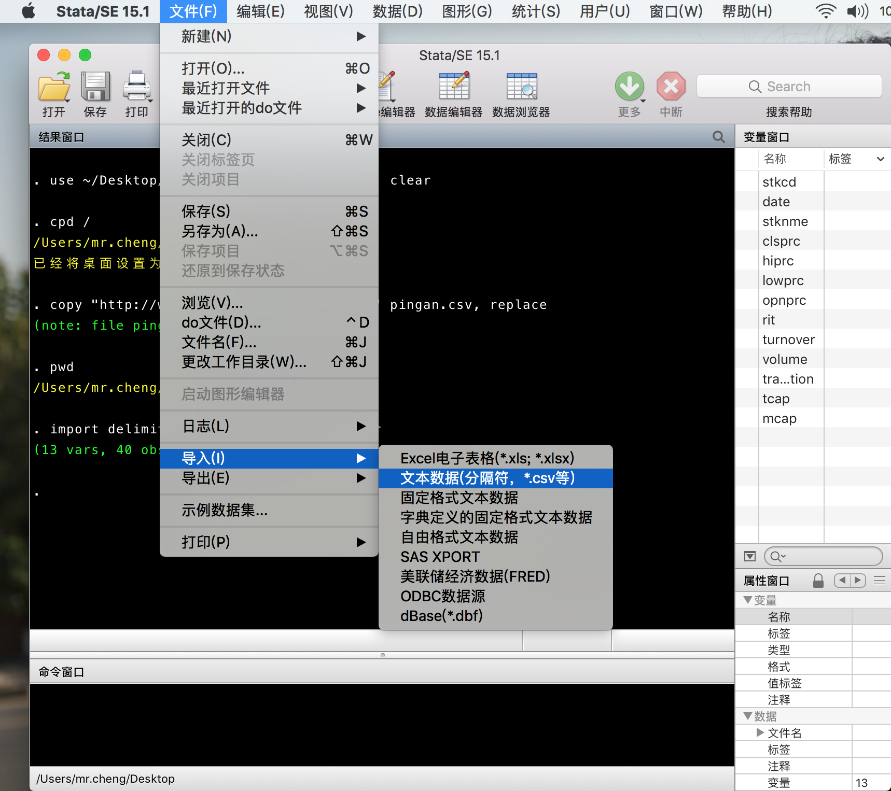
```

稍等片刻，在对话框里进行选择，然后提交即可：

```{r csvgui2, echo=FALSE, fig.align='center', fig.cap = 'Stata 通过 GUI 导入 csv 数据(2)', out.width='70%'}
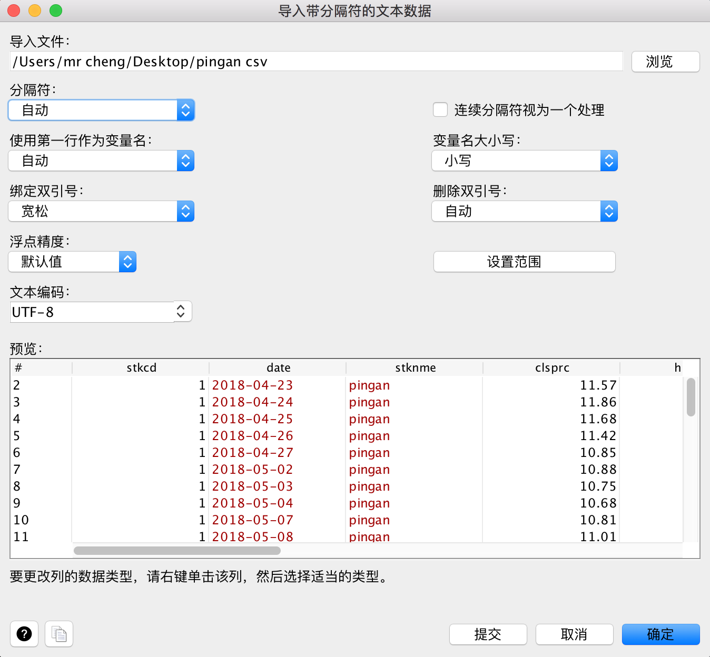
```

为了保存这个操作，我们最好把这个提交动作的命令复制粘贴到我们的 do 文档里面：

```stata
import delimited /Users/czx/Desktop/pingan.csv, ///
    delimiter(comma) varnames(1) encoding(utf8) clear
```

### 读入 xls、xlsx 数据

这两种格式的数据是 Excel 的数据，例如我想导入 `grilic_small.xls` 数据集：

```stata
* 首先用copy下载：
copy "https://czxb.github.io/mr/grilic_small.xls" grilic_small.xls, replace
import excel using grilic_small.xls, clear firstrow
```

`firstrow` 表示设定第一行为变量名。

同样导入 Excel 文件也能通过界面鼠标点击操作。

### 导入自由格式的 txt 文件

下面我要介绍的这种是在使用 Stata 爬数据的时候最为常用的一种方法了。

假如我想爬东方财富网的采购经理人指数：网址是：[中国 采购经理人指数（PMI）](http://data.eastmoney.com/cjsj/pmi.html)。那么第一步就是我的把这个网页读入 Stata，下面的命令就可以实现了：

```stata
* 首先把这个网页下载存储为temp.txt文件：
copy "http://data.eastmoney.com/cjsj/pmi.html" temp.txt, replace
* 然后读入Stata，把每一行的前20000个字符（可以确定是整行了）读入strL格式的变量v。
infix strL v 1-20000 using temp.txt, clear
```

然后你会发现这个变量 v 里面的有些观测值是乱码的，这是因为这个网页文件不是 `UTF-8` 编码的，所以需要先把这个 `temp.txt` 文件转一下码。 Stata 中的转码命令是：

```stata
unicode encoding set gb18030
unicode translate 文件名.后缀名
unicode erasebackups, badidea
```

所以我们把这个 temp.txt 文件转个码再读如 Stata 中：

```stata
* 首先清空内存，这个清空是非常彻底的清空。
clear all
copy "http://data.eastmoney.com/cjsj/pmi.html" temp.txt, replace
unicode encoding set gb18030
unicode translate temp.txt
unicode erasebackups, badidea
infix strL v 1-20000 using temp.txt, clear
```

然后就会发现乱码问题得到了解决。
Stata14 之前的版本创建的数据集读入 Stata14、15 都是需要转码的，都可以用这三句命令完成。

但是每次都打这三句是不是非常麻烦？所以我简单把这三句封装成了一个小命令`utrans`。
这个命令位于我的 finance 命令包中，安装 finance 包即可安装这个命令：

```stata
github install czxa/finance, replace
```

然后上面的转码只需要`utrans + 文件即可完成`：

```stata
utrans temp.txt
*> 转码完成
```

## 数据处理

当我们把数据读入之后就能进行数据处理了。数据处理的熟练程度直接决定了你写论文的速度。这里介绍一些常用的 Stata 处理数据的命令。

### describe：审视数据
这个命令可以被简写为`des`。建议初学者不要立即使用简写，以免后来记不住命令的全称。

```stata
sysuse auto, clear
*> (1978 Automobile Data)

des
*> Contains data from /Applications/Stata/ado/base/a/auto.dta
*>   obs:            74                          1978 Automobile Data
*>  vars:            12                          13 Apr 2016 17:45
*>  size:         3,182                          (_dta has notes)
*> ----------------------------------------------------------------------
*>               storage   display    value
*> variable name   type    format     label      variable label
*> ----------------------------------------------------------------------
*> make            str18   %-18s                 Make and Model
*> price           int     %8.0gc                Price
*> mpg             int     %8.0g                 Mileage (mpg)
*> rep78           int     %8.0g                 Repair Record 1978
*> headroom        float   %6.1f                 Headroom (in.)
*> trunk           int     %8.0g                 Trunk space (cu. ft.)
*> weight          int     %8.0gc                Weight (lbs.)
*> length          int     %8.0g                 Length (in.)
*> turn            int     %8.0g                 Turn Circle (ft.)
*> displacement    int     %8.0g                 Displacement (cu. in.)
*> gear_ratio      float   %6.2f                 Gear Ratio
*> foreign         byte    %8.0g      origin     Car type
*> ----------------------------------------------------------------------
*> Sorted by: foreign
```

### list：列示数据

这个命令有两种用法，第一种是列示某些变量，第二种是列示某些观测值：

```stata
* 列示整个数据表
list

* 列示变量price和make
list price make

* 列示所有变量的第5-10个观测值
list in 5/10

* 列示变量price和make的最后一个观测值
list price make in -1

* 列示price大于10000的部分
list price if price > 10000
```

### gsort/order：排序

sort 命令正在被逐渐弃用。gsort 用于观测值的排序，order 用于变量的排序。

```stata
* 把price按照由低到高的顺序排列
gsort price

* 把price按照由高到低的顺序排列
gsort -price

* 先排rep78再排price
gsort rep78 -price
```

### codebook：描述变量的基本信息

```stata
codebook
codebook price
*> --------------------------------------------------------------------------
*> price                                                               Price
*> --------------------------------------------------------------------------
*> 
*>                   type:  numeric (int)
*> 
*>                  range:  [3291,15906]                 units:  1
*>          unique values:  74                       missing .:  0/74
*> 
*>                   mean:   6165.26
*>               std. dev:    2949.5
*> 
*>            percentiles:        10%       25%       50%       75%       90%
*>                               3895      4195    5006.5      6342     11385
```
从上面的结果中可以看到：
1. price 变量为数值型变量；
2. 范围在 [3291,15906]；
3. 有 74 个观测值，互不相同且没有缺失值；
4. 均值为 6165.26，标准差为 2949.5；
5. 分位数看起来是合理的。

### generate：生成新变量

这个命令可以简写为`gen`。

```stata
* 例如我想生成一列等于观测值编号的变量v
gen v = _n

* 再例如我想生成一列等于总观测值数据的变量v1
gen v1 = _N

* 还可以和数学函数一起使用，例如生成pirce的平方序列
gen price2 = price^2
```

gen 还可以和 by/bysort 一起使用。例如我想生成一个表示 rep78 变量的每个值的个数的变量 v2：

```stata
bysort rep78: gen v2 = _N
* 或者
bysort rep78: egen v3 = count(mpg)
```

### replace: 替换

```stata
* 例如把rep78中的缺失值都替换成0(Stata中的数值型变量的缺失值用点表示，其实际数值是无穷大)
replace rep78 = 0 if rep78 == .

* 或者
replace rep78 = 0 if missing(rep78)

* 把 price 变量取值在 10000-15000 的观测值替换成-1
replace price = -1 if inrange(price, 10000, 15000)

* 把 make 变量取值为 "Olds Starfire" 和 "Dodge St. Regis" 的替换成 "" (空字符串)
replace make = "" if inlist(make, "Olds Starfire", "Dodge St. Regis")

* 把 make 变量中含字母A的观测值替换成空字符串
replace make = "" if index(make, "A")
```

### rename：重命名变量
这个命令可以简写为 ren。

```stata
* 例如把 make 重命名为 make1
ren make make1
```

### drop：删除
这个命令也有两种用法：删除变量和删除观测值。

```stata
* 删除变量make1
drop make1

* 删除第5-10个观测值
drop in 5/10

* 删除price大于10000的观测值
drop if price > 10000

* 使用通配符：删除m开头的变量
drop m*
```

### summarize：查看描述性统计量

这个命令可以简写为 sum ：

```stata
sum price
sum price if price > 10000
sum price, detail
```

### tabulate：查看频率频数表

这个命令可以被简写为 tab：

```stata
tab rep78
```

### pwcorr：计算相关系数表

```stata
pwcorr price length weight, star(0.05) sig
```

+ star 表示在 5%显著性水平上显著的相关系数上标星星。
+ sig 表示显示显著性水平。

corr 命令也能用于计算相关系数表：

```stata
corr price weight

* 还可以用来计算协方差矩阵
corr price weight, c
```

### display

这个命令可以被简写为`di`，用于打印：

```stata
display "这是一行字符串"
di as text "这是一行字符串"
di as error "这是一行字符串"
di as result "这是一行字符串"
di in green "这是一行字符串"
di in red "这是一行字符串"
di in yellow "这是一行字符串"
di in white "这是一行字符串"
di as input di in white "这是一行字符串"
di 3 + 4
di 2^0.5

sysuse auto, clear
*> (1978 Automobile Data)

summarize mpg
*> 
*>     Variable |        Obs        Mean    Std. Dev.       Min        Max
*> -------------+---------------------------------------------------------
*>          mpg |         74     21.2973    5.785503         12         41
*> 

di as text "mean of mpg = " as result r(mean)
*> mean of mpg = 21.297297
```

## 数据导出
### save: 导出为 dta 文件

```stata
save auto2, replace
```

### export delimited：导出为 csv 文件

```stata
export delimited using auto2.csv, replace
```

### export excel：导出为 excel 文件

```stata
export excel using auto2.xlsx, replace
```

## 绘图

### histogram：绘制直方图

这个命令可以被简写为 hist：

```stata
cuse grilic_small, c w
hist s, width(1) freq
```

+ width：组宽
+ freq：设定纵轴为频数，默认是密度

```{r hist, echo=FALSE, fig.align='center', fig.cap = '直方图', out.width='60%'}
knitr::include_graphics('assets/hist.png')
```

> 推荐大家使用 plotplain 主题，刚刚安装 finance 命令包的时候这个主题已经安装好了，使用 scheme() 选项可以指定选项。

```stata
hist s, width(1) freq sch(plotplain)
```

### scatter：绘制散点图

```stata
* 例如，我想观察工资和受教育年限之间的关系
gen n = _n
sc lnw s, mlab(n) msize(*2) mc(red*0.6) xti("受教育年限") yti("对数工资")
```

```{r scatter, echo=FALSE, fig.align='center', fig.cap = '散点图', out.width='60%'}
knitr::include_graphics('assets/scatter.png')
```

## 统计相关

### grilic 数据集示例

```stata
cuse grilic, c w
ren lw lnw
des
sum
sum lnw, d
hist lnw, width(0.1)
kdensity lnw, normal normop(lp(dash)) leg(pos(6) row(1)) ///
  xti("工资对数") yti("密度") ///
  yla(,format(%6.1f))
```

```{r kden, echo=FALSE, fig.align='center', fig.cap = '工资对数的核密度估计图', out.width='60%'}
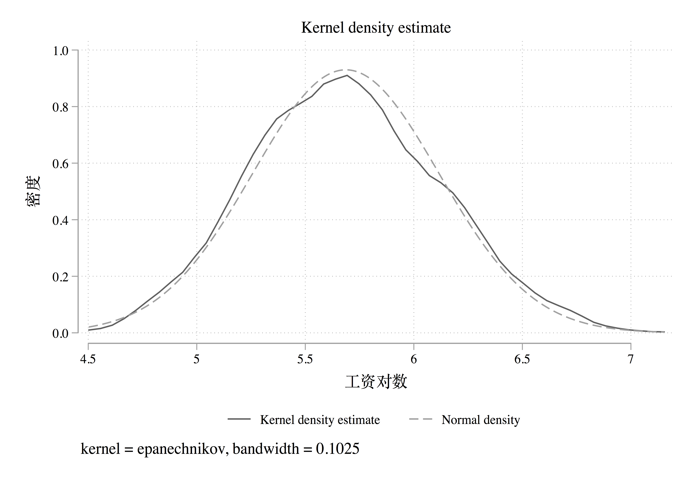
```

```stata
tw ///
kdensity lnw || ///
kdensity lnw if s == 16, lp(dash) ||, ///
  xti("工资对数") yti("密度") ///
  leg(pos(6) row(1)) ///
  yla(#4, format(%6.1f)) xla(, format(%6.1f)) ///
```

```{r kden2, echo=FALSE, fig.align='center', fig.cap = '工资对数的核密度估计图与受教育年限为16年的样本工资对数和密度估计图', out.width='60%'}
knitr::include_graphics('assets/kdensity2.png')
```

### 验证迭代期望定律

迭代期望定律：
$$E(Y) = E_x[E(Y|x)]$$

使用数据集 grilic.dta 来验证该定律：

$$E(lnw) = E_{rns} \times [E(lnw|rns)]$$

* rns 是一个虚拟变量，首先我们计算 `[E(lnw|rns=1)]` 和 `[E(lnw|rns=0)]`
* 那么 `E_rns[E(lnw|rns)]` 等于两者的加权平均：
* 先别急着算，均值这么长，抄起来多累，我们重新开始，这一次使用宏变量来记录每一次的均值。

```stata
cuse grilic, c w
ren lw lnw
sum lnw if rns == 1
return list
local a = r(mean)
sum lnw if rns == 0
return list
local b = r(mean)
di (`a'*204+`b'*554)/(204+554)
*> 5.6867388
```

另一方面，E(lnw)为：

```stata
sum lnw
```
忽略舍入误差，两者完全相等。从而得证。

## t 检验、方差分析和因子分析

### t 检验

t 检验使用 ttest 命令。

#### 单样本 t 检验
单样本 t 检验就是均值检验，检验某组数的均值是否等于某个值。
例如检验 auto 数据集中的 mpg 的变量是否为 20：

```stata
sysuse auto, clear
ttest mpg == 20  

*> One-sample t test
*> ------------------------------------------------------------------------------
*> Variable |     Obs        Mean    Std. Err.   Std. Dev.   [95% Conf. Interval]
*> ---------+--------------------------------------------------------------------
*>      mpg |      74     21.2973    .6725511    5.785503     19.9569    22.63769
*> ------------------------------------------------------------------------------
*>     mean = mean(mpg)                                              t =   1.9289
*> Ho: mean = 20                                    degrees of freedom =       73
*> 
*>     Ha: mean < 20               Ha: mean != 20                 Ha: mean > 20
*>  Pr(T < t) = 0.9712         Pr(|T| > |t|) = 0.0576          Pr(T > t) = 0.0288
```

#### 双样本 t 检验

双样本 t 检验也就是检验两组样本的均值是否相等。例如，我想检验国产车和进口车的价格的均值是否相等：

```stata
ttest price, by(for)

*> Two-sample t test with equal variances
*> ------------------------------------------------------------------------------
*>    Group |     Obs        Mean    Std. Err.   Std. Dev.   [95% Conf. Interval]
*> ---------+--------------------------------------------------------------------
*> Domestic |      52    6072.423    429.4911    3097.104    5210.184    6934.662
*>  Foreign |      22    6384.682    558.9942    2621.915     5222.19    7547.174
*> ---------+--------------------------------------------------------------------
*> combined |      74    6165.257    342.8719    2949.496    5481.914      6848.6
*> ---------+--------------------------------------------------------------------
*>     diff |           -312.2587    754.4488               -1816.225    1191.708
*> ------------------------------------------------------------------------------
*>     diff = mean(Domestic) - mean(Foreign)                         t =  -0.4139
*> Ho: diff = 0                                     degrees of freedom =       72
*> 
*>     Ha: diff < 0                 Ha: diff != 0                 Ha: diff > 0
*>  Pr(T < t) = 0.3401         Pr(|T| > |t|) = 0.6802          Pr(T > t) = 0.6599
```

### 方差分析

方差分析(Analysis of Variance，简称 ANOVA)，又称“变异数分析”，是 R.A.Fisher 发明的，用于两个及两个以上样本均数差别的显著性检验。

#### 单因素方差分析

```stata
webuse systolic, clear
anova systolic drug

*>            Number of obs =         58    R-squared     =  0.3355
*>            Root MSE      =    10.7211    Adj R-squared =  0.2985       
*>     Source | Partial SS         df         MS        F    Prob>F
*> -----------+----------------------------------------------------
*>      Model |  3133.2385          3   1044.4128      9.09  0.0001
*>            |
*>       drug |  3133.2385          3   1044.4128      9.09  0.0001
*>            |
*>   Residual |  6206.9167         54    114.9429  
*> -----------+----------------------------------------------------
*>      Total |  9340.1552         57   163.86237  
```

#### 双因素方差分析

```stata
anova systolic drug disease

*>            Number of obs =         58    R-squared     =  0.3803
*>            Root MSE      =    10.5503    Adj R-squared =  0.3207
*>     Source | Partial SS         df         MS        F    Prob>F
*> -----------+----------------------------------------------------
*>      Model |  3552.0722          5   710.41445      6.38  0.0001
*>            |
*>       drug |  3063.4329          3   1021.1443      9.17  0.0001
*>    disease |  418.83374          2   209.41687      1.88  0.1626
*>            |
*>   Residual |  5788.0829         52   111.30929  
*> -----------+----------------------------------------------------
*>      Total |  9340.1552         57   163.86237  
```

<!--chapter:end:02-basics.Rmd-->

# 弹性与半弹性

使用书上的 grilic_small.dta 数据集，考虑受教育年限对工资的影响。

## 弹性
首先是弹性的表述，我们经常说这样一个词：“需求的价格弹性”，我们也很清楚它的意思是价格对需求的影响（而不是需求对价格的影响）。所以如果我们把他们换成数学语言，就是“y 的 x 弹性”(英文：The elasticity of y with respect to x)。计算公式如下：

$$\varepsilon  = \frac{\Delta y / y}{\Delta x / x}$$

即 y 的变化比例除以 x 的变化比例。关于弹性的表述非常绕，我们可以举个这样的例子：$x = 100, \Delta x = 1, y = 100, \Delta y = 2$，那么$\varepsilon = 2$。这样就说明，如果弹性为 2，那么其含义就是，$x$变化$1\%$，$y$变化$2\%$.

实际回归的时候如何求一个 y 的 x 弹性呢？我们可以继续把上面的公式变形一下：

\begin{align}
\varepsilon & = \frac{\Delta y / y}{\Delta x / x} \\
& = \frac{\partial y / y}{\partial x / x} \\
& = \frac{\partial lny}{\partial lnx}
\end{align}

这就意味着如何想要求 $y$ 的 $x$ 弹性，我们需要求 $lny$ 对 $lnx$ 的偏导数。考虑工资的受教育年限弹性：

```stata
cuse grilic_small, clear web
* 或者
use http://www.czxa.top/cuse/g/grilic_small, clear
* 因为数据集里面已经对数工资变量，所以我们只对受教育年限变量取对数即可
gen lns = ln(s)
* 注意ln()函数和log()函数是等价的
* 回归lnw和lns
reg lnw lns

*>       Source |       SS           df       MS      Number of obs   =        30
*> -------------+----------------------------------   F(1, 28)        =     11.23
*>        Model |  1.12395728         1  1.12395728   Prob > F        =    0.0023
*>     Residual |  2.80324396        28  .100115856   R-squared       =    0.2862
*> -------------+----------------------------------   Adj R-squared   =    0.2607
*>        Total |  3.92720124        29  .135420733   Root MSE        =    .31641
*> ------------------------------------------------------------------------------
*>          lnw |      Coef.   Std. Err.      t    P>|t|     [95% Conf. Interval]
*> -------------+----------------------------------------------------------------
*>          lns |   1.271595   .3795118     3.35   0.002     .4942001    2.048989
*>        _cons |   2.470437   .9933712     2.49   0.019     .4356081    4.505265
*> ------------------------------------------------------------------------------
```

可以看到，lnw 对 lns 的回归系数是 1.27，也就是 w 的 s 弹性，解释为：受教育年限每延长 1%，工资平均提高 1.27%。。很容易理解这里计算的是平均。我们经常需要计算 y 关于 x 在某个点的弹性（也就是说更多时候，弹性不是一个常数，而是关于 x 的函数）。

Stata 的 margins 命令可以用来计算 y 关于 x 在某个点的弹性：

```stata
* 首先我们需要生成工资变量，因为数据集里面只有工资对数变量
gen w = exp(lnw)
* 然后就 w 对 s 回归
reg w s

*>       Source |       SS           df       MS      Number of obs   =        30
*> -------------+----------------------------------   F(1, 28)        =     10.35
*>        Model |  106091.987         1  106091.987   Prob > F        =    0.0033
*>     Residual |  287015.278        28  10250.5457   R-squared       =    0.2699
*> -------------+----------------------------------   Adj R-squared   =    0.2438
*>        Total |  393107.266        29   13555.423   Root MSE        =    101.24
*> ------------------------------------------------------------------------------
*>            w |      Coef.   Std. Err.      t    P>|t|     [95% Conf. Interval]
*> -------------+----------------------------------------------------------------
*>            s |   28.26456   8.785661     3.22   0.003     10.26795    46.26117
*>        _cons |   -41.4791   122.6431    -0.34   0.738    -292.7022     209.744
*> ------------------------------------------------------------------------------
```
我们也知道这个回归系数 28.26 的含义是受教育年限每延长一年，工资平均增加 28 块钱（币种可能是美元）。

然后我们可以使用 tabulate 命令查看变量 s 的频率频数分布表：
```stata
tab s

*>   schooling |      Freq.     Percent        Cum.
*> ------------+-----------------------------------
*>          11 |          3       10.00       10.00
*>          12 |         12       40.00       50.00
*>          14 |          1        3.33       53.33
*>          15 |          3       10.00       63.33
*>          16 |         10       33.33       96.67
*>          18 |          1        3.33      100.00
*> ------------+-----------------------------------
*>       Total |         30      100.00
```
根据上表，我们可以看出 s 的取值为 11～18，所以下面我们求 w 关于 s 在每一点的弹性：

```stata
* margins必须在回归后才能使用
margins, eyex(s) at(s = (11(1)18))

*> Conditional marginal effects                    Number of obs     =         30
*> Model VCE    : OLS
*> 
*> Expression   : Linear prediction, predict()
*> ey/ex w.r.t. : s
*> 
*> 1._at        : s               =          11
*> 2._at        : s               =          12
*> 3._at        : s               =          13
*> 4._at        : s               =          14
*> 5._at        : s               =          15
*> 6._at        : s               =          16
*> 7._at        : s               =          17
*> 8._at        : s               =          18
*> ------------------------------------------------------------------------------
*>              |            Delta-method
*>              |      ey/ex   Std. Err.      t    P>|t|     [95% Conf. Interval]
*> -------------+----------------------------------------------------------------
*> s            |
*>          _at |
*>           1  |   1.153951    .470754     2.45   0.021     .1896548    2.118247
*>           2  |   1.139334   .4206618     2.71   0.011     .2776474     2.00102
*>           3  |   1.127252   .3801114     2.97   0.006     .3486291    1.905875
*>           4  |   1.117098   .3466306     3.22   0.003     .4070576    1.827139
*>           5  |   1.108445   .3185293     3.48   0.002     .4559675    1.760923
*>           6  |   1.100983    .294614     3.74   0.001     .4974935    1.704472
*>           7  |   1.094481   .2740186     3.99   0.000     .5331797    1.655783
*>           8  |   1.088767   .2560998     4.25   0.000     .5641699    1.613363
*> ------------------------------------------------------------------------------
```

如果我们想把这些弹性绘制成关于 s 的图像该怎么做呢？
第一种是笨方法，把这些弹性直接手动复制粘贴下来：
```stata
clear
input s e
11 1.153951
12 1.139334
13 1.127252
14 1.117098
15 1.108445
16 1.100983
17 1.094481
18 1.088767
end
line e s, xti(受教育年限) ///
      yti(工资的受教育年限弹性) ///
      yla(, format(%6.2f))
```

```{r wage123, echo=FALSE, fig.align='center', fig.cap = '工资的受教育年限弹性', out.width='80%'}
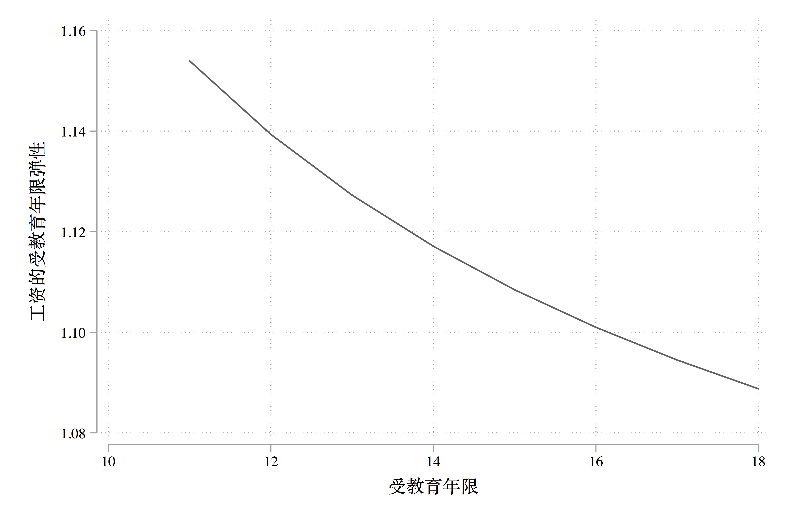
```

另外一种方法是直接利用返回值。很多 Stata 命令运行之后都会保留一些返回值，运行命令 `return list` 就可以查看，例如上面 margins 命令运行之后的返回值查看：

```stata
* 因为刚刚clear了，所以再重新运行一下前面的命令
cuse grilic_small.dta, c w
gen w = exp(lnw)
* qui 前缀可以隐藏运行结果
qui reg w s
qui margins, eyex(s) at(s = (11(1)18))
ret list

*> scalars:
*>               r(level) =  95
*>                r(k_at) =  1
*>                r(k_by) =  1
*>           r(k_predict) =  1
*>           r(k_margins) =  0
*>                r(df_r) =  28
*>                   r(N) =  30
*> 
*> macros:
*>            r(mcmethod) : "noadjust"
*>                 r(cmd) : "margins"
*>             r(cmdline) : "margins , eyex(s) at(s = (11(1)18))"
*>         r(est_cmdline) : "regress w s"
*>             r(est_cmd) : "regress"
*>          r(emptycells) : "strict"
*>            r(atstats8) : "values"
*>            r(atstats7) : "values"
*>            r(atstats6) : "values"
*>            r(atstats5) : "values"
*>            r(atstats4) : "values"
*>            r(atstats3) : "values"
*>            r(atstats2) : "values"
*>            r(atstats1) : "values"
*>          r(continuous) : "continuous"
*>         r(derivatives) : "ey/ex"
*>               r(xvars) : "s"
*>          r(expression) : "predict()"
*>      r(predict1_label) : "Linear prediction"
*>             r(vcetype) : "Delta-method"
*>                 r(vce) : "delta"
*>           r(model_vce) : "ols"
*>               r(title) : "Conditional marginal effects"
*> 
*> matrices:
*>               r(table) :  9 x 8
*>           r(chainrule) :  1 x 3
*>                  r(at) :  8 x 1
*>                   r(V) :  8 x 8
*>            r(Jacobian) :  8 x 2
*>               r(error) :  1 x 8
*>                   r(b) :  1 x 8
*>                  r(_N) :  1 x 8
```

对比前面的 margins 的运行结果，可以很容易的发现我们需要的东西在`r(table)`里面，是以矩阵的形式保存的。我们把它读出来：

```stata
* 首先把r(table)保存到矩阵e里面，矩阵生产使用matrix命令，简写为mat
mat e = r(table)

* 查看矩阵使用matrix list命令，简写为mat list
mat list e

*> e[9,8]
*>                 s:         s:         s:         s:         s:         s:         s:         s:
*>                 1.         2.         3.         4.         5.         6.         7.         8.
*>               _at        _at        _at        _at        _at        _at        _at        _at
*>      b  1.1539507  1.1393339   1.127252  1.1170982  1.1084451  1.1009828  1.0944814  1.0887665
*>     se  .47075402  .42066176  .38011143  .34663063  .31852928  .29461398  .27401865  .25609981
*>      t  2.4512816  2.7084323  2.9655831  3.2227338  3.4798845  3.7370353   3.994186  4.2513367
*> pvalue  .02073597  .01139796  .00611555  .00321455  .00166106  .00084655  .00042681  .00021346
*>     ll  .18965477  .27764736  .34862905  .40705759  .45596746  .49749346  .53317969  .56416985
*>     ul  2.1182466  2.0010205   1.905875  1.8271389  1.7609228  1.7044722  1.6557832  1.6133632
*>     df         28         28         28         28         28         28         28         28
*>   crit  2.0484071  2.0484071  2.0484071  2.0484071  2.0484071  2.0484071  2.0484071  2.0484071
*>  eform          0          0          0          0          0          0          0          0
```

我们可以设计一个小循环，实现创建弹性 e 和变量 s 的数据集：

```stata
* preserve和restore是一对命令，preserve可以预保存，当前数据集和各种变量，restore可以恢复preserve预保存的内容。也就是说preserve和restore之间的操作不会产生影响
preserve
* 只使用clear不会清除宏变量（例如上面的矩阵）
clear
set obs 8
gen e = .
gen s = .
forval i = 1/8{
      replace s = `i' + 10
      replace e = e[1, `i']
}
line e s, xti(受教育年限) ///
      yti(工资的受教育年限弹性) ///
      yla(, format(%6.2f))
restore
```

## 半弹性
同样，我们可以这样定义 y 的 x 半弹性（The semielasticity of y with respect to x）：
$$
semi\sim\varepsilon 1 = \frac{\partial y}{\partial lnx}
$$

$$
semi\sim\varepsilon 2 = \frac{\partial lny}{\partial x}
$$

### 第一种半弹性

对于第一种半弹性：

\begin{align}
semi\sim\varepsilon 1 & = \frac{\partial y}{\partial lnx} \\
& = \frac{\partial y}{\partial x/x}
\end{align}


可以这么理解，$x = 100, \partial x = 100, \partial y = 2, semi \sim \varepsilon 1 = 2$。即是说，半弹性为 2 的时候表示 x 增加 100%，y 增加 2 个单位。

如果我们想求工资关于受教育年限的半弹性：
```stata
cuse grilic_small, c w
gen lns = ln(s)
reg w lns

*>       Source |       SS           df       MS      Number of obs   =        30
*> -------------+----------------------------------   F(1, 28)        =     10.09
*>        Model |  104136.237         1  104136.237   Prob > F        =    0.0036
*>     Residual |  288971.029        28  10320.3939   R-squared       =    0.2649
*> -------------+----------------------------------   Adj R-squared   =    0.2387
*>        Total |  393107.266        29   13555.423   Root MSE        =    101.59
*> ------------------------------------------------------------------------------
*>            w |      Coef.   Std. Err.      t    P>|t|     [95% Conf. Interval]
*> -------------+----------------------------------------------------------------
*>          lns |   387.0569    121.849     3.18   0.004     137.4605    636.6532
*>        _cons |  -662.8339   318.9395    -2.08   0.047    -1316.152   -9.516088
*> ------------------------------------------------------------------------------
```

回归结果为 387.0569。表示受教育年限翻一番，工资平均增加 387.0569 块钱。同样这个时候可以用 margins 命令求在受教育年限的每个点的半弹性，不过这个时候要用的选项是`dyex()`：

```stata
cuse grilic_small.dta, c
gen w = exp(lnw)
qui reg w s
qui margins, dyex(s) at(s = (11(1)18))
mat e = r(table)
clear
set obs 8
gen e = .
gen s = .
forval i = 1/8{
      replace s = `i' + 10 in `i'
      replace e = e[1, `i'] in `i'
}
line e s, xti(受教育年限) ///
      yti(工资的受教育年限半弹性) ///
      yla(, format(%6.2f))
gr export 工资的受教育年限半弹性.png, replace width(2400)
```

```{r wage456, echo=FALSE, fig.align='center', fig.cap = '工资的受教育年限半弹性', out.width='80%'}
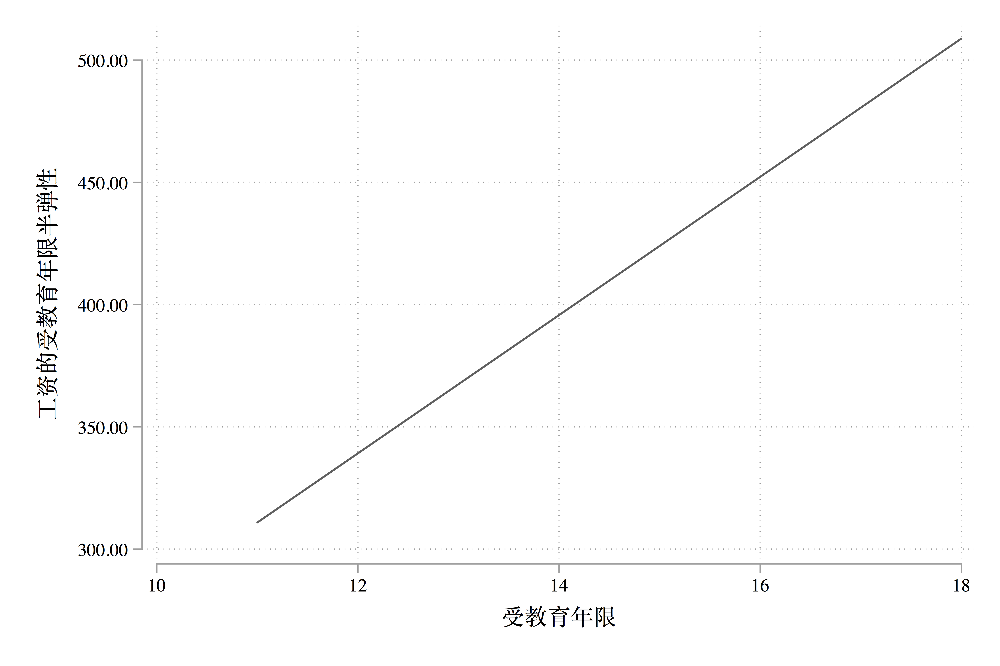
```

### 第二种半弹性
对于第二种半弹性：

\begin{align}
semi\sim\varepsilon 2 &= \frac{\partial lny}{\partial x} \\
& = \frac{\partial y/y}{\partial x}
\end{align}


可以这么理解，$\partial x = 1, \partial y = 200, y =100,  semi \sim \varepsilon 2 = 2$。即是说，半弹性为 2 的时候表示 x 增加 1，y 增加 200%。

这里求工资关于受教育年限的半弹性：
```stata
cuse grilic_small.dta, c w
reg lnw s

*>       Source |       SS           df       MS      Number of obs   =        30
*> -------------+----------------------------------   F(1, 28)        =     11.34
*>        Model |  1.13168716         1  1.13168716   Prob > F        =    0.0022
*>     Residual |  2.79551408        28  .099839789   R-squared       =    0.2882
*> -------------+----------------------------------   Adj R-squared   =    0.2627
*>        Total |  3.92720124        29  .135420733   Root MSE        =    .31597
*> ------------------------------------------------------------------------------
*>          lnw |      Coef.   Std. Err.      t    P>|t|     [95% Conf. Interval]
*> -------------+----------------------------------------------------------------
*>            s |   .0923133   .0274191     3.37   0.002     .0361478    .1484787
*>        _cons |   4.519277   .3827556    11.81   0.000     3.735237    5.303316
*> ------------------------------------------------------------------------------
```
回归系数为 0.09，即使说，受教育年限每增加一年，工资平均增加 0.09%。
同样可以求受教育年限每个点上的半弹性，这个时候使用 `eydx()` 选项：

```stata
cuse grilic_small.dta, c
gen w = exp(lnw)
qui reg w s
qui margins, eydx(s) at(s = (11(1)18))
mat e = r(table)
clear
set obs 8
gen e = .
gen s = .
forval i = 1/8{
      replace s = `i' + 10 in `i'
      replace e = e[1, `i'] in `i'
}
line e s, xti(受教育年限) ///
      yti(工资的受教育年限半弹性) ///
      yla(, format(%6.2f))
gr export 工资的受教育年限半弹性2.png, replace width(2400)
```

```{r wage4562, echo=FALSE, fig.align='center', fig.cap = '工资的受教育年限半弹性2', out.width='80%'}
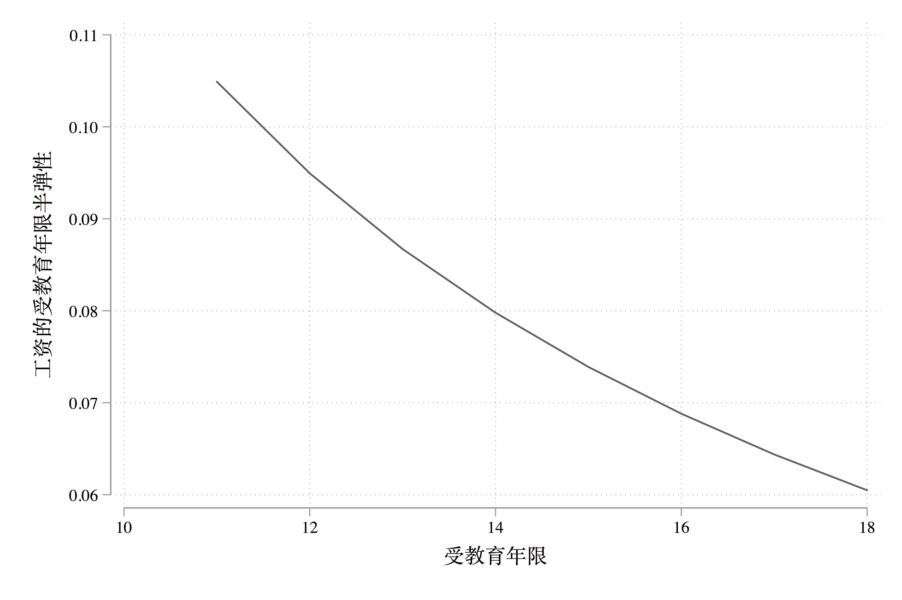
```

## 总结
最后可以用 Stata 帮助文件(margins 命令: dydx 选项)中的一个表格来总结弹性和半弹性：


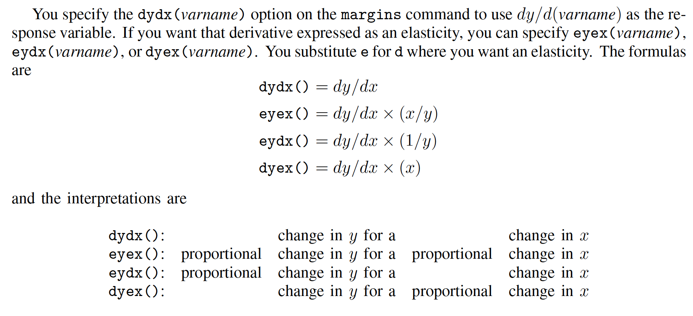

<!--chapter:end:03-elastic.Rmd-->

# Stata 网页表格爬取示例

本文以爬取[东方财富网 CPI 数据](http://data.eastmoney.com/cjsj/cpi.html)为例，讲解如何使用 Stata 进行网页表格数据爬取。

Stata 虽非数据爬取利器，但是能够轻松解决一些小的数据爬取任务。数据爬取的本质无非是数据请求和数据处理，因此熟练使用 Stata 进行数据爬取往往也是很好的数据处理能力的象征。在实际应用中，我们经常需要爬取一些公开数据。这些数据一种常见展示方式是通过 HTML 表示呈现。一个简单的 HTML 表格示例如下：

```html
<table>
    <tr><td bgcolor="red">1</td><td bgcolor="yellow">2</td><td bgcolor="blue">3</td></tr>
    <tr><td>1</td><td>2</td><td>3</td></tr>
</table>
```
[东方财富网 CPI 数据](http://data.eastmoney.com/cjsj/cpi.html)的表格是这样的：


下面我将一步步讲解如何爬取这个表格。

## 准备工作
1. Stata14.0 以上版本的；
2. Chrome 浏览器；
3. 想把数据爬下来的你。

## 网页分析
首先讲解如何爬取一个页面的表格。这个网页的网址是：
```markdown
http://data.eastmoney.com/cjsj/cpi.html
```


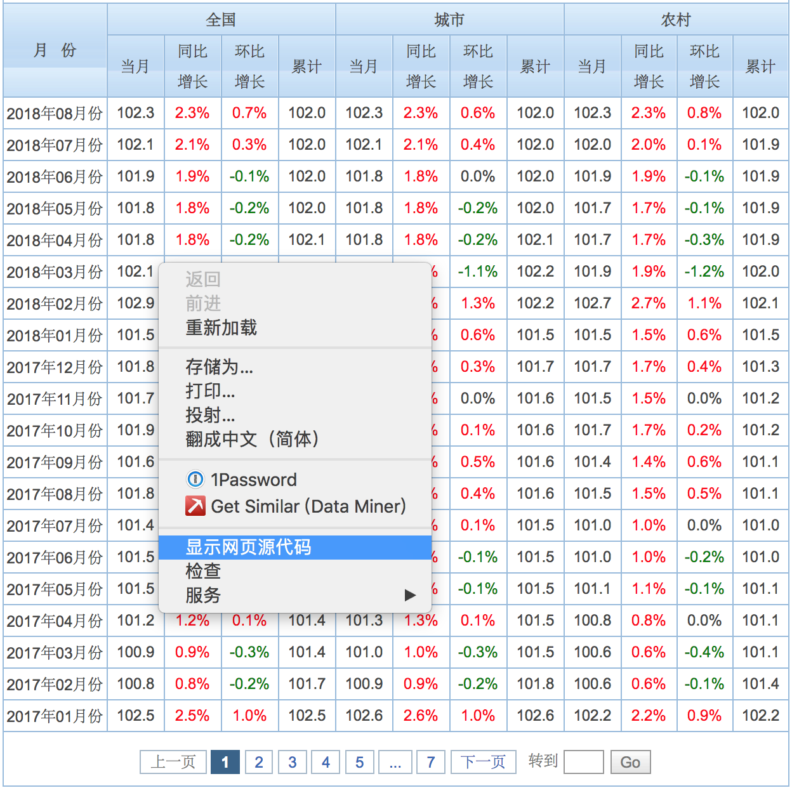

在页面上右键选择显示网页源代码，很多浏览器都有查看网页源代码的功能，但是我还是最喜欢谷歌浏览器的。点击之后即可跳转至网页源代码界面：


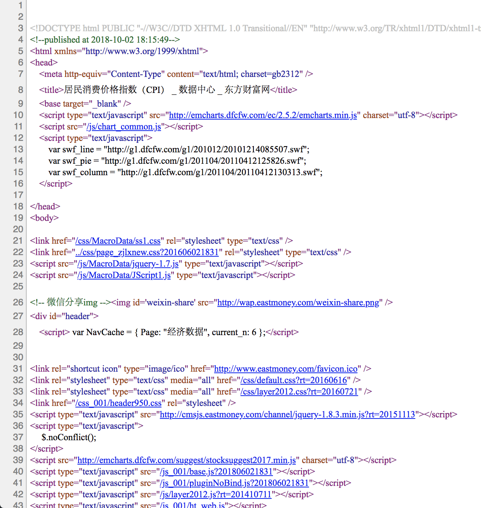

也就是说你刚刚看到的网页的本质实际上是这些源代码，之所以我们能看到各种炫彩的页面，那是因为浏览器帮我们翻译了源代码。

下一步我们要做的事情就是找到这个表格在源代码的哪一块儿了，然后分析表格的特点，已方便在后面的 Stata 处理源代码的时候进行过滤。

一个经常被用来寻找目标的方法是使用`查找`功能。Ctr+F（Mac 是 Command + F）即可打开搜索框，我们注意到表格里面有`月份`两个字，所以我们就用`月份`进行查找。


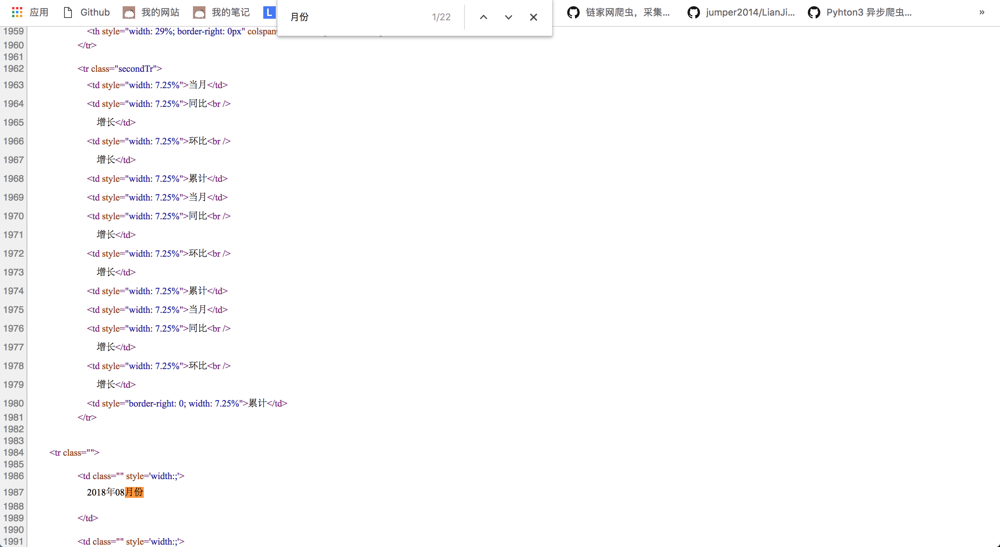

我们首先在第 1987 行发现了这个词，仔细一看，这附近的代码就是表格的代码。

下一步就是我们先分析一下这部分代码的特点：
1. 所有表格中的数据在源代码中都是单独位于一行的，所以我们不能从其所在行入手了；
2. 表格数据的上一行要么有字符串`<td class=`要么有`<span`。也可以发现，span 标签是控制文字颜色的。

经过以上的网页分析我们就可以开始进行网页表格爬取了。

## 开始爬取
总的来说，Stata 进行网页表格爬取分为 3 个步骤：
1. 请求：把含有所需数据的源代码下载下来；
2. 转码：很多网页并非使用 UTF-8 编码，直接读入 Stata 会出现乱码，因此可以预先进行 UTF-8 转码；
3. 处理：这里主要是对字符串进行处理，常用操作有分割(split)、转置(sxpose)、提取(正则表达式或直接字符串提取)等等。

### 请求
由于这个网页没有设置反爬机制，所以可以直接使用`copy`命令进行下载，copy 命令不仅可以下载网页，还可以下载文件（当然网页其实就是一个 html 文件）。更多用法可以`help copy`。我们这里把要爬取的页面保存成一个名叫`temp.txt`的 txt 文件，为什么要起这个名字呢，因为爬完之后它就要被删除了，所以只是一个临时的文件。
```stata
clear all
* 设定工作目录
cd "你自己的工作目录（一个文件夹的路径）"
copy "http://data.eastmoney.com/cjsj/pmi.html" temp.txt, replace
```
### 转码
在我的 Stata 命令包——finance 包中，我编写了一个简单的转码命令，这个命令包的安装办法为：
```stata
* 首先你需要安装github命令，这个命令是用来安装github上的命令的
* net install github, from("https://haghish.github.io/github/")
* 然后就可以安装这个命令了
* github install czxa/finance, replace
```
安装成功之后，使用下面的命令就可以直接对 temp.txt 文件进行转码了：
```stata
utrans temp.txt
```
如果返回的结果是`转码成功`，则表示`转码成功`了！（感觉像在说废话。。。）

如果你不幸的因为各种各样的原因没能成功安装这个小命令，可以直接使用下面三句命令进行转码：
```stata
unicode encoding set gb18030
unicode translate temp.txt
unicode erasebackups, badidea
```

### 读入
下面我们就要把 temp.txt 文件读入 Stata 进行处理了，一个非常常用的读取方法是使用 infix 命令：
```stata
infix strL v 1-20000 using temp.txt, clear
* 把变量v的显示格式变成 %60s （这样看起来更宽）
format v %60s
```
这句命令的含义是创建一个格式为 strL 的变量 v，然后把 temp.txt 文件的每一行的前 1-20000 个字符（因为我们注意到 temp.txt 的每一行都没有超过 20000 个字符）读入变量 v 的每一个观测值。读入之后是这样的：


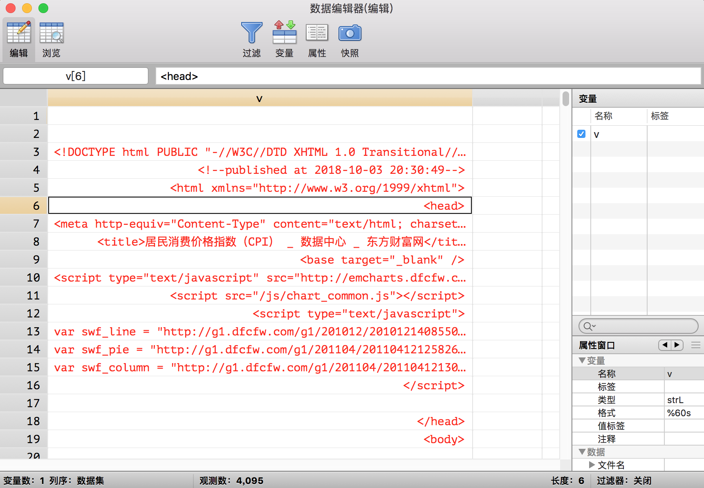

### 处理
首先根据上面我们进行网页分析发现的结论，我们保留符合<font color = 'blue'>表格数据的上一行要么有字符串"<td class="要么有"<span"</font>规律的观测值：
```stata
keep if index(v[_n-1], "<td class=") | index(v[_n-1], "<span")
* 再删除空观测值
drop if v == ""
* 再删除一些显然不是表格中数据的观测值，而这些无用观测值中都含有斜线
drop if index(v, "/")
```
这一步处理后的结果：


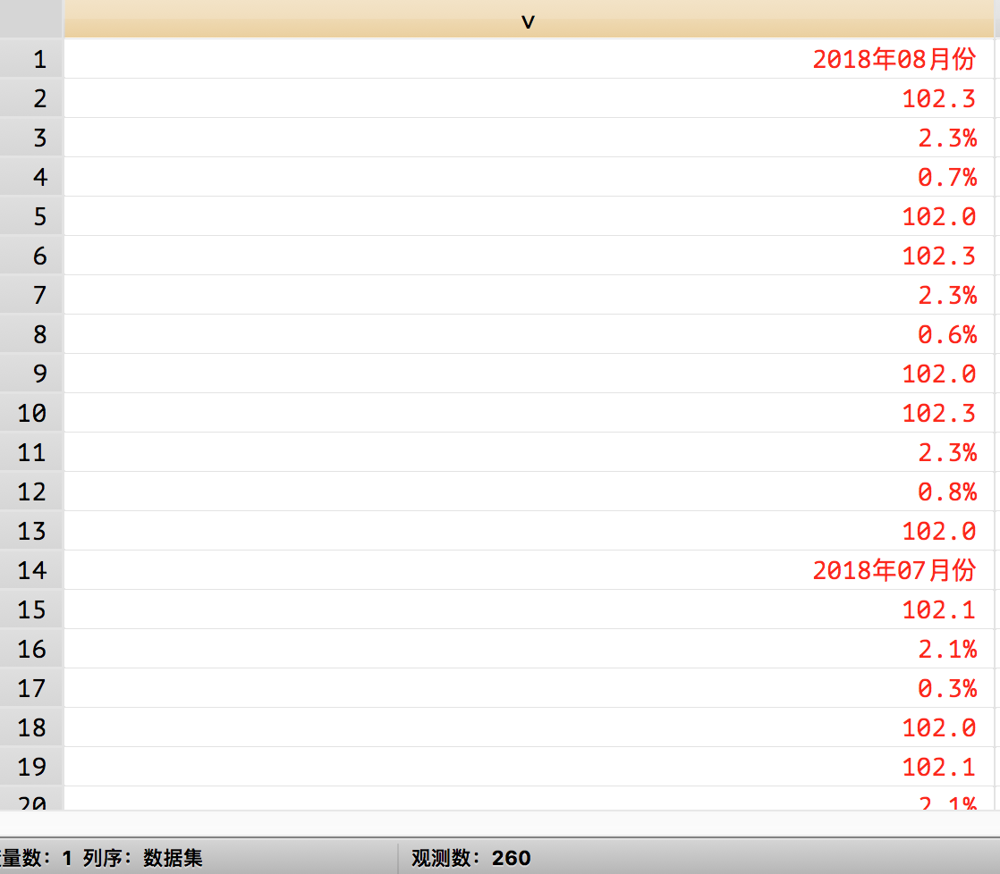

实际上到这一步，我们已经把表格整理的挺干净了，不过这不像一个表格，我们需要进行这样的一个操作：我们已经注意到了 1-13 行实际是表格的第一行，14-26 行实际是表格的第二行。我们该怎么完成这样的一个操作呢？一个非常好用的命令是`post命令`。这个命令的功能就像它的名字一样——邮局。它可以实现把 v 的每个观测值发送到我们想要得到的表格的指定位置。
```stata
* 第一步postfile建立一个“邮局”，同时设定“收件人”（变量date、v1、v2、v3、v4）：
postfile mypost str20 date str20 v1 str20 v2 str20 v3 ///
	str20 v4 str20 v5 str20 v6 str20 v7 str20 v8 str20 v9 ///
	str20 v10 str20 v11 str20 v12 using cpi.dta, replace
* 然后循环将v的值对应发送给各个收件人
forval i = 1(13)`=_N'{
	post mypost (v[`i']) (v[`i' + 1]) (v[`i' + 2]) (v[`i' + 3]) ///
	 			(v[`i' + 4]) (v[`i' + 5]) (v[`i' + 6]) (v[`i' + 7]) ///
	 			(v[`i' + 8]) (v[`i' + 9]) (v[`i' + 10]) (v[`i' + 11]) ///
	 			(v[`i' + 12])
}
* 关闭邮局mypost
postclose mypost

* 打开 cpi.dta 就能看到整理好的数据了
use cpi, clear
```
经过这个“邮局操作”，数据现在变成这个样子的了：


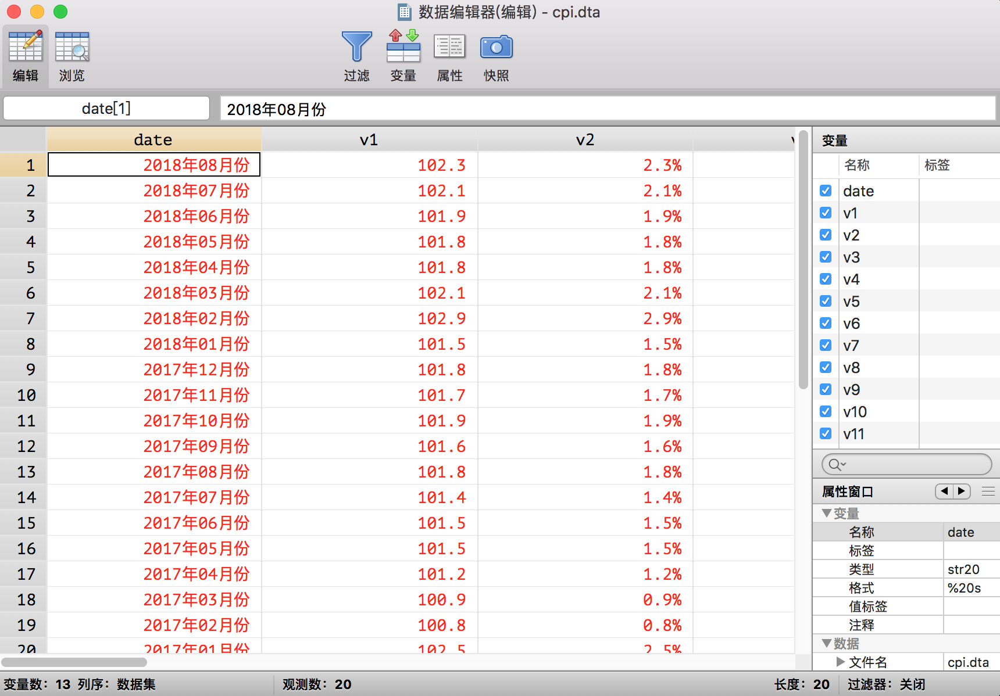

到这一步我们实际上已经完成了这个表格的爬取了，不过接下来我们再把数据整理成更加规整的 Stata 数据。

```stata
* 整理date变量
replace date = subinstr(date, "年", "", .)
replace date = subinstr(date, "月份", "", .)
* date()函数把字符串日期变成Stata日期
gen date1 = date(date, "YM")
* format一下便于我们人类理解
format date1 %tdCY-N
* 把date1变量放在第一列
order date1
* 删除date
drop date
* 重命名date1为date
ren date1 date
* 循环所有变量，把%删除
foreach i of varlist _all{
	cap replace `i' = subinstr(`i', "%", "", .)
}
* 把所有能被转换为数值型变量的字符串变量转换成数值型变量
destring, replace
* 循环所有变量，如果变量名不是date就把显示格式变成%6.2f
foreach i of varlist _all{
	if "`i'" != "date" {
		format `i' %6.2f
	}
}
* 添加变量标签
label var date "月份"
label var v1 "全国CPI"
label var v2 "全国CPI年率"
label var v3 "全国CPI月率"
label var v4 "全国CPI累计"
label var v5 "城市CPI"
label var v6 "城市CPI年率"
label var v7 "城市CPI月率"
label var v8 "城市CPI累计"
label var v9 "农村CPI"
label var v10 "农村CPI年率"
label var v11 "农村CPI月率"
label var v12 "农村CPI累计"
* 数据集标签
label data "消费者价格指数"

* 变量重命名
ren v1 cpi_all
ren v2 cpi_all_year_rate
ren v3 cpi_all_month_rate
ren v4 cpi_all_accum
ren v5 cpi_city
ren v6 cpi_city_year_rate
ren v7 cpi_city_month_rate
ren v8 cpi_city_accum
ren v9 cpi_village
ren v10 cpi_village_year_rate
ren v11 cpi_village_month_rate
ren v12 cpi_village_accum
save CPI_final, replace
```
这样整理之后的数据集是这样的：


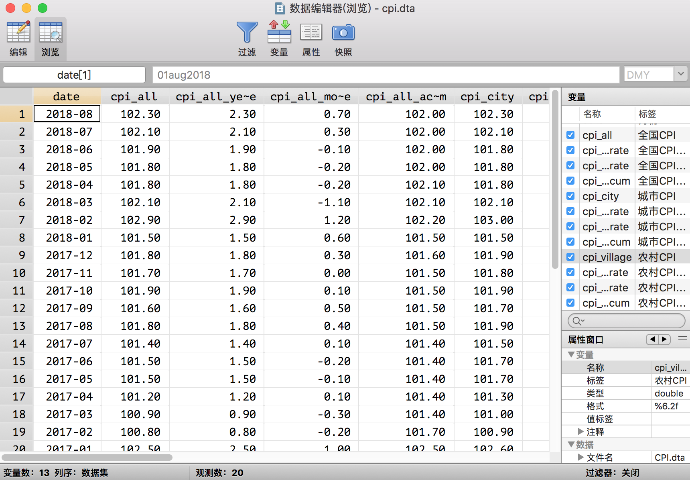

这样我们就爬好了单页面的表格。另外我们也注意到完整的表格有 7 页。我们点击下一页可以看到第二页的网址是：

```html
http://data.eastmoney.com/cjsj/consumerpriceindex.aspx?p=2
```

显然 url 中的最后一个参数就是页数。每页的结构都是一致的，所以可以循环运行刚刚的代码把剩下 6 个页面的表格依次爬下来然后合并。

## 多页面爬取
### 纵向拼接示例
作为示例，我们再尝试用刚刚的代码爬第二页：

```stata
clear
copy "http://data.eastmoney.com/cjsj/consumerpriceindex.aspx?p=2" temp.txt, replace
utrans temp.txt
infix strL v 1-20000 using temp.txt, clear
keep if index(v[_n-1], "<td class=") | index(v[_n-1], "<span")
drop if v == ""
drop if index(v, "/")
postfile mypost str20 date str20 v1 str20 v2 str20 v3 ///
	str20 v4 str20 v5 str20 v6 str20 v7 str20 v8 str20 v9 ///
	str20 v10 str20 v11 str20 v12 using CPI_temp.dta, replace
forval i = 1(13)`=_N'{
	post mypost (v[`i']) (v[`i' + 1]) (v[`i' + 2]) (v[`i' + 3]) ///
	 			(v[`i' + 4]) (v[`i' + 5]) (v[`i' + 6]) (v[`i' + 7]) ///
	 			(v[`i' + 8]) (v[`i' + 9]) (v[`i' + 10]) (v[`i' + 11]) ///
	 			(v[`i' + 12])
}
postclose mypost
use CPI_temp, clear
replace date = subinstr(date, "年", "", .)
replace date = subinstr(date, "月份", "", .)
gen date1 = date(date, "YM")
format date1 %tdCY-N
order date1
drop date
ren date1 date
foreach i of varlist _all{
	cap replace `i' = subinstr(`i', "%", "", .)
}
destring, replace
foreach i of varlist _all{
	if "`i'" != "date" {
		format `i' %6.2f
	}
}
ren v1 cpi_all
ren v2 cpi_all_year_rate
ren v3 cpi_all_month_rate
ren v4 cpi_all_accum
ren v5 cpi_city
ren v6 cpi_city_year_rate
ren v7 cpi_city_month_rate
ren v8 cpi_city_accum
ren v9 cpi_village
ren v10 cpi_village_year_rate
ren v11 cpi_village_month_rate
ren v12 cpi_village_accum
```
这些代码运行之后可以得到一个和第一页爬取结果类似的表格，然后可以用 append 命令把这个表格纵向拼接到第一页爬取的数据集`CPI_final.dta`上：
```stata
append using CPI_final
save CPI_final, replace
```

### 循环拼接
为了连贯，我再把上面的代码重新写，因为有些代码可以在放在循环之后再运行，例如变量标签、变量名等。
```stata
*===============================*
* 	 东方财富网消费者价格指数爬取
*===============================*
* 下载第一页
clear all
cd "~/Desktop"
copy "http://data.eastmoney.com/cjsj/cpi.html" temp.txt, replace
utrans temp.txt
infix strL v 1-20000 using temp.txt, clear
keep if index(v[_n-1], "<td class=") | index(v[_n-1], "<span")
drop if v == ""
drop if index(v, "/")
postfile mypost str20 date str20 v1 str20 v2 str20 v3 ///
	str20 v4 str20 v5 str20 v6 str20 v7 str20 v8 str20 v9 ///
	str20 v10 str20 v11 str20 v12 using CPI_temp.dta, replace
forval i = 1(13)`=_N'{
	post mypost (v[`i']) (v[`i' + 1]) (v[`i' + 2]) (v[`i' + 3]) ///
	 	(v[`i' + 4]) (v[`i' + 5]) (v[`i' + 6]) (v[`i' + 7]) ///
		(v[`i' + 8]) (v[`i' + 9]) (v[`i' + 10]) (v[`i' + 11]) ///
	 	(v[`i' + 12])
}
postclose mypost
use CPI_temp, clear
save CPI_final, replace

* 接下来循环第2到第7页，把每一页纵向拼接
forval i = 2/7{
	clear
	copy "http://data.eastmoney.com/cjsj/consumerpriceindex.aspx?p=`i'" temp.txt, replace
	utrans temp.txt
	infix strL v 1-20000 using temp.txt, clear
	keep if index(v[_n-1], "<td class=") | index(v[_n-1], "<span")
	drop if v == ""
	drop if index(v, "/")
	postfile mypost str20 date str20 v1 str20 v2 str20 v3 ///
		str20 v4 str20 v5 str20 v6 str20 v7 str20 v8 str20 v9 ///
		str20 v10 str20 v11 str20 v12 using CPI_temp.dta, replace
	forval i = 1(13)`=_N'{
		post mypost (v[`i']) (v[`i' + 1]) (v[`i' + 2]) (v[`i' + 3]) ///
		 	(v[`i' + 4]) (v[`i' + 5]) (v[`i' + 6]) (v[`i' + 7]) ///
		 	(v[`i' + 8]) (v[`i' + 9]) (v[`i' + 10]) (v[`i' + 11]) ///
		 	(v[`i' + 12])
	}
	postclose mypost
	use CPI_temp, clear
	append using CPI_final
	save CPI_final, replace
}

use CPI_final, clear
replace date = subinstr(date, "年", "", .)
replace date = subinstr(date, "月份", "", .)
gen date1 = date(date, "YM")
format date1 %tdCY-N
order date1
drop date
ren date1 date
foreach i of varlist _all{
	cap replace `i' = subinstr(`i', "%", "", .)
}
destring, replace
foreach i of varlist _all{
	if "`i'" != "date" {
		format `i' %6.2f
	}
}
* 添加变量标签
label var date "月份"
label var v1 "全国CPI"
label var v2 "全国CPI年率"
label var v3 "全国CPI月率"
label var v4 "全国CPI累计"
label var v5 "城市CPI"
label var v6 "城市CPI年率"
label var v7 "城市CPI月率"
label var v8 "城市CPI累计"
label var v9 "农村CPI"
label var v10 "农村CPI年率"
label var v11 "农村CPI月率"
label var v12 "农村CPI累计"
* 数据集标签
label data "消费者价格指数"

* 变量重命名
ren v1 cpi_all
ren v2 cpi_all_year_rate
ren v3 cpi_all_month_rate
ren v4 cpi_all_accum
ren v5 cpi_city
ren v6 cpi_city_year_rate
ren v7 cpi_city_month_rate
ren v8 cpi_city_accum
ren v9 cpi_village
ren v10 cpi_village_year_rate
ren v11 cpi_village_month_rate
ren v12 cpi_village_accum
save CPI_final, replace
```
爬取结果：


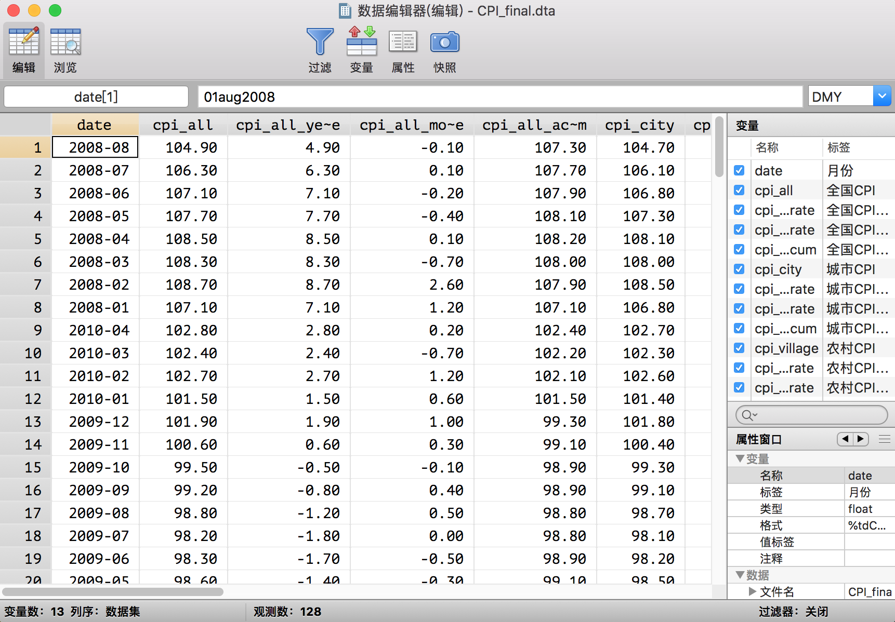
 
至此，这个爬取任务我们就算完成了。下面我们进行一个简单的应用——数据展示。

## 数据呈现
假如我想观察 CPI 的走势，需要绘制一幅线图：
```stata
use CPI_final, clear
gsort date
* 绘图
* 推荐使用我最喜欢的绘图主题plotplain
* 安装方法
ssc install blindschemes, replace all
* 把绘图主题永久性的设置为plotplain
set scheme plotplain, permanently
* 查看2018年6月对应的Stata日期
di date("2018-06", "YM")
* ///表示代码换行，注意下面几行绘图代码要一起运行
tw ///
line cpi_all date,  ///
	lc(blue*0.6) lp(solid)  ///
	xline(21336) ||  ///
line cpi_city date, lc(dkorange)  ///
	lp(solid) ||  ///
line cpi_village date, lc(orange_red) ||, ///
	ti("图：消费者价格指数走势", size(*1.2)) ///
	leg(pos(6) row(1))  ||  ///
scatteri 102.3 21336 (12) "2018年6月"
* 导出图片为png格式
gr export 20181004a1.png, replace
```


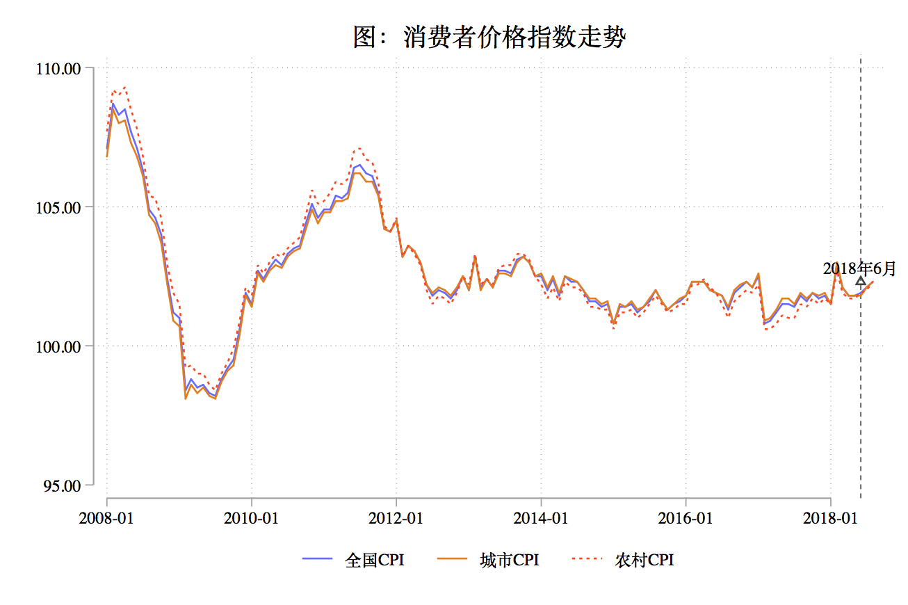

上面一些选项的含义：

+ ||: 用于分隔图层。
+ line: 用于绘制线图
+ tw: 全称是 twoway，用于组合多个图层
+ lc: 全称为 lcolor()用于控制线图的颜色
+ lp: 全称是 lpattern()用于控制线型
+ yline: 在指定位置画一条水平线
+ xline: 在指定位置画一条竖直线
+ ti: 全称是 title()，控制标题，size 用于控制标题文字大小，这里是 1.2 倍
+ leg: 全称是 legend()，控制图例，pos 用于控制图例的位置，
			这里是 6 点种方向，单行排列。
+ scatteri: 用于在指定的坐标处画个点。"2018 年 6 月"是这个点的标签, (12)用于指定这个标签位于点的方向，指定为 12 点钟方向。

<!--chapter:end:04-crawl.Rmd-->

# Stata 修图与操作记录

对于 Stata 初学者而言，一般在绘图的时候都会很头疼，因为 Stata 绘图命令的选项非常多且不容易记。不过幸好 Stata 提供了非常人性化的 GUI，让我们可以通过图形界面操作进行修图。然而我们都知道鼠标点击修图的坏处就是不可重复，就是说我们第一次经过一系列的鼠标点击操作的过程很难再次重复了。但是幸运的是如果我们使用 Stata 进行修图操作可以把修图操作保存成代码，这样再次绘图的时候直接运行代码即可。为了大家绘图不头疼，我这里讲一下如何在 Stata 进行修图并记录修图操作。

首先我们绘制一幅很不美观的图：
```stata
* 使用plotplain主题绘制
sysuse auto, clear
tw sc price weight
```


对于 MacOS 的 Stata 来说，图形窗口是这样的（WindowsOS 版本的 Stata 的图形窗口虽然不太一样，但是功能是一样的）：


点击图形编辑器（WindowsOS 版本的 Stata 是在图形窗口上右键选择`Start Graph Editor`），开始图形编辑操作：


这个时候你会发现窗口的右下角（WindowsOS 版本的 Stata 的图形窗口这三个按钮是在顶边栏）有三个按钮，第一个按钮是开始/结束记录修图操作，第二个按钮是暂停记录，第三个按钮是打开修图操作的宏文件（里面记录了每一步的修图操作）。

点击第一个按钮开始记录修图操作：

这个图形界面操作还是蛮容易懂的，大家四处点击试试就知道怎么用了，例如在右侧边栏可以选择对应的图形元素进行修改，例如修改纵轴标题：

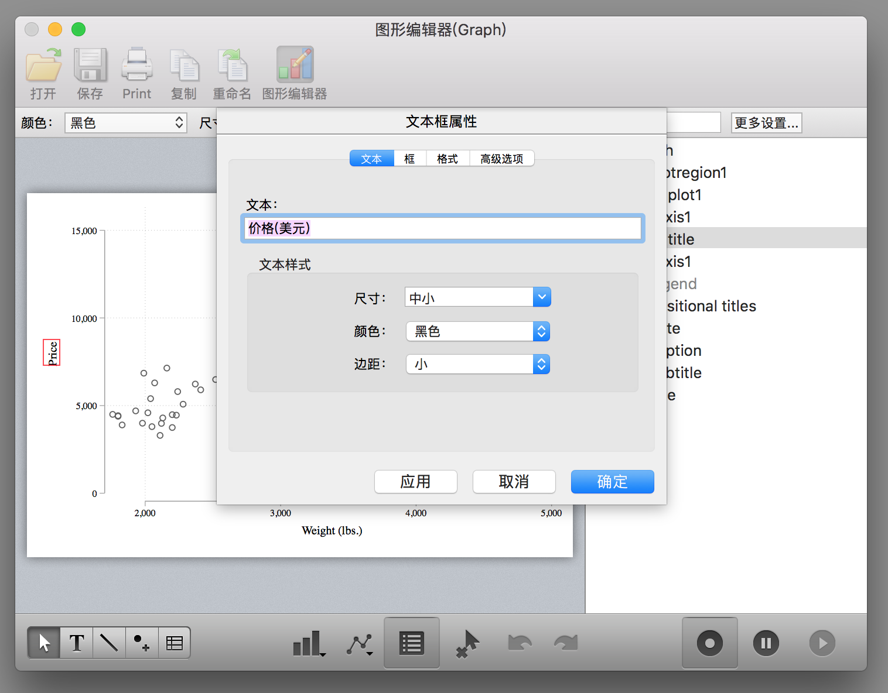

确定：


再例如把纵轴的标题移动到坐标轴的顶端：


再例如添加一些文字（点击下边栏的 T）


其它的功能大家可以自行探索。

修图操作完成之后，点击第二个按钮暂停修图操作或者点击第一个按钮保存修图操作为一个 grec 文件：


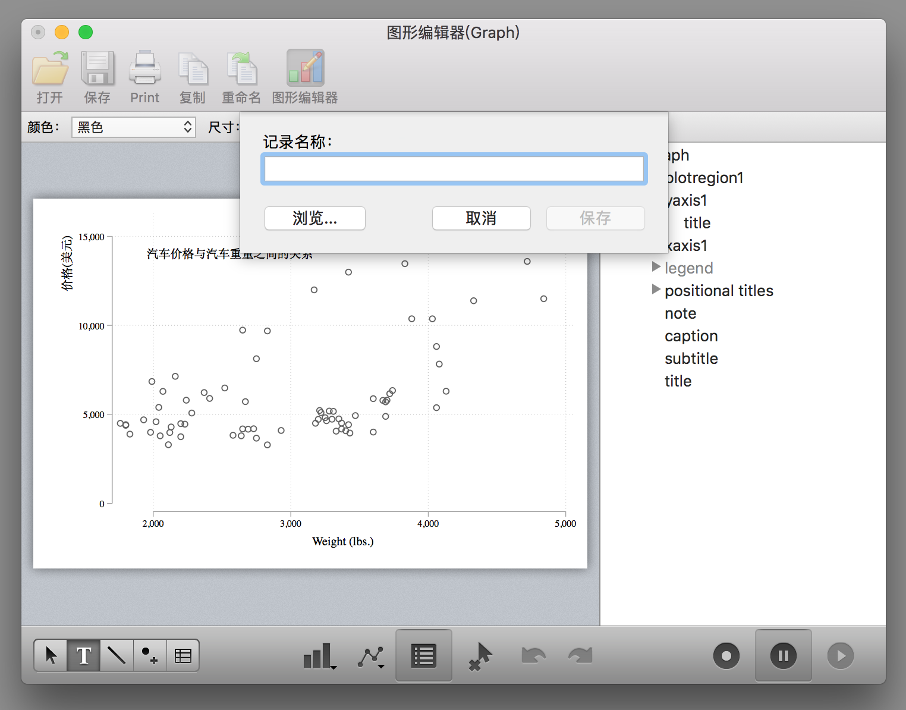


然后你就会在桌面发现一个 grec 文件了。

下面我们丢弃这幅图，运行刚刚的绘图代码：
```stata
sysuse auto, clear
tw sc price weight
```
重新绘制一幅没有修改的图，然后同样点击`图形编辑器`打开操作窗口，再点击右下角的第三个按钮 👉点击浏览👉选择刚刚保存的 grec 文件：


然后就会发现刚刚手动进行的操作被重新运行了一遍：


或者我们在绘图代码中加入这么一个选项也行，就一下也不要点击了：
```stata
tw sc price weight, play(myoperate)
```


但是这个必须要保证`myoperate.grec`文件存在才能正确运行，虽然代码简洁，但是如果我们不小心弄丢了`myoperate.grec`文件那不就完了！幸好 Stata 还提供了更令人拍案叫绝的操作，我们用文本编辑器打开这个`myoperate.grec`文件，可以看到里面的代码是这样的：
```stata
StataFileTM:00001:01100:GREC:                          :
00005:00004:00001:
*! classname: twowaygraph_g
*! family: twoway
*! date:  5 Oct 2018
*! time: 22:01:58
*! graph_scheme: plotplain
*! naturallywhite: 1
*! end

* File created by Graph Editor Recorder.
* Edit only if you know what you are doing.

.yaxis1.title.text = {}
.yaxis1.title.text.Arrpush 价格(美元)
* title edits

.yaxis1.title.DragBy 26.71715565298195 1.931360649613153
* title reposition

.plotregion1.AddTextBox added_text editor 14109.65584366113 1951.290247065128
.plotregion1.added_text_new = 1
.plotregion1.added_text_rec = 1
.plotregion1.added_text[1].style.editstyle  angle(default) ///
	size(medsmall) color(black) horizontal(left) vertical(middle) ///
	margin(zero) linegap(zero) drawbox(no) boxmargin(zero) ///
	fillcolor(bluishgray) linestyle( width(vthin) color(black) ///
	pattern(solid) align(inside)) box_alignment(east) editcopy
.plotregion1.added_text[1].text = {}
.plotregion1.added_text[1].text.Arrpush 汽车价格与汽车重量之间的关系
* editor text[1] edits


* <end>
```

虽然里面的代码很复杂，但是大致还是能看懂，我们把其中以`.`开头的行都复制到我们的 do 文件里面，记得在每行前面加上`gr_edit`，也就是说把绘图代码写成这个样子：
```stata
tw sc price weight

* 下面的代码是通过图形编辑器记录的
gr_edit .yaxis1.title.text = {}
gr_edit .yaxis1.title.text.Arrpush 价格(美元)
gr_edit .yaxis1.title.DragBy 26.71715565298195 1.931360649613153
gr_edit .plotregion1.AddTextBox added_text editor 14109.65584366113 1951.290247065128
gr_edit .plotregion1.added_text_new = 1
gr_edit .plotregion1.added_text_rec = 1
gr_edit ..plotregion1.added_text[1].style.editstyle  angle(default) ///
	size(medsmall) color(black) horizontal(left) vertical(middle) ///
	margin(zero) linegap(zero) drawbox(no) boxmargin(zero) ///
	fillcolor(bluishgray) linestyle( width(vthin) color(black) ///
	pattern(solid) align(inside)) box_alignment(east) editcopy
gr_edit .plotregion1.added_text[1].text = {}
gr_edit .plotregion1.added_text[1].text.Arrpush 汽车价格与汽车重量之间的关系
```
然后把上面的一大段代码运行一下你就会发现刚刚的那幅图又出现了！而且你还可以一步步的运行观察每一步的作用。

当然其实这个东西还有更强大的应用，例如通过下面的代码可以实现在图片的右边添加一个表格：
```stata
sysuse auto, clear
twoway scatter mpg rep78, msize(small) ||, ///
	graphregion(margin(r+50)) yti("里程数") ///
	xti("1978年的维修次数")

gr_edit AddTextBox added_text editor `=82+8' `=101'
gr_edit added_text_new = 1
gr_edit added_text_rec = 1
gr_edit added_text[1].text = {}
gr_edit added_text[1].text.Arrpush "Mean mpg by rep78"
gr_edit AddTextBox added_text editor `=82+2' `=112'
gr_edit added_text_new = 2
gr_edit added_text_rec = 2
gr_edit added_text[2].text = {}
gr_edit added_text[2].text.Arrpush "rep78  mpg"

* 按照rep78变量进行分组求mpg的均值
collapse mpg, by(rep78)

local z = 2

forvalues i=0/4 {
  local ++z
  gr_edit AddTextBox added_text editor `=80-(`i'*4)' `=114'
  gr_edit added_text_new = `z'
  gr_edit added_text_rec = `z'
  gr_edit added_text[`z'].text = {}
  gr_edit added_text[`z'].text.Arrpush ///
  "`=rep78[`z'-2]'      `=string(mpg[`z'-2],"%8.2f")' "
}
```

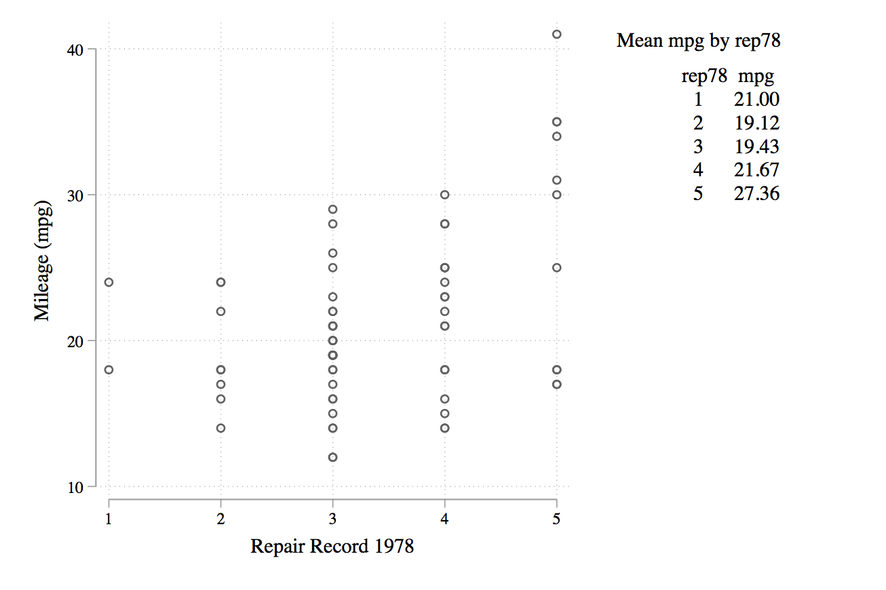

<!--chapter:end:05-chart.Rmd-->

# Stata 与 docx 文档的协同

注意：后来爬虫俱乐部对这些命令进行了更新，更新后的命令支持了字体的自定义，推荐直接学习爬虫俱乐部的相关命令：

```stata
ssc install reg2docx
ssc install corr2docx
ssc install sum2docx
```

在实证论文写作的时候我们经常需要在论文中使用三种表格：描述性统计表、回归表以及相关系数表（当然这个不是必须）。有时候变量特别多，这些表格的排版就变得十分困难，幸运的是，我们有 Stata15。Stata15 比起前代的 Stata 在文本编排上有着巨大的进步，简单来说，Stata15 可以直接写论文了。本文就以上周的作业为例，讲解如何使用 Stata15 进行文本编排。其中用到了 reg2docx、sum2docx 和 corr2docx 三个命令。这三个命令都是外部命令，由爬虫俱乐部编写。不过我觉得非常不地道。根本不是为中文论文写作编写的，所以我稍作改编以方便我们自己使用，改编后的命令名为 reg2docx2、sum2docx2 和 corr2docx2。

## 安装
首先安装这三个命令的中文适配版：
```stata
github install czxa/stata2docx, replace
```
暂时只修改了两个地方：
1. 把字体的默认参数设置为`"宋体", 14, black`。这个比较贴近我们的毕业论文排版要求，因为我们的毕业论文的要求就是正文宋体四号字。
2. 添加了自定义字体选项。

## 使用
安装好之后就可以使用 help 命令查看帮助文件了，我贴心的准备了中文的帮助文档。
```stata
help stata2docx
help corr2docx2
help reg2docx2
help sum2docx2
```

## 父母身高与子女身高
作为示例，我以上周的作业为例讲解如何使用 Stata 进行文本编排，如果想要完整的学习 Stata 编排 docx 文档，还要自己对着 help 文档学习。
Stata15 的 docx 文本编排主要使用 pudocx 命令，

文档的创建一般分为三步
1. 创建用于输出的文件；
2. 文本操作；
3. 关闭保存文件。

putdocx 命令的使用方法也是如此：
```stata
clear all
* 首先打开文档，设置纸张大小为A4，字体为宋体、14号（即四号字）
putdocx begin, pagesize(A4) font("宋体", 14, black)
* 开启一个段落，居中，设置风格为标题（为了写标题）
putdocx paragraph, halign(center) style(Title)
putdocx text ("使用Stata可进行docx文件的排版"), bold ///
	font("宋体", 18, black)
* 新段落，副标题
putdocx paragraph, halign(center) style(Subtitle)
* linebreak：在文本后断行
putdocx text ("程振兴"), bold font("华文楷体", 12, black) linebreak
putdocx text ("2018年10月9日"), bold ///
	font("华文楷体", 12, black) linebreak
* 保存文档
putdocx save mydoc.docx, replace
```
然后我们运行刚刚的代码，打开 mydoc.docx 文件：


可能这个副标题的斜体风格不是我们想要的，那就去掉`style(Subtitle)`选项就好了。

继续，下面我们先把题目抄上去：
```stata
* 把题目抄写上去
* 打开文档
putdocx begin
* 开启一个新段落，为段落设置字体
putdocx paragraph, halign(left) font("华文楷体", 14, black)
* 为这两个字单独设置字体
putdocx text ("【作业】"), bold font("宋体", 14, black)
putdocx text ("数据集galton.dta 包含了Galton(1886)的原始数据集。///
变量parent为父母的平均身高（英寸），而child为子女的身高（英寸）。///
其中，为平衡身高的性别差异，女性身高（包括母亲和女儿）///
均乘以1.08。"), linebreak
putdocx text ("（1）计算变量child与parent的基本统计特征；"), linebreak
putdocx text ("（2）将变量child与parent的散点图和线性拟合图画在一起；"), ///
	linebreak
putdocx text ("（3）考虑一下回归方程："), linebreak

* 开启新段落，这段是公式，比较费事
putdocx paragraph, halign(center) font("宋体", 14, black)

putdocx text ("child"),
putdocx text ("i"), script(sub)
putdocx text (" = ")
putdocx text ("α")
putdocx text (" + ")
putdocx text ("β")
putdocx text (" * ")
putdocx text ("parent")
* 下标
putdocx text ("i"), script(sub)
putdocx text (" + ")
putdocx text ("ε")
putdocx text ("i"), script(sub)
putdocx text ("    ")
putdocx text ("(4.46)"), linebreak

* 新段落，楷体
putdocx paragraph, halign(left) font("华文楷体", 14, black)
putdocx text ("其中，随机扰动项 ε")
putdocx text ("i"), script(sub)
putdocx text ("代表哪些因素？"), linebreak
* 因为代码太长，所以我用三道斜线换个行
putdocx text ("（4）使用OLS估计上面的方程(4.46)并回答：///
父母的身高每增加1英寸，子女的身高平均将增加多少？///
父母的身高可以解释子女身高变动的百分之几？"), linebreak
putdocx text ("（5）定义parent_dev为父母的身高减去父母那一///
辈人的平均身高，并定义gengap为子女身高减去父母身高。将///
gengap对parent_dev进行回归，是否存在“回归均值现象”？"), linebreak
* 保存，注意应该是append，指定接在上面的那个文档后面
putdocx save mydoc.docx, append
```


接下来开始解答这道题：
```stata
putdocx begin, font("宋体", 14, black)
putdocx paragraph, halign(left)
putdocx text ("【解答】"), bold linebreak
putdocx text ("(1) child和parent变量的描述性统计表")
putdocx pagebreak
putdocx paragraph, halign(center)
putdocx text ("表1.1 child和parent变量的描述性统计表")
putdocx save mydoc.docx, append
```


接下来我们是要添加一个描述性统计表。使用 sum2docx2 即可：
```stata
cuse galton, c w
* 实际上font("宋体", 14, black)是默认选项，不加也一样
sum2docx2 child parent using mydoc.docx, append ///
	obs mean(%9.2f) sd min(%9.2f) max(%9.2f) ///
	font("宋体", 14, black)

putdocx begin, font("宋体", 14, black)
putdocx paragraph, halign(left)
putdocx text ("(2) child与parent的散点图和线性拟合图: ")
putdocx save mydoc.docx, append
```


接下来第二题，画个图然后放进去，注意按照毕业论文的要求，图标题放置在图片的下方，表标题放置在表的上方。：
```stata
tw ///
sc child parent || ///
lfit child parent ||, ///
	leg(off) ///
	xti("父母的平均身高(英寸)") ///
	yti("子女的平均身高(英寸)") ///
	xlab(64(1)74)
gr export img1.png, replace

putdocx begin, font("宋体", 14, black)
putdocx paragraph, halign(center)
putdocx image "img1.png"
putdocx text ("图1.1 child与parent的散点图和线性拟合图")
putdocx save mydoc.docx, append
```


编排效果：


继续：
```stata
putdocx begin, font("宋体", 14, black)
putdocx paragraph, halign(left)
putdocx text ("(3) 例如营养水平，后期运动量情况等。///
只要是不由父母的遗传决定但是会影响人身高的因素///
差不多都在里面了。"), linebreak
putdocx text ("(4) 首先估计方程(4.46)，回归结果如下："), linebreak
putdocx pagebreak
putdocx paragraph, halign(center)
putdocx text ("表1.2 模型估计表")
putdocx save mydoc.docx, append
```

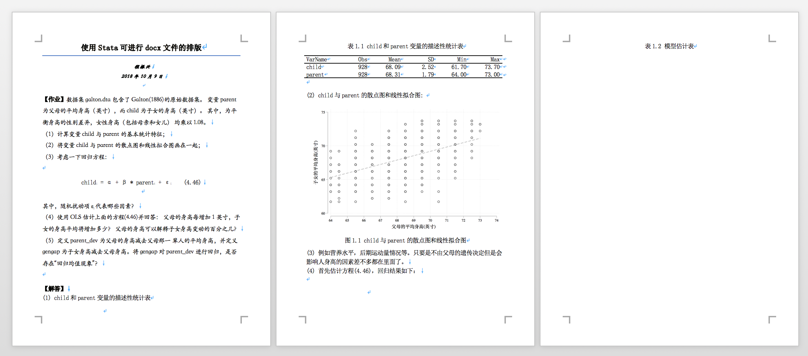

再接下来就是一件大活了，把回归结果放在文档中，一般论文里面都要用到三五个模型，甚至更多，涉及的变量往往七八九十个，回归系数、显著性水平加起来估计有七八九十一百个。手动制表往往非常困难，使用 reg2docx 就能很方便的解决这个问题：
```stata
qui reg child parent
est store m1
reg2docx2 m1 using mydoc.docx, append b(%6.2f) p(%6.4f) ///
	mtitles("OLS") r2(%6.2f) ar2(%6.2f) font("宋体", 14, black)
```

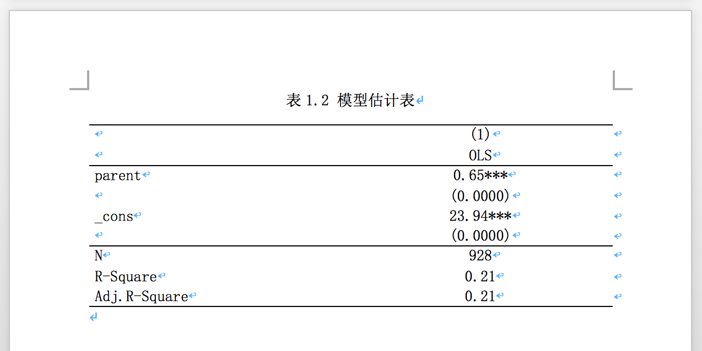

帮助文档中有更加复杂的例子，我们也来尝试一下：
```stata
clear
set obs 1000
gen x1 = uniform()
gen x2 = uniform()
gen x3 = uniform()
gen x4 = uniform()
gen x5 = uniform()
gen x6 = uniform()
gen ind = mod(_n,10)
tab ind, gen(ind)
gen y = 0.4+.5*x1+.6*x2+.7*x3+.8*x4+rnormal()*3
replace y = y-.7*x5-.8*x6
forvalue i = 1(1)10{
	replace y = y+sqrt(`i')*ind`i'
}
reg y x1 x5 x6 ind2-ind10
est store m1
reg y x1 x2 x5 x6 ind2-ind10
est store m2
reg y x1 x2 x3 x5 x6 ind2-ind10
est store m3
reg y x1 x2 x3 x4 x5 x6 ind2-ind10
est store m4
reg2docx2 m1 m2 m3 m4 using mydoc.docx, append ///
	indicate("ind=ind*") drop(x2 x3) r2(%9.3f) ///
	ar2(%9.2f) order(x6 x5) b(%9.3f) t(%7.2f) ///
	title(table2: OLS regression results) ///
	mtitles("model 1" "model 2" "" "model 4")
```


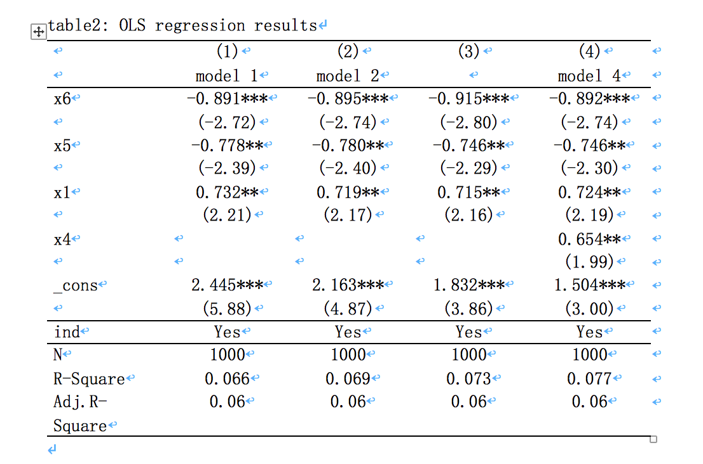

可以看出，虽然这个命令里面有添加表格标题的功能，但是不建议使用，建议像我刚才那样自己添加标题。

删除掉刚刚的那段，继续做作业：
```stata
putdocx text ("(5) 生成新变量进行回归，回归结果如下："), linebreak
putdocx paragraph, halign(center)
putdocx text ("表1.3 模型估计表")
putdocx save mydoc.docx, append

cuse galton, c
egen parent_dev = mean(parent)
replace parent_dev = parent - parent_dev
* 或者也可以这样
* sum parent
* gen parent_dev = parent - r(mean)
gen gengap = child - parent

reg gengap parent_dev
qui reg child parent
est store m2
reg2docx2 m2 using mydoc.docx, append b(%6.2f) ///
p(%6.4f) mtitles("OLS") r2(%6.2f) ar2(%6.2f)

putdocx begin, font("宋体", 14, black)
putdocx paragraph, halign(left)
putdocx text ("可以看到回归系数为 -0.35 < 0，也就是说父母的身高///
越偏离其同辈的平均身高(也就是越高)，其子女与父辈的身高差越低。///
因此存在“回归均值的现象”。"), linebreak
putdocx save mydoc.docx, append
```
编排效果：


至此，我们的作业就完成了。下面再补充 corr2docx2 的使用：

```stata
* 最后作为演示，我再讲解一下corr2docx的用法：
putdocx begin, font("宋体", 14, black)
putdocx pagebreak
putdocx paragraph, halign(center)
putdocx text ("表1.4 相关系数表")
putdocx save mydoc.docx, append

corr2docx2 child parent gengap parent_dev using mydoc.docx, ///
append star(** 0.01 * 0.05)  font("宋体", 14, black) ///
notefont("宋体", 10, black)
```


这样我们就完成了这篇小文章的编排，最后附上完整代码：
```stata
* 首先打开文件：
clear all
putdocx begin, pagesize(A4) font("宋体", 14, black)
putdocx paragraph, halign(center) style(Title)
putdocx text ("使用Stata可进行docx文件的排版"), bold ///
	font("宋体", 18, black)
putdocx paragraph, halign(center) style(Subtitle)
putdocx text ("程振兴"), bold font("华文楷体", 12, black) linebreak
putdocx text ("2018年10月9日"), bold font("华文楷体", 12, black) ///
	linebreak
putdocx save mydoc.docx, replace

* 把题目抄写上去
* 打开文档
putdocx begin
* 开启一个新段落，为段落设置字体
putdocx paragraph, halign(left) font("华文楷体", 14, black)
* 为这两个字单独设置字体
putdocx text ("【作业】"), bold font("宋体", 14, black)
putdocx text ("数据集galton.dta 包含了Galton(1886)的原始数据集。///
变量parent为父母的平均身高（英寸），而child为子女的身高（英寸）。///
其中，为平衡身高的性别差异，女性身高（包括母亲和女儿）///
均乘以1.08。"), linebreak
putdocx text ("（1）计算变量child与parent的基本统计特征；"), linebreak
putdocx text ("（2）将变量child与parent的散点图和线性拟合图画在一起；"), ///
	linebreak
putdocx text ("（3）考虑一下回归方程："), linebreak

* 开启新段落，这段是公式，比较费事
putdocx paragraph, halign(center) font("宋体", 14, black)

putdocx text ("child"),
putdocx text ("i"), script(sub)
putdocx text (" = ")
putdocx text ("α")
putdocx text (" + ")
putdocx text ("β")
putdocx text (" * ")
putdocx text ("parent")
* 下标
putdocx text ("i"), script(sub)
putdocx text (" + ")
putdocx text ("ε")
putdocx text ("i"), script(sub)
putdocx text ("    ")
putdocx text ("(4.46)"), linebreak

* 新段落，楷体
putdocx paragraph, halign(left) font("华文楷体", 14, black)
putdocx text ("其中，随机扰动项 ε")
putdocx text ("i"), script(sub)
putdocx text ("代表哪些因素？"), linebreak
* 因为代码太长，所以我用三道斜线换个行
putdocx text ("（4）使用OLS估计上面的方程(4.46)并回答：///
父母的身高每增加1英寸，子女的身高平均将增加多少？///
父母的身高可以解释子女身高变动的百分之几？"), linebreak
putdocx text ("（5）定义parent_dev为父母的身高减去父母那一///
辈人的平均身高，并定义gengap为子女身高减去父母身高。将///
gengap对parent_dev进行回归，是否存在“回归均值现象”？"), linebreak
* 保存，注意应该是append，指定接在上面的那个文档后面
putdocx save mydoc.docx, append

putdocx begin, font("宋体", 14, black)
putdocx paragraph, halign(left)
putdocx text ("【解答】"), bold linebreak
putdocx text ("(1) child和parent变量的描述性统计表")
putdocx pagebreak
putdocx paragraph, halign(center)
putdocx text ("表1.1 child和parent变量的描述性统计表")
putdocx save mydoc.docx, append

cuse galton, c
sum2docx2 child parent using mydoc.docx, append ///
	obs mean(%9.2f) sd min(%9.2f) max(%9.2f) ///
	font("宋体", 14, black)

putdocx begin, font("宋体", 14, black)
putdocx paragraph, halign(left)
putdocx text ("(2) child与parent的散点图和线性拟合图: ")
putdocx save mydoc.docx, append

* tw ///
* sc child parent || ///
* lfit child parent ||, ///
* 	leg(off) ///
* 	xti("父母的平均身高(英寸)") ///
* 	yti("子女的平均身高(英寸)") ///
* 	xlab(64(1)74)
* gr export img1.png, replace

putdocx begin, font("宋体", 14, black)
putdocx paragraph, halign(center)
putdocx image "img1.png"
putdocx text ("图1.1 child与parent的散点图和线性拟合图")
putdocx save mydoc.docx, append

putdocx begin, font("宋体", 14, black)
putdocx paragraph, halign(left)
putdocx text ("(3) 例如营养水平，后期运动量情况等。///
只要是不由父母的遗传决定但是会影响人身高的因素差不多都///
在里面了。"), linebreak
putdocx text ("(4) 首先估计方程(4.46)，回归结果如下："), linebreak
putdocx pagebreak
putdocx paragraph, halign(center)
putdocx text ("表1.2 模型估计表")
putdocx save mydoc.docx, append

qui reg child parent
est store m1
reg2docx2 m1 using mydoc.docx, append b(%6.2f) p(%6.4f) ///
	mtitles("OLS") r2(%6.2f) ar2(%6.2f) font("宋体", 14, black)

putdocx begin, font("宋体", 14, black)
putdocx paragraph, halign(left)
putdocx text ("回归结果显示父母的身高每增加1英寸，///
子女的身高平均将增加0.65英寸。父母的身高可以解释子女///
身高变动的21.05%。"), linebreak

putdocx text ("(5) 生成新变量进行回归，回归结果如下："), linebreak
putdocx paragraph, halign(center)
putdocx text ("表1.3 模型估计表")
putdocx save mydoc.docx, append

cuse galton, c
egen parent_dev = mean(parent)
replace parent_dev = parent - parent_dev
* 或者也可以这样
* sum parent
* gen parent_dev = parent - r(mean)
gen gengap = child - parent

reg gengap parent_dev
qui reg child parent
est store m2
reg2docx2 m2 using mydoc.docx, append b(%6.2f) ///
p(%6.4f) mtitles("OLS") r2(%6.2f) ar2(%6.2f)

putdocx begin, font("宋体", 14, black)
putdocx paragraph, halign(left)
putdocx text ("可以看到回归系数为 -0.35 < ///
0，也就是说父母的身高越偏离其同辈的平均身高(也就///
是越高)，其子女与父辈的身高差越低。因此存在“回归均值///
的现象”。"), linebreak
putdocx save mydoc.docx, append

* 最后作为演示，我再讲解一下corr2docx的用法：
putdocx begin, font("宋体", 14, black)
putdocx pagebreak
putdocx paragraph, halign(center)
putdocx text ("表1.4 相关系数表")
putdocx save mydoc.docx, append

corr2docx2 child parent gengap parent_dev using ///
mydoc.docx, append star(** 0.01 * 0.05) ///
font("宋体", 14, black) notefont("宋体", 10, black)
```

<!--chapter:end:06-docx.Rmd-->

# 习题讲解

## 习题 6.5
**【题目】：**
使用数据集 `grilic.dta`，以稳健标准误估计下面的回归方程：

$$
ln w = \beta_{1} + \beta_{2} s + \beta_{3} expr + \beta_{4} tenure + \beta_{5} smsa + \varepsilon
$$

1. 使用全样本，估计方程（6.43）。
2. 使用美国南方的子样本，估计方程（6.43）。
3. 使用美国北方的子样本，估计方程（6.43）。
4. 与全样本相比，子样本估计量的标准误有何变化，为什么？

**【解答】：**

（1）：使用全样本：
```stata
cuse grilic, clear web
// 因为我的数据里面的lnw的名字是lw，为了和书上的统一，重命名为lnw
ren lw lnw
reg lnw s expr tenure smsa, r

*> Linear regression                               Number of obs     =        758
*>                                                 F(4, 753)         =      98.36
*>                                                 Prob > F          =     0.0000
*>                                                 R-squared         =     0.3448
*>                                                 Root MSE          =     .34813
*> ------------------------------------------------------------------------------
*>              |               Robust
*>          lnw |      Coef.   Std. Err.      t    P>|t|     [95% Conf. Interval]
*> -------------+----------------------------------------------------------------
*>            s |   .1035073   .0062235    16.63   0.000     .0912899    .1157247
*>         expr |   .0381933   .0066362     5.76   0.000     .0251656     .051221
*>       tenure |   .0363505   .0081018     4.49   0.000     .0204457    .0522554
*>         smsa |   .1523258   .0276534     5.51   0.000      .098039    .2066127
*>        _cons |   4.059067   .0861023    47.14   0.000     3.890038    4.228096
*> ------------------------------------------------------------------------------
```

根据估计结果，拟合的模型为：

$$
lnw = 4.059 + 0.104s + 0.036expr + 0.152smsa +\hat{\varepsilon}
$$


（2）：使用南方样本(rns == 1)估计
```stata
reg lnw s expr tenure smsa if rns, r

*> Linear regression                               Number of obs     =        204
*>                                                 F(4, 199)         =      36.04
*>                                                 Prob > F          =     0.0000
*>                                                 R-squared         =     0.4203
*>                                                 Root MSE          =     .34929
*> ------------------------------------------------------------------------------
*>              |               Robust
*>          lnw |      Coef.   Std. Err.      t    P>|t|     [95% Conf. Interval]
*> -------------+----------------------------------------------------------------
*>            s |   .1198242   .0120804     9.92   0.000     .0960021    .1436463
*>         expr |   .0451903   .0143038     3.16   0.002     .0169839    .0733967
*>       tenure |   .0092643   .0177777     0.52   0.603    -.0257926    .0443211
*>         smsa |   .1746563   .0496961     3.51   0.001     .0766579    .2726548
*>        _cons |   3.806148   .1582838    24.05   0.000     3.494019    4.118276
*> ------------------------------------------------------------------------------
```

根据估计结果，拟合的模型为：

$$
lnw = 3.806 + 0.120s + 0.045expr + 0.175smsa +\hat{\varepsilon}
$$


（3）：使用北方样本(rns == 0)估计：

```stata
reg lnw s expr tenure smsa if !rns, r

*> Linear regression                               Number of obs     =        554
*>                                                 F(4, 549)         =      59.45
*>                                                 Prob > F          =     0.0000
*>                                                 R-squared         =     0.3127
*>                                                 Root MSE          =     .34356
*> ------------------------------------------------------------------------------
*>              |               Robust
*>          lnw |      Coef.   Std. Err.      t    P>|t|     [95% Conf. Interval]
*> -------------+----------------------------------------------------------------
*>            s |   .0944787   .0072808    12.98   0.000      .080177    .1087804
*>         expr |   .0358675   .0073509     4.88   0.000     .0214281    .0503068
*>       tenure |   .0455117   .0088423     5.15   0.000     .0281429    .0628806
*>         smsa |   .1199364    .034029     3.52   0.000     .0530934    .1867794
*>        _cons |   4.214014    .103448    40.74   0.000     4.010812    4.417217
*> ------------------------------------------------------------------------------
```

根据估计结果，拟合的模型为：

$$
lnw = 4.021 + 0.094s + 0.036expr + 0.120smsa +\hat{\varepsilon}
$$


（4）：比较

三个模型的估计量标准误如下：

估计参数|全样本 | 北方样本 | 南方样本
:-:|:-:|:-:|:-:
s | 0.0062  | 0.0073 | 0.0120
expr | 0.0066 | 0.0074 | 0.0143
tenure | 0.0081 | 0.0088 | 0.0178
smsa | 0.0277 | 0.0340 | 0.0497
\_cons | 0.0861 | 0.1034 | 0.1583

还可以把这个画出来，如图\ref{fig:pic65}：

```{r pic65, echo=FALSE, fig.align='center', fig.cap = '模型比较', out.width='90%'}
knitr::include_graphics('assets/6_5模型比较.png')
```

从图中可以很容易看出全样本估计的模型各个参数的标准误都较子样本的小。这是当样本量增加时，样本更加接近总体，对参数的估计自然更加准确，标准误会更小。

绘图代码：
```stata
clear
input str10 var sd1 sd2 sd3
"s" 0.0062  0.0073 0.0120
"expr" 0.0066 0.0074 0.0143
"tenure" 0.0081 0.0088 0.0178
"smsa" 0.0277 0.0340 0.0497
"_cons" 0.0861 0.1034 0.1583
end
reshape long sd, i(var) j(m)
encode var, gen(varlab) lab(var)
* colorscheme是一个选择配色的命令，安装方法：
* net install colorscheme.pkg, from("https://github.com/matthieugomez/stata-colorscheme/raw/master/")
* 详细介绍可以参考我的这篇博客：https://www.czxa.top/posts/16049/
colorscheme 3, palette(Dark2)
ret list
tw ///
line sd varlab if m == 1, lp(solid) lc("`r(color1)'") || ///
line sd varlab if m == 2, lp(solid) lc("`r(color2)'") || ///
line sd varlab if m == 3, lp(solid) lc("`r(color3)'") ||, ///
xlab(, val labsize(*1.2)) ylab(, format(%6.2f) labsize(*1.2)) ///
xti("估计参数") yti("标准误") ///
leg(order(1 "全样本" 2 "北方样本" 3 "南方样本") pos(6) row(1))
gr export "6_5模型比较.png", replace
```

另外一种办法是把标准误存储起来使用：
```stata
cuse grilic, clear
ren lw lnw
reg lnw s expr tenure smsa, r
ret list
mat list r(table)
mat m1 = r(table)
mat list m1

reg lnw s expr tenure smsa if rns, r
mat m2 = r(table)

reg lnw s expr tenure smsa if !rns, r
mat m3 = r(table)

mat list m1
mat list m2
mat list m3

clear
gen var = ""
gen sd1 = .
gen sd2 = .
gen sd3 = .
set obs 5

di m1[1,1]
forval i = 1/`=_N'{
	replace sd1 = m1[2, `i'] in `i'
	replace sd2 = m2[2, `i'] in `i'
	replace sd3 = m3[2, `i'] in `i'
}

local k = 1
foreach j in "s" "expr" "tenure" "smsa" "_cons"{
	replace var = "`j'" in `k'
	local ++k
}
reshape long sd, i(var) j(m)
encode var, gen(varlab) lab(var)
colorscheme 3, palette(Dark2)
ret list
tw ///
line sd varlab if m == 1, lp(solid) lc("`r(color1)'") || ///
line sd varlab if m == 2, lp(solid) lc("`r(color2)'") || ///
line sd varlab if m == 3, lp(solid) lc("`r(color3)'") ||, ///
xlab(, val labsize(*1.2)) ylab(, format(%6.2f) labsize(*1.2)) ///
xti("估计参数") yti("标准误") ///
leg(order(1 "全样本" 2 "南方样本" 3 "北方样本") pos(6) row(1))
gr export "6_5模型比较.png", replace
```

---

## 习题 6.6

**【题目】：**
房屋的价格如何决定？一种理论认为，房价由房屋的性能决定，成为“特征价格法”。数据集`hprice2a.dta`包含了美国波士顿 506 个社区的房屋中位数价格的横截面数据。考虑以下特征价格回归：

$$
lprice_i = \beta_1 + \beta_2lnox_i + \beta_3ldist_i + \beta_4rooms_i + \beta_5stratio_i + \varepsilon_i
$$

其中，$lprice$为房价的对数，$lnox$为空气污染程度的对数，$ldist$为社区到就业中心距离的对数，$rooms$为房屋的平均房间数，$stratio$为社区学校的`学生 - 教师`比例，下标$i$表示社区$i$。

（1）使用普通标准误进行回归，并评论解释变量系数的符号、统计显著性及经济意义。
（2）使用稳健标准误进行回归，稳健标准误和普通标准误差别大么？
（3）使用稳健标准误，以 5%的显著性水平，检验$H_0: \beta_3 = \beta_5$。
（4）使用稳健标准误，以 5%的显著性水平，检验$H_0: \beta_4 = 0.31$与$H_0: \beta_4 = 0.30$。

**【解答】**

（1）：普通标准误回归
```stata
cuse hprice2a, clear
gen ldist = ln(dist)
reg lprice lnox ldist rooms stratio

*>       Source |       SS           df       MS      Number of obs   =       506
*> -------------+----------------------------------   F(4, 501)       =    175.86
*>        Model |  49.3987735         4  12.3496934   Prob > F        =    0.0000
*>     Residual |  35.1834974       501  .070226542   R-squared       =    0.5840
*> -------------+----------------------------------   Adj R-squared   =    0.5807
*>        Total |  84.5822709       505  .167489645   Root MSE        =      .265
*> ------------------------------------------------------------------------------
*>       lprice |      Coef.   Std. Err.      t    P>|t|     [95% Conf. Interval]
*> -------------+----------------------------------------------------------------
*>         lnox |    -.95354   .1167418    -8.17   0.000    -1.182904   -.7241762
*>        ldist |  -.1343401   .0431032    -3.12   0.002    -.2190255   -.0496548
*>        rooms |   .2545271   .0185303    13.74   0.000     .2181203    .2909338
*>      stratio |  -.0524512   .0058971    -8.89   0.000    -.0640373   -.0408651
*>        _cons |   11.08387   .3181115    34.84   0.000     10.45887    11.70886
*> ------------------------------------------------------------------------------
```

1. lnox：系数为负，在 5%的显著性水平上显著，表示空气污染程度每加剧 1%，房价平均下跌 0.95%；
2. ldist：系数为负，在 5%的显著性水平上显著，表示社区到就业中心的距离每增加 1%，房价平均下跌 0.13%；
3. rooms：系数为正，在 5%的显著性水平上显著，表示房屋的平均房间数增加 1，房价平均上涨 25.45%；
4. stratio：系数为负，在 5%的显著性水平上显著，表示社区学校的学生-教师比例每提高一个单位，房价平均下跌 5.24%。

（2）：稳健标准误的回归
```stata
reg lprice lnox ldist rooms stratio, r

*> Linear regression                               Number of obs     =        506
*>                                                 F(4, 501)         =     146.27
*>                                                 Prob > F          =     0.0000
*>                                                 R-squared         =     0.5840
*>                                                 Root MSE          =       .265
*> ------------------------------------------------------------------------------
*>              |               Robust
*>       lprice |      Coef.   Std. Err.      t    P>|t|     [95% Conf. Interval]
*> -------------+----------------------------------------------------------------
*>         lnox |    -.95354   .1268006    -7.52   0.000    -1.202667   -.7044135
*>        ldist |  -.1343401   .0535287    -2.51   0.012    -.2395086   -.0291717
*>        rooms |   .2545271   .0247204    10.30   0.000     .2059586    .3030956
*>      stratio |  -.0524512   .0046082   -11.38   0.000     -.061505   -.0433974
*>        _cons |   11.08387   .3772952    29.38   0.000     10.34259    11.82514
*> ------------------------------------------------------------------------------
```

显然差别不大。


（3）：5%显著性水平，检验$\beta_3 = \beta_5$
```stata
test ldist = stratio

*> ( 1)  ldist - stratio = 0
*>
*>       F(  1,   501) =    2.27
*>            Prob > F =    0.1322
```

p 值大于 5%，不显著，因此无法拒绝原假设。


（4）：5% 显著性水平，检验$\beta_4 = 0.31 / 0.30$

```stata
test rooms = 0.31

*> ( 1)  rooms = .31

*>       F(  1,   501) =    5.04
*>            Prob > F =    0.0253

test rooms = 0.30

*> ( 1)  rooms = .3
*>
*>       F(  1,   501) =    3.38
*>            Prob > F =    0.0664
```
第一个检验的结果是拒绝原假设的，第二个结果是无法拒绝原假设。

---

## 习题 7.2

**【题目】**
房价的回归是否存在异方差？继续考虑上题中的房价模型：
1. 以 5%的置信度，使用 BP 检验，检验是否存在异方差（假设扰动项为 iid，分别以拟合值$\hat{y}以及所有解释变量进行检验$）。
2. 以 5%的置信度，使用怀特检验，检验是否存在异方差。

**【解答】**

（1）：BP 检验
首先是以拟合值进行检验：
```stata
cuse hprice2a, clear
gen ldist = ln(dist)
qui reg lprice lnox ldist rooms stratio
estat hettest, iid

*> Breusch-Pagan / Cook-Weisberg test for heteroskedasticity
*>          Ho: Constant variance
*>          Variables: fitted values of lprice
*> 
*>          chi2(1)      =    37.57
*>          Prob > chi2  =   0.0000
```

然后再使用所有的解释变量进行检验：
```stata
estat hettest, iid rhs

*> Breusch-Pagan / Cook-Weisberg test for heteroskedasticity
*>          Ho: Constant variance
*>          Variables: lnox ldist rooms stratio
*> 
*>          chi2(4)      =    69.87
*>          Prob > chi2  =   0.0000
```
两次检验的结果都强烈拒绝拒绝同方差的原假设，因为认为存在异方差。

（2）：怀特检验

```stata
estat imtest, white

*> White's test for Ho: homoskedasticity
*>          against Ha: unrestricted heteroskedasticity

*>          chi2(14)     =    143.98
*>          Prob > chi2  =    0.0000

*> Cameron & Trivedi's decomposition of IM-test

*> ---------------------------------------------------
*>               Source |       chi2     df      p
*> ---------------------+-----------------------------
*>   Heteroskedasticity |     143.98     14    0.0000
*>             Skewness |      16.99      4    0.0019
*>             Kurtosis |      11.30      1    0.0008
*> ---------------------+-----------------------------
*>                Total |     172.26     19    0.0000
*> ---------------------------------------------------
```

结果同样强烈拒绝同方差的原假设，认为存在异方差。

## 习题 7.3

**【题目】**
恩格尔系数是否存在异方差？数据集`food.dta`包含有关每周食物开支(food_exp)和周收入(income)的 40 个观测值。
1. 将 food_exp 和 income 的散点图和线性拟合图画在一起。根据此图，是否可能存在异方差？此异方差和收入的关系是怎样的？
2. 将 food_exp 对 income 进行回归。
3. 以 5%的置信度，使用 BP 检验，检验是否存在异方差（iid 假设）。
4. 以 5%的置信度，使用怀特检验，检验是否存在异方差。
5. 定义食物开支比例 food_share = food_exp/income，将 food_share 与 income 的散点图与线性拟合图画在一起。从图上看，是否还存在异方差？
6. 将 food_share 对 income 进行回归。
7. 5%、BP 检验、iid。
8. 5%、怀特检验。

**【解答】**

（1）：图表
```stata
cuse food, clear
tw ///
sc food_exp income || ///
lfit food_exp income ||, ///
leg(pos(6) row(1))
gr export "7_3恩格尔系数1.png", replace
```

```{r pic73, echo=FALSE, fig.align='center', fig.cap = '恩格尔系数', out.width='90%'}
knitr::include_graphics('assets/7_3恩格尔系数1.png')
```


从图\ref{fig:pic73}可以看出，很可能存在异方差，并且收入越高方差越大。


（2）：回归
```stata
reg food_exp income

*>       Source |       SS           df       MS      Number of obs   =        40
*> -------------+----------------------------------   F(1, 38)        =     23.79
*>        Model |  190626.976         1  190626.976   Prob > F        =    0.0000
*>     Residual |  304505.177        38  8013.29412   R-squared       =    0.3850
*> -------------+----------------------------------   Adj R-squared   =    0.3688
*>        Total |  495132.153        39  12695.6962   Root MSE        =    89.517
*> ------------------------------------------------------------------------------
*>     food_exp |      Coef.   Std. Err.      t    P>|t|     [95% Conf. Interval]
*> -------------+----------------------------------------------------------------
*>       income |   .1020964   .0209326     4.88   0.000     .0597205    .1444723
*>        _cons |   83.41601   43.41016     1.92   0.062     -4.46327    171.2953
*> ------------------------------------------------------------------------------
```

拟合的模型为：

$$
food\_exp = 83.416 + 0.102income + \varepsilon
$$


（3）：BP 检验
```stata
estat hettest, iid

*> Breusch-Pagan / Cook-Weisberg test for heteroskedasticity
*>          Ho: Constant variance
*>          Variables: fitted values of food_exp
*>          chi2(1)      =     7.38
*>          Prob > chi2  =   0.0066

estat hettest, iid rhs

*> Breusch-Pagan / Cook-Weisberg test for heteroskedasticity
*>          Ho: Constant variance
*>          Variables: income
*>          chi2(1)      =     7.38
*>          Prob > chi2  =   0.0066
```

两个 BP 检验的结果都强烈拒绝同方差的原假设，因此认为存在异方差。


（4）：怀特检验
```stata
estat imtest, white

*> White's test for Ho: homoskedasticity
*>          against Ha: unrestricted heteroskedasticity

*>          chi2(2)      =      7.56
*>          Prob > chi2  =    0.0229

*> Cameron & Trivedi's decomposition of IM-test

*> ---------------------------------------------------
*>               Source |       chi2     df      p
*> ---------------------+-----------------------------
*>   Heteroskedasticity |       7.56      2    0.0229
*>             Skewness |       0.13      1    0.7146
*>             Kurtosis |       0.00      1    0.9825
*> ---------------------+-----------------------------
*>                Total |       7.69      4    0.1036
*> ---------------------------------------------------
```
怀特检验的结果也强烈拒绝同方差的原假设，因此认为存在异方差。


（5）：food_share & income
```stata
gen food_share = food_exp / income
tw ///
sc food_share income || ///
lfit food_share income ||, ///
leg(pos(6) row(1)) ylab(, format(%6.2f))
gr export "7_3恩格尔系数2.png", replace
```

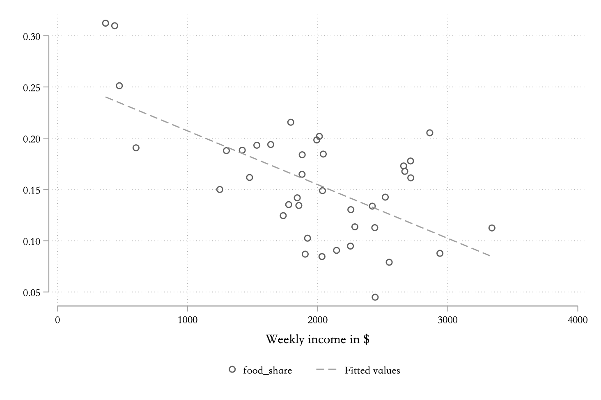

可以看出异方差现象不如刚刚那般明显了。


（6）：回归
```stata
reg food_share income

*>       Source |       SS           df       MS      Number of obs   =        40
*> -------------+----------------------------------   F(1, 38)        =     24.39
*>        Model |  .050217947         1  .050217947   Prob > F        =    0.0000
*>     Residual |  .078224368        38  .002058536   R-squared       =    0.3910
*> -------------+----------------------------------   Adj R-squared   =    0.3749
*>        Total |  .128442315        39  .003293393   Root MSE        =    .04537

*> ------------------------------------------------------------------------------
*>   food_share |      Coef.   Std. Err.      t    P>|t|     [95% Conf. Interval]
*> -------------+----------------------------------------------------------------
*>       income |  -.0000524   .0000106    -4.94   0.000    -.0000739   -.0000309
*>        _cons |   .2595986   .0220021    11.80   0.000     .2150576    .3041397
*> ------------------------------------------------------------------------------
```
拟合的模型为：

$$
food\_share = -5.24e^{-5}income + 0.26 + \varepsilon
$$


（7）：BP 检验
```stata
estat hettest, iid

*> Breusch-Pagan / Cook-Weisberg test for heteroskedasticity
*>          Ho: Constant variance
*>          Variables: fitted values of food_share
*> 
*>          chi2(1)      =     0.08
*>          Prob > chi2  =   0.7748

estat hettest, iid rhs

*> Breusch-Pagan / Cook-Weisberg test for heteroskedasticity
*>          Ho: Constant variance
*>          Variables: income

*>          chi2(1)      =     0.08
*>          Prob > chi2  =   0.7748
```
两个 BP 检验的结果都无法拒绝同方差的原假设，因此不认为存在异方差。


（8）：怀特检验
```stata
estat imtest, white

*> White's test for Ho: homoskedasticity
*>          against Ha: unrestricted heteroskedasticity

*>          chi2(2)      =      2.60
*>          Prob > chi2  =    0.2722

*> Cameron & Trivedi's decomposition of IM-test

*> ---------------------------------------------------
*>               Source |       chi2     df      p
*> ---------------------+-----------------------------
*>   Heteroskedasticity |       2.60      2    0.2722
*>             Skewness |       0.37      1    0.5421
*>             Kurtosis |       2.71      1    0.1000
*> ---------------------+-----------------------------
*>                Total |       5.68      4    0.2244
*> ---------------------------------------------------
```
怀特检验的结果无法拒绝同方差的原假设，因此不认为存在异方差。

## 习题 9.4
**【题目】：**

使用数据集`Growth.dta`考察贸易与增长的关系，该数据集的被解释变量为 65 个国家 1960——1995 年的平均增长率，而主要解释变量为 1960——1995 年的平均贸易开放度（tradeshare）。

1. 将 growth 与 tradeshare 的散点图和线性拟合图画在一起。二者看起来是否有关系？
2. 有一个国家马耳他（Malta），其贸易开放度比其他国家高很多，在散点图上找出马耳他。它是否像极端值？
3. 使用全样本，把 growth 对 tradeshare 进行回归，该回归的斜率和截距的估计值分别是多少？
4. 计算每个观测值的影响力，以及此影响力的最大值和平均值只比，是否存在极端值？
5. 去掉马耳他重复上述回归，并再次回答（3）中的问题。
6. 马耳他在哪？马耳他的贸易开放度为什么这么高？是否应该在本研究中去掉马耳他？
7. 把 growth 对 tradeshare，rgdp60（1960 年的人均 GDP），yearsschool（1960 年的平均受教育年限），rev_coups（1960 年-1995 年的年平均政变次数），以及 assassinations（1960——1995 年的年平均政治暗杀次数）进行回归。评论各变量系数的符号、统计显著性及经济意义。
8. 为什么把变量 r60 与 yearsschool 的取值定为起初的 1960 年？

**【解答】：**

（1）：散点图&线性拟合图
```stata
use growth, clear
tw ///
lfit growth tradeshare || ///
sc growth tradeshare ||, ///
leg(order(1 "线性拟合值") pos(1) ring(0) row(1)) ///
xti("1960——1995年的平均贸易开放程度") ///
yti("1960——1995年的平均增长率") ///
xlab(, format(%6.0f))
gr export "9_4散点+线性拟合图.png", replace
```

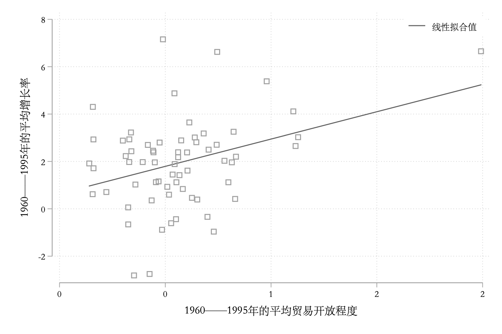

显然，贸易开放程度和经济增长之间存在正相关的关系。

（2）：马耳他
```stata
* 预保存数据
preserve
keep if country_name == "Malta"
* 存储马耳他的数据
local y = growth[1]
local x = tradeshare[1]
di "x = " `x' " 而 y = "`y'
* 恢复数据
restore
* 可以看到local变量还在
di "x = " `x' " 而 y = "`y'

tw ///
lfit growth tradeshare || ///
scatteri `y' `x' (7) "马耳他", ms(D) mc("dkorange") || ///
sc growth tradeshare if country_name != "Malta" ||, ///
leg(order(1 "线性拟合值") pos(1) ring(0) row(1)) ///
xti("1960——1995年的平均贸易开放程度") ///
yti("1960——1995年的平均增长率") ///
xlab(, format(%6.0f))
gr export "9_4散点+线性拟合图+极端值.png", replace
```


可以看出，马耳他看起来很像极端值。

（3）：全样本回归
```stata
reg growth tradeshare

*>       Source |       SS           df       MS      Number of obs   =        65
*> -------------+----------------------------------   F(1, 63)        =      8.89
*>        Model |  28.4885066         1  28.4885066   Prob > F        =    0.0041
*>     Residual |  201.851551        63  3.20399287   R-squared       =    0.1237
*> -------------+----------------------------------   Adj R-squared   =    0.1098
*>        Total |  230.340057        64  3.59906339   Root MSE        =      1.79
*> ------------------------------------------------------------------------------
*>       growth |      Coef.   Std. Err.      t    P>|t|     [95% Conf. Interval]
*> -------------+----------------------------------------------------------------
*>   tradeshare |   2.306434    .773485     2.98   0.004     .7607473     3.85212
*>        _cons |   .6402653   .4899767     1.31   0.196    -.3388749    1.619405
*> ------------------------------------------------------------------------------
```
斜率为`2.3064`，截距为`0.6403`。

（4）：影响力
```stata
* 计算leverage
predict lev, lev
qui sum lev
di r(max)/r(mean)
```

计算的结果为 12.87，经验规则表明，这是相当大的，因此认为存在极端值。

（5）：去掉极端值的回归
```stata
reg growth tradeshare if country_name != "Malta"

*>       Source |       SS           df       MS      Number of obs   =        64
*> -------------+----------------------------------   F(1, 62)        =      2.90
*>        Model |  9.28031557         1  9.28031557   Prob > F        =    0.0937
*>     Residual |  198.527844        62  3.20206201   R-squared       =    0.0447
*> -------------+----------------------------------   Adj R-squared   =    0.0292
*>        Total |   207.80816        63  3.29854222   Root MSE        =    1.7894
*> 
*> ------------------------------------------------------------------------------
*>       growth |      Coef.   Std. Err.      t    P>|t|     [95% Conf. Interval]
*> -------------+----------------------------------------------------------------
*>   tradeshare |   1.680905   .9873624     1.70   0.094    -.2928046    3.654614
*>        _cons |   .9574107   .5803727     1.65   0.104    -.2027378    2.117559
*> ------------------------------------------------------------------------------
```

此时斜率为 1.6809，截距为 0.9574。（对比刚刚的（2.3064 和 0.6403））

（6）：马耳他
马耳他是一个位于地中海中心的岛国。是一个高度发达的资本主义国家，经济以服务业和金融业为主，旅游业是马耳他主要的外汇来源。马耳他同 100 多个国家和地区有贸易关系，欧盟是马耳他最重要的贸易伙伴。另外，马耳他社会保障体系较为完备，实行免费教育，免费医疗及退休保险制。
也就是地中海的这个位置：

绘图代码（[R 语言 + leaflet](https://rstudio.github.io/leaflet/)）:

```{r}
library(leaflet)

Maltatag <- makeIcon(
  iconUrl = "malta.jpeg",
  iconWidth = 90, iconHeight = 55,
  iconAnchorX = 22, iconAnchorY = 94
)
content <- paste(sep = "<br/>",
                 "<b><a href='https://baike.baidu.com/item/%E9%A9%AC%E8%80%B3%E4%BB%96'>马耳他</a></b>",
                 "人口：44万",
                 "面积：316平方公里"
)

leaflet(width = "100%", height = "500px") %>%
  setView(lng = 14.31, lat = 35.53, zoom = 5) %>%
  addTiles() %>%
  addPopups(lng = 14.31, lat = 36.5, content) %>%
  addMarkers(lng = 17.31, lat = 32.5, icon = Maltatag)
```

由于马耳他是极端值且对估计结果影响较大，所以还是去掉比较好。

（7）：完整模型的估计

```stata
reg growth tradeshare rgdp60 yearsschool rev_coups assasinations

*>       Source |       SS           df       MS      Number of obs   =        65
*> -------------+----------------------------------   F(5, 59)        =      6.61
*>        Model |  82.6634812         5  16.5326962   Prob > F        =    0.0001
*>     Residual |  147.676576        59  2.50299281   R-squared       =    0.3589
*> -------------+----------------------------------   Adj R-squared   =    0.3045
*>        Total |  230.340057        64  3.59906339   Root MSE        =    1.5821
*> 
*> -------------------------------------------------------------------------------
*>        growth |      Coef.   Std. Err.      t    P>|t|     [95% Conf. Interval]
*> --------------+----------------------------------------------------------------
*>    tradeshare |   1.561696   .7579475     2.06   0.044     .0450462    3.078345
*>        rgdp60 |  -.0004693   .0001482    -3.17   0.002    -.0007659   -.0001728
*>   yearsschool |   .5748461   .1393379     4.13   0.000     .2960316    .8536606
*>     rev_coups |  -2.157503   1.110292    -1.94   0.057    -4.379191    .0641853
*> assasinations |   .3540784   .4773943     0.74   0.461    -.6011854    1.309342
*>         _cons |   .4897603   .6895996     0.71   0.480    -.8901254    1.869646
*> -------------------------------------------------------------------------------
```

1. tradeshare：符号为正，在 5%的显著性水平上显著，表示平均贸易开放程度每增加一个单位，经济平均增长率平均上升 1.56%。
2. rgdp60：符号为负，在 5%的显著性水平上显著，表示 1960 年的人均 GDP 每增加一块钱，经济平均增长率就平均下降 0.00047%。
3. yearsschool：符号为正，在 5%的显著性水平上显著，表示 1960 年的平均受教育年限每增加 1 年，经济平均增长率就平均上升 0.57%。
4. rev_coups：符号为负，在 10%的显著性水平上显著，表示 1960——1995 年间的年平均政变次数每增加一次，经济平均增长率就平均下降 2.15%。
5. assassinations：符号为负，但是很不显著，因此没有意义。

（8）：期初
这样可以避免逆向因果的问题，而且比较符合逻辑。

---

## 习题 9.5
**【题目】：**
美国的汽油需求函数是否稳定？使用数据集`gasoline.dta`，估计美国 1953——2004 年的汽油需求函数（参见第八章）：

\begin{align}
lgasq_t =& \beta_0 + \beta_1 lgasq_{t-1} + \beta_2lincome_t + \beta_3lgasp_t \\
& + \beta_4lpnc_t + \beta_5lpuc_t + \varepsilon_t
\end{align}

其中被解释变量 lgasq 为人均汽油消费量的对数，解释变量 lincome 为人均收入对数，lgasp 为汽油价格指数的对数，lpnc 为新车价格指数的对数，lpuc 为二手车价格指数的对数。

1. 将 lgasq 与 lgasp 的时间趋势图画在一起。根据此图，在 1953——2004 年期间，美国的汽油需求函数是否曾出现结构变动？
2. 使用 OLS 估计方程（9.48）.
3. 使用 BP 检验与怀特检验，检验是否存在异方差。
4. 使用 BG 检验与 Q 检验，检验是否存在自相关。
5. 1973 年 10 月爆发石油危机，可能引发汽油需求的结构变动。使用虚拟变量法，检验美国的汽油需求函数是否在 1974 年发生结构变动。根据（3）与（4）的检验结果决定是否应该使用稳健标准误。

**【解答】：**

（1）：时间趋势图
```stata
use gasoline, clear
* 使用调色板命令配色
colorscheme 3, palette(Dark2)
ret list
* "027 158 119" "217 095 002"
tw ///
line lgasq year, lc("027 158 119") yaxis(1) || ///
line lgasp year, lc("217 095 002") yaxis(2) ||, ///
leg(order(1 "对数人均汽油消费量" 2 "对数汽油价格指数") pos(10) ring(0)) ///
yti("对数人均汽油消费量", axis(1)) ///
yti("对数汽油价格指数", axis(2)) ///
xti("年份")

gr export "9_5趋势图.png", replace
```


（2）：OLS 估计
```stata
reg lgasq l.lgasq lincome lgasp lpnc lpuc

*>       Source |       SS           df       MS      Number of obs   =        51
*> -------------+----------------------------------   F(5, 45)        =   1830.77
*>        Model |  2.59056415         5   .51811283   Prob > F        =    0.0000
*>     Residual |  .012735088        45  .000283002   R-squared       =    0.9951
*> -------------+----------------------------------   Adj R-squared   =    0.9946
*>        Total |  2.60329924        50  .052065985   Root MSE        =    .01682
*> 
*> ------------------------------------------------------------------------------
*>        lgasq |      Coef.   Std. Err.      t    P>|t|     [95% Conf. Interval]
*> -------------+----------------------------------------------------------------
*>        lgasq |
*>          L1. |   .8309713   .0457633    18.16   0.000     .7387994    .9231433
*>              |
*>      lincome |   .1640462   .0550263     2.98   0.005     .0532175    .2748748
*>        lgasp |  -.0695317   .0147326    -4.72   0.000    -.0992047   -.0398587
*>         lpnc |  -.1783946   .0551726    -3.23   0.002    -.2895179   -.0672714
*>         lpuc |   .1270093   .0357704     3.55   0.001      .054964    .1990546
*>        _cons |   -3.12318   .9958266    -3.14   0.003    -5.128878   -1.117483
*> ------------------------------------------------------------------------------
```
拟合的模型为：

\begin{align}
lgasq_t =& -3.12 + 0.83 lgasq_{t-1} + 0.16lincome_t + -0.07lgasp_t \\
& - 0.18lpnc_t + 0.13lpuc_t + \varepsilon_t
\end{align}

（3）：异方差检验
```stata
estat hettest, iid

*> Breusch-Pagan / Cook-Weisberg test for heteroskedasticity
*>          Ho: Constant variance
*>          Variables: fitted values of lgasq

*>          chi2(1)      =     0.31
*>          Prob > chi2  =   0.5788

estat hettest, iid rhs

*> Breusch-Pagan / Cook-Weisberg test for heteroskedasticity
*>          Ho: Constant variance
*>          Variables: L.lgasq lincome lgasp lpnc lpuc
*>          chi2(5)      =     7.46
*>          Prob > chi2  =   0.1884

estat imtest, white

*> White's test for Ho: homoskedasticity
*>          against Ha: unrestricted heteroskedasticity
*> 
*>          chi2(20)     =     33.20
*>          Prob > chi2  =    0.0321
*> 
*> Cameron & Trivedi's decomposition of IM-test
*> 
*> ---------------------------------------------------
*>               Source |       chi2     df      p
*> ---------------------+-----------------------------
*>   Heteroskedasticity |      33.20     20    0.0321
*>             Skewness |       9.58      5    0.0881
*>             Kurtosis |       0.61      1    0.4356
*> ---------------------+-----------------------------
*>                Total |      43.38     26    0.0176
*> ---------------------------------------------------
```
两种 BP 检验的结果表明无法拒绝同方差的原假设，而怀特检验表明拒绝同方差的原假设。考虑到两种检验的区别，所以结论是：不存在线性的异方差，但是存在非线性的异方差。

（4）：自相关检验
```stata
tsset year
*>    time variable:  year, 1953 to 2004
*>            delta:  1 unit

qui reg lgasq l.lgasq lincome lgasp lpnc lpuc

* BG检验
estat bgo

*> Breusch-Godfrey LM test for autocorrelation
*> ---------------------------------------------------------------------------
*>     lags(p)  |          chi2               df                 Prob > chi2
*> -------------+-------------------------------------------------------------
*>        1     |          0.545               1                   0.4603
*> ---------------------------------------------------------------------------
*>                         H0: no serial correlation

estat bgo, nom

*> Breusch-Godfrey LM test for autocorrelation
*> ---------------------------------------------------------------------------
*>     lags(p)  |          chi2               df                 Prob > chi2
*> -------------+-------------------------------------------------------------
*>        1     |          1.361               1                   0.2434
*> ---------------------------------------------------------------------------
*>                         H0: no serial correlation

* Q检验

predict e1, r
*> (1 missing value generated)

wntestq e1

*> Portmanteau test for white noise
*> ---------------------------------------
*>  Portmanteau (Q) statistic =    25.2413
*>  Prob > chi2(23)           =     0.3380
```
两种检验都无法拒绝无自相关的原假设。

（5）：检验结构变动
```stata
use gasoline, clear
gen yearid = (year >= 1973)
gen interaction = yearid * lgasp
reg lgasq l.lgasq lincome lgasp lpnc lpuc yearid interaction, r

*> Linear regression                               Number of obs     =         51
*>                                                 F(7, 43)          =    2328.20
*>                                                 Prob > F          =     0.0000
*>                                                 R-squared         =     0.9967
*>                                                 Root MSE          =     .01421*> 

*> ------------------------------------------------------------------------------
*>              |               Robust
*>        lgasq |      Coef.   Std. Err.      t    P>|t|     [95% Conf. Interval]
*> -------------+----------------------------------------------------------------
*>        lgasq |
*>          L1. |   .4682407    .096862     4.83   0.000     .2728999    .6635815
*>              |
*>      lincome |   .3143699   .0528124     5.95   0.000     .2078636    .4208762
*>        lgasp |   .5230541   .1386092     3.77   0.000      .243522    .8025862
*>         lpnc |  -.0353864   .0503548    -0.70   0.486    -.1369365    .0661638
*>         lpuc |   .0381906   .0297671     1.28   0.206    -.0218405    .0982217
*>       yearid |   1.934971     .42312     4.57   0.000     1.081668    2.788274
*>  interaction |  -.6175106   .1377708    -4.48   0.000    -.8953518   -.3396694
*>        _cons |  -11.08808   2.034093    -5.45   0.000    -15.19022   -6.985939
*> ------------------------------------------------------------------------------

* 另外再进行检验
test yearid interaction

*> ( 1)  yearid = 0
*> ( 2)  interaction = 0
*>       F(  2,    43) =   18.80
*>            Prob > F =    0.0000
```
由于存在异方差问题，所以使用稳健的标准误。
可以看出生成的虚拟变量和虚拟变量与汽油价格指数对数的交互项的系数都非常显著，因此认为在 1973 年发生了结构变动。

## 习题 10.5

**【题目】：**
使用数据集`acemoglu.dta`。该数据集包含 64 个曾为欧洲殖民地的国家，主要变量为`logpgp95`（1995 年人均 GDP，PPP），`avexpr`（1985——1995 年间的平均产权保护程度，0 为最低，10 为最高），`lat_abst`（首都纬度的绝对值/90），以及`logem4`（殖民者死亡率的对数）。另外，变量`shortnam`以三个字母表示每个国家的简称。

1. 为了直观地考察产权保护与经济发展的关系，将`logpgp95`和`avexpr`的散点图和线性拟合图画在一起，并为每个散点标注国家简称。
2. 为了使用稳健标准误，把`logpgp95`对`avexpr`及`lat_abst`进行回归，评论变量的符号、统计显著性及经济意义。
3. 由于`avexpr`可能为内生解释变量，使用`logem4`作为`avexpr`的工具变量，重新进行（2）回归。工具变量回归的结果与 OLS 有何不同？
4. `logem4`是否为弱工具变量？

**【解答】：**

（1）：散点图+线性拟合图+散点标签

```stata
cuse acemoglu, clear web
* 这里需要处理一下散点标签遮盖的问题
* ssc install egenmore
egen clock = mlabvpos(logpgp95 avexpr)
tw ///
sc logpgp95 avexpr, mlab(shortnam) mlabvpos(clock) || ///
lfit logpgp95 avexpr ||, ///
  leg(order(1 "1995年PPP人均GDP" 2 "线性拟合值") pos(10) ring(0)) ///
  xti("1985——1995年间的平均产权保护程度")
gr export "10_5散点图.png", replace
```


虽然还是不能完美的处理散点遮盖的问题，但是已经处理的相当不错了，如果你想追求完全没有任何散点遮盖，你可以逐个修改 clock 变量的某些值。不过 R 的 ggplot2+ggrepel 包能够完美的解决散点相互遮盖的问题。

```R
# install.packages("RStata")
# 读取数据的方法一：使用RStata包，
# 该包的详细使用可以参考：https://www.czxa.top/posts/13184/
library(RStata)
library(ggplot2)
library(ggrepel)
options("RStata.StataPath" = "/Applications/Stata/StataSE.app/Contents/MacOS/stata-se")
options("RStata.StataVersion" = 15)
s <- stata("cuse acemoglu, clear web", data.out = T)

# 读取数据的方法二：使用readstata13包直接读取dta文件，
# 之所以用这个包的原因是这个包读地最快。
library(readstata13)
s <- read.dta13("acemoglu.dta")
# 之所以为散点创建颜色映射，是因为我闲的无聊
ggplot(data = s, aes(x = avexpr, y = logpgp95, colour = shortnam)) +
  geom_point() +
  geom_smooth(method = "lm", se = F, colour = "#fc8d62") +
  geom_label_repel(arrow = arrow(length = unit(0.01, "npc"),
                  type = "closed", ends = "first"),
                  force = 10,
    aes(label = shortnam)) +
  labs(x = "1985——1995年间的平均产权保护程度") +
  theme(axis.title.y = element_blank()) +
  theme(legend.position = "none") +
  theme(axis.title.x = element_text(size = 14))
```


取消颜色映射：
```stata
ggplot(data = s, aes(x = avexpr, y = logpgp95)) +
  geom_point() +
  geom_smooth(method = "lm", se = F, colour = "#fc8d62") +
  geom_label_repel(arrow = arrow(length = unit(0.01, "npc"),
                  type = "closed", ends = "first"),
                  force = 10,
    aes(label = shortnam)) +
  labs(x = "1985——1995年间的平均产权保护程度") +
  theme(axis.title.y = element_blank()) +
  theme(legend.position = "none") +
  theme(axis.title.x = element_text(size = 14))
```


（2）：稳健回归

```stata
reg logpgp95 avexpr lat_abst, r

*> Linear regression                               Number of obs     =         64
*>                                                 F(2, 61)          =      64.91
*>                                                 Prob > F          =     0.0000
*>                                                 R-squared         =     0.5745
*>                                                 Root MSE          =     .69166
*> ------------------------------------------------------------------------------
*>              |               Robust
*>     logpgp95 |      Coef.   Std. Err.      t    P>|t|     [95% Conf. Interval]
*> -------------+----------------------------------------------------------------
*>       avexpr |   .4678871   .0626811     7.46   0.000     .3425484    .5932257
*>     lat_abst |   1.576884   .6506046     2.42   0.018     .2759197    2.877848
*>        _cons |   4.728082   .3413732    13.85   0.000     4.045464      5.4107
*> ------------------------------------------------------------------------------
```

1. avexpr：符号为正，表示 1985——1995 年间的平均产权保护程度每提高 1，1995 年的 PPP 人均 GDP 平均提高 47%。
2. lat_abst：符号为正，表示纬度每上升 1%，1995 年的 PPP 人均 GDP 平均提高 1.57%。

（3）：IV

```stata
ivregress 2sls logpgp95 (avexpr = logem4) lat_abst, r

*> Instrumental variables (2SLS) regression          Number of obs   =         64
*>                                                   Wald chi2(2)    =      28.33
*>                                                   Prob > chi2     =     0.0000
*>                                                   R-squared       =     0.1025
*>                                                   Root MSE        =      .9807

*> ------------------------------------------------------------------------------
*>              |               Robust
*>     logpgp95 |      Coef.   Std. Err.      z    P>|z|     [95% Conf. Interval]
*> -------------+----------------------------------------------------------------
*>       avexpr |    .995704   .2403256     4.14   0.000     .5246745    1.466734
*>     lat_abst |  -.6472071   1.227012    -0.53   0.598    -3.052107    1.757692
*>        _cons |   1.691814   1.447779     1.17   0.243    -1.145781    4.529409
*> ------------------------------------------------------------------------------
*> Instrumented:  avexpr
*> Instruments:   lat_abst logem4
```
IV 的回归结果中 avexpr 的系数变大，lat_abst 的系数由正变负，但是不再显著。

（4）：弱工具变量检验

```stata
estat first

*> First-stage regression summary statistics
*> --------------------------------------------------------------------------
*>              |            Adjusted      Partial       Robust
*>     Variable |   R-sq.       R-sq.        R-sq.       F(1,61)   Prob > F
*> -------------+------------------------------------------------------------
*>       avexpr |  0.2960      0.2729       0.1767       9.52499    0.0030
*> --------------------------------------------------------------------------
```
由于 F 统计量小于 10，因此无法拒绝存在弱工具变量的原假设，认为其是弱工具变量。

---

## 习题 10.6
**【题目】：**
生育行为如何影响劳动力供给？具体来说，如果妇女多生一位小孩，其劳动力供给将下降多少？本题使用来自美国 1980 年人口普查的数据集`fertility_small.dta`进行估计。此数据集包含了美国 21～35 岁已婚且有两个或更多子女的妇女信息，主要变量为 weeks（1979 年的工作周数），morekids（是否有两个以上小孩），以及 samesex（头两个小孩是否性别相同）。

1. 把 weeks 对虚拟变量 morekids 进行回归。有两个以上小孩的的妇女是否比有两个小孩的妇女工作更少？少多少？此效应是否在统计上显著？
2. 上面（1）的回归能否估计生育行为对劳动力供给的因果效应？为什么？
3. 把 morekids 对 samesex 进行回归。如果头两个小孩的性别相同，是否更可能生第三个小孩，此效应大么？是否在统计上显著？
4. 在 weeks 对 morekids 的回归中，能否将 samesex 作为有效工具变量？为什么？
5. samesex 是否为弱工具变量？
6. 以 samesex 为工具变量，把 weeks 对 morekids 进行回归。生育行为对劳动力供给的效应有多大？是否在统计上显著？

**【解答】：**

（1）：OLS

```stata
cuse fertility_small.dta, clear
reg weeks morekids

*>      Source |       SS           df       MS      Number of obs   =    30,000
*> -------------+----------------------------------   F(1, 29998)     =    538.16
*>       Model |  254515.369         1  254515.369   Prob > F        =    0.0000
*>    Residual |  14187250.9    29,998  472.939893   R-squared       =    0.0176
*> -------------+----------------------------------   Adj R-squared   =    0.0176
*>       Total |  14441766.3    29,999  481.408257   Root MSE        =    21.747
*> ------------------------------------------------------------------------------
*>       weeks |      Coef.   Std. Err.      t    P>|t|     [95% Conf. Interval]
*> -------------+----------------------------------------------------------------
*>    morekids |  -6.008217   .2589951   -23.20   0.000    -6.515858   -5.500575
*>       _cons |    21.4782   .1591503   134.96   0.000     21.16626    21.79014
*> ------------------------------------------------------------------------------
```

从结果可以看出，有两个以上小孩的妇女确实比只有两个孩子的妇女的工作时间更少，在 5%的显著性水平上显著，平均每周少 6 个小时。

（2）：因果判断
显然是不能的，这里面存在逆向因果的问题，也就是妇女可能会因为有闲暇时间而选择生孩子。

（3）：回归
```stata
reg morekids samesex

*>       Source |       SS           df       MS      Number of obs   =    30,000
*> -------------+----------------------------------   F(1, 29998)     =    143.15
*>        Model |  33.4852461         1  33.4852461   Prob > F        =    0.0000
*>     Residual |  7017.06195    29,998   .23391766   R-squared       =    0.0047
*> -------------+----------------------------------   Adj R-squared   =    0.0047
*>        Total |   7050.5472    29,999  .235026074   Root MSE        =    .48365
*> ------------------------------------------------------------------------------
*>     morekids |      Coef.   Std. Err.      t    P>|t|     [95% Conf. Interval]
*> -------------+----------------------------------------------------------------
*>      samesex |   .0668197   .0055848    11.96   0.000     .0558732    .0777662
*>        _cons |   .3439785   .0039616    86.83   0.000     .3362137    .3517433
*> ------------------------------------------------------------------------------
```
结果显著为正，表明如果前两个孩子性别相同，更可能生第三个孩子。但是效应不大。

（4）：IV
从逻辑上分析 samesex 变量影响 morekids（相关性），且 weeks 不会影响 samesex（外生性），所以 samesex 是一个很好的工具变量。

（5）：弱工具变量的检验
```stata
ivregress 2sls weeks (morekids = samesex), r

*> Instrumental variables (2SLS) regression          Number of obs   =     30,000
*>                                                   Wald chi2(1)    =       2.58
*>                                                   Prob > chi2     =     0.1084
*>                                                   R-squared       =     0.0176
*>                                                   Root MSE        =     21.746
*> ------------------------------------------------------------------------------
*>              |               Robust
*>        weeks |      Coef.   Std. Err.      z    P>|z|     [95% Conf. Interval]
*> -------------+----------------------------------------------------------------
*>     morekids |  -6.033194   3.758162    -1.61   0.108    -13.39906    1.332668
*>        _cons |   21.48763   1.425247    15.08   0.000      18.6942    24.28107
*> ------------------------------------------------------------------------------
*> Instrumented:  morekids
*> Instruments:   samesex

estat first

*> First-stage regression summary statistics
*> --------------------------------------------------------------------------
*>              |            Adjusted      Partial       Robust
*>     Variable |   R-sq.       R-sq.        R-sq.    F(1,29998)   Prob > F
*> -------------+------------------------------------------------------------
*>     morekids |  0.0047      0.0047       0.0047       143.213    0.0000
*> --------------------------------------------------------------------------
```
对工具变量的有效性检验表明，F > 10，因此拒绝 samesex 是弱工具变量的原假设。

（6）：IV

（5）中的回归结果表明生育行为对劳动力的供给确实会存在影响，具体来说，生育超过两个孩子的妇女平均比只生育两个孩子的妇女每周少工作 6 个小时。结果并不显著的。

（7）：增加控制变量
回归略；结果发生了变化，因为这些被遗漏的控制变量会对生育行为产生影响。

---

## 习题 12.3
**【题目】：**
数据集 `munnell.dta` 包含了美国 48 个州、1970——1986 年的年度数据。为了估计公共资本对经济增长的贡献，使用此数据集进行以下回归：

\begin{align}
lny_{it} = & \beta_0 + \beta_1lnk_{1, it} + \beta_2lnk_{2, ik} + \\
& \beta_3lnlabor_{it} + \beta_4unemp_{it} + u_{i} + \varepsilon_{it}
\end{align}

其中，y 为州产值（gross state product），$k_1$为公共资本，$k_2$为私人资本存量，labor 为非农劳动力，unemp 为州失业率（反映影响产出的经济周期因素）。面板变量为 state，时间变量为 year。
1. 进行混合回归，评论$lnk_1$的系数符号、显著性与经济意义。
2. 对随机效应模型进行 FGLS 估计。$lnk_1$的系数符号与显著性是否有变化？检验是否存在个体随机效应。
3. 对随机效应模型进行 MLE 估计。
4. 对固定效应模型进行组内估计。$lnk_1$的系数符号与显著性是否有变化？
5. 对固定效应进行 LSDV 估计， 检验是否存在个体固定效应。
6. 进行传统的豪斯曼检验。
7. 进行稳健的豪斯曼检验。
8. 在组内估计中，加入时间趋势项。时间趋势项是否显著？
9. 在组内估计中，加入时间虚拟变量，估计双向固定效应模型。时间效应是否显著？
10. 计算一阶差分估计量。$lnk_1$的系数符号与显著性是否有变化？
11. 计算组间估计量。此估计量是否可信？

**【解答】：**

（1）：混合回归
```stata
cuse munnell, clear
xtset state year
reg lny lnk1 lnk2 lnlabor unemp, vce(cluster state)

*> Linear regression                               Number of obs     =        816
*>                                                 F(4, 47)          =    2706.83
*>                                                 Prob > F          =     0.0000
*>                                                 R-squared         =     0.9926
*>                                                 Root MSE          =      .0881
*>                                  (Std. Err. adjusted for 48 clusters in state)
*> ------------------------------------------------------------------------------
*>              |               Robust
*>          lny |      Coef.   Std. Err.      t    P>|t|     [95% Conf. Interval]
*> -------------+----------------------------------------------------------------
*>         lnk1 |    .155007   .0609054     2.55   0.014     .0324812    .2775328
*>         lnk2 |   .3091902    .046834     6.60   0.000     .2149723     .403408
*>      lnlabor |   .5939349   .0695029     8.55   0.000     .4541131    .7337567
*>        unemp |   -.006733   .0031308    -2.15   0.037    -.0130314   -.0004346
*>        _cons |   1.643302    .247374     6.64   0.000      1.14565    2.140955
*> ------------------------------------------------------------------------------
```
$lnk_1$的系数为正，在 5%的显著性水平上显著。经济意义是公共资本每增加 1%，州产值平均增加 0.155%。

（2）：随机效应 + FGLS
```stata
xtreg lny lnk1 lnk2 lnlabor unemp, r theta

*> Random-effects GLS regression                   Number of obs     =        816
*> Group variable: state                           Number of groups  =         48
*> 
*> R-sq:                                           Obs per group:
*>      within  = 0.9412                                         min =         17
*>      between = 0.9928                                         avg =       17.0
*>      overall = 0.9917                                         max =         17
*> 
*>                                                 Wald chi2(4)      =    4408.64
*> corr(u_i, X)   = 0 (assumed)                    Prob > chi2       =     0.0000
*> theta          = .8888353
*> 
*>                                  (Std. Err. adjusted for 48 clusters in state)
*> ------------------------------------------------------------------------------
*>              |               Robust
*>          lny |      Coef.   Std. Err.      z    P>|z|     [95% Conf. Interval]
*> -------------+----------------------------------------------------------------
*>         lnk1 |   .0044388   .0553107     0.08   0.936    -.1039682    .1128458
*>         lnk2 |   .3105483    .044162     7.03   0.000     .2239923    .3971043
*>      lnlabor |   .7296705   .0708825    10.29   0.000     .5907434    .8685976
*>        unemp |  -.0061725   .0023631    -2.61   0.009    -.0108041   -.0015409
*>        _cons |   2.135411   .2417872     8.83   0.000     1.661516    2.609305
*> -------------+----------------------------------------------------------------
*>      sigma_u |   .0826905
*>      sigma_e |  .03813705
*>          rho |  .82460109   (fraction of variance due to u_i)
*> ------------------------------------------------------------------------------
```

此时不再显著。为了检验个体效应，下面进行 LM 检验：

```stata
xttest0

*> Breusch and Pagan Lagrangian multiplier test for random effects

*>         lny[state,t] = Xb + u[state] + e[state,t]

*>         Estimated results:
*>                          |       Var     sd = sqrt(Var)
*>                 ---------+-----------------------------
*>                      lny |    1.04271       1.021132
*>                        e |   .0014544       .0381371
*>                        u |   .0068377       .0826905

*>         Test:   Var(u) = 0
*>                              chibar2(01) =  4134.96
*>                           Prob > chibar2 =   0.0000
```
结果强烈拒绝“不存在个体随机效应的假设”，即认为存在个体效应。

（3）：随机效应 + MLE
```stata
xtreg lny lnk1 lnk2 lnlabor unemp, mle nolog

*> Random-effects ML regression                    Number of obs     =        816
*> Group variable: state                           Number of groups  =         48
*> Random effects u_i ~ Gaussian                   Obs per group:
*>                                                               min =         17
*>                                                               avg =       17.0
*>                                                               max =         17
*>                                                 LR chi2(4)        =    2412.91
*> Log likelihood  =  1401.9041                    Prob > chi2       =     0.0000
*> ------------------------------------------------------------------------------
*>          lny |      Coef.   Std. Err.      z    P>|z|     [95% Conf. Interval]
*> -------------+----------------------------------------------------------------
*>         lnk1 |   .0031446   .0239185     0.13   0.895    -.0437348     .050024
*>         lnk2 |    .309811    .020081    15.43   0.000      .270453     .349169
*>      lnlabor |   .7313372   .0256936    28.46   0.000     .6809787    .7816957
*>        unemp |  -.0061382   .0009143    -6.71   0.000    -.0079302   -.0043462
*>        _cons |   2.143865   .1376582    15.57   0.000      1.87406    2.413671
*> -------------+----------------------------------------------------------------
*>     /sigma_u |    .085162   .0090452                      .0691573    .1048706
*>     /sigma_e |   .0380836   .0009735                      .0362226    .0400402
*>          rho |   .8333481   .0304597                      .7668537    .8861754
*> ------------------------------------------------------------------------------
*> LR test of sigma_u=0: chibar2(01) = 1149.84            Prob >= chibar2 = 0.000
```

（4）：固定效应 + 组内估计
```stata
xtreg lny lnk1 lnk2 lnlabor unemp, fe r

*> Fixed-effects (within) regression               Number of obs     =        816
*> Group variable: state                           Number of groups  =         48
*> 
*> R-sq:                                           Obs per group:
*>      within  = 0.9413                                         min =         17
*>      between = 0.9921                                         avg =       17.0
*>      overall = 0.9910                                         max =         17
*> 
*>                                                 F(4,47)           =     395.61
*> corr(u_i, Xb)  = 0.0608                         Prob > F          =     0.0000
*> 
*>                                  (Std. Err. adjusted for 48 clusters in state)
*> ------------------------------------------------------------------------------
*>              |               Robust
*>          lny |      Coef.   Std. Err.      t    P>|t|     [95% Conf. Interval]
*> -------------+----------------------------------------------------------------
*>         lnk1 |  -.0261493   .0611148    -0.43   0.671    -.1490964    .0967978
*>         lnk2 |   .2920067   .0625495     4.67   0.000     .1661733    .4178401
*>      lnlabor |   .7681595   .0827326     9.28   0.000      .601723     .934596
*>        unemp |  -.0052977   .0025285    -2.10   0.042    -.0103844   -.0002111
*>        _cons |   2.352898    .314594     7.48   0.000     1.720017     2.98578
*> -------------+----------------------------------------------------------------
*>      sigma_u |  .09057293
*>      sigma_e |  .03813705
*>          rho |   .8494045   (fraction of variance due to u_i)
*> ------------------------------------------------------------------------------
```
$lnk_1$ 的符号变为负，同样不显著。

（5）：固定效应 + LSDV

```stata
xtreg lny lnk1 lnk2 lnlabor unemp i.state, vce(cluster state)

*> Random-effects GLS regression                   Number of obs     =        816
*> Group variable: state                           Number of groups  =         48

*> R-sq:                                           Obs per group:
*>      within  = 0.9413                                         min =         17
*>      between = 1.0000                                         avg =       17.0
*>      overall = 0.9987                                         max =         17

*>                                                 Wald chi2(4)      =          .
*> corr(u_i, X)   = 0 (assumed)                    Prob > chi2       =          .

*>                                     (Std. Err. adjusted for 48 clusters in state)
*> ---------------------------------------------------------------------------------
*>                 |               Robust
*>             lny |      Coef.   Std. Err.      z    P>|z|     [95% Conf. Interval]
*> ----------------+----------------------------------------------------------------
*>            lnk1 |  -.0261493   .0629666    -0.42   0.678    -.1495615    .0972629
*>            lnk2 |   .2920067   .0644448     4.53   0.000     .1656972    .4183162
*>         lnlabor |   .7681595   .0852394     9.01   0.000     .6010934    .9352256
*>           unemp |  -.0052977   .0026051    -2.03   0.042    -.0104036   -.0001919
*>                 |
*>           state |
*>        ARIZONA  |   .1664708   .0131244    12.68   0.000     .1407475    .1921942
*>       ARKANSAS  |   .0613989   .0201529     3.05   0.002     .0218998    .1008979
*>     CALIFORNIA  |   .2988061   .0732358     4.08   0.000     .1552666    .4423455
*>       COLORADO  |   .1942932   .0086412    22.48   0.000     .1773568    .2112296
*>    CONNECTICUT  |   .2695868   .0341927     7.88   0.000     .2025704    .3366032
*>       DELAWARE  |   .2118447   .0451819     4.69   0.000     .1232898    .3003996
*>        FLORIDA  |   .1315363   .0385407     3.41   0.001     .0559979    .2070746
*>        GEORGIA  |   .0565913   .0241312     2.35   0.019     .0092949    .1038876
*>          IDAHO  |   .1367973   .0457483     2.99   0.003     .0471321    .2264624
*>       ILLINOIS  |   .1857042   .0448826     4.14   0.000     .0977359    .2736726
*>        INDIANA  |   .0577659   .0161645     3.57   0.000      .026084    .0894479
*>           IOWA  |   .1255467   .0159194     7.89   0.000     .0943453    .1567482
*>         KANSAS  |   .1371023   .0257417     5.33   0.000     .0866494    .1875551
*>       KENTUCKY  |   .1976712   .0128558    15.38   0.000     .1724743    .2228682
*>      LOUISIANA  |   .3130538   .0447378     7.00   0.000     .2253693    .4007384
*>          MAINE  |   .0667996   .0397777     1.68   0.093    -.0111633    .1447626
*>       MARYLAND  |   .1986622   .0368114     5.40   0.000     .1265132    .2708113
*>  MASSACHUSETTS  |   .1606044   .0505757     3.18   0.001     .0614778    .2597309
*>       MICHIGAN  |   .2153771   .0384914     5.60   0.000     .1399354    .2908188
*>      MINNESOTA  |   .1139324   .0209493     5.44   0.000     .0728724    .1549923
*>    MISSISSIPPI  |   .0484076   .0145654     3.32   0.001       .01986    .0769552
*>       MISSOURI  |   .1120074   .0205456     5.45   0.000     .0717388     .152276
*>        MONTANA  |   .1465373   .0661967     2.21   0.027     .0167942    .2762804
*>       NEBRASKA  |   .1096629   .0355752     3.08   0.002     .0399369     .179389
*>         NEVADA  |   .1402696   .0459828     3.05   0.002      .050145    .2303941
*>  NEW_HAMPSHIRE  |   .1225309   .0446646     2.74   0.006     .0349898    .2100719
*>     NEW_JERSEY  |   .2412521   .0422531     5.71   0.000     .1584374    .3240667
*>     NEW_MEXICO  |   .2527582   .0460158     5.49   0.000     .1625689    .3429476
*>       NEW_YORK  |   .2743703    .077557     3.54   0.000     .1223614    .4263792
*> NORTH_CAROLINA  |   .0360083    .030923     1.16   0.244    -.0245997    .0966164
*>   NORTH_DAKOTA  |   .1422781   .0748141     1.90   0.057    -.0043548     .288911
*>           OHIO  |   .1210272   .0431546     2.80   0.005     .0364457    .2056087
*>       OKLAHOMA  |   .2143161   .0255197     8.40   0.000     .1642985    .2643337
*>         OREGON  |   .1492874   .0121212    12.32   0.000     .1255303    .1730444
*>   PENNSYLVANIA  |   .0877255   .0488119     1.80   0.072    -.0079441    .1833952
*>   RHODE_ISLAND  |   .1867343   .0561357     3.33   0.001     .0767105    .2967582
*> SOUTH_CAROLINA  |   -.082223   .0207814    -3.96   0.000    -.1229539   -.0414922
*>   SOUTH_DAKOTA  |   .0880636   .0596279     1.48   0.140     -.028805    .2049322
*>       TENNESSE  |   .0274807   .0188807     1.46   0.146    -.0095248    .0644862
*>          TEXAS  |   .1920419   .0443789     4.33   0.000     .1050609    .2790229
*>           UTAH  |   .1270401   .0261314     4.86   0.000     .0758236    .1782566
*>        VERMONT  |   .1345834   .0546054     2.46   0.014     .0275587    .2416081
*>       VIRGINIA  |   .1788493   .0311795     5.74   0.000     .1177386    .2399599
*>     WASHINGTON  |   .2451644   .0331981     7.38   0.000     .1800973    .3102315
*>  WEST_VIRGINIA  |   .0915334   .0315848     2.90   0.004     .0296284    .1534383
*>      WISCONSIN  |   .1273426   .0258475     4.93   0.000     .0766825    .1780027
*>        WYOMING  |   .4469402   .1067769     4.19   0.000     .2376613    .6562192
*>                 |
*>           _cons |   2.201616   .3258801     6.76   0.000     1.562903    2.840329
*> ----------------+----------------------------------------------------------------
*>         sigma_u |          0
*>         sigma_e |  .03813705
*>             rho |          0   (fraction of variance due to u_i)
*> ---------------------------------------------------------------------------------
```

从估计结果中可以看出，基本所有州的估计系数都是显著的，因此可以放心拒绝“所有个体虚拟变量的系数都为 0”的原假设，即认为存在个体固定效应。

（6）：传统的 Hausman 检验
```stata
qui xtreg lny lnk1 lnk2 lnlabor unemp, re
est store RE
qui xtreg lny lnk1 lnk2 lnlabor unemp, fe
est store FE
hausman FE RE, constant sigmamore

*>                  ---- Coefficients ----
*>              |      (b)          (B)            (b-B)     sqrt(diag(V_b-V_B))
*>              |       FE           RE         Difference          S.E.
*> -------------+----------------------------------------------------------------
*>         lnk1 |   -.0261493     .0044388       -.0305881        .0172815
*>         lnk2 |    .2920067     .3105483       -.0185416        .0155955
*>      lnlabor |    .7681595     .7296705         .038489        .0170552
*>        unemp |   -.0052977    -.0061725        .0008747        .0004016
*>        _cons |    2.352898     2.135411        .2174875        .1138557
*> ------------------------------------------------------------------------------
*>                            b = consistent under Ho and Ha; obtained from xtreg
*>             B = inconsistent under Ha, efficient under Ho; obtained from xtreg
*> 
*>     Test:  Ho:  difference in coefficients not systematic
*> 
*>                   chi2(5) = (b-B)‘[(V_b-V_B)^(-1)](b-B)
*>                           =        9.65
*>                 Prob>chi2 =      0.0858
*>                 (V_b-V_B is not positive definite)
```

p 值为 0.0858，虽然在 5%的显著性水平上无法拒绝原假设“$H_0：u_i$与解释变量不相关”，但是在 10%的显著性水平上可以拒绝，认为应该使用固定效应而非随机效应模型。

（7）：稳健的豪斯曼检验
```stata
qui xtreg lny lnk1 lnk2 lnlabor unemp, r
xtoverid

*> Test of overidentifying restrictions: fixed vs random effects
*> Cross-section time-series model: xtreg re  robust cluster(state)
*> Sargan-Hansen statistic  19.333  Chi-sq(4)    P-value = 0.0007
```

检验的结果是强烈拒绝随机效应的原假设。

（8）：组内估计 + 时间趋势
```stata
xtreg lny lnk1 lnk2 lnlabor unemp year, fe r

*> Fixed-effects (within) regression               Number of obs     =        816
*> Group variable: state                           Number of groups  =         48
*> R-sq:                                           Obs per group:
*>      within  = 0.9475                                         min =         17
*>      between = 0.9883                                         avg =       17.0
*>      overall = 0.9864                                         max =         17
*>                                                 F(5,47)           =     383.39
*> corr(u_i, Xb)  = 0.8393                         Prob > F          =     0.0000
*>                                  (Std. Err. adjusted for 48 clusters in state)
*> ------------------------------------------------------------------------------
*>              |               Robust
*>          lny |      Coef.   Std. Err.      t    P>|t|     [95% Conf. Interval]
*> -------------+----------------------------------------------------------------
*>         lnk1 |  -.0283785   .0610049    -0.47   0.644    -.1511046    .0943477
*>         lnk2 |   .1434502   .0826932     1.73   0.089    -.0229069    .3098074
*>      lnlabor |    .725201   .0840044     8.63   0.000     .5562061     .894196
*>        unemp |  -.0076736   .0023959    -3.20   0.002    -.0124935   -.0028537
*>         year |   .0070499   .0014881     4.74   0.000     .0040561    .0100437
*>        _cons |  -9.686101   2.439071    -3.97   0.000    -14.59288   -4.779322
*> -------------+----------------------------------------------------------------
*>      sigma_u |  .21134823
*>      sigma_e |  .03608959
*>          rho |  .97166754   (fraction of variance due to u_i)
*> ------------------------------------------------------------------------------
```
时间趋势项是显著的。

（9）：组内估计 + 时间虚拟变量
```stata
tab year, gen(year)

xtreg lny lnk1 lnk2 lnlabor unemp year2-year17, fe r

*> Fixed-effects (within) regression               Number of obs     =        816
*> Group variable: state                           Number of groups  =         48

*> R-sq:                                           Obs per group:
*>      within  = 0.9536                                         min =         17
*>      between = 0.9890                                         avg =       17.0
*>      overall = 0.9879                                         max =         17

*>                                                 F(20,47)          =     364.45
*> corr(u_i, Xb)  = 0.7201                         Prob > F          =     0.0000

*>                                  (Std. Err. adjusted for 48 clusters in state)
*> ------------------------------------------------------------------------------
*>              |               Robust
*>          lny |      Coef.   Std. Err.      t    P>|t|     [95% Conf. Interval]
*> -------------+----------------------------------------------------------------
*>         lnk1 |  -.0301757   .0582405    -0.52   0.607    -.1473404    .0869891
*>         lnk2 |   .1688277   .0856799     1.97   0.055    -.0035381    .3411934
*>      lnlabor |   .7693063   .0850678     9.04   0.000     .5981719    .9404406
*>        unemp |  -.0042211   .0031954    -1.32   0.193    -.0106494    .0022072
*>        year2 |    .015136   .0033617     4.50   0.000      .008373    .0218989
*>        year3 |    .029522   .0045477     6.49   0.000     .0203732    .0386708
*>        year4 |   .0425394   .0076907     5.53   0.000     .0270677     .058011
*>        year5 |   .0152535   .0103313     1.48   0.146    -.0055304    .0360374
*>        year6 |   .0158935   .0137346     1.16   0.253    -.0117369    .0435239
*>        year7 |   .0231792   .0138496     1.67   0.101    -.0046827     .051041
*>        year8 |   .0312112    .014556     2.14   0.037     .0019283    .0604941
*>        year9 |   .0387562   .0164337     2.36   0.023     .0056959    .0718165
*>       year10 |   .0360904   .0188087     1.92   0.061    -.0017478    .0739287
*>       year11 |   .0274387   .0223685     1.23   0.226     -.017561    .0724384
*>       year12 |   .0442891   .0233254     1.90   0.064    -.0026355    .0912136
*>       year13 |   .0419059   .0258024     1.62   0.111    -.0100018    .0938136
*>       year14 |   .0588273   .0258947     2.27   0.028     .0067339    .1109206
*>       year15 |   .0784954   .0249182     3.15   0.003     .0283665    .1286243
*>       year16 |   .0873012   .0263323     3.32   0.002     .0343275    .1402749
*>       year17 |   .0979994     .02765     3.54   0.001     .0423749     .153624
*>        _cons |   3.637237    .679395     5.35   0.000     2.270471    5.004004
*> -------------+----------------------------------------------------------------
*>      sigma_u |  .15633758
*>      sigma_e |   .0342888
*>          rho |  .95410413   (fraction of variance due to u_i)
*> ------------------------------------------------------------------------------

local cmd = ""

forval i = 2/17{
  local cmd "`cmd' year`i'"
}

di "`cmd'"
*>  year2 year3 year4 year5 year6 year7 year8 year9 year10 year11 year12 year13 year14 year15 year16 year17

test `cmd'

*>  ( 1)  year2 = 0
*>  ( 2)  year3 = 0
*>  ( 3)  year4 = 0
*>  ( 4)  year5 = 0
*>  ( 5)  year6 = 0
*>  ( 6)  year7 = 0
*>  ( 7)  year8 = 0
*>  ( 8)  year9 = 0
*>  ( 9)  year10 = 0
*>  (10)  year11 = 0
*>  (11)  year12 = 0
*>  (12)  year13 = 0
*>  (13)  year14 = 0
*>  (14)  year15 = 0
*>  (15)  year16 = 0
*>  (16)  year17 = 0
*>        F( 16,    47) =   28.90
*>             Prob > F =    0.0000
```

时间效应显著。

（10）：FD
```stata
* net install st0039.pkg, from("http://www.stata-journal.com/software/sj3-2/")
xtserial lny lnk1 lnk2 lnlabor unemp year2-year17, output

*> Linear regression                               Number of obs     =        768
*>                                                 F(20, 47)         =     363.63
*>                                                 Prob > F          =     0.0000
*>                                                 R-squared         =     0.8539
*>                                                 Root MSE          =     .01845

*>                                  (Std. Err. adjusted for 48 clusters in state)
*> ------------------------------------------------------------------------------
*>              |               Robust
*>        D.lny |      Coef.   Std. Err.      t    P>|t|     [95% Conf. Interval]
*> -------------+----------------------------------------------------------------
*>         lnk1 |
*>          D1. |  -.0416268   .0440097    -0.95   0.349     -.130163    .0469093
*>              |
*>         lnk2 |
*>          D1. |   .0062043   .0257296     0.24   0.810    -.0455569    .0579656
*>              |
*>      lnlabor |
*>          D1. |   .9050566   .0362855    24.94   0.000     .8320596    .9780535
*>              |
*>        unemp |
*>          D1. |   -.002949   .0009908    -2.98   0.005    -.0049422   -.0009558
*>              |
*>        year2 |
*>          D1. |   .0193292    .003322     5.82   0.000     .0126461    .0260123
*>              |
*>        year3 |
*>          D1. |   .0333364   .0052652     6.33   0.000     .0227441    .0439287
*>              |
*>        year4 |
*>          D1. |   .0465709   .0087431     5.33   0.000      .028982    .0641598
*>              |
*>        year5 |
*>          D1. |   .0229254   .0092568     2.48   0.017     .0043031    .0415476
*>              |
*>        year6 |
*>          D1. |    .028394   .0106514     2.67   0.010     .0069662    .0498217
*>              |
*>        year7 |
*>          D1. |   .0380152    .012365     3.07   0.004     .0131401    .0628903
*>              |
*>        year8 |
*>          D1. |   .0441399   .0141835     3.11   0.003     .0156065    .0726734
*>              |
*>        year9 |
*>          D1. |   .0502516   .0155829     3.22   0.002     .0189028    .0816003
*>              |
*>       year10 |
*>          D1. |   .0491132   .0165744     2.96   0.005     .0157699    .0824565
*>              |
*>       year11 |
*>          D1. |    .045003   .0167655     2.68   0.010     .0112752    .0787307
*>              |
*>       year12 |
*>          D1. |   .0643423   .0177688     3.62   0.001     .0285962    .1000885
*>              |
*>       year13 |
*>          D1. |   .0668306   .0172853     3.87   0.000      .032057    .1016041
*>              |
*>       year14 |
*>          D1. |   .0852646   .0177724     4.80   0.000     .0495112    .1210181
*>              |
*>       year15 |
*>          D1. |   .1034262   .0190686     5.42   0.000      .065065    .1417874
*>              |
*>       year16 |
*>          D1. |   .1135096    .020332     5.58   0.000     .0726068    .1544123
*>              |
*>       year17 |
*>          D1. |   .1269322   .0217636     5.83   0.000     .0831494     .170715
*> ------------------------------------------------------------------------------

*> Wooldridge test for autocorrelation in panel data
*> H0: no first-order autocorrelation
*>     F(  1,      47) =    121.713
*>            Prob > F =      0.0000
```
$lnk_1$ 系数为负，不显著。

（11）：组间估计量
```stata
xtreg lny lnk1 lnk2 lnlabor unemp, be

*> Between regression (regression on group means)  Number of obs     =        816
*> Group variable: state                           Number of groups  =         48

*> R-sq:                                           Obs per group:
*>      within  = 0.9330                                         min =         17
*>      between = 0.9939                                         avg =       17.0
*>      overall = 0.9925                                         max =         17

*>                                                 F(4,43)           =    1754.11
*> sd(u_i + avg(e_i.))=  .0832062                  Prob > F          =     0.0000

*> ------------------------------------------------------------------------------
*>          lny |      Coef.   Std. Err.      t    P>|t|     [95% Conf. Interval]
*> -------------+----------------------------------------------------------------
*>         lnk1 |   .1793651   .0719719     2.49   0.017     .0342199    .3245104
*>         lnk2 |   .3019542   .0418215     7.22   0.000     .2176132    .3862953
*>      lnlabor |   .5761274   .0563746    10.22   0.000     .4624372    .6898176
*>        unemp |  -.0038903   .0099084    -0.39   0.697    -.0238724    .0160918
*>        _cons |   1.589444   .2329796     6.82   0.000     1.119596    2.059292
*> ------------------------------------------------------------------------------
```
由于豪斯曼检验选择了固定效应，而组间估计量只在随机效应成立的情况下才是一致的，所以其结果不可信。

<!--chapter:end:07-exer.Rmd-->

# 计量经济学课程的得分分布！

虽然计量的最终分数还没完全确定，我现在只有一个初稿，于是就画了幅`rainplot`。

只有平时分、考试分、按照四六开计算的总分的变量的数据集可以在这里下载：[econometrix_score.csv](https://czxb.github.io/br/econometrix_score.csv)。

```r
library(tidyverse)
library(gglayer)
df <- read_csv("econometrix_score.csv")
df %>% 
  mutate(
    id = 1:nrow(df)
  ) %>% 
  gather(homework, testscore, totalscore, 
         key = "type", value = "score") %>% 
  mutate(
    type = factor(type, levels = rev(c("homework", "testscore", "totalscore")),
                  labels = rev(c("平时分", "考试成绩", "总成绩")))
  ) %>% 
  ggplot(aes(x = type, y = score, fill = type)) + 
  geom_flat_violin(position = position_nudge(x = 0.2)) +  
  geom_dotplot(binaxis = 'y',
               stackdir = 'down',
               dotsize = 0.3) + 
  geom_boxplot(width = 0.1, position = position_nudge(x = 0.1),
               outlier.color = "white") + 
  guides(fill = "none") + 
  labs(y = "得分", title = "2018年秋计量经济学得分分布", 
       subtitle = "程振兴", caption = "数据来源：瞎编瞎造\nhttps://www.czxa.top") + 
  theme(axis.title.y = element_blank()) + 
  scale_fill_brewer(palette = 'Set2') +
  scale_colour_brewer(palette = 'Set2') +
  scale_y_continuous(
    breaks = seq(0, 100, by = 25),
    labels = formattable::suffix(seq(0, 100, by = 25), "分")
  ) + 
  coord_flip()
```


可见，我这个助教已经在平时分上尽力了！

<!--chapter:end:08-scores.Rmd-->

